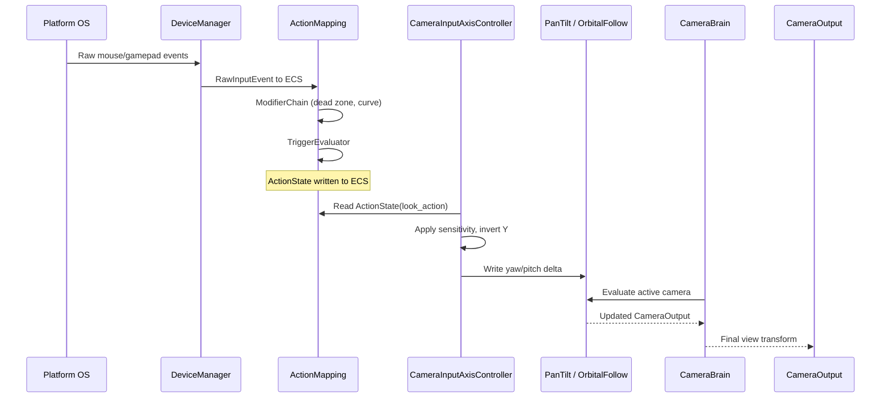
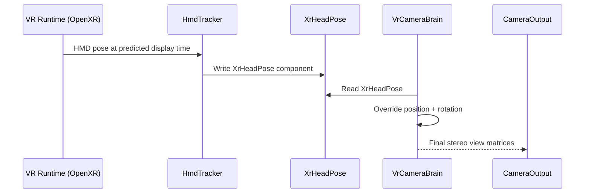

# Input ↔ Camera Integration Design

## Systems Involved

| System | Design | Domain |
|--------|--------|--------|
| Input | [input.md](../input/input.md) | Input |
| Camera | [camera.md](../game-framework/camera.md) | Camera |

## Integration Requirements

| ID | Requirement | Systems |
|----|-------------|---------|
| IR-4.1.1 | Mouse delta drives PanTilt rotation | Input, Camera |
| IR-4.1.2 | Gamepad right stick drives OrbitalFollow | Input, Camera |
| IR-4.1.3 | VR HMD pose overrides camera transform | Input, Camera |
| IR-4.1.4 | Input action toggles FreeLookModifier | Input, Camera |
| IR-4.1.5 | Aim assist snaps camera toward targets | Input, Camera |
| IR-4.1.6 | Gamepad orbit respects dead zone + curve | Input, Camera |
| IR-4.1.7 | Mouse sensitivity scales PanTilt delta | Input, Camera |
| IR-4.1.8 | Camera input suppressed during blending | Input, Camera |

1. **IR-4.1.1** -- `ActionState` with `ActionValue::Axis2D` from mouse delta drives `PanTilt`
   yaw/pitch each frame. The `CameraInputAxisController` reads the action and writes `PanTilt`
   angles.
2. **IR-4.1.2** -- Gamepad right stick `ActionValue::Axis2D` drives `OrbitalFollow`
   horizontal/vertical orbit angles through `CameraInputAxisController`. `ModifierChain` applies
   dead zone and response curve before the value reaches the camera.
3. **IR-4.1.3** -- `XrHeadPose` from the VR input layer (HmdTracker) overwrites
   `CameraOutput.position` and `CameraOutput.rotation` in `VrCameraBrain`, bypassing all
   position/rotation behaviors.
4. **IR-4.1.4** -- A bool `ActionState` (e.g., "FreeLook") toggles the `FreeLookModifier` enableable
   component on the active virtual camera entity.
5. **IR-4.1.5** -- `AimAssistConfig` reads `ActionValue::Axis2D` look input and nearby target entity
   positions, then deflects the final delta toward the closest valid target before writing to
   `PanTilt` or `OrbitalFollow`.
6. **IR-4.1.6** -- Gamepad orbit input passes through `InputModifier::DeadZoneRadial` and
   `InputModifier::ResponseCurve` in the `ModifierChain` before reaching
   `CameraInputAxisController`.
7. **IR-4.1.7** -- `CameraInputAxisController` multiplies raw mouse delta by a per-axis sensitivity
   scalar stored on the component.
8. **IR-4.1.8** -- While `BlendSystem` is actively blending between cameras,
   `CameraInputAxisController` suppresses input to prevent user-driven rotation during transitions.

## Data Contracts

| Type | Defined in | Consumed by | Purpose |
|------|-----------|-------------|---------|
| `ActionState` | Input | Camera | Current action value |
| `ActionValue::Axis2D` | Input | Camera | 2D look delta |
| `ActionValueType` | Input | Camera | Value type filter |
| `ActionId` | Input | Camera | Named action ref |
| `CameraInputAxisController` | Integration | Camera | Input bridge |
| `InputSensitivity` | Integration | Camera | Per-axis scaling |
| `PanTilt` | Camera | Camera | Yaw/pitch state |
| `OrbitalFollow` | Camera | Camera | Orbit angles |
| `XrHeadPose` | Camera (vr.rs) | Camera | HMD transform |
| `VrCameraBrain` | Camera (vr.rs) | Camera | VR override brain |
| `AimAssistConfig` | Input | Integration | Aim magnetism |
| `AimAssistState` | Input | Integration | Per-entity state |
| `FreeLookModifier` | Camera | Camera | Toggleable look |

All glam types (`Vec2`, `Vec3`, `Quat`) come from the `glam` crate, an approved dependency per
`constraints.md`.

```rust
/// Per-axis sensitivity with rkyv derives for
/// settings persistence (user preferences).
#[derive(
    Clone, Copy, Debug, PartialEq,
    Archive, Serialize, Deserialize,
)]
pub struct InputSensitivity {
    /// Horizontal sensitivity multiplier.
    pub x: f32,
    /// Vertical sensitivity multiplier.
    pub y: f32,
}

/// Bridge between input actions and camera rotation.
/// Reads a named Axis2D action each frame and writes
/// yaw/pitch to PanTilt or orbit angles to
/// OrbitalFollow.
///
/// **ActionValueType filtering:** CIAC only accepts
/// `ActionValueType::Axis2D`. If the bound action
/// produces a different type (Bool, Axis1D, Axis3D),
/// CIAC treats the value as zero delta and logs a
/// one-time warning. No panic or error — the camera
/// simply does not move.
#[derive(Component)]
pub struct CameraInputAxisController {
    /// ActionId for the look/orbit action.
    pub look_action: ActionId,
    /// Per-axis sensitivity multiplier (glam Vec2).
    pub sensitivity: InputSensitivity,
    /// Invert Y axis.
    pub invert_y: bool,
    /// When true, input is suppressed during blends.
    pub suppress_during_blend: bool,
    /// Maximum seconds before suppression auto-clears.
    /// Prevents indefinite input lockout if blend
    /// state becomes stale. Default: 2.0 seconds.
    pub suppression_timeout: f32,
    /// Elapsed time since suppression began (runtime).
    pub suppression_elapsed: f32,
}

/// Mutable aim assist state tracked per entity.
/// Stores sticky target and timing for magnetism.
/// Defined in input, consumed here for deflection.
#[derive(Component)]
pub struct AimAssistState {
    /// Currently locked target entity, if any.
    pub sticky_target: Option<Entity>,
    /// Time since last target acquisition.
    pub lock_timer: f32,
}

/// FreeLookModifier toggle mechanism: the component
/// is inserted/removed on the virtual camera entity.
/// Presence = enabled; absence = disabled. This uses
/// marker-component insertion/removal (ECS-primary
/// pattern), not a bool flag.
///
/// When the bool FreeLook action fires:
/// - Pressed → insert FreeLookModifier component
/// - Released → remove FreeLookModifier component
///
/// Defined in camera/extensions/free_look.rs.
/// Struct definition in camera.md; referenced here
/// for integration completeness.

/// VR head pose written by HmdTracker each frame.
/// Defined in camera/vr.rs (not the input system).
/// The XR input layer writes this component; the
/// VrCameraBrain reads it.
///
/// Fallback: if tracking is lost, the last valid
/// XrHeadPose is held until tracking resumes.
/// VrCameraBrain does not interpolate or predict —
/// it uses the stale pose as-is.
#[derive(Component)]
pub struct XrHeadPose {
    /// Head position in tracking space (glam Vec3).
    pub position: Vec3,
    /// Head orientation in tracking space (glam Quat).
    pub rotation: Quat,
}

/// VR-specific camera brain that produces stereo
/// RenderView nodes (left eye, right eye).
/// Defined in camera/vr.rs.
///
/// Fallback: if XrHeadPose is missing (no VR HMD),
/// VrCameraBrain does not evaluate. The standard
/// CameraBrain takes over.
#[derive(Component)]
pub struct VrCameraBrain {
    /// Interpupillary distance (meters) from runtime.
    pub ipd: f32,
    /// Whether late-latch is enabled for this brain.
    pub late_latch: bool,
}

/// Aim assist configuration. Defined in input
/// (input/aim_assist.rs). The integration layer
/// reads this alongside AimAssistState to deflect
/// look input toward valid targets.
///
/// Fallback: if no valid targets exist within
/// magnetism_radius, the raw look delta passes
/// through unmodified. If AimAssistConfig.enabled
/// is false, deflection is skipped entirely.
///
/// Arc usage note: AimAssistConfig is an owned ECS
/// component. Arc is acceptable only for shared
/// immutable reference data (e.g., target lists
/// built once per frame and read by multiple
/// systems). AimAssistConfig itself is never wrapped
/// in Arc.
#[derive(Component)]
pub struct AimAssistConfig {
    /// Radius for target magnetism (world units).
    pub magnetism_radius: f32,
    /// Strength of pull toward target (0..1).
    pub magnetism_strength: f32,
    /// Radius for friction slowdown near targets.
    pub friction_radius: f32,
    /// Look speed multiplier when inside friction.
    pub friction_multiplier: f32,
    /// Whether snap-to-target is enabled.
    pub snap_enabled: bool,
    /// Snap activation radius.
    pub snap_radius: f32,
    /// Master enable/disable for aim assist.
    pub enabled: bool,
}
```

## Data Flow



### VR Head Tracking Flow



## Timing and Ordering

| System | Phase | Timestep | Order |
|--------|-------|----------|-------|
| DeviceManager | 1-Input | Variable | 1st |
| ActionMapping | 1-Input | Variable | 2nd |
| CameraInputAxisController | 6-Animation | Variable | After input |
| CameraBrain | 6-Animation | Variable | After CIAC |
| VrCameraBrain | 6-Animation | Variable | After brain |

The input system runs in Phase 1 and writes `ActionState` components. Camera systems run in Phase 6
(Animation / LateUpdate) and read those actions. This one-phase gap is intentional: simulation and
physics may modify the tracking target between input and camera evaluation.

## Failure Modes

| Failure | Impact | Recovery |
|---------|--------|----------|
| No input device connected | Camera stays still | Default to last known state |
| VR HMD tracking lost | Stale pose | Hold last valid XrHeadPose |
| Action not mapped | CIAC reads zero delta | No camera movement |
| Aim assist no targets | Pass-through | Raw delta used unmodified |
| Blend suppression stuck | No input response | Timeout clears suppression |

## Platform Considerations

| Platform | Input path | Camera impact |
|----------|-----------|---------------|
| Windows | Win32 raw input / XInput | Standard mouse + gamepad |
| macOS | HID / GCController | Standard mouse + gamepad |
| Linux | evdev | Standard mouse + gamepad |
| VR (all) | OpenXR / OVR | VrCameraBrain overrides |

Mouse acceleration is OS-dependent. The engine reads raw deltas (no OS acceleration) on all
platforms so that sensitivity and response curves are consistent.

## Test Plan

See companion [input-camera-test-cases.md](input-camera-test-cases.md).

## Review Feedback

1. **Missing 2D/2.5D coverage.** The design only addresses 3D camera rotation (PanTilt,
   OrbitalFollow) and VR. The constraints require first-class 2D/2.5D support (side-scroller,
   isometric, top-down), but no IR covers input driving a 2D camera (e.g., scroll-to-pan, edge
   panning, drag-to-scroll). [CONFIDENT]

2. **`AimAssistConfig` ownership mismatch.** The Data Contracts table says `AimAssistConfig` is
   "Defined in: Input", but aim assist is a camera-side concern that consumes input deltas and
   target positions. The input design defines the struct, but the camera design does not reference
   it at all -- ownership and consumption boundaries are unclear. [CONFIDENT]

3. **`XrHeadPose` listed as "Input (VR)" but not defined in the input design.** The camera design
   defines `XrHeadPose` in `camera/vr.rs`, not the input system. The Data Contracts table's "Defined
   in" column is incorrect. [CONFIDENT]

4. **No `#[derive(Component)]` on supporting types.** `CameraInputAxisController` has the derive,
   but `AimAssistConfig`, `FreeLookModifier`, `XrHeadPose`, and `VrCameraBrain` are listed as ECS
   components without showing their struct definitions or confirming they derive `Component`. The
   design CLAUDE.md requires Rust pseudocode for all data contracts. [CONFIDENT]

5. **No class diagram.** The design CLAUDE.md mandates a Mermaid `classDiagram` covering all types,
   enums, traits, and relationships. This document has none -- only sequence diagrams. [CONFIDENT]

6. **Missing `AimAssistState` in Data Contracts.** The input design's `AimAssistConfig::deflect`
   method takes `&mut AimAssistState`, but this type is not mentioned anywhere in the integration
   document. [CONFIDENT]

7. **`sensitivity` field uses `Vec2` (glam) directly.** This is acceptable per constraints (`glam`
   is an approved dependency), but the document does not state the import or confirm the type comes
   from glam. Minor, but worth noting for completeness. [UNCERTAIN]

8. **No `HashMap` concern raised, but none used either.** The design correctly avoids `HashMap` on
   hot paths. No issue found. [CONFIDENT]

9. **No Arc/Rc/Cell/RefCell usage.** The design correctly uses owned ECS components with no interior
   mutability wrappers. No issue found. [CONFIDENT]

10. **No async/await usage.** The design correctly uses synchronous ECS system reads and writes with
    no futures or async patterns. No issue found. [CONFIDENT]

11. **Blend suppression timeout (Failure Modes) lacks specification.** "Timeout clears suppression"
    is stated but no duration, mechanism, or component field controls this. A stale suppression flag
    could lock out input indefinitely. [CONFIDENT]

12. **Test cases do not cover 2D camera input.** Because the design omits 2D/2.5D, the companion
    test cases also have no coverage for 2D camera input scenarios (e.g., mouse scroll to zoom
    orthographic camera, edge panning in RTS view). [CONFIDENT]

13. **Test cases missing for combined scenarios.** No test case covers sensitivity + invert_y + dead
    zone together, or aim assist + blend suppression interaction. Edge-case combinations are
    untested. [CONFIDENT]

14. **`FreeLookModifier` described as "enableable component" but mechanism unclear.** Is it added/
    removed, or does it have an `enabled: bool` field? ECS-primary design should clarify whether
    this uses marker-component insertion/removal or a flag, since the engine avoids runtime
    reflection. [CONFIDENT]

15. **No rkyv or serialization mention.** If `CameraInputAxisController` or `AimAssistConfig` need
    to be saved (e.g., user sensitivity preferences in save files), the design should note rkyv
    derives. [UNCERTAIN]

16. **Three-thread model compliance is implicit.** The design does not explicitly state which thread
    owns `CameraInputAxisController` evaluation. Per constraints, input runs on the main thread and
    camera systems run on worker threads. The one-phase gap implies a channel handoff, but the
    document does not call out the thread boundary or channel mechanism between Phase 1 (main
    thread) and Phase 6 (worker thread). [CONFIDENT]

17. **Platform table omits iOS and Android.** The constraints require multiplatform support
    including iOS and Android. The Platform Considerations table lists Windows, macOS, Linux, and VR
    but omits mobile platforms where touch input drives camera (e.g., two-finger pan,
    pinch-to-zoom). [CONFIDENT]

18. **No mention of `ActionValueType` filtering.** The input design defines `ActionValueType` as a
    filter for what value types an action can produce. The integration should note that CIAC only
    accepts `ActionValueType::Axis2D` and what happens if a mismatched type is bound. [UNCERTAIN]
