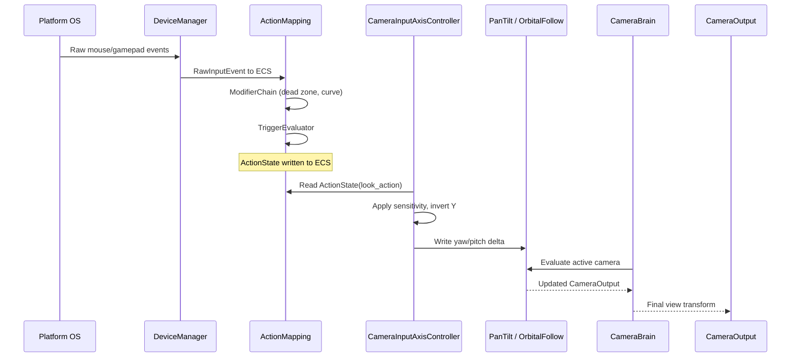
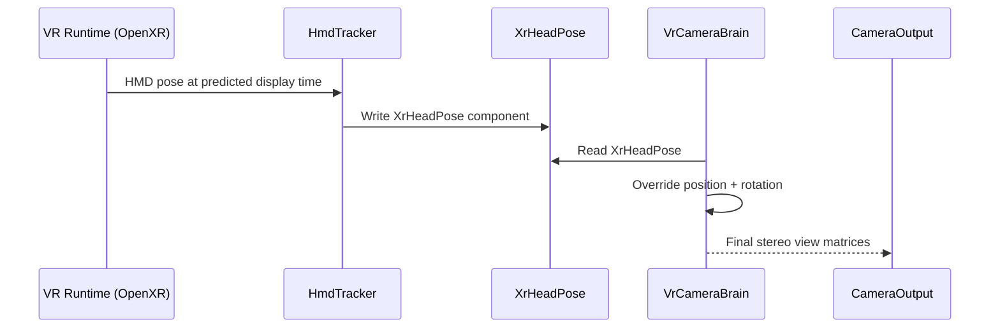

# Input ↔ Camera Integration Design

## Systems Involved

| System | Design | Domain |
|--------|--------|--------|
| Input | [input.md](../input/input.md) | Input |
| Camera | [camera.md](../game-framework/camera.md) | Camera |

## Integration Requirements

| ID | Requirement | Systems |
|----|-------------|---------|
| IR-4.1.1 | Mouse delta drives PanTilt rotation | Input, Camera |
| IR-4.1.2 | Gamepad right stick drives OrbitalFollow | Input, Camera |
| IR-4.1.3 | VR HMD pose overrides camera transform | Input, Camera |
| IR-4.1.4 | Input action toggles FreeLookModifier | Input, Camera |
| IR-4.1.5 | Aim assist snaps camera toward targets | Input, Camera |
| IR-4.1.6 | Gamepad orbit respects dead zone + curve | Input, Camera |
| IR-4.1.7 | Mouse sensitivity scales PanTilt delta | Input, Camera |
| IR-4.1.8 | Camera input suppressed during blending | Input, Camera |

1. **IR-4.1.1** -- `ActionState` with `ActionValue::Axis2D` from mouse delta drives `PanTilt`
   yaw/pitch each frame. The `CameraInputAxisController` reads the action and writes `PanTilt`
   angles.
2. **IR-4.1.2** -- Gamepad right stick `ActionValue::Axis2D` drives `OrbitalFollow`
   horizontal/vertical orbit angles through `CameraInputAxisController`. `ModifierChain` applies
   dead zone and response curve before the value reaches the camera.
3. **IR-4.1.3** -- `XrHeadPose` from the VR input layer (HmdTracker) overwrites
   `CameraOutput.position` and `CameraOutput.rotation` in `VrCameraBrain`, bypassing all
   position/rotation behaviors.
4. **IR-4.1.4** -- A bool `ActionState` (e.g., "FreeLook") toggles the `FreeLookModifier` enableable
   component on the active virtual camera entity.
5. **IR-4.1.5** -- `AimAssistConfig` reads `ActionValue::Axis2D` look input and nearby target entity
   positions, then deflects the final delta toward the closest valid target before writing to
   `PanTilt` or `OrbitalFollow`.
6. **IR-4.1.6** -- Gamepad orbit input passes through `InputModifier::DeadZoneRadial` and
   `InputModifier::ResponseCurve` in the `ModifierChain` before reaching
   `CameraInputAxisController`.
7. **IR-4.1.7** -- `CameraInputAxisController` multiplies raw mouse delta by a per-axis sensitivity
   scalar stored on the component.
8. **IR-4.1.8** -- While `BlendSystem` is actively blending between cameras,
   `CameraInputAxisController` suppresses input to prevent user-driven rotation during transitions.

## Data Contracts

| Type | Defined in | Consumed by | Purpose |
|------|-----------|-------------|---------|
| `ActionState` | Input | Camera | Current action value |
| `ActionValue::Axis2D` | Input | Camera | 2D look delta |
| `ActionId` | Input | Camera | Named action ref |
| `CameraInputAxisController` | Camera | Camera | Input bridge |
| `PanTilt` | Camera | Camera | Yaw/pitch state |
| `OrbitalFollow` | Camera | Camera | Orbit angles |
| `XrHeadPose` | Input (VR) | Camera | HMD transform |
| `VrCameraBrain` | Camera | Camera | VR override brain |
| `AimAssistConfig` | Input | Camera | Aim magnetism |
| `FreeLookModifier` | Camera | Camera | Toggleable look |

```rust
/// Bridge between input actions and camera rotation.
/// Reads a named Axis2D action each frame and writes
/// yaw/pitch to PanTilt or orbit angles to
/// OrbitalFollow.
#[derive(Component)]
pub struct CameraInputAxisController {
    /// ActionId for the look/orbit action.
    pub look_action: ActionId,
    /// Per-axis sensitivity multiplier.
    pub sensitivity: Vec2,
    /// Invert Y axis.
    pub invert_y: bool,
    /// When true, input is suppressed during blends.
    pub suppress_during_blend: bool,
}
```

## Data Flow



### VR Head Tracking Flow



## Timing and Ordering

| System | Phase | Timestep | Order |
|--------|-------|----------|-------|
| DeviceManager | 1-Input | Variable | 1st |
| ActionMapping | 1-Input | Variable | 2nd |
| CameraInputAxisController | 6-Animation | Variable | After input |
| CameraBrain | 6-Animation | Variable | After CIAC |
| VrCameraBrain | 6-Animation | Variable | After brain |

The input system runs in Phase 1 and writes `ActionState` components. Camera systems run in Phase 6
(Animation / LateUpdate) and read those actions. This one-phase gap is intentional: simulation and
physics may modify the tracking target between input and camera evaluation.

## Failure Modes

| Failure | Impact | Recovery |
|---------|--------|----------|
| No input device connected | Camera stays still | Default to last known state |
| VR HMD tracking lost | Stale pose | Hold last valid XrHeadPose |
| Action not mapped | CIAC reads zero delta | No camera movement |
| Aim assist no targets | Pass-through | Raw delta used unmodified |
| Blend suppression stuck | No input response | Timeout clears suppression |

## Platform Considerations

| Platform | Input path | Camera impact |
|----------|-----------|---------------|
| Windows | Win32 raw input / XInput | Standard mouse + gamepad |
| macOS | HID / GCController | Standard mouse + gamepad |
| Linux | evdev | Standard mouse + gamepad |
| VR (all) | OpenXR / OVR | VrCameraBrain overrides |

Mouse acceleration is OS-dependent. The engine reads raw deltas (no OS acceleration) on all
platforms so that sensitivity and response curves are consistent.

## Test Plan

See companion [input-camera-test-cases.md](input-camera-test-cases.md).
