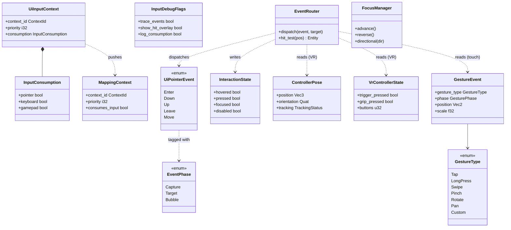
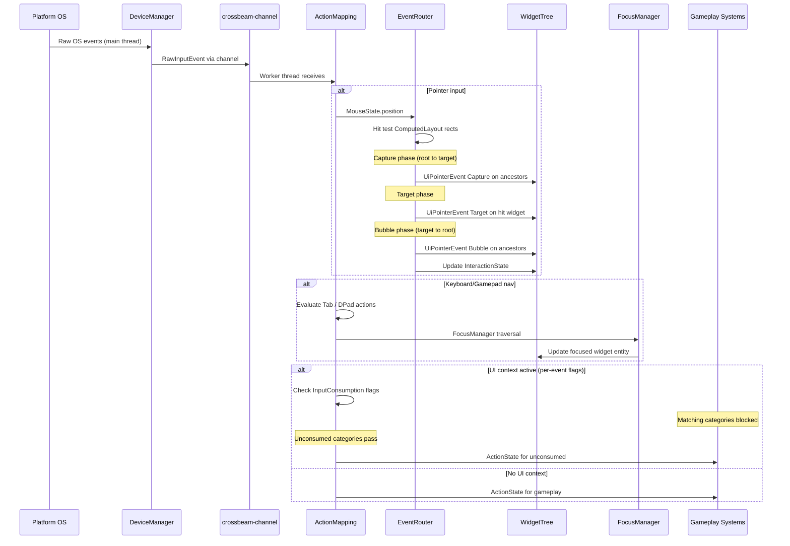
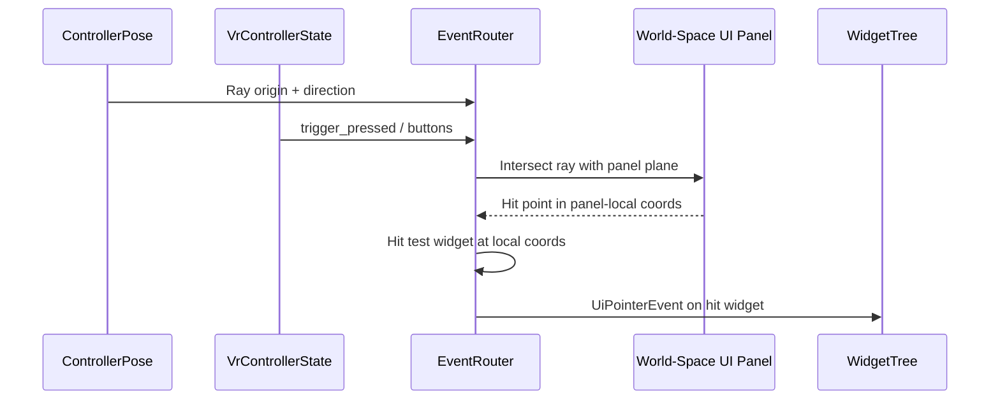

# Input ↔ UI Framework Integration Design

This design follows the cross-cutting conventions in [shared-conventions.md](shared-conventions.md);
only deviations are called out below.

## Overview

Raw input events cross the main thread to worker thread boundary via a bounded MPSC channel
(capacity 1024, see [shared-messaging-capacities.md](shared-messaging-capacities.md) row CH-1).
Workers running in Phase 2 (PreUpdate) drain the channel into `PointerEvent` / `KeyboardEvent`
streams and feed the `EventRouter` for hit testing plus the `FocusManager` for focus traversal. The
UI framework consumes abstract `UiPointerEvent` entity events so input backends (mouse, touch,
gamepad, VR ray) can swap without touching widget code. Focus, capture/bubble dispatch, context
stacking, and IME text routing all run on worker threads; only the OS pump touches the main thread.

## Systems Involved

| System | Design | Domain |
|--------|--------|--------|
| Input | [input.md](../input/input.md) | Input |
| UI | [ui-framework.md](../ui/ui-framework.md) | UI |

## Integration Requirements

| ID | Requirement | Systems |
|----|-------------|---------|
| IR-4.2.1 | Pointer events route to widget hit test | Input, UI |
| IR-4.2.2 | Keyboard focus traversal via tab/arrows | Input, UI |
| IR-4.2.3 | Gamepad dpad navigates widget focus | Input, UI |
| IR-4.2.4 | Touch gestures drive scroll and drag | Input, UI |
| IR-4.2.5 | UI consumes input preventing game actions | Input, UI |
| IR-4.2.6 | VR laser pointer drives UI interaction | Input, UI |
| IR-4.2.7 | Text input routes to focused TextInput | Input, UI |
| IR-4.2.8 | Context stack push/pop for UI modes | Input, UI |

1. **IR-4.2.1** -- `MouseState.position` and `MouseButton` events are consumed by `EventRouter` to
   perform hit testing against `ComputedLayout` rects in the widget tree. Matching widgets receive
   `UiPointerEvent::Enter`, `Down`, `Up`, `Leave` as ECS entity events dispatched through the
   capture -> target -> bubble pipeline. `InteractionState` is updated on the target entity.
2. **IR-4.2.2** -- `ActionState` for Tab and Shift+Tab bool actions drive `FocusManager` sequential
   traversal. Arrow key actions drive directional navigation within focus groups.
3. **IR-4.2.3** -- Gamepad dpad `ActionValue::Axis2D` is converted to directional focus movement by
   `FocusManager`. South button confirms, East button cancels.
4. **IR-4.2.4** -- `GestureEvent { gesture_type: GestureType::Pan, .. }` drives `ScrollView`
   inertial scrolling, `GestureEvent { gesture_type: GestureType::Pinch, .. }` drives `ScrollView`
   zoom (mapping `scale` to content scale factor; see "Pinch Mapping" below), and
   `GestureEvent { gesture_type: GestureType::Swipe { direction }, .. }` drives `DragDropManager`
   drag operations keyed by the swipe direction.
5. **IR-4.2.5** -- When a UI `MappingContext` is active at the top of the `ContextStack`, its
   per-event-category flags (pointer, keyboard, gamepad) in `InputConsumption` block matching
   gameplay actions underneath. Each event category is consumed independently so a chat window can
   consume keyboard while allowing mouse camera orbit. See "Consumption Granularity" below.
6. **IR-4.2.6** -- VR `ControllerPose` provides hand position and orientation, and
   `VrControllerState` provides trigger and button state. `EventRouter` constructs a ray from
   `ControllerPose` and intersects it with world-space UI panels (F-10.1.10). Hit results drive
   `InteractionState`, and `VrControllerState.trigger_pressed` drives `UiPointerEvent::Down`.
7. **IR-4.2.7** -- When a `TextInput` widget has focus, raw `RawInputKind::KeyPress` events with
   scancodes route to the `TextInput` IME pipeline. The UI context's `InputConsumption.keyboard`
   flag prevents gameplay action mapping from consuming those same keys.
8. **IR-4.2.8** -- Opening a menu pushes a UI `MappingContext` onto the `ContextStack`. Closing pops
   it, restoring gameplay input bindings.

## Data Contracts

| Type | Defined in | Consumed by | Purpose |
|------|-----------|-------------|---------|
| `MouseState` | Input | UI | Pointer position |
| `RawInputEvent` | Input | UI | Key/button events |
| `GestureEvent` | Input | UI | Touch gestures |
| `ActionState` | Input | UI | Mapped actions |
| `MappingContext` | Input | UI | Input consumption |
| `ContextStack` | Input | UI | Mode stacking |
| `FocusManager` | UI | UI | Focus traversal |
| `EventRouter` | UI | UI | Hit test + dispatch |
| `InteractionState` | UI | UI | Widget hover/press |
| `ControllerPose` | Input (VR) | UI | VR hand ray |
| `VrControllerState` | Input (VR) | UI | VR buttons |

```rust
/// UI input mapping context pushed when menus or
/// overlays open. Per-event flags control which
/// input categories are consumed.
pub struct UiInputContext {
    /// MappingContext to push onto ContextStack.
    pub context_id: ContextId,
    /// Priority higher than gameplay contexts.
    pub priority: i32,
    /// Per-event-category consumption flags.
    pub consumption: InputConsumption,
}

/// Per-event-category consumption flags. Each
/// flag independently blocks the corresponding
/// input category from reaching lower contexts.
pub struct InputConsumption {
    /// Block pointer (mouse/touch) events.
    pub pointer: bool,
    /// Block keyboard events.
    pub keyboard: bool,
    /// Block gamepad events.
    pub gamepad: bool,
}

/// Pointer event dispatched to widgets after hit
/// test. Written as ECS entity event on the hit
/// widget. Propagates through capture -> target
/// -> bubble phases per the UI framework's
/// EventRouter dispatch model.
///
/// Defined in the UI crate
/// (`harmonius_ui::event`). The UI framework
/// design's EventRouter dispatches this type.
pub enum UiPointerEvent {
    Enter { position: Vec2 },
    Down { position: Vec2, button: MouseButton },
    Up { position: Vec2, button: MouseButton },
    Leave,
    Move { position: Vec2, delta: Vec2 },
}

/// Phase of event propagation through the widget
/// tree hierarchy. Matches the UI framework's
/// three-phase dispatch model.
pub enum EventPhase {
    /// Root-to-target traversal. Ancestors can
    /// intercept before the target receives it.
    Capture,
    /// Event delivered to the hit-tested widget.
    Target,
    /// Target-to-root traversal. Ancestors can
    /// react after the target handled it.
    Bubble,
}

/// Tracks pointer interaction state on a widget.
/// Written by EventRouter after hit testing and
/// event dispatch. Read by style resolver for
/// hover/press visual feedback.
pub struct InteractionState {
    pub hovered: bool,
    pub pressed: bool,
    pub focused: bool,
    pub disabled: bool,
}
```

## API Sketch

The UI framework consumes an abstract event stream rather than driving `ActionState` directly. A
worker-thread system drains the bounded MPSC channel from the main thread and dispatches entity
events. The full implementation lives in `ui/ui-framework.md`; this integration defines only the
channel shape and the entry-point system signature.

```rust
/// Phase 2 (PreUpdate) system that drains the
/// bounded MPSC pointer channel from the main
/// thread and dispatches UiPointerEvent /
/// KeyboardEvent entity events through the
/// EventRouter + FocusManager. Synchronous; no
/// async/await. Channel capacity = 256 per
/// shared-messaging-capacities.md row CH-1.
pub fn ui_input_dispatch_system(
    mut rx: ResMut<PointerEventReceiver>,
    mut router: ResMut<EventRouter>,
    mut focus: ResMut<FocusManager>,
    contexts: Res<ContextStack>,
) {
    // 1. Drain pointer events via try_recv.
    // 2. For each event:
    //      a. Check top MappingContext's
    //         InputConsumption flags.
    //      b. If pointer consumed: hit test through
    //         EventRouter; dispatch Capture ->
    //         Target -> Bubble phases.
    //      c. If keyboard consumed: route to focused
    //         widget; otherwise fall through to
    //         gameplay.
    // 3. Update InteractionState on target entities.
}
```

## Class Diagram



## Data Flow



### VR Laser Interaction Flow



### Capture / Bubble Dispatch

`UiPointerEvent` is an ECS entity event delivered to the hit-tested widget entity. `EventRouter`
walks the widget tree parent chain from root to target, then target, then target back to root,
mirroring the UI framework's three-phase dispatch (`on_capture` -> `on_event` -> `on_bubble`). Each
visited entity receives a copy of the event tagged with its `EventPhase`.

| Phase | Traversal | Ancestors receive | Stop conditions |
|-------|-----------|-------------------|-----------------|
| Capture | Root to target | Yes, before target | Ancestor sets `handled = true` |
| Target | Hit widget only | n/a | Target sets `handled = true` |
| Bubble | Target to root | Yes, after target | Ancestor sets `handled = true` |

1. **Algorithm reference** -- parent-chain walk mirrors the DOM UI Events "Event flow" spec (W3C DOM
   Level 3 Events, section "Event dispatch and DOM event flow"). See also the UI framework design
   `event_routing_system`.
2. **Early termination** -- a handler setting `handled = true` halts the current phase; capture
   stopping cancels target and bubble; target stopping cancels bubble.
3. **Disabled widgets** -- `InteractionState.disabled = true` short-circuits target delivery (the
   widget still receives capture for overlays that intercept clicks).

### Pinch Mapping

| Source field | UI binding | Effect |
|--------------|-----------|--------|
| `GestureEvent.scale` (Pinch) | `ScrollView.content_scale` | Multiplies current content scale |
| `GestureEvent.position` (Pinch) | `ScrollView.focal_point` | Anchor for zoom in panel-local px |
| `GestureEvent.phase` (Pinch) | `ScrollView.zoom_active` | Began/Changed/Ended transitions |

1. `ScrollView` clamps the resulting scale to `[min_zoom, max_zoom]` from its configuration.
2. If `GestureEvent.phase = Cancelled`, `ScrollView` reverts to the scale at `Began`.
3. If no `ScrollView` ancestor exists, pinch bubbles up and is ignored by default widgets.

### Consumption Granularity

`InputConsumption` is per-event-category (pointer / keyboard / gamepad), not per-action or
per-widget. Rationale: action mapping already happens after consumption, so widget-level consumption
would require a back-channel from UI to action mapping. Category-level is granular enough for every
documented UI scenario (chat, menu, dialog, HUD overlay).

| Scenario | pointer | keyboard | gamepad |
|----------|---------|----------|---------|
| Full-screen menu | true | true | true |
| Chat window | false | true | false |
| HUD overlay | false | false | false |
| Modal dialog (mouse) | true | true | false |
| Gamepad radial menu | false | false | true |

1. Finer granularity (per-widget or per-action) is rejected as out of scope for this iteration.
2. `MappingContext` retains a legacy `consumes_input: bool` field which is the logical OR of the
   three flags for gameplay contexts that do not distinguish categories.

### 2D / 2.5D UI Hit Testing

UI widgets are inherently 2D. For 2D and 2.5D (isometric / orthographic 3D) games, the UI tree still
lives in screen space for the HUD overlay. Diegetic UI (in-world signs, billboards) uses the same VR
world-space panel pipeline: a ray from the camera through the cursor intersects the panel plane,
then the panel-local hit point feeds the hit tester.

| Game mode | UI layer | Hit test input |
|-----------|---------|----------------|
| 2D (pixel) | Screen-space overlay | Cursor (px) |
| 2.5D (ortho 3D) | Screen-space overlay | Cursor (px) |
| 2.5D diegetic | World-space panel | Camera ray vs panel plane |
| 3D HUD | Screen-space overlay | Cursor (px) |
| 3D diegetic | World-space panel | Camera ray vs panel plane |
| VR | World-space panel | Controller ray vs panel plane |

1. Screen-space hit testing uses `ComputedLayout` rects in logical pixels (DPI-scaled).
2. World-space hit testing uses the panel's local 2D coordinate frame after ray-plane intersection;
   the same `EventRouter` consumes it.

### Thread Ownership

| Data / system | Owning thread | QoS / pin | Handoff |
|---------------|---------------|-----------|---------|
| OS event pump | Main | Main thread (platform-forced) | Produces `RawInputEvent` |
| `DeviceManager` | Main | Main thread | crossbeam MPSC to sim |
| `ActionMapping` | Simulation worker | QoS: user-interactive | Reads MPSC, writes ECS |
| `EventRouter` | Simulation worker | QoS: user-interactive | Reads ECS, writes entity events |
| `FocusManager` | Simulation worker | QoS: user-interactive | Reads ECS, writes focus |
| `WidgetTree` diff | Simulation worker | QoS: user-interactive | Reads ECS, writes render queue |
| Render thread | Render | Core-pinned | Reads widget render queue |

1. **Channel** -- `crossbeam_channel::bounded(1024)` MPSC from main (producer) to simulation (single
   consumer). Buffer length 1024 chosen for ~17 frames at 60 Hz worst-case input burst; overflow
   drops oldest (documented fallback).
2. **Arc policy** -- only immutable input tables (`InputBindings`, `GestureConfig`) are shared via
   `Arc`. Mutable state (`InteractionState`, `FocusState`) lives in ECS on the simulation worker
   only.
3. **Debug toggles** -- a runtime-toggleable `InputDebugFlags` resource enables event tracing,
   hit-test overlay rendering, and consumption logging; toggled via console command at runtime.

## Timing and Ordering

| System | Phase | Timestep | Order |
|--------|-------|----------|-------|
| DeviceManager | 1-Input | Variable | 1st |
| ActionMapping | 1-Input | Variable | 2nd |
| EventRouter | 2-PreUpdate | Variable | 1st after input |
| FocusManager | 2-PreUpdate | Variable | After router |
| WidgetTree diff | 3-Simulation | Variable | After focus |

Input fires in Phase 1. Event routing and focus run in Phase 2 (PreUpdate) so gameplay systems in
Phase 3 (Simulation) observe consistent widget focus and interaction state. This matches the UI
framework design's `event_routing_system` placement in PreUpdate.

## Failure Modes

| ID | Failure | Impact | Recovery |
|----|---------|--------|----------|
| FM-1 | No focused widget | Key events dropped | Focus first focusable |
| FM-2 | Gesture recognition fails | GestureEvent not emitted | Fall back to raw pointer events |
| FM-3 | Hit test misses all widgets | No interaction | Event falls through to game |
| FM-4 | ContextStack underflow | Pop on empty stack | No-op, log warning |
| FM-5 | VR laser misses all panels | No UI interaction | Pointer events not sent |
| FM-6 | IME composition interrupted | Partial text | Commit or cancel composition |

## Platform Considerations

| Platform | Input detail |
|----------|-------------|
| Windows | Win32 raw input, XInput gamepad |
| macOS | HID mouse, GCController gamepad |
| Linux | evdev mouse, evdev gamepad |
| Touch (all) | GestureRecognizer emits `GestureEvent` for scroll/drag/pinch |
| VR (all) | `ControllerPose` + `VrControllerState` drive laser ray |

IME input handling differs per platform (TSF on Windows, InputMethodKit on macOS, IBus/Fcitx on
Linux). The `TextInput` widget abstracts these differences.

## Performance Budget

UI input dispatch shares the Phase 2 (PreUpdate) budget documented in
[/docs/design/performance-budget.md](../performance-budget.md). Per-IR target budgets are:

| Metric | Target | IR |
|--------|--------|----|
| Hit test 500 widgets | < 0.2 ms | IR-4.2.1 |
| Capture/bubble dispatch depth 20 | < 0.05 ms | IR-4.2.1 |
| Focus traversal 100 widgets | < 0.05 ms | IR-4.2.2 |
| Pinch gesture apply to ScrollView | < 0.02 ms | IR-4.2.4 |
| Consumption check across 16 contexts | < 0.01 ms | IR-4.2.5 |
| VR ray vs 10 world panels | < 0.1 ms | IR-4.2.6 |

## Test Plan

See companion [input-ui-test-cases.md](input-ui-test-cases.md).

## Review Status

| # | Finding | Status | Resolution |
|---|---------|--------|-----------|
| 1 | No capture/bubble dispatch | Resolved | Added "Capture / Bubble Dispatch" section |
| 2 | GestureEvent type mismatch | Resolved | IR-4.2.4 uses struct form with `gesture_type` |
| 3 | MotionControllerTracker not a type | Resolved | VR flow + contracts use ControllerPose |
| 4 | No threading model discussion | Resolved | Added "Thread Ownership" section |
| 5 | Phase mismatch for EventRouter | Resolved | Moved EventRouter to Phase 2 PreUpdate |
| 6 | No classDiagram | Resolved | Added classDiagram before Data Flow |
| 7 | No 2D/2.5D hit testing | Resolved | Added "2D / 2.5D UI Hit Testing" section |
| 8 | UiPointerEvent not defined in UI | Resolved | Defined here; doc comment cites UI crate |
| 9 | InteractionState no pseudocode | Resolved | Added `pub struct InteractionState` block |
| 10 | Missing edge-case test cases | Resolved | Added 5 edge-case TCs in companion file |
| 11 | Pinch gesture not covered | Resolved | Added "Pinch Mapping" + TC-IR-4.2.4.3 |
| 12 | consumes_input granularity unclear | Resolved | Added "Consumption Granularity" section |
