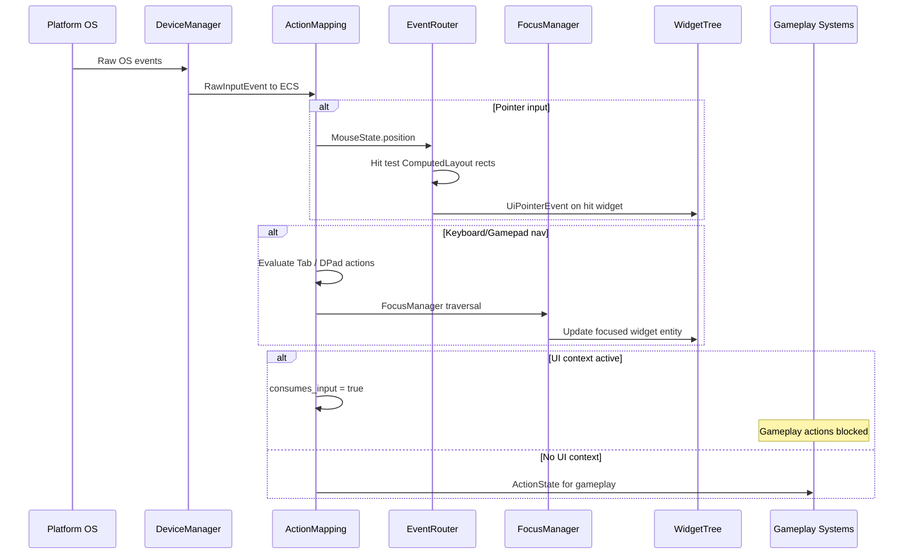
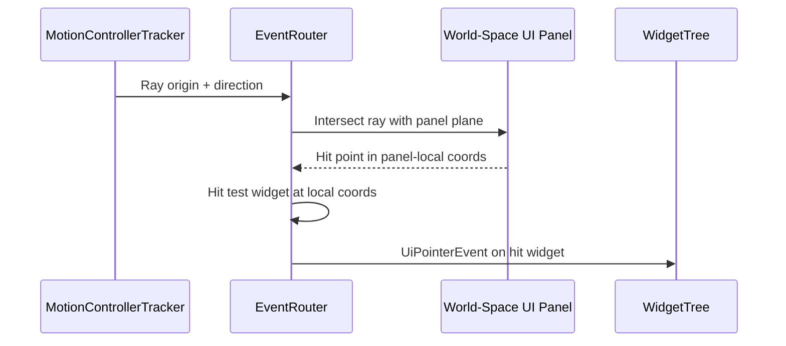

# Input ↔ UI Framework Integration Design

## Systems Involved

| System | Design | Domain |
|--------|--------|--------|
| Input | [input.md](../input/input.md) | Input |
| UI | [ui-framework.md](../ui/ui-framework.md) | UI |

## Integration Requirements

| ID | Requirement | Systems |
|----|-------------|---------|
| IR-4.2.1 | Pointer events route to widget hit test | Input, UI |
| IR-4.2.2 | Keyboard focus traversal via tab/arrows | Input, UI |
| IR-4.2.3 | Gamepad dpad navigates widget focus | Input, UI |
| IR-4.2.4 | Touch gestures drive scroll and drag | Input, UI |
| IR-4.2.5 | UI consumes input preventing game actions | Input, UI |
| IR-4.2.6 | VR laser pointer drives UI interaction | Input, UI |
| IR-4.2.7 | Text input routes to focused TextInput | Input, UI |
| IR-4.2.8 | Context stack push/pop for UI modes | Input, UI |

1. **IR-4.2.1** -- `MouseState.position` and `MouseButton` events are consumed by `EventRouter` to
   perform hit testing against `ComputedLayout` rects in the widget tree. Matching widgets receive
   `PointerEnter`, `PointerDown`, `PointerUp`, `PointerLeave` via `InteractionState`.
2. **IR-4.2.2** -- `ActionState` for Tab and Shift+Tab bool actions drive `FocusManager` sequential
   traversal. Arrow key actions drive directional navigation within focus groups.
3. **IR-4.2.3** -- Gamepad dpad `ActionValue::Axis2D` is converted to directional focus movement by
   `FocusManager`. South button confirms, East button cancels.
4. **IR-4.2.4** -- `GestureEvent` (Pan, Pinch, Swipe) from the gesture recognizer drives
   `ScrollView` inertial scrolling and `DragDropManager` drag operations.
5. **IR-4.2.5** -- When a UI `MappingContext` is active at the top of the `ContextStack`, it sets
   `consumes_input = true` to block gameplay actions underneath.
6. **IR-4.2.6** -- VR `MotionControllerTracker` produces a ray that `EventRouter` intersects with
   world-space UI panels (F-10.1.10). Hit results drive `InteractionState`.
7. **IR-4.2.7** -- When a `TextInput` widget has focus, raw `RawInputKind::KeyPress` events with
   scancodes route to the `TextInput` IME pipeline. `consumes_input` prevents gameplay action
   mapping.
8. **IR-4.2.8** -- Opening a menu pushes a UI `MappingContext` onto the `ContextStack`. Closing pops
   it, restoring gameplay input bindings.

## Data Contracts

| Type | Defined in | Consumed by | Purpose |
|------|-----------|-------------|---------|
| `MouseState` | Input | UI | Pointer position |
| `RawInputEvent` | Input | UI | Key/button events |
| `GestureEvent` | Input | UI | Touch gestures |
| `ActionState` | Input | UI | Mapped actions |
| `MappingContext` | Input | UI | Input consumption |
| `ContextStack` | Input | UI | Mode stacking |
| `FocusManager` | UI | UI | Focus traversal |
| `EventRouter` | UI | UI | Hit test + dispatch |
| `InteractionState` | UI | UI | Widget hover/press |
| `MotionControllerTracker` | Input (VR) | UI | Laser ray |

```rust
/// UI input mapping context pushed when menus or
/// overlays open. Consumes all input to prevent
/// gameplay actions from firing underneath.
pub struct UiInputContext {
    /// The MappingContext to push onto ContextStack.
    pub context_id: ContextId,
    /// Priority higher than gameplay contexts.
    pub priority: i32,
}

/// Pointer event dispatched to widgets after hit
/// test. Written as entity event on the hit widget.
pub enum UiPointerEvent {
    Enter { position: Vec2 },
    Down { position: Vec2, button: MouseButton },
    Up { position: Vec2, button: MouseButton },
    Leave,
    Move { position: Vec2, delta: Vec2 },
}
```

## Data Flow



### VR Laser Interaction Flow



## Timing and Ordering

| System | Phase | Timestep | Order |
|--------|-------|----------|-------|
| DeviceManager | 1-Input | Variable | 1st |
| ActionMapping | 1-Input | Variable | 2nd |
| EventRouter | 3-Simulation | Variable | After input |
| FocusManager | 3-Simulation | Variable | After router |
| WidgetTree diff | 3-Simulation | Variable | After focus |

Input fires in Phase 1. UI event routing and focus run in Phase 3 (Simulation) so that data binding
updates from simulation can affect widget state before layout.

## Failure Modes

| Failure | Impact | Recovery |
|---------|--------|----------|
| No focused widget | Key events dropped | Focus first focusable |
| Hit test misses all widgets | No interaction | Event falls through to game |
| ContextStack underflow | Pop on empty stack | No-op, log warning |
| VR laser misses all panels | No UI interaction | Pointer events not sent |
| IME composition interrupted | Partial text | Commit or cancel composition |

## Platform Considerations

| Platform | Input detail |
|----------|-------------|
| Windows | Win32 raw input, XInput gamepad |
| macOS | HID mouse, GCController gamepad |
| Linux | evdev mouse, evdev gamepad |
| Touch (all) | GestureRecognizer for scroll/drag |
| VR (all) | MotionControllerTracker laser ray |

IME input handling differs per platform (TSF on Windows, InputMethodKit on macOS, IBus/Fcitx on
Linux). The `TextInput` widget abstracts these differences.

## Test Plan

See companion [input-ui-test-cases.md](input-ui-test-cases.md).
