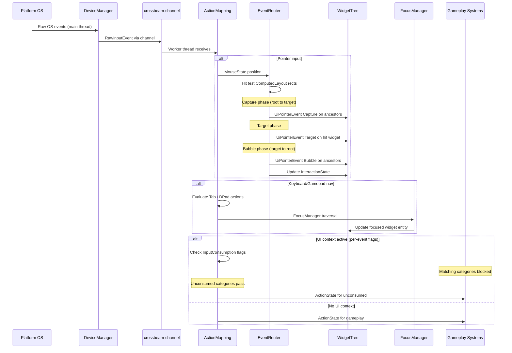
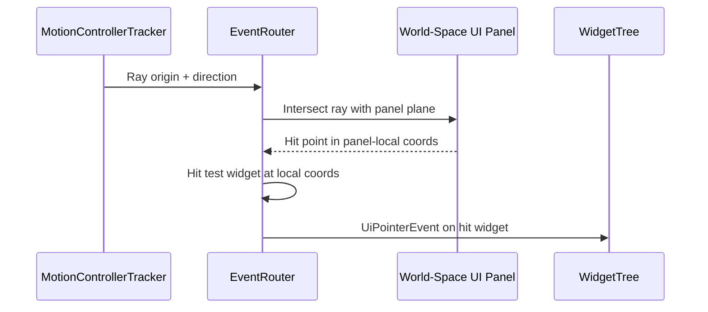

# Input ↔ UI Framework Integration Design

## Systems Involved

| System | Design | Domain |
|--------|--------|--------|
| Input | [input.md](../input/input.md) | Input |
| UI | [ui-framework.md](../ui/ui-framework.md) | UI |

## Integration Requirements

| ID | Requirement | Systems |
|----|-------------|---------|
| IR-4.2.1 | Pointer events route to widget hit test | Input, UI |
| IR-4.2.2 | Keyboard focus traversal via tab/arrows | Input, UI |
| IR-4.2.3 | Gamepad dpad navigates widget focus | Input, UI |
| IR-4.2.4 | Touch gestures drive scroll and drag | Input, UI |
| IR-4.2.5 | UI consumes input preventing game actions | Input, UI |
| IR-4.2.6 | VR laser pointer drives UI interaction | Input, UI |
| IR-4.2.7 | Text input routes to focused TextInput | Input, UI |
| IR-4.2.8 | Context stack push/pop for UI modes | Input, UI |

1. **IR-4.2.1** -- `MouseState.position` and `MouseButton` events are consumed by `EventRouter` to
   perform hit testing against `ComputedLayout` rects in the widget tree. Matching widgets receive
   `PointerEnter`, `PointerDown`, `PointerUp`, `PointerLeave` via `InteractionState`.
2. **IR-4.2.2** -- `ActionState` for Tab and Shift+Tab bool actions drive `FocusManager` sequential
   traversal. Arrow key actions drive directional navigation within focus groups.
3. **IR-4.2.3** -- Gamepad dpad `ActionValue::Axis2D` is converted to directional focus movement by
   `FocusManager`. South button confirms, East button cancels.
4. **IR-4.2.4** -- `GestureEvent` with `gesture_type` of `GestureType::Pan`, `GestureType::Pinch`,
   or `GestureType::Swipe` from the gesture recognizer drives `ScrollView` inertial scrolling,
   `ScrollView` pinch-to-zoom, and `DragDropManager` drag operations.
5. **IR-4.2.5** -- When a UI `MappingContext` is active at the top of the `ContextStack`, its
   per-event `consumes_input` flags block matching gameplay actions underneath. Each event category
   (pointer, keyboard, gamepad) is consumed independently so a chat window can consume keyboard
   while allowing mouse camera orbit.
6. **IR-4.2.6** -- VR `ControllerPose` provides hand position and orientation. `EventRouter`
   constructs a ray from `ControllerPose` and intersects it with world-space UI panels (F-10.1.10).
   Hit results drive `InteractionState`.
7. **IR-4.2.7** -- When a `TextInput` widget has focus, raw `RawInputKind::KeyPress` events with
   scancodes route to the `TextInput` IME pipeline. `consumes_input` prevents gameplay action
   mapping.
8. **IR-4.2.8** -- Opening a menu pushes a UI `MappingContext` onto the `ContextStack`. Closing pops
   it, restoring gameplay input bindings.

## Data Contracts

| Type | Defined in | Consumed by | Purpose |
|------|-----------|-------------|---------|
| `MouseState` | Input | UI | Pointer position |
| `RawInputEvent` | Input | UI | Key/button events |
| `GestureEvent` | Input | UI | Touch gestures |
| `ActionState` | Input | UI | Mapped actions |
| `MappingContext` | Input | UI | Input consumption |
| `ContextStack` | Input | UI | Mode stacking |
| `FocusManager` | UI | UI | Focus traversal |
| `EventRouter` | UI | UI | Hit test + dispatch |
| `InteractionState` | UI | UI | Widget hover/press |
| `ControllerPose` | Input (VR) | UI | VR hand ray |
| `VrControllerState` | Input (VR) | UI | VR buttons |

```rust
/// UI input mapping context pushed when menus or
/// overlays open. Per-event flags control which
/// input categories are consumed.
pub struct UiInputContext {
    /// MappingContext to push onto ContextStack.
    pub context_id: ContextId,
    /// Priority higher than gameplay contexts.
    pub priority: i32,
    /// Per-event-category consumption flags.
    pub consumption: InputConsumption,
}

/// Per-event-category consumption flags. Each
/// flag independently blocks the corresponding
/// input category from reaching lower contexts.
pub struct InputConsumption {
    /// Block pointer (mouse/touch) events.
    pub pointer: bool,
    /// Block keyboard events.
    pub keyboard: bool,
    /// Block gamepad events.
    pub gamepad: bool,
}

/// Pointer event dispatched to widgets after hit
/// test. Written as ECS entity event on the hit
/// widget. Propagates through capture -> target
/// -> bubble phases per the UI framework's
/// EventRouter dispatch model.
///
/// Defined in the UI crate
/// (`harmonius_ui::event`). The UI framework
/// design's EventRouter dispatches this type.
pub enum UiPointerEvent {
    Enter { position: Vec2 },
    Down { position: Vec2, button: MouseButton },
    Up { position: Vec2, button: MouseButton },
    Leave,
    Move { position: Vec2, delta: Vec2 },
}

/// Phase of event propagation through the widget
/// tree hierarchy. Matches the UI framework's
/// three-phase dispatch model.
pub enum EventPhase {
    /// Root-to-target traversal. Ancestors can
    /// intercept before the target receives it.
    Capture,
    /// Event delivered to the hit-tested widget.
    Target,
    /// Target-to-root traversal. Ancestors can
    /// react after the target handled it.
    Bubble,
}

/// Tracks pointer interaction state on a widget.
/// Written by EventRouter after hit testing and
/// event dispatch. Read by style resolver for
/// hover/press visual feedback.
pub struct InteractionState {
    pub hovered: bool,
    pub pressed: bool,
    pub focused: bool,
    pub disabled: bool,
}
```

## Data Flow



### VR Laser Interaction Flow



## Timing and Ordering

| System | Phase | Timestep | Order |
|--------|-------|----------|-------|
| DeviceManager | 1-Input | Variable | 1st |
| ActionMapping | 1-Input | Variable | 2nd |
| EventRouter | 3-Simulation | Variable | After input |
| FocusManager | 3-Simulation | Variable | After router |
| WidgetTree diff | 3-Simulation | Variable | After focus |

Input fires in Phase 1. UI event routing and focus run in Phase 3 (Simulation) so that data binding
updates from simulation can affect widget state before layout.

## Failure Modes

| Failure | Impact | Recovery |
|---------|--------|----------|
| No focused widget | Key events dropped | Focus first focusable |
| Hit test misses all widgets | No interaction | Event falls through to game |
| ContextStack underflow | Pop on empty stack | No-op, log warning |
| VR laser misses all panels | No UI interaction | Pointer events not sent |
| IME composition interrupted | Partial text | Commit or cancel composition |

## Platform Considerations

| Platform | Input detail |
|----------|-------------|
| Windows | Win32 raw input, XInput gamepad |
| macOS | HID mouse, GCController gamepad |
| Linux | evdev mouse, evdev gamepad |
| Touch (all) | GestureRecognizer for scroll/drag |
| VR (all) | MotionControllerTracker laser ray |

IME input handling differs per platform (TSF on Windows, InputMethodKit on macOS, IBus/Fcitx on
Linux). The `TextInput` widget abstracts these differences.

## Test Plan

See companion [input-ui-test-cases.md](input-ui-test-cases.md).

## Review Feedback

1. [CONFIDENT] **No capture/bubble dispatch.** The constraint requires ECS entity events with
   capture/bubble, and the UI framework design (lines 769-779) explicitly shows
   capture/target/bubble phases in `EventRouter`. This integration design never mentions how
   `UiPointerEvent` participates in capture/bubble dispatch through the widget tree hierarchy.

2. [CONFIDENT] **GestureEvent type mismatch.** IR-4.2.4 references `GestureEvent::Pan` and
   `GestureEvent::Swipe` as if `GestureEvent` were an enum. The input design defines `GestureEvent`
   as a struct with a `gesture_type: GestureType` field. The correct form is
   `GestureEvent { gesture_type: GestureType::Pan, .. }`.

3. [CONFIDENT] **MotionControllerTracker is not a type.** The Data Contracts table lists
   `MotionControllerTracker` as a type defined in Input (VR). The input design defines
   `ControllerPose` and `VrControllerState` as the actual VR controller types.
   `MotionControllerTracker` is only a module-level label in a Mermaid diagram, not a struct.

4. [CONFIDENT] **No threading model discussion.** The three-thread model constraint requires
   specifying which thread owns which data. Input runs on the main thread (OS events), but the
   design never states which thread EventRouter, FocusManager, and hit testing run on, or how input
   crosses from main thread to worker thread via crossbeam-channel.

5. [CONFIDENT] **Phase mismatch for EventRouter.** The Timing table places EventRouter in
   "3-Simulation". The UI framework design places `event_routing_system` in "PreUpdate" (before game
   logic), which maps to right after Phase 1 (Input), not Phase 3 (Simulation). Reconcile which
   phase owns event routing.

6. [CONFIDENT] **No classDiagram.** The design CLAUDE.md requires every design to include a Mermaid
   `classDiagram` covering all types, structs, enums, traits, and their relationships. This document
   has only sequence diagrams.

7. [CONFIDENT] **No 2D/2.5D hit testing discussion.** The constraint requires first-class 2D/2.5D
   support. The design covers screen-space and VR world-space hit testing but does not address how
   pointer events map to world-space UI in 2D or isometric 2.5D games.

8. [UNCERTAIN] **UiPointerEvent not defined in UI design.** `UiPointerEvent` is defined only in this
   integration document. The UI framework design has no corresponding pointer event enum. Clarify
   whether this type belongs in the input design, the UI design, or is genuinely an integration-only
   type.

9. [CONFIDENT] **InteractionState has no Rust pseudocode.** `InteractionState` appears in the UI
   framework class diagram but has no `pub struct` definition in Rust pseudocode anywhere. This
   integration design references it without providing a definition either.

10. [CONFIDENT] **Missing test cases for edge cases.** No test cases cover: (a) overlapping widgets
    where hit test must pick the topmost z-order, (b) pointer events on disabled widgets, (c)
    simultaneous touch + mouse input, (d) gamepad dpad wrap-around at focus group boundaries, (e)
    IME composition commit/cancel on focus loss.

11. [CONFIDENT] **Pinch gesture not covered.** IR-4.2.4 mentions `GestureEvent::Pinch` but neither
    the integration requirement text, the Data Flow diagrams, nor the test cases describe how pinch
    maps to UI behavior (zoom? scale?). Only Pan and Swipe have test coverage.

12. [UNCERTAIN] **consumes_input granularity unclear.** The design says `consumes_input = true`
    blocks all gameplay actions. It does not clarify whether partial consumption is possible (e.g.,
    a chat window consumes keyboard but allows mouse camera orbit). The MappingContext in the input
    design has `consumes_input: bool` as all-or-nothing which may be too coarse for some UI
    scenarios.
