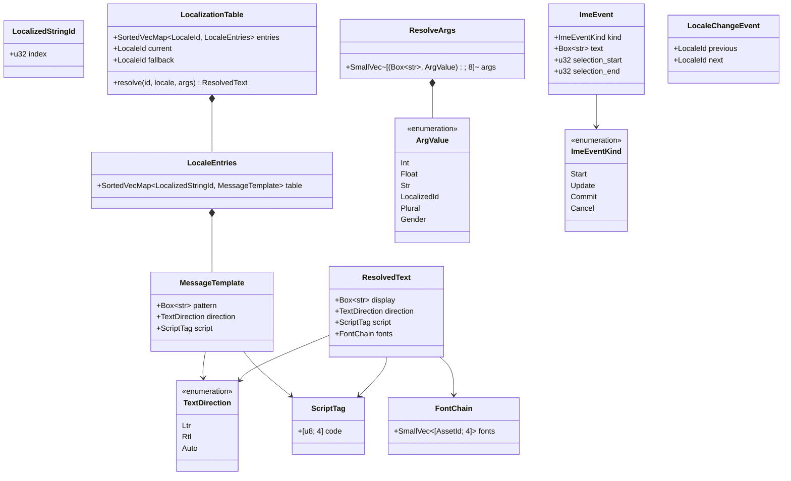
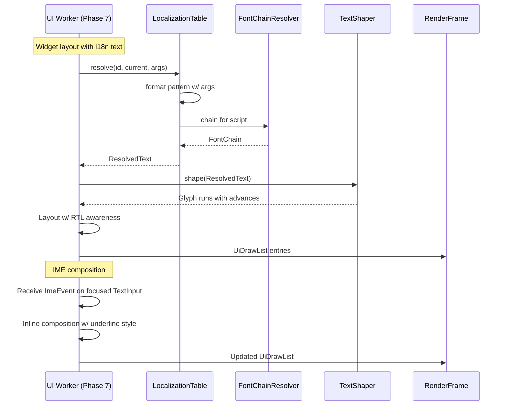
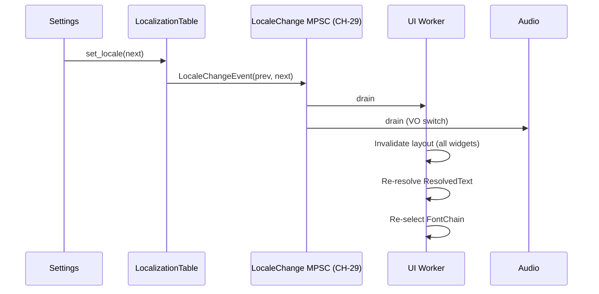

# Localization ↔ UI Integration Design

## Systems Involved

| System | Design | Domain |
|--------|--------|--------|
| Localization | [localization.md](../game-framework/localization.md) | Game Framework |
| UI | [ui-framework.md](../ui/ui-framework.md) | UI |

Localization is a core-runtime service, not a UI feature (see
[constraints.md](../constraints.md#localization)). See
[shared-conventions.md](shared-conventions.md) and
[shared-messaging-capacities.md](shared-messaging-capacities.md). `core-runtime/localization.md` is
tracked as task P2-47 in `design-review.md`; this doc carries the contract for its UI consumer side.

## Integration Requirements

| ID | Requirement | Systems |
|----|-------------|---------|
| IR-4.4.1 | `LocalizedStringId` resolved at UI layout | Loc, UI |
| IR-4.4.2 | Text direction (LTR/RTL) affects layout | Loc, UI |
| IR-4.4.3 | Font fallback chain by script | Loc, UI |
| IR-4.4.4 | IME composition displayed in TextInput | Loc, UI |
| IR-4.4.5 | Dynamic relayout on locale switch | Loc, UI |
| IR-4.4.6 | Pluralization and format args | Loc, UI |

1. **IR-4.4.1** -- UI widgets store `LocalizedStringId` rather than strings. During layout the UI
   resolver queries `LocalizationTable.resolve(id, locale, args)` to produce a `ResolvedText`
   carrying the display string, its computed direction, and the selected font set.
2. **IR-4.4.2** -- Text direction is a property of `ResolvedText` and drives the UI layout
   algorithm. Widgets flip alignment, padding, and icon placement for RTL.
3. **IR-4.4.3** -- The resolver picks a font fallback chain based on the script of the text. The UI
   shaper then renders glyphs, falling through the chain for any missing codepoint.
4. **IR-4.4.4** -- When a `TextInput` widget has focus, IME composition state (candidate string,
   selection range) arrives through `ImeEvent` and is displayed inline with a distinct style.
5. **IR-4.4.5** -- On a locale switch, the UI receives a `LocaleChangeEvent` and re-resolves all
   `LocalizedStringId`s, forces layout invalidation, and re-runs font-chain selection.
6. **IR-4.4.6** -- Plural and gendered text use ICU-style message format args provided in
   `ResolveArgs`. Format resolution happens in the localization table.

## Data Contracts

| Type | Defined in | Consumed by | Purpose |
|------|-----------|-------------|---------|
| `LocalizedStringId` | Loc | UI | Stable table key |
| `LocalizationTable` | Loc | UI | Resolver |
| `ResolveArgs` | Loc | Loc | Format arguments |
| `ResolvedText` | Loc | UI | Display string + meta |
| `TextDirection` | Loc | UI | LTR / RTL |
| `ScriptTag` | Loc | UI | ISO 15924 script id |
| `FontChain` | UI | UI | Font fallback list |
| `ImeEvent` | Input | UI | IME composition |
| `LocaleChangeEvent` | Loc | UI | Locale switch |
| `LocaleChangeCh` | Loc | Workers | MPSC `CH-29` |

## Class Diagram

## Data Flow

## Timing and Ordering

| System | Phase | Timestep | Order |
|--------|-------|----------|-------|
| Locale change receive | 1 Input | Variable | 1st |
| UI layout | 7 Snapshot | Variable | 1st |
| Localization resolve | 7 Snapshot | Variable | inside layout |
| Font chain selection | 7 Snapshot | Variable | inside layout |
| Text shaping | 7 Snapshot | Variable | after resolve |
| IME event dispatch | 1 Input | Variable | before layout |

Locale change events fire in Phase 1 and are observed by UI at the next layout (Phase 7) in the same
frame. A locale switch therefore takes effect within one frame.

## Thread Ownership

| Data / system | Owning thread | QoS / pin | Handoff |
|---------------|---------------|-----------|---------|
| `LocalizationTable` | Worker | user-initiated | `Arc<LocalizationTable>` (SC-1 OK, immutable) |
| `FontAtlas` | Render (GPU) | core-pinned | `Arc<FontAtlas>` (immutable after bake) |
| `LocaleChangeCh` | Worker -> Worker | user-initiated | `CH-29` cap=16 BackPressure |
| `ImeEvent` stream | Main -> Worker | user-initiated | Reuses `CH-1` input channel |
| `ResolvedText` | UI worker | user-initiated | Per-frame arena alloc |

1. **`Arc<LocalizationTable>`** is immutable between locale switches; on a locale switch, a new
   table replaces the previous `Arc`. This preserves SC-1.
2. **`SortedVecMap` for entries** (SC-2 compliant).
3. **rkyv derives** on `LocalizationTable` so it can be mmapped from disk (SC-12). Baked locale
   tables ship as `.loctbl` rkyv archives.
4. **Per-frame `ResolvedText`** is allocated from the worker-local arena and discarded at frame end;
   no `Arc` needed.

## Fallback Modes

| ID | Trigger | Policy | Recovery | Side effects |
|----|---------|--------|----------|-------------|
| FM-1 | `LocalizedStringId` not in current locale | Use fallback locale (usually English) | Next load | Mixed lang |
| FM-2 | String not in fallback either | Render `[missing:id]` sentinel | Table patch | Visible diag |
| FM-3 | Glyph not in any font in chain | Render `.notdef` box | Chain extended | Missing glyph UI |
| FM-4 | IME Commit after focus moved | Discard composition | Next IME start | Lost partial input |
| FM-5 | `CH-29` full (unlikely) | BackPressure producer | Channel drains | Small stall at setting |
| FM-6 | Pattern format arg missing | Substitute `{missing:key}` | Args fix | Visible diag |
| FM-7 | Locale change during layout | Defer to next frame | Next frame | 1-frame latency |

## Performance Budget

Cross-reference [/docs/design/performance-budget.md](../performance-budget.md).

| Pair subsystem | Phase | Budget | Source |
|----------------|-------|--------|--------|
| Locale resolve (500 strings) | 7 Snapshot | 0.1 ms | UI layout slice |
| Font chain select (per string) | 7 Snapshot | 0.02 ms | UI layout slice |
| Text shaping (cached) | 7 Snapshot | 0.15 ms | UI layout slice |
| Locale switch re-layout | 7 Snapshot | 2.0 ms (rare) | One-off event |

## Test Plan

See companion [localization-ui-test-cases.md](localization-ui-test-cases.md).

## Open Questions

| # | Question | Owner |
|---|----------|-------|
| 1 | Should resolution be memoized per frame? | Localization |
| 2 | How are date/time/number formats plugged in? | Core runtime |
| 3 | Font fallback ordering per-script or per-locale? | UI |
