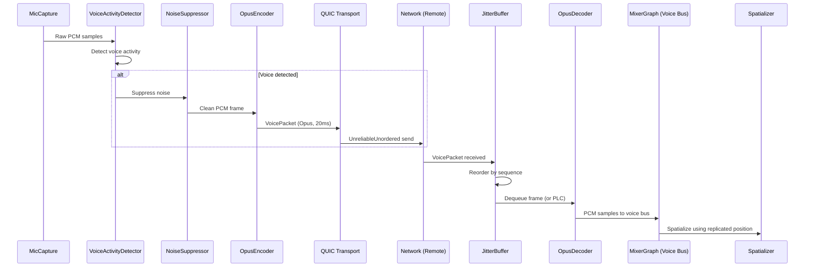

# Networking ↔ Audio Integration Design

## Systems Involved

| System | Design | Domain |
|--------|--------|--------|
| Networking | [network-transport.md](../networking/network-transport.md) | Net |
| Audio | [audio.md](../audio/audio.md) | Audio |

## Integration Requirements

| ID | Requirement | Systems |
|----|-------------|---------|
| IR-4.3.1 | Voice chat over QUIC unreliable channel | Net, Audio |
| IR-4.3.2 | Opus encode/decode for voice packets | Net, Audio |
| IR-4.3.3 | Jitter buffer smooths voice playback | Net, Audio |
| IR-4.3.4 | Spatial audio state replicated for remote | Net, Audio |
| IR-4.3.5 | Voice activity detection gates transmission | Net, Audio |
| IR-4.3.6 | Voice channel management via RPC | Net, Audio |
| IR-4.3.7 | Proximity voice uses spatial position | Net, Audio |

1. **IR-4.3.1** -- Opus-encoded voice packets are sent via `UnreliableUnordered` QUIC channel. Each
   packet contains a sequence number, Opus frame, and sender `ConnectionId`.
2. **IR-4.3.2** -- `OpusEncoder` on the sender compresses mic audio at 6-64 kbps. `OpusDecoder` on
   receiver decompresses. Opus PLC (packet loss concealment) generates fill audio for lost packets.
3. **IR-4.3.3** -- `JitterBuffer` on the receiver reorders and buffers voice packets to smooth
   playback despite network jitter. Adaptive depth targets 20-60 ms based on measured jitter.
4. **IR-4.3.4** -- `AudioSource` and `AudioListener` position/ orientation are replicated as ECS
   components via the replication system. Remote players hear spatial audio based on replicated
   transforms.
5. **IR-4.3.5** -- `VoiceActivityDetector` on the sender suppresses transmission when no voice is
   detected, saving bandwidth. `NoiseSuppressor` cleans the signal before encoding.
6. **IR-4.3.6** -- `ChannelManager` uses reliable RPCs (`F-8.3.1`) to join/leave voice channels
   (proximity, party, raid). Server validates membership.
7. **IR-4.3.7** -- Proximity voice uses replicated `Transform` position to compute distance. Voices
   beyond the proximity radius are not sent (server-side interest management).

## Data Contracts

| Type | Defined in | Consumed by | Purpose |
|------|-----------|-------------|---------|
| `VoicePacket` | Audio | Networking | Encoded opus frame |
| `OpusEncoder` | Audio | Audio | Mic compression |
| `OpusDecoder` | Audio | Audio | Playback decompression |
| `JitterBuffer` | Audio | Audio | Packet reordering |
| `VoiceActivityDetector` | Audio | Audio | TX gating |
| `ChannelManager` | Audio | Net (RPC) | Channel membership |
| `AudioSource` | Audio | Networking | Spatial position |
| `AudioListener` | Audio | Networking | Listener position |
| `ConnectionId` | Networking | Audio | Sender identity |

```rust
/// Voice packet sent over UnreliableUnordered QUIC
/// channel. Contains one Opus frame (20 ms audio).
pub struct VoicePacket {
    /// Monotonic sequence for jitter buffer ordering.
    pub sequence: u32,
    /// Sender connection for demuxing.
    pub sender: ConnectionId,
    /// Voice channel (proximity, party, raid).
    pub channel: VoiceChannelId,
    /// Opus-encoded audio frame.
    pub opus_frame: SmallVec<[u8; 128]>,
}

/// Voice channel identifier for routing.
#[derive(Clone, Copy, PartialEq, Eq, Hash)]
pub enum VoiceChannelId {
    Proximity,
    Party(u32),
    Raid(u32),
    Custom(u32),
}
```

## Data Flow



## Timing and Ordering

| System | Phase | Timestep | Order |
|--------|-------|----------|-------|
| MicCapture | Audio thread | 20 ms frames | Continuous |
| OpusEncoder | Audio thread | 20 ms frames | After capture |
| Transport send | 2-Network | Variable | After encode |
| Transport recv | 2-Network | Variable | On packet arrival |
| JitterBuffer | Audio thread | 20 ms frames | On dequeue |
| OpusDecoder | Audio thread | 20 ms frames | After jitter |
| Spatializer | Audio thread | Per buffer | After decode |

Voice capture and playback run on the audio thread at buffer rate. The network transport
sends/receives voice packets in Phase 2. The SPSC command queue bridges game thread replication data
to the audio thread.

## Failure Modes

| Failure | Impact | Recovery |
|---------|--------|----------|
| Packet loss | Audio gap | Opus PLC fills gap |
| High jitter | Choppy audio | Jitter buffer depth grows |
| Mic disconnected | No voice TX | VAD outputs silence |
| Opus decode error | Garbled audio | Skip frame, log error |
| Channel RPC timeout | Join delayed | Retry with backoff |
| Server rejects channel join | No voice | UI shows error |

## Platform Considerations

| Platform | Mic capture | QUIC impl |
|----------|-----------|-----------|
| Windows | WASAPI loopback | MsQuic |
| macOS | CoreAudio | Networking.framework |
| Linux | PipeWire / ALSA | quinn-proto |

Acoustic echo cancellation (`AEC`) behavior differs per platform audio backend. The
`AcousticEchoCanceller` uses platform-native AEC where available (Windows WASAPI, macOS CoreAudio)
and falls back to a software implementation on Linux.

## Test Plan

See companion [networking-audio-test-cases.md](networking-audio-test-cases.md).
