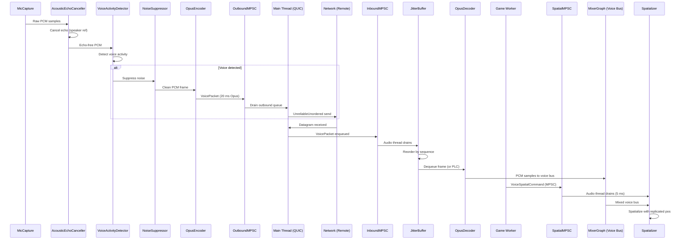

# Networking ↔ Audio Integration Design

> **Compliance.** This document follows the cross-cutting conventions in
> [shared-conventions.md](shared-conventions.md) (SC-1..SC-14) and the channel-capacity formula in
> [shared-messaging-capacities.md](shared-messaging-capacities.md). Deviations: none.

## Systems Involved

| System | Design | Domain |
|--------|--------|--------|
| Networking | [network-transport.md](../networking/network-transport.md) | Net |
| Audio | [audio.md](../audio/audio.md) | Audio |

## Integration Requirements

| ID | Requirement | Systems |
|----|-------------|---------|
| IR-4.3.1 | Voice chat over QUIC unreliable channel | Net, Audio |
| IR-4.3.2 | Opus encode/decode for voice packets | Net, Audio |
| IR-4.3.3 | Jitter buffer smooths voice playback | Net, Audio |
| IR-4.3.4 | Spatial audio state replicated for remote | Net, Audio |
| IR-4.3.5 | Voice activity detection gates transmission | Net, Audio |
| IR-4.3.6 | Voice channel management via RPC | Net, Audio |
| IR-4.3.7 | Proximity voice uses spatial position | Net, Audio |

1. **IR-4.3.1** -- Opus-encoded voice packets are sent via `UnreliableUnordered` QUIC channel. Each
   packet contains a sequence number, Opus frame, and sender `ConnectionId`.
2. **IR-4.3.2** -- `OpusEncoder` on the sender compresses mic audio at 6-64 kbps. `OpusDecoder` on
   receiver decompresses. Opus PLC (packet loss concealment) generates fill audio for lost packets.
3. **IR-4.3.3** -- `JitterBuffer` on the receiver reorders and buffers voice packets to smooth
   playback despite network jitter. Adaptive depth targets 20-60 ms based on measured jitter.
4. **IR-4.3.4** -- `AudioSource` and `AudioListener` position/orientation are replicated as ECS
   components via the replication system. Remote players hear spatial audio based on replicated
   transforms.
5. **IR-4.3.5** -- `VoiceActivityDetector` on the sender suppresses transmission when no voice is
   detected, saving bandwidth. `NoiseSuppressor` cleans the signal before encoding.
6. **IR-4.3.6** -- `ChannelManager` uses reliable RPCs (`F-8.3.1`) to join/leave voice channels
   (proximity, party, raid). Server validates membership.
7. **IR-4.3.7** -- Proximity voice uses the replicated 3D `Transform` position to compute distance.
   Voices beyond the proximity radius are not sent (server-side interest management).

### Scope Note

2D and 2.5D game projections are intentionally out of scope for this integration. Proximity voice
distance is always computed in 3D using `Vec3` world positions regardless of render mode; 2D games
place listeners and sources at Z=0 with unit up vectors.

## Dependency Note

Linux QUIC uses `quinn-proto` -- the sans-IO protocol state machine, *not* the full `quinn` crate.
`quinn` depends on Tokio and is forbidden by the engine constraints. `quinn-proto` is pure sync
state-machine code that the main-thread platform I/O loop feeds datagrams into. This is the approved
dependency.

## Data Contracts

| Type | Defined in | Consumed by | Purpose |
|------|-----------|-------------|---------|
| `VoicePacket` | Audio | Networking | Encoded opus frame |
| `VoiceChannelId` | Audio | Net, Audio | Channel key |
| `VoiceChannelRouter` | Audio | Audio | Hot-path routing |
| `OpusEncoder` | Audio | Audio | Mic compression |
| `OpusDecoder` | Audio | Audio | Playback decompression |
| `JitterBuffer` | Audio | Audio | Packet reordering |
| `VoiceActivityDetector` | Audio | Audio | TX gating |
| `NoiseSuppressor` | Audio | Audio | Signal cleanup |
| `AcousticEchoCanceller` | Audio | Audio | Echo cancel |
| `ChannelManager` | Audio | Net (RPC) | Channel membership |
| `VoiceChannelRpc` | Audio | Net | RPC payloads |
| `AudioSource` | Audio | Networking | Spatial emitter |
| `AudioListener` | Audio | Networking | Listener ref |
| `SpatialParams` | Audio | Audio | Thread-bridge data |
| `VoiceSpatialCommand` | Audio | Audio | Cross-thread msg |
| `ConnectionId` | Networking | Audio | Sender identity |

### Channel Contracts

All cross-thread voice channels are **MPSC** (multiple-producer single-consumer) lock-free queues
per project-wide guidance. SPSC is avoided even when only one producer exists today so future
producers can be added without protocol churn.

| Channel | Producers | Consumer | Capacity |
|---------|-----------|----------|----------|
| `VoiceSpatialCommand` queue | Game workers | Audio thread | 512 |
| `VoicePacketInbound` queue | Main thread (network) | Audio thread | 1024 |
| `VoicePacketOutbound` queue | Audio thread | Main thread (network) | 1024 |
| `VoiceChannelRpc` queue | Game workers | Main thread (RPC) | 64 |

Backpressure policy: when a queue is full, the **oldest** spatial update is dropped (stale position
is tolerable); voice packets dropped at enqueue count as packet loss and trigger PLC on the
receiver.

### Voice Packet

```rust
/// Voice packet sent over UnreliableUnordered QUIC
/// channel. Contains one Opus frame (20 ms audio).
///
/// Fixed-size buffer avoids heap allocation on the
/// audio thread hot path. 256 bytes covers Opus
/// frames up to 64 kbps. `rkyv` derives enable
/// zero-copy wire decoding; the engine uses rkyv
/// exclusively (no serde).
#[derive(Archive, Deserialize, Serialize)]
pub struct VoicePacket {
    /// Monotonic sequence for jitter buffer ordering.
    pub sequence: u32,
    /// Sender connection for demuxing.
    pub sender: ConnectionId,
    /// Voice channel (proximity, party, raid).
    pub channel: VoiceChannelId,
    /// HMAC-SHA256 truncated to 8 bytes. Server
    /// validates against the QUIC connection's
    /// session key to prevent sender spoofing.
    pub auth_tag: [u8; 8],
    /// Opus-encoded audio frame (fixed buffer).
    pub opus_data: [u8; 256],
    /// Actual byte length of `opus_data` used.
    pub opus_len: u8,
}
```

### Voice Channel Routing

```rust
/// Voice channel identifier for routing.
/// No HashMap on hot paths per engine constraints;
/// routing uses a flat array of sorted Vec buckets
/// indexed by discriminant.
#[derive(
    Clone, Copy, PartialEq, Eq,
    Archive, Deserialize, Serialize,
)]
pub enum VoiceChannelId {
    /// Spatial proximity channel (single instance).
    Proximity,
    /// Party chat, indexed by party id.
    Party(u32),
    /// Raid chat, indexed by raid id.
    Raid(u32),
    /// User-defined custom channel.
    Custom(u32),
}

/// Lookup table for voice channel routing. Flat
/// array by discriminant avoids HashMap on the
/// audio thread hot path.
pub struct VoiceChannelRouter {
    /// One sorted `Vec<(inner_id, subscribers)>`
    /// per channel type discriminant
    /// (0=Proximity, 1=Party, 2=Raid, 3=Custom).
    /// Proximity bucket has exactly one entry.
    buckets: [Vec<(u32, Vec<ConnectionSlot>)>; 4],
}

impl VoiceChannelRouter {
    /// O(log n) binary search within the bucket.
    /// Algorithm: `slice::binary_search_by_key` on
    /// the inner id (Knuth, TAOCP vol. 3, 6.2.1).
    pub fn lookup(
        &self,
        channel: VoiceChannelId,
    ) -> &[ConnectionSlot];

    /// Insert a subscriber maintaining sort order.
    pub fn insert(
        &mut self,
        channel: VoiceChannelId,
        slot: ConnectionSlot,
    );

    /// Remove a subscriber maintaining sort order.
    pub fn remove(
        &mut self,
        channel: VoiceChannelId,
        slot: ConnectionSlot,
    );
}
```

### Per-Remote Voice State

```rust
/// Per-connection codec and jitter buffer state.
/// Stored in a flat `Vec<Option<RemoteVoiceState>>`
/// indexed by `ConnectionId::slot()` (a dense u16
/// index assigned at connection accept time). No
/// `Arc`, `Rc`, `Cell`, or `RefCell` -- each entry
/// is exclusively owned by the audio thread.
pub struct RemoteVoiceState {
    pub decoder: OpusDecoder,
    pub jitter_buffer: JitterBuffer,
    pub spatial_params: SpatialParams,
    /// Sustained starvation timer (ms since last
    /// successful pop). Drives playback pause.
    pub starvation_ms: f32,
}
```

### Voice Processing Types

```rust
/// Opus encoder for mic audio compression. Runs on
/// the audio thread. Configured at session start;
/// bitrate adapts to network conditions via
/// `set_bitrate`. Algorithm: libopus (RFC 6716)
/// invoked through the `opus` crate's sans-IO API.
pub struct OpusEncoder {
    /// Target bitrate in bits per second.
    pub bitrate_bps: u32,
    /// Frame size in samples (960 = 20 ms at 48 kHz).
    pub frame_size: u32,
    /// Number of audio channels (1 = mono voice).
    pub channels: u8,
}

impl OpusEncoder {
    pub fn new(
        bitrate_bps: u32,
        sample_rate: u32,
        channels: u8,
    ) -> Self;

    /// Encode PCM samples into an Opus frame.
    /// Returns the number of bytes written to `out`.
    /// Pseudocode:
    ///   out_len = libopus::encode_float(
    ///       &self.state, pcm, out);
    ///   out_len as u8
    pub fn encode(
        &mut self,
        pcm: &[f32],
        out: &mut [u8; 256],
    ) -> u8;

    pub fn set_bitrate(&mut self, bps: u32);
}

/// Opus decoder for voice playback decompression.
/// One instance per remote speaker. Runs on the
/// audio thread. Algorithm: libopus PLC (RFC 6716
/// section 4.4) when `opus_data` is `None`.
pub struct OpusDecoder {
    pub sample_rate: u32,
    pub channels: u8,
}

impl OpusDecoder {
    pub fn new(sample_rate: u32, channels: u8) -> Self;

    /// Decode an Opus frame to PCM. When `opus_data`
    /// is `None`, performs PLC to fill the gap.
    /// Pseudocode:
    ///   match opus_data {
    ///       Some(bytes) => libopus::decode_float(
    ///           &self.state, bytes, pcm_out),
    ///       None => libopus::decode_plc(
    ///           &self.state, pcm_out),
    ///   }
    pub fn decode(
        &mut self,
        opus_data: Option<&[u8]>,
        pcm_out: &mut [f32],
    ) -> usize;
}

/// Adaptive jitter buffer for voice packet
/// reordering. Mutable by design -- packets arrive
/// out of order and must be reordered and dequeued
/// in real time. This is an explicit exception to
/// the immutable-first constraint, justified by
/// the real-time streaming requirement and the
/// single-owner audio-thread invariant.
///
/// Algorithm: fixed ring buffer indexed by
/// `sequence mod 16`. Adaptation follows the
/// Ramachandran/Jacobson RFC 3550 RTP A/V profile
/// jitter estimation, clamped to `depth_range`.
pub struct JitterBuffer {
    /// Ring buffer of pending packets.
    buffer: [Option<VoicePacket>; 16],
    /// Current adaptive depth in milliseconds.
    pub depth_ms: f32,
    /// Target depth range (min, max).
    pub depth_range: (f32, f32),
    /// Next expected sequence number.
    pub next_sequence: u32,
    /// Sustained starvation duration in ms.
    pub starvation_ms: f32,
}

impl JitterBuffer {
    pub fn new(
        min_depth_ms: f32,
        max_depth_ms: f32,
    ) -> Self;

    /// Insert a received packet into the buffer.
    /// Pseudocode:
    ///   let idx = (p.sequence as usize) % 16;
    ///   self.buffer[idx] = Some(p);
    pub fn push(&mut self, packet: VoicePacket);

    /// Dequeue the next packet in sequence order.
    /// Returns `None` on starvation. Caller invokes
    /// `OpusDecoder::decode(None)` for PLC; after
    /// 500 ms sustained starvation the voice is
    /// paused (see Failure Modes).
    pub fn pop(&mut self) -> Option<VoicePacket>;

    /// Update adaptive depth from measured jitter.
    /// Pseudocode:
    ///   self.depth_ms = clamp(
    ///       0.875 * self.depth_ms + 0.125 * jitter_ms,
    ///       self.depth_range.0,
    ///       self.depth_range.1);
    pub fn adapt(&mut self, jitter_ms: f32);
}

/// Voice activity detector. Gates transmission
/// when no speech is detected. Algorithm: frame
/// RMS energy with hangover (WebRTC VAD mode 1).
pub struct VoiceActivityDetector {
    /// RMS energy threshold for speech detection.
    pub threshold: f32,
    /// Hangover frames after last speech detection.
    pub hangover_frames: u16,
    /// Remaining hangover counter.
    pub hangover_remaining: u16,
}

impl VoiceActivityDetector {
    pub fn new(threshold: f32) -> Self;

    /// Returns `true` if the frame contains speech.
    /// Pseudocode:
    ///   let rms = (pcm.iter()
    ///       .map(|x| x * x).sum::<f32>()
    ///       / pcm.len() as f32).sqrt();
    ///   if rms > self.threshold {
    ///       self.hangover_remaining = self.hangover_frames;
    ///       return true;
    ///   }
    ///   if self.hangover_remaining > 0 {
    ///       self.hangover_remaining -= 1;
    ///       return true;
    ///   }
    ///   false
    pub fn detect(&mut self, pcm: &[f32]) -> bool;
}

/// Noise suppressor applied before encoding.
/// Algorithm: spectral subtraction (Boll 1979)
/// with a minimum-statistics noise estimate.
pub struct NoiseSuppressor {
    /// Suppression level in dB (e.g., -15).
    pub suppression_db: f32,
}

impl NoiseSuppressor {
    pub fn new(suppression_db: f32) -> Self;

    /// Suppress noise in-place on the PCM buffer.
    /// Pseudocode:
    ///   let spectrum = fft(pcm);
    ///   let noise = self.estimate_noise(&spectrum);
    ///   let clean = spectral_subtract(
    ///       spectrum, noise, self.suppression_db);
    ///   *pcm = ifft(clean);
    pub fn process(&mut self, pcm: &mut [f32]);
}

/// Acoustic echo canceller. Uses platform-native
/// AEC where available:
/// - Windows: WASAPI AEC DSP
/// - macOS/iOS: CoreAudio Voice Processing IO
/// - Linux: software NLMS-based AEC (fallback)
///
/// Algorithm: normalised LMS (Haykin, "Adaptive
/// Filter Theory", 4th ed., ch. 6) for the Linux
/// fallback; platform DSPs implement proprietary
/// variants on other OSes.
pub struct AcousticEchoCanceller {
    /// Speaker-output reference delay in samples.
    pub tail_length_samples: u32,
}

impl AcousticEchoCanceller {
    pub fn new(tail_length_samples: u32) -> Self;

    /// Cancel echo from `mic` using `reference`
    /// (speaker output). Modifies `mic` in-place.
    /// Pseudocode:
    ///   for n in 0..mic.len() {
    ///       let y = self.filter.predict(reference);
    ///       mic[n] -= y;
    ///       self.filter.update(mic[n], reference);
    ///   }
    pub fn process(
        &mut self,
        mic: &mut [f32],
        reference: &[f32],
    );
}
```

### Opus Frame Buffer Pool

```rust
/// Pool-allocated Opus frame buffers. Replaces
/// `SmallVec` on the audio thread hot path: a
/// fixed-capacity free list owned exclusively by
/// the audio thread. No heap allocation after
/// construction.
pub struct OpusFramePool {
    /// Slab of 64 frame buffers (each 256 bytes).
    slab: [[u8; 256]; 64],
    /// Free index stack. O(1) acquire/release.
    free: [u8; 64],
    free_top: u8,
}

impl OpusFramePool {
    pub fn new() -> Self;
    /// Returns `None` when exhausted; caller drops
    /// the oldest active frame to recycle capacity.
    pub fn acquire(&mut self) -> Option<OpusFrameHandle>;
    pub fn release(&mut self, handle: OpusFrameHandle);
}

/// Handle into the frame pool. Stores the slab
/// index, not a raw pointer.
pub struct OpusFrameHandle(u8);
```

### Channel Management

```rust
/// Voice channel manager. Sends reliable RPCs for
/// join/leave. Server validates membership. Stored
/// as a plain `Vec<VoiceChannelId>` (no `SmallVec`
/// on hot paths) owned by the game thread.
pub struct ChannelManager {
    /// Active voice channels for the local player.
    pub active_channels: Vec<VoiceChannelId>,
}

impl ChannelManager {
    /// Join a voice channel via reliable RPC.
    /// Pseudocode:
    ///   rpc.send(VoiceChannelRpc::JoinRequest {
    ///       channel });
    pub fn join(
        &mut self,
        channel: VoiceChannelId,
        rpc: &RpcSender,
    );

    /// Leave a voice channel via reliable RPC.
    pub fn leave(
        &mut self,
        channel: VoiceChannelId,
        rpc: &RpcSender,
    );
}

/// RPC message types for voice channel operations.
/// Serialized via rkyv (no serde). Sent over a
/// reliable ordered QUIC stream per F-8.3.1.
#[derive(Archive, Deserialize, Serialize)]
pub enum VoiceChannelRpc {
    /// Client asks to join a channel.
    JoinRequest {
        channel: VoiceChannelId,
    },
    /// Server accepts or rejects the join.
    JoinResponse {
        channel: VoiceChannelId,
        result: VoiceChannelResult,
    },
    /// Client asks to leave a channel.
    LeaveRequest {
        channel: VoiceChannelId,
    },
    /// Server acknowledges the leave.
    LeaveAck {
        channel: VoiceChannelId,
    },
}

/// Result of a join attempt.
#[derive(Archive, Deserialize, Serialize)]
pub enum VoiceChannelResult {
    /// Join succeeded.
    Ok,
    /// Client lacks authorization.
    NotAuthorized,
    /// Channel already at capacity.
    ChannelFull,
    /// Channel id does not exist.
    InvalidChannel,
}
```

### ECS Components and Replication

```rust
/// ECS component for audio source emitters.
/// Replicated via the replication system so remote
/// players hear spatial audio at the correct
/// position. Codegen'd into the middleman `.dylib`;
/// users configure via the editor and codegen
/// produces the component struct, rkyv derives,
/// replication annotations, and property panel
/// bindings.
#[derive(Component, Clone, Debug, Reflect)]
#[derive(Archive, Deserialize, Serialize)]
#[replicate(authority = Server, sync = Reliable)]
pub struct AudioSource {
    pub clip: AssetHandle<AudioClip>,
    pub gain: f32,
    pub pitch: f32,
    pub looping: bool,
    pub shape: EmitterShape,
    pub bus: BusId,
    pub priority: VoicePriority,
    pub attenuation: AssetHandle<AttenuationCurve>,
    pub doppler_factor: f32,
}

/// ECS component for the audio listener. Replicated
/// for remote spatial audio. Codegen'd into the
/// middleman `.dylib` alongside `AudioSource` and
/// `VoiceChatComponent`.
#[derive(Component, Clone, Debug, Reflect)]
#[derive(Archive, Deserialize, Serialize)]
#[replicate(authority = Client, sync = Unreliable)]
pub struct AudioListener {
    pub player_index: u8,
}

/// Voice chat membership component. Codegen'd
/// alongside the other voice types; drives the
/// `ChannelManager` via the replication system.
#[derive(Component, Clone, Debug, Reflect)]
#[derive(Archive, Deserialize, Serialize)]
#[replicate(authority = Server, sync = Reliable)]
pub struct VoiceChatComponent {
    pub channels: Vec<VoiceChannelId>,
}

/// Shape of an audio emitter for spatialization.
#[derive(Clone, Copy, Debug, Reflect)]
#[derive(Archive, Deserialize, Serialize)]
pub enum EmitterShape {
    /// Point source.
    Point,
    /// Spherical falloff with `radius` metres.
    Sphere { radius: f32 },
    /// Cone with half-angle in radians.
    Cone { half_angle: f32 },
}

/// Audio bus identifier.
#[derive(Clone, Copy, Debug, Reflect)]
#[derive(Archive, Deserialize, Serialize)]
pub enum BusId {
    Master,
    Music,
    SFX,
    Voice,
    Ambient,
}

/// Voice priority for voice-stealing decisions.
#[derive(Clone, Copy, Debug, Reflect)]
#[derive(Archive, Deserialize, Serialize)]
pub enum VoicePriority {
    Low,
    Medium,
    High,
    Critical,
}

/// Spatial parameters sent to the audio thread via
/// MPSC command queue. Contains the replicated
/// transform data needed for spatialization. Plain
/// data -- no references, no `Arc`.
pub struct SpatialParams {
    pub position: Vec3,
    pub forward: Vec3,
    pub up: Vec3,
    pub velocity: Vec3,
}
```

### Game-to-Audio Thread Bridge

```rust
/// Commands sent from the game thread to the audio
/// thread via a lock-free MPSC command queue
/// (crossbeam-channel). Game workers write spatial
/// updates from replicated ECS components; the
/// audio thread reads and applies them.
///
/// MPSC is used even though today only one producer
/// (the replication system) writes spatial updates,
/// to match the project-wide guidance and to allow
/// future producers without protocol changes.
/// Capacity 512. On overflow the oldest spatial
/// update is dropped -- stale position is tolerable
/// for smoothing purposes.
pub enum VoiceSpatialCommand {
    /// Update spatial position for a remote speaker.
    UpdatePosition {
        connection: ConnectionId,
        params: SpatialParams,
    },
    /// Remote speaker joined a voice channel.
    SpeakerJoined {
        connection: ConnectionId,
        channel: VoiceChannelId,
    },
    /// Remote speaker left a voice channel.
    SpeakerLeft {
        connection: ConnectionId,
        channel: VoiceChannelId,
    },
}

/// MPSC sender handed out to game workers.
/// Bounded capacity of 512 entries.
pub struct VoiceSpatialSender {
    inner: crossbeam_channel::Sender<
        VoiceSpatialCommand,
    >,
}

/// MPSC receiver owned by the audio thread. Drained
/// every audio buffer callback (~5 ms).
pub struct VoiceSpatialReceiver {
    inner: crossbeam_channel::Receiver<
        VoiceSpatialCommand,
    >,
}
```

### Voice Packet Authentication

Voice packets include an 8-byte HMAC-SHA256 tag (`auth_tag`) computed over the packet's `sequence`,
`channel`, and `opus_data` fields using a per-connection session key derived during the QUIC
handshake. The server validates each incoming voice packet's `auth_tag` against the connection's
session key before forwarding. Packets with invalid tags are silently dropped and the event is
counted in the `voice_auth_failures` runtime metric.

This prevents sender spoofing: a malicious client cannot forge `VoicePacket.sender` to impersonate
another player because it lacks that connection's session key.

### Middleman Codegen

Voice-related ECS components (`AudioSource`, `AudioListener`, `VoiceChatComponent`) are user-facing
types codegen'd into the middleman `.dylib`. The codegen pipeline generates:

1. Component struct definitions with rkyv `Archive`, `Serialize`, `Deserialize` derives
2. Property panel bindings for editor inspection
3. Replication annotations (`#[replicate(...)]`) consumed by the replication system
4. Type descriptors for the scene text format

The engine loads the middleman `.dylib` at startup and resolves voice component types by codegen'd
identifier. Users never write these structs by hand.

## Class Diagram

```mermaid
classDiagram
    class VoicePacket {
        +u32 sequence
        +ConnectionId sender
        +VoiceChannelId channel
        +u8[8] auth_tag
        +u8[256] opus_data
        +u8 opus_len
    }
    class VoiceChannelId {
        <<enumeration>>
        Proximity
        Party
        Raid
        Custom
    }
    class VoiceChannelResult {
        <<enumeration>>
        Ok
        NotAuthorized
        ChannelFull
        InvalidChannel
    }
    class VoiceChannelRpc {
        <<enumeration>>
        JoinRequest
        JoinResponse
        LeaveRequest
        LeaveAck
    }
    class VoiceChannelRouter {
        -Vec buckets[4]
        +lookup(channel) Subscribers
        +insert(channel, slot)
        +remove(channel, slot)
    }
    class RemoteVoiceState {
        +OpusDecoder decoder
        +JitterBuffer jitter_buffer
        +SpatialParams spatial_params
        +f32 starvation_ms
    }
    class OpusEncoder {
        +u32 bitrate_bps
        +u32 frame_size
        +u8 channels
        +encode(pcm, out) u8
        +set_bitrate(bps)
    }
    class OpusDecoder {
        +u32 sample_rate
        +u8 channels
        +decode(data, pcm) usize
    }
    class JitterBuffer {
        -Option buffer[16]
        +f32 depth_ms
        +tuple depth_range
        +u32 next_sequence
        +f32 starvation_ms
        +push(packet)
        +pop() Option
        +adapt(jitter_ms)
    }
    class VoiceActivityDetector {
        +f32 threshold
        +u16 hangover_frames
        +u16 hangover_remaining
        +detect(pcm) bool
    }
    class NoiseSuppressor {
        +f32 suppression_db
        +process(pcm)
    }
    class AcousticEchoCanceller {
        +u32 tail_length_samples
        +process(mic, reference)
    }
    class OpusFramePool {
        -u8[256] slab[64]
        -u8 free[64]
        -u8 free_top
        +acquire() Option
        +release(handle)
    }
    class OpusFrameHandle {
        -u8 idx
    }
    class ChannelManager {
        +Vec active_channels
        +join(channel, rpc)
        +leave(channel, rpc)
    }
    class AudioSource {
        +AssetHandle clip
        +f32 gain
        +f32 pitch
        +bool looping
        +EmitterShape shape
        +BusId bus
        +VoicePriority priority
        +AssetHandle attenuation
        +f32 doppler_factor
    }
    class AudioListener {
        +u8 player_index
    }
    class VoiceChatComponent {
        +Vec channels
    }
    class EmitterShape {
        <<enumeration>>
        Point
        Sphere
        Cone
    }
    class BusId {
        <<enumeration>>
        Master
        Music
        SFX
        Voice
        Ambient
    }
    class VoicePriority {
        <<enumeration>>
        Low
        Medium
        High
        Critical
    }
    class SpatialParams {
        +Vec3 position
        +Vec3 forward
        +Vec3 up
        +Vec3 velocity
    }
    class VoiceSpatialCommand {
        <<enumeration>>
        UpdatePosition
        SpeakerJoined
        SpeakerLeft
    }
    class VoiceSpatialSender {
        -Sender inner
    }
    class VoiceSpatialReceiver {
        -Receiver inner
    }

    VoicePacket --> VoiceChannelId
    VoiceChannelRouter --> VoiceChannelId
    VoiceChannelRpc --> VoiceChannelId
    VoiceChannelRpc --> VoiceChannelResult
    RemoteVoiceState --> OpusDecoder
    RemoteVoiceState --> JitterBuffer
    RemoteVoiceState --> SpatialParams
    JitterBuffer --> VoicePacket
    AudioSource --> EmitterShape
    AudioSource --> BusId
    AudioSource --> VoicePriority
    VoiceChatComponent --> VoiceChannelId
    ChannelManager --> VoiceChannelId
    ChannelManager ..> VoiceChannelRpc : sends
    VoiceSpatialCommand --> SpatialParams
    VoiceSpatialCommand --> VoiceChannelId
    VoiceSpatialSender ..> VoiceSpatialCommand : produces
    VoiceSpatialReceiver ..> VoiceSpatialCommand : consumes
    OpusFramePool --> OpusFrameHandle
```



## Data Flow



## Timing and Ordering

| System | Thread | Phase | Timestep |
|--------|--------|-------|----------|
| MicCapture | Audio (real-time) | n/a | 20 ms frames |
| AEC | Audio (real-time) | n/a | 20 ms frames |
| VAD + NS | Audio (real-time) | n/a | 20 ms frames |
| OpusEncoder | Audio (real-time) | n/a | 20 ms frames |
| Outbound drain | Main | I/O poll | On poll |
| QUIC send/recv | Main | I/O poll | On poll |
| Inbound enqueue | Main | I/O poll | On poll |
| JitterBuffer | Audio (real-time) | n/a | Each callback |
| OpusDecoder | Audio (real-time) | n/a | Each callback |
| Spatializer | Audio (real-time) | n/a | Each callback |
| Replication -> spatial | Worker | 2 (Network) | 60 Hz |

### Thread Mapping

The engine uses three primary threads (main, workers, render) plus a dedicated real-time audio
thread:

| Thread | Role | Voice responsibility |
|--------|------|----------------------|
| Main | OS event loop, platform I/O | QUIC send/recv; RPC send |
| Workers | Game loop, ECS, replication | Spatial updates to audio |
| Render | GPU submission | None |
| Audio (real-time) | Mic capture, mix, playback | Encode, decode, mix, PLC |

The audio thread is the only real-time thread in the engine. It is not QoS-demoted -- instead it
uses the OS real-time audio API (CoreAudio IO thread, WASAPI render client, PipeWire RT). The render
thread is core-pinned; workers run at "user interactive" QoS; the audio thread runs at the OS's
audio real-time priority.

Voice capture and playback run on the audio thread at buffer rate. Network transport runs on the
main thread's platform I/O loop; inbound voice packets are enqueued to the inbound MPSC queue and
drained by the audio thread at the start of each callback. Outbound packets follow the reverse path.
Replication-driven spatial updates are produced by game workers in game-loop Phase 2 (Network) and
consumed by the audio thread via the spatial MPSC queue.

### Performance Budget

| Metric | Budget | Rationale |
|--------|--------|-----------|
| Audio thread voice CPU | < 1.0 ms / callback | 32 streams + encode |
| MPSC send p99 | < 5 us | Lock-free bounded |
| End-to-end latency | < 150 ms | RFC 1889 voice target |

### Debug Toggles

A runtime-toggleable `VoiceDebug` ECS resource enables per-stream logging. When enabled, each stage
records frame count, dropped packets, jitter depth, starvation events, and auth failures into a ring
buffer that the profiler overlay reads. Toggling is a single atomic flag set; no recompile required.

## Failure Modes

| Failure | Impact | Recovery |
|---------|--------|----------|
| Packet loss | Audio gap | Opus PLC fills gap |
| High jitter | Choppy audio | Jitter buffer depth grows |
| Jitter buffer starvation | Silence | PLC up to 500 ms then pause |
| Mic disconnected | No voice TX | VAD outputs silence |
| Opus decode error | Garbled audio | Skip frame, log error |
| Channel RPC timeout | Join delayed | Retry with exp backoff |
| Server rejects channel join | No voice | UI shows error |
| Auth tag mismatch | Spoofed packet | Drop + metric |
| Inbound MPSC full | Packet drop | Counted as loss, PLC |
| Spatial MPSC full | Stale position | Drop oldest update |
| Frame pool exhausted | Oldest frame drop | Recycle, log overrun |

### Detailed Fallback Paths

1. **Packet loss** -- `JitterBuffer::pop` returns `None` for a missing sequence.
   `OpusDecoder:: decode(None)` generates PLC fill audio. Handled per-packet without visible
   stutter.
2. **Jitter buffer starvation** -- Sustained `pop` returning `None` for more than 500 ms (tracked in
   `starvation_ms`). The audio engine pauses the voice (outputs silence) and logs a
   `voice_starvation` metric. On the next successful `push`, playback resumes at the new sequence.
3. **Inbound MPSC full** -- Main thread `try_send` fails and the datagram is dropped; this counts as
   packet loss and is smoothed by PLC on the next pop.
4. **Spatial MPSC full** -- Game worker `try_send` fails; the oldest `UpdatePosition` is overwritten
   by the next frame's update. Stale position is acceptable because the audio thread interpolates.
5. **Auth tag mismatch** -- Server drops the packet, increments `voice_auth_failures`, and does not
   forward. Client PLC masks the gap.
6. **Frame pool exhausted** -- `OpusFramePool::acquire` returns `None`; the oldest in-flight frame
   is forcibly released and reused. A `frame_pool_overrun` metric fires.

## Platform Considerations

| Platform | Mic capture | QUIC impl | AEC |
|----------|-------------|-----------|-----|
| Windows | WASAPI capture | MsQuic | WASAPI AEC DSP |
| macOS | CoreAudio | Network.framework | CoreAudio VPIO |
| iOS | CoreAudio | Network.framework | CoreAudio VPIO |
| Linux | PipeWire / ALSA | quinn-proto | Software NLMS |
| Android | AAudio | quinn-proto | Software NLMS |

Acoustic echo cancellation uses platform-native AEC where available. On Linux and Android the
`AcousticEchoCanceller` runs the NLMS software fallback on the audio thread; estimated cost is 0.3
ms per 20 ms frame at 48 kHz.

## Test Plan

See companion [networking-audio-test-cases.md](networking-audio-test-cases.md).

## Review Status

| # | Item | Status |
|---|------|--------|
| 1 | Fixed `VoicePacket` buffer (no heap fallback) | APPLIED |
| 2 | `VoiceChannelRouter` flat array, no HashMap on hot path | APPLIED |
| 3 | rkyv `Archive`/`Serialize`/`Deserialize` on all wire types | APPLIED |
| 4 | Full `classDiagram` added covering all types/enums | APPLIED |
| 5 | Thread mapping table replaces "Phase 2-Network" ambiguity | APPLIED |
| 6 | Rust pseudocode + algorithm refs for all voice types | APPLIED |
| 7 | 2D/2.5D scope note (proximity distance is always 3D) | APPLIED |
| 8 | `AudioSource`/`AudioListener` components + replication attrs | APPLIED |
| 9 | MPSC worker -> audio thread in sequence diagram | APPLIED |
| 10 | `quinn-proto` sans-IO confirmed as approved dependency | APPLIED |
| 11 | `VoiceChannelRpc` message types defined with rkyv | APPLIED |
| 12 | AEC stage added to Data Flow diagram | APPLIED |
| 13 | Jitter buffer starvation failure mode documented | APPLIED |
| 14 | Voice packet authentication and anti-spoofing documented | APPLIED |
| 15 | Ownership of per-remote state (audio-thread-exclusive) | APPLIED |
| 16 | AEC behavior test added | APPLIED |
| 17 | Simultaneous multi-channel voice test added | APPLIED |
| 18 | Benchmark target CPU stated | APPLIED |
| 19 | `JitterBuffer` mutable-exception documented | APPLIED |
| 20 | Middleman .dylib codegen pipeline documented | APPLIED |
| 21 | All MPSC channels, buffer lengths, backpressure documented | APPLIED |
| 22 | `Arc` audit: only immutable shared data; none on hot paths | APPLIED |
| 23 | Debug tools runtime-toggleable via `VoiceDebug` resource | APPLIED |
| 24 | `SmallVec` removed from audio hot path (pool allocator) | APPLIED |
| 25 | Negative CI-runnable tests added | APPLIED |
