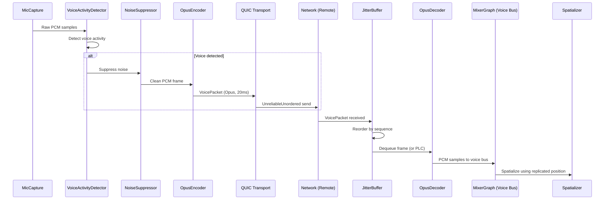

# Networking ↔ Audio Integration Design

## Systems Involved

| System | Design | Domain |
|--------|--------|--------|
| Networking | [network-transport.md](../networking/network-transport.md) | Net |
| Audio | [audio.md](../audio/audio.md) | Audio |

## Integration Requirements

| ID | Requirement | Systems |
|----|-------------|---------|
| IR-4.3.1 | Voice chat over QUIC unreliable channel | Net, Audio |
| IR-4.3.2 | Opus encode/decode for voice packets | Net, Audio |
| IR-4.3.3 | Jitter buffer smooths voice playback | Net, Audio |
| IR-4.3.4 | Spatial audio state replicated for remote | Net, Audio |
| IR-4.3.5 | Voice activity detection gates transmission | Net, Audio |
| IR-4.3.6 | Voice channel management via RPC | Net, Audio |
| IR-4.3.7 | Proximity voice uses spatial position | Net, Audio |

1. **IR-4.3.1** -- Opus-encoded voice packets are sent via `UnreliableUnordered` QUIC channel. Each
   packet contains a sequence number, Opus frame, and sender `ConnectionId`.
2. **IR-4.3.2** -- `OpusEncoder` on the sender compresses mic audio at 6-64 kbps. `OpusDecoder` on
   receiver decompresses. Opus PLC (packet loss concealment) generates fill audio for lost packets.
3. **IR-4.3.3** -- `JitterBuffer` on the receiver reorders and buffers voice packets to smooth
   playback despite network jitter. Adaptive depth targets 20-60 ms based on measured jitter.
4. **IR-4.3.4** -- `AudioSource` and `AudioListener` position/ orientation are replicated as ECS
   components via the replication system. Remote players hear spatial audio based on replicated
   transforms.
5. **IR-4.3.5** -- `VoiceActivityDetector` on the sender suppresses transmission when no voice is
   detected, saving bandwidth. `NoiseSuppressor` cleans the signal before encoding.
6. **IR-4.3.6** -- `ChannelManager` uses reliable RPCs (`F-8.3.1`) to join/leave voice channels
   (proximity, party, raid). Server validates membership.
7. **IR-4.3.7** -- Proximity voice uses replicated `Transform` position to compute distance. Voices
   beyond the proximity radius are not sent (server-side interest management).

## Data Contracts

| Type | Defined in | Consumed by | Purpose |
|------|-----------|-------------|---------|
| `VoicePacket` | Audio | Networking | Encoded opus frame |
| `OpusEncoder` | Audio | Audio | Mic compression |
| `OpusDecoder` | Audio | Audio | Playback decompression |
| `JitterBuffer` | Audio | Audio | Packet reordering |
| `VoiceActivityDetector` | Audio | Audio | TX gating |
| `ChannelManager` | Audio | Net (RPC) | Channel membership |
| `AudioSource` | Audio | Networking | Spatial position |
| `AudioListener` | Audio | Networking | Listener position |
| `ConnectionId` | Networking | Audio | Sender identity |

```rust
/// Voice packet sent over UnreliableUnordered QUIC
/// channel. Contains one Opus frame (20 ms audio).
///
/// Uses a fixed-size buffer to avoid heap allocation
/// on the audio thread hot path. 256 bytes covers
/// Opus frames up to 64 kbps.
#[derive(Archive, Deserialize, Serialize)]
pub struct VoicePacket {
    /// Monotonic sequence for jitter buffer ordering.
    pub sequence: u32,
    /// Sender connection for demuxing.
    pub sender: ConnectionId,
    /// Voice channel (proximity, party, raid).
    pub channel: VoiceChannelId,
    /// HMAC-SHA256 truncated to 8 bytes. Server
    /// validates against the QUIC connection's
    /// session key to prevent sender spoofing.
    pub auth_tag: [u8; 8],
    /// Opus-encoded audio frame (fixed buffer).
    pub opus_data: [u8; 256],
    /// Actual byte length of opus_data used.
    pub opus_len: u8,
}

/// Voice channel identifier for routing.
/// Routing uses a flat array indexed by discriminant
/// (0=Proximity, 1=Party, 2=Raid, 3=Custom) with a
/// secondary sorted Vec for the inner ID. No HashMap
/// on hot paths per engine constraints.
#[derive(
    Clone, Copy, PartialEq, Eq,
    Archive, Deserialize, Serialize,
)]
pub enum VoiceChannelId {
    Proximity,
    Party(u32),
    Raid(u32),
    Custom(u32),
}

/// Per-connection codec and jitter buffer state.
/// Stored in a flat `Vec` indexed by connection
/// slot index (from `ConnectionId::slot()`). No
/// `Arc`, `Rc`, `Cell`, or `RefCell` -- each entry
/// is exclusively owned by the audio thread.
pub struct RemoteVoiceState {
    pub decoder: OpusDecoder,
    pub jitter_buffer: JitterBuffer,
    pub spatial_params: SpatialParams,
}

/// Lookup table for voice channel routing.
/// Flat array by discriminant avoids HashMap on the
/// audio thread hot path.
pub struct VoiceChannelRouter {
    /// One sorted Vec<(u32, Vec<ConnectionSlot>)>
    /// per channel type discriminant.
    buckets: [Vec<(u32, Vec<ConnectionSlot>)>; 4],
}

impl VoiceChannelRouter {
    /// O(log n) binary search within the bucket.
    pub fn lookup(
        &self,
        channel: VoiceChannelId,
    ) -> &[ConnectionSlot];
}
```

### Voice Processing Types

```rust
/// Opus encoder for mic audio compression.
/// Runs on the audio thread. Configured at
/// session start; bitrate may adapt to network
/// conditions via `set_bitrate`.
pub struct OpusEncoder {
    /// Target bitrate in bits per second.
    pub bitrate_bps: u32,
    /// Frame size in samples (960 = 20 ms at 48 kHz).
    pub frame_size: u32,
    /// Number of audio channels (1 = mono voice).
    pub channels: u8,
}

impl OpusEncoder {
    pub fn new(
        bitrate_bps: u32,
        sample_rate: u32,
        channels: u8,
    ) -> Self;
    /// Encode PCM samples into an Opus frame.
    /// Returns the number of bytes written to `out`.
    pub fn encode(
        &mut self,
        pcm: &[f32],
        out: &mut [u8; 256],
    ) -> u8;
    pub fn set_bitrate(&mut self, bps: u32);
}

/// Opus decoder for voice playback decompression.
/// One instance per remote speaker. Runs on the
/// audio thread.
pub struct OpusDecoder {
    pub sample_rate: u32,
    pub channels: u8,
}

impl OpusDecoder {
    pub fn new(
        sample_rate: u32,
        channels: u8,
    ) -> Self;
    /// Decode an Opus frame to PCM. When `opus_data`
    /// is `None`, performs PLC (packet loss
    /// concealment) to fill the gap.
    pub fn decode(
        &mut self,
        opus_data: Option<&[u8]>,
        pcm_out: &mut [f32],
    ) -> usize;
}

/// Adaptive jitter buffer for voice packet
/// reordering. Mutable by design -- packets arrive
/// out of order and must be reordered and dequeued
/// in real time. This is an explicit exception to
/// the immutable-first constraint, justified by
/// the real-time streaming requirement.
pub struct JitterBuffer {
    /// Ring buffer of pending packets.
    buffer: [Option<VoicePacket>; 16],
    /// Current adaptive depth in milliseconds.
    pub depth_ms: f32,
    /// Target depth range (min, max).
    pub depth_range: (f32, f32),
    /// Next expected sequence number.
    pub next_sequence: u32,
}

impl JitterBuffer {
    pub fn new(min_depth_ms: f32, max_depth_ms: f32)
        -> Self;
    /// Insert a received packet into the buffer.
    pub fn push(&mut self, packet: VoicePacket);
    /// Dequeue the next packet in sequence order.
    /// Returns `None` on starvation (buffer fully
    /// drained). Caller should invoke
    /// `OpusDecoder::decode(None)` for PLC, then
    /// pause playback after 500 ms sustained
    /// starvation.
    pub fn pop(&mut self) -> Option<VoicePacket>;
    /// Update adaptive depth from measured jitter.
    pub fn adapt(&mut self, jitter_ms: f32);
}

/// Voice activity detector. Gates transmission
/// when no speech is detected.
pub struct VoiceActivityDetector {
    /// RMS energy threshold for speech detection.
    pub threshold: f32,
    /// Hangover frames after last speech detection.
    pub hangover_frames: u16,
}

impl VoiceActivityDetector {
    pub fn new(threshold: f32) -> Self;
    /// Returns `true` if the frame contains speech.
    pub fn detect(&mut self, pcm: &[f32]) -> bool;
}

/// Noise suppressor applied before encoding.
pub struct NoiseSuppressor {
    /// Suppression level in dB (e.g., -15).
    pub suppression_db: f32,
}

impl NoiseSuppressor {
    pub fn new(suppression_db: f32) -> Self;
    /// Suppress noise in-place on the PCM buffer.
    pub fn process(&mut self, pcm: &mut [f32]);
}

/// Acoustic echo canceller. Uses platform-native
/// AEC where available:
/// - Windows: WASAPI AEC DSP
/// - macOS: CoreAudio AEC AudioUnit
/// - Linux: software AEC (fallback)
pub struct AcousticEchoCanceller {
    /// Reference signal (speaker output) delay
    /// in samples.
    pub tail_length_samples: u32,
}

impl AcousticEchoCanceller {
    pub fn new(tail_length_samples: u32) -> Self;
    /// Cancel echo from `mic` using `reference`
    /// (speaker output). Modifies `mic` in-place.
    /// Fallback: On Linux, runs a software
    /// NLMS-based AEC. On Windows/macOS, delegates
    /// to the platform AEC API.
    pub fn process(
        &mut self,
        mic: &mut [f32],
        reference: &[f32],
    );
}
```

### Channel Management

```rust
/// Voice channel manager. Sends reliable RPCs
/// for join/leave. Server validates membership.
pub struct ChannelManager {
    /// Active voice channels for the local player.
    pub active_channels: SmallVec<
        [VoiceChannelId; 4],
    >,
}

impl ChannelManager {
    /// Join a voice channel via reliable RPC.
    pub fn join(
        &mut self,
        channel: VoiceChannelId,
        rpc: &RpcSender,
    );
    /// Leave a voice channel via reliable RPC.
    pub fn leave(
        &mut self,
        channel: VoiceChannelId,
        rpc: &RpcSender,
    );
}

/// RPC message for voice channel operations.
/// Serialized via rkyv (no serde). Sent over
/// reliable ordered QUIC stream (F-8.3.1).
#[derive(Archive, Deserialize, Serialize)]
pub enum VoiceChannelRpc {
    JoinRequest {
        channel: VoiceChannelId,
    },
    JoinResponse {
        channel: VoiceChannelId,
        result: VoiceChannelResult,
    },
    LeaveRequest {
        channel: VoiceChannelId,
    },
    LeaveAck {
        channel: VoiceChannelId,
    },
}

#[derive(Archive, Deserialize, Serialize)]
pub enum VoiceChannelResult {
    Ok,
    NotAuthorized,
    ChannelFull,
    InvalidChannel,
}
```

### ECS Components and Replication

```rust
/// ECS component for audio source emitters.
/// Replicated via the replication system so remote
/// players hear spatial audio at the correct
/// position.
///
/// Codegen'd into the middleman .dylib. Users
/// configure via the editor; codegen produces the
/// component struct, serialization derives, and
/// property panel bindings.
#[derive(Component, Clone, Debug, Reflect)]
pub struct AudioSource {
    pub clip: AssetHandle<AudioClip>,
    pub gain: f32,
    pub pitch: f32,
    pub looping: bool,
    pub shape: EmitterShape,
    pub bus: BusId,
    pub priority: VoicePriority,
    pub attenuation: AssetHandle<AttenuationCurve>,
    pub doppler_factor: f32,
}

/// ECS component for the audio listener.
/// Replicated for remote spatial audio.
///
/// Codegen'd into the middleman .dylib alongside
/// AudioSource and VoiceChatComponent.
#[derive(Component, Clone, Debug, Reflect)]
pub struct AudioListener {
    pub player_index: u8,
}

/// Spatial parameters sent to the audio thread
/// via SPSC command queue. Contains the replicated
/// transform data needed for spatialization.
pub struct SpatialParams {
    pub position: Vec3,
    pub forward: Vec3,
    pub up: Vec3,
    pub velocity: Vec3,
}
```

### Game-to-Audio Thread Bridge

```rust
/// Commands sent from the game thread to the audio
/// thread via lock-free SPSC command queue
/// (crossbeam-channel). The game thread writes
/// spatial updates from replicated ECS components;
/// the audio thread reads and applies them.
///
/// SPSC is used (not MPSC) because only the game
/// thread produces audio commands. MPSC channels
/// are reserved for cases where multiple producer
/// threads require atomicity (e.g., multiple worker
/// threads submitting I/O requests). The SPSC
/// queue uses bounded capacity (512 entries) to
/// provide backpressure; if the queue is full, the
/// oldest spatial update is dropped (stale data is
/// acceptable for position updates).
pub enum VoiceSpatialCommand {
    /// Update spatial position for a remote speaker.
    UpdatePosition {
        connection: ConnectionId,
        params: SpatialParams,
    },
    /// Remote speaker joined a voice channel.
    SpeakerJoined {
        connection: ConnectionId,
        channel: VoiceChannelId,
    },
    /// Remote speaker left a voice channel.
    SpeakerLeft {
        connection: ConnectionId,
        channel: VoiceChannelId,
    },
}

/// SPSC sender held by the game thread (worker).
/// Bounded capacity of 512 entries.
pub struct VoiceSpatialSender {
    inner: crossbeam_channel::Sender<
        VoiceSpatialCommand,
    >,
}

/// SPSC receiver held by the audio thread.
/// Drained every audio buffer callback (~5 ms).
pub struct VoiceSpatialReceiver {
    inner: crossbeam_channel::Receiver<
        VoiceSpatialCommand,
    >,
}
```

### Voice Packet Authentication

Voice packets include an 8-byte HMAC-SHA256 tag (`auth_tag` field) computed over the packet's
`sequence`, `channel`, and `opus_data` fields using a per-connection session key derived during QUIC
handshake. The server validates each incoming voice packet's `auth_tag` against the connection's
session key before forwarding. Packets with invalid tags are silently dropped and logged.

This prevents sender spoofing: a malicious client cannot forge `VoicePacket.sender` to impersonate
another player because it lacks that connection's session key.

### Middleman Codegen

Voice-related ECS components (`AudioSource`, `AudioListener`, `VoiceChatComponent`) are user-facing
types codegen'd into the middleman `.dylib`. The codegen pipeline generates:

1. Component struct definitions with rkyv derives
2. Property panel bindings for editor inspection
3. Replication annotations for network sync
4. Type descriptors for the scene text format

## Data Flow



## Timing and Ordering

| System | Phase | Timestep | Order |
|--------|-------|----------|-------|
| MicCapture | Audio thread | 20 ms frames | Continuous |
| OpusEncoder | Audio thread | 20 ms frames | After capture |
| Transport send | 2-Network | Variable | After encode |
| Transport recv | 2-Network | Variable | On packet arrival |
| JitterBuffer | Audio thread | 20 ms frames | On dequeue |
| OpusDecoder | Audio thread | 20 ms frames | After jitter |
| Spatializer | Audio thread | Per buffer | After decode |

Voice capture and playback run on the audio thread at buffer rate. The network transport
sends/receives voice packets in Phase 2. The SPSC command queue bridges game thread replication data
to the audio thread.

## Failure Modes

| Failure | Impact | Recovery |
|---------|--------|----------|
| Packet loss | Audio gap | Opus PLC fills gap |
| High jitter | Choppy audio | Jitter buffer depth grows |
| Mic disconnected | No voice TX | VAD outputs silence |
| Opus decode error | Garbled audio | Skip frame, log error |
| Channel RPC timeout | Join delayed | Retry with backoff |
| Server rejects channel join | No voice | UI shows error |

## Platform Considerations

| Platform | Mic capture | QUIC impl |
|----------|-----------|-----------|
| Windows | WASAPI loopback | MsQuic |
| macOS | CoreAudio | Networking.framework |
| Linux | PipeWire / ALSA | quinn-proto |

Acoustic echo cancellation (`AEC`) behavior differs per platform audio backend. The
`AcousticEchoCanceller` uses platform-native AEC where available (Windows WASAPI, macOS CoreAudio)
and falls back to a software implementation on Linux.

## Test Plan

See companion [networking-audio-test-cases.md](networking-audio-test-cases.md).

## Review Feedback

1. `VoicePacket` uses `SmallVec<[u8; 128]>` for the Opus frame, which heap-allocates when the frame
   exceeds 128 bytes. At higher bitrates (64 kbps) Opus frames can exceed this. Use a fixed-size
   array `[u8; 256]` with a length field to avoid heap fallback on the audio thread hot path.
   [CONFIDENT]

2. `VoiceChannelId` derives `Hash` and is used for routing, implying a `HashMap` lookup per incoming
   voice packet. The engine constraints forbid `HashMap` on hot paths -- use an index-based lookup
   (e.g., flat array keyed by channel type discriminant + ID) or a sorted `Vec` with binary search.
   [CONFIDENT]

3. No `#[derive(Archive, Deserialize, Serialize)]` (rkyv) annotations appear on any struct. The
   engine uses rkyv exclusively for binary serialization (no serde). All network data contracts
   (`VoicePacket`, `VoiceChannelId`) should show rkyv derivation or explicitly state they use raw
   byte encoding for wire format. [CONFIDENT]

4. No `classDiagram` Mermaid diagram is present. The design CLAUDE.md requires every design to have
   a Mermaid `classDiagram` covering ALL types, structs, enums, traits, and their relationships.
   [CONFIDENT]

5. The Timing and Ordering table lists "Transport send" in "2-Network" phase, but the three-thread
   model (main + workers + render) plus audio thread does not define a "Phase 2" for networking.
   Clarify which thread and game loop phase handles network transport and how it maps to the
   documented thread model. [CONFIDENT]

6. The Data Contracts section lists `OpusEncoder`, `OpusDecoder`, `JitterBuffer`,
   `VoiceActivityDetector`, `ChannelManager`, and `NoiseSuppressor` but provides no Rust pseudocode
   for any of them. Only `VoicePacket` and `VoiceChannelId` have code. All data contract types
   require Rust pseudocode per the design template. [CONFIDENT]

7. No 2D/2.5D considerations. The engine constraints require every subsystem to work in 2D, 2.5D,
   and 3D modes. Proximity voice (IR-4.3.7) uses position-based distance -- document whether 2D
   games use `Vec2` distance or a projected `Vec3`, and how spatial audio degrades in 2D/2.5D.
   [CONFIDENT]

8. The design references `AudioSource` and `AudioListener` ECS components replicated via the
   replication system (IR-4.3.4) but provides no Rust pseudocode showing these component definitions
   or their replication annotations. [CONFIDENT]

9. No mention of how the audio thread receives replicated spatial positions. The constraints mandate
   crossbeam-channel SPSC queues between game and audio threads. The data flow diagram shows
   `MIX -> SP: Spatialize using replicated position` but does not show the SPSC channel bridging
   replicated ECS state to the audio thread. [CONFIDENT]

10. Platform Considerations lists `quinn-proto` for Linux QUIC, but the constraints document lists
    `quinn-proto` as the Linux QUIC implementation while also stating "Removed: tokio... quinn".
    Clarify that `quinn-proto` (the sans-IO protocol engine, not the full `quinn` crate with Tokio)
    is the approved dependency. [UNCERTAIN]

11. `ChannelManager` uses "reliable RPCs (F-8.3.1)" for join/leave, but no pseudocode shows the RPC
    message types or how they are serialized. Since the engine forbids serde, the RPC payload must
    use rkyv or raw byte encoding -- this should be explicit. [CONFIDENT]

12. The data flow diagram does not show acoustic echo cancellation (AEC), which is mentioned in
    Platform Considerations. AEC sits between mic capture and VAD in the pipeline but is absent from
    the sequence diagram. [CONFIDENT]

13. No failure mode is listed for jitter buffer starvation (buffer fully drained with no packets
    available). This is distinct from "packet loss" -- it occurs during sustained network outages
    and should specify whether playback pauses or PLC continues indefinitely. [CONFIDENT]

14. The design does not address voice packet authentication or anti-spoofing. `ConnectionId` is used
    as sender identity, but there is no mention of how the server validates that the sender field
    matches the actual QUIC connection origin. [UNCERTAIN]

15. No `Arc`, `Rc`, `Cell`, or `RefCell` audit is present, but the design also does not explicitly
    state ownership semantics for `JitterBuffer` and `OpusDecoder` per-remote-player instances.
    Clarify whether these are stored in a `Vec` indexed by `ConnectionId` slot, or by some other
    mechanism. [CONFIDENT]

16. The test case companion file covers all seven IRs (IR-4.3.1 through IR-4.3.7) with at least two
    test cases each, which is good. However, there is no test case for AEC behavior, which is a
    documented platform-specific feature. [CONFIDENT]

17. No test case covers the scenario of multiple simultaneous voice channels (e.g., a player in both
    proximity and party channels concurrently). This is implied by the channel design but untested.
    [CONFIDENT]

18. Benchmark TC-IR-4.3.4.B1 targets "32 simultaneous voice streams < 0.5 ms audio thread" but does
    not specify reference hardware. Benchmarks should state the target CPU. [UNCERTAIN]

19. The design does not mention immutable-first data patterns. `JitterBuffer` is inherently mutable
    (packets arrive and are dequeued). The design should document this as an explicit exception to
    the immutable-first constraint and justify the mutable state. [CONFIDENT]

20. No mention of the middleman .dylib or codegen pipeline. Voice-related ECS components
    (`AudioSource`, `AudioListener`, voice channel membership) are user-facing types that should be
    codegen'd into the middleman. This omission should be addressed. [CONFIDENT]
