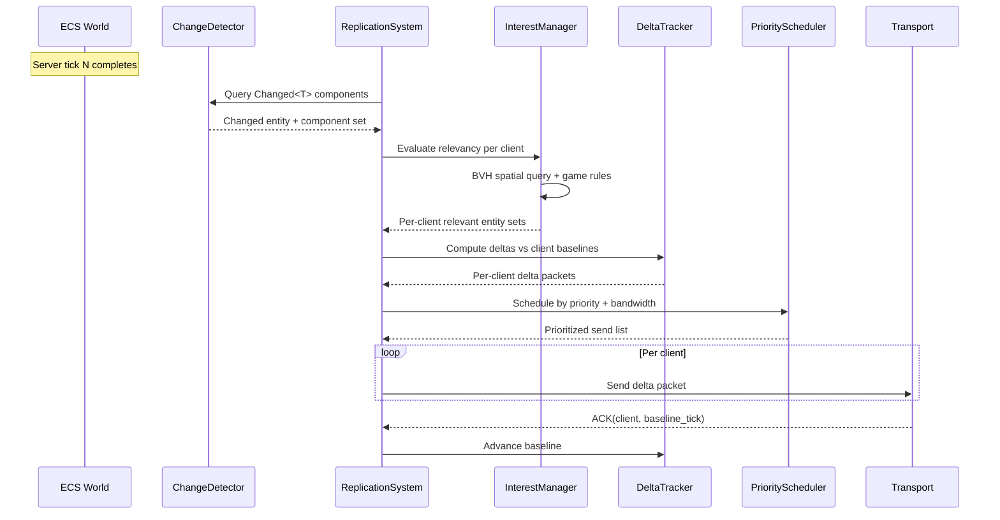
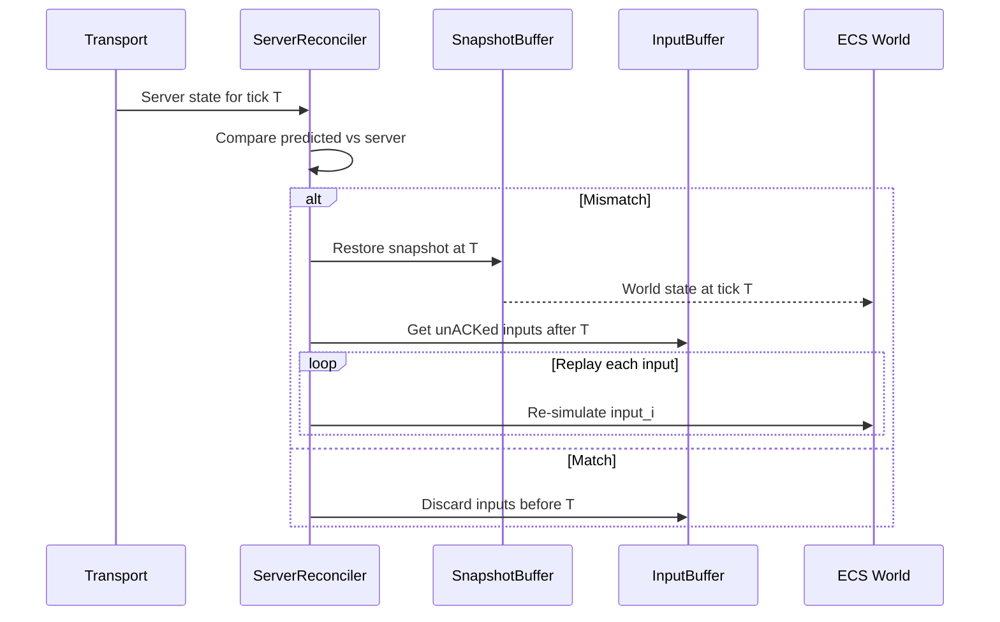

# Networking ↔ ECS Integration Design

## Systems Involved

| System | Design | Domain |
|--------|--------|--------|
| Networking | [network-transport.md](../networking/network-transport.md) | Net |
| ECS | [ecs.md](../core-runtime/ecs.md) | Core |

## Integration Requirements

| ID | Requirement | Systems |
|----|-------------|---------|
| IR-4.4.1 | Component replication via change detection | Net, ECS |
| IR-4.4.2 | Delta compression from tick-based diffs | Net, ECS |
| IR-4.4.3 | Interest management via shared BVH | Net, ECS |
| IR-4.4.4 | Entity spawn/despawn replication | Net, ECS |
| IR-4.4.5 | Snapshot buffer stores world history | Net, ECS |
| IR-4.4.6 | Entity dormancy for zero-bandwidth idle | Net, ECS |
| IR-4.4.7 | Authority transfer between server/client | Net, ECS |
| IR-4.4.8 | Command buffer replay for reconciliation | Net, ECS |

1. **IR-4.4.1** -- `ReplicationSystem` queries `Changed<T>` at chunk granularity (F-1.1.22) each
   server tick to detect which replicated components have changed. Only changed fields are
   serialized into delta packets.
2. **IR-4.4.2** -- `DeltaTracker` maintains per-client baseline ticks. Deltas are computed as the
   diff between the client's last acknowledged baseline and the current world state. ACKs advance
   baselines.
3. **IR-4.4.3** -- `InterestManager` queries the shared BVH (F-1.9.1) to determine which entities
   are spatially relevant to each client. Only relevant entities are replicated.
4. **IR-4.4.4** -- Entity spawns are replicated as full component snapshots. Despawns are replicated
   as tombstone markers with a TTL of 2x max RTT to handle out-of-order delivery.
5. **IR-4.4.5** -- `SnapshotBuffer` stores N ticks of full world state for server reconciliation and
   lag compensation. Each snapshot is a shallow clone of changed archetype chunks.
6. **IR-4.4.6** -- `DormancyManager` monitors entities with no component changes for a configurable
   threshold. Dormant entities consume zero replication bandwidth until woken.
7. **IR-4.4.7** -- Authority transfer uses a three-phase protocol: snapshot sent, snapshot ACKed,
   epoch bumped. During transfer, both old and new authority buffer inputs.
8. **IR-4.4.8** -- `ServerReconciler` replays unacknowledged inputs by re-executing `CommandBuffer`
   entries against a restored world state snapshot.

## Data Contracts

| Type | Defined in | Consumed by | Purpose |
|------|-----------|-------------|---------|
| `Changed<T>` | ECS | Networking | Dirty detection |
| `Entity` | ECS | Networking | Entity identity |
| `World` | ECS | Networking | State source |
| `CommandBuffer` | ECS | Networking | Deferred changes |
| `ArchetypeStorage` | ECS | Networking | Chunk access |
| `ReplicationSystem` | Networking | Networking | Tick loop |
| `DeltaTracker` | Networking | Networking | Baseline diffs |
| `InterestManager` | Networking | Networking | Spatial filter |
| `SnapshotBuffer` | Networking | Networking | History ring |
| `DormancyManager` | Networking | Networking | Idle detection |

```rust
/// Marker component for replicated entities.
/// Codegen'd into the middleman .dylib with
/// per-component replication metadata.
#[derive(Component)]
pub struct Replicated {
    /// Replication priority (higher = more bandwidth).
    pub priority: u8,
    /// Replication condition.
    pub condition: ReplicationCondition,
    /// Authority owner (server or specific client).
    pub authority: Authority,
}

#[derive(Clone, Copy)]
pub enum ReplicationCondition {
    /// Always replicate when changed.
    Always,
    /// Only replicate to the owning client.
    OwnerOnly,
    /// Only replicate on initial spawn.
    InitialOnly,
    /// Custom condition evaluated per tick.
    Custom(ReplicationFilterId),
}

#[derive(Clone, Copy)]
pub enum Authority {
    Server,
    Client(ConnectionId),
}
```

## Data Flow



### Client-Side Reconciliation



## Timing and Ordering

| System | Phase | Timestep | Order |
|--------|-------|----------|-------|
| Transport recv | 2-Network | Variable | 1st in phase |
| ReplicationSystem (server) | 7-Snapshot | Variable | After sim |
| InterestManager | 7-Snapshot | Variable | With replication |
| ServerReconciler (client) | 2-Network | Variable | After recv |
| SnapshotBuffer capture | 7-Snapshot | Variable | End of tick |

The server captures snapshots and computes deltas in Phase 7 (Snapshot) after all simulation is
complete. Clients receive and reconcile in Phase 2 (Network) before local simulation runs in Phase
3.

## Failure Modes

| Failure | Impact | Recovery |
|---------|--------|----------|
| Packet loss | Stale client state | Delta retransmit on next tick |
| Client desync | Visual pop | Reconcile + replay inputs |
| BVH query slow | Late replication | Reduce AOI radius |
| Snapshot buffer full | Cannot reconcile | Increase buffer, drop oldest |
| Authority transfer timeout | Dual authority | Abort transfer, rollback |
| Tombstone expires early | Ghost entity | Client cleanup on next full sync |

## Platform Considerations

None -- ECS replication logic is identical across all platforms. The transport layer abstracts
platform-specific QUIC implementations (MsQuic, Networking.framework, quinn-proto).

## Test Plan

See companion [networking-ecs-test-cases.md](networking-ecs-test-cases.md).
