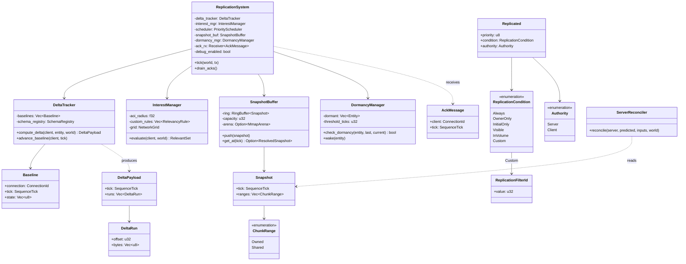
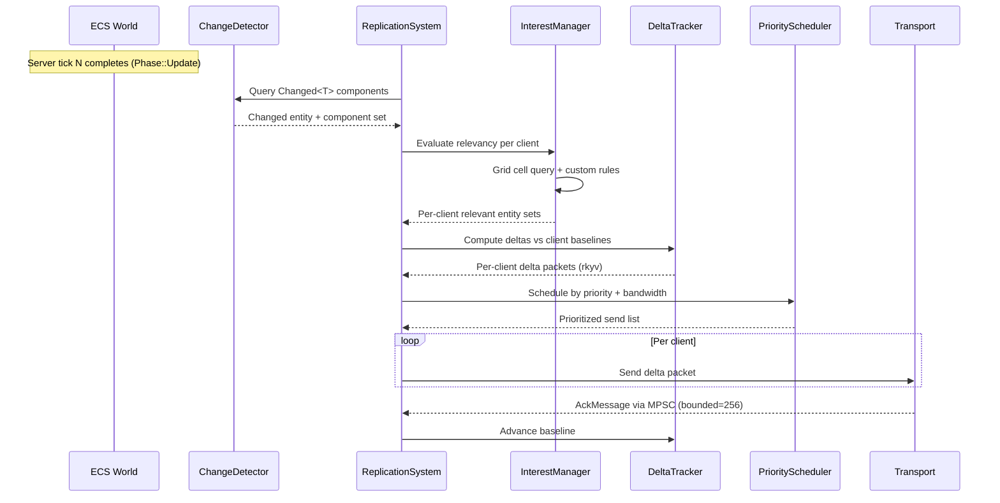
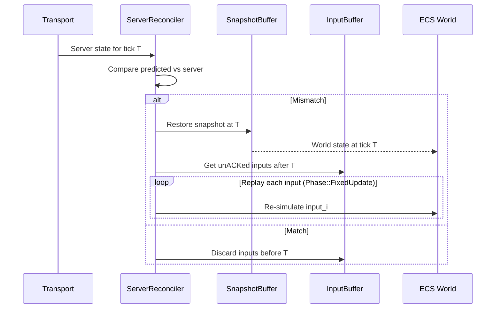

# Networking ↔ ECS Integration Design

> **Compliance.** This document follows the cross-cutting conventions in
> [shared-conventions.md](shared-conventions.md) (SC-1..SC-14) and the channel-capacity formula
> in [shared-messaging-capacities.md](shared-messaging-capacities.md). Deviations: none.

## Systems Involved

| System | Design | Domain |
|--------|--------|--------|
| Networking | [network-transport.md](../networking/network-transport.md) | Net |
| ECS | [ecs.md](../core-runtime/ecs.md) | Core |

## Scope

2D and 2.5D networking are intentionally out of scope for this integration document; the
`InterestManager` Grid is axis-agnostic and covers 2D, 2.5D, and 3D by collapsing unused axes, and
delta/snapshot logic is dimensionality-independent.

## Integration Requirements

| ID | Requirement | Systems |
|----|-------------|---------|
| IR-4.4.1 | Component replication via change detection | Net, ECS |
| IR-4.4.2 | Delta compression from tick-based diffs | Net, ECS |
| IR-4.4.3 | Interest management via networking Grid | Net, ECS |
| IR-4.4.4 | Entity spawn/despawn replication | Net, ECS |
| IR-4.4.5 | Snapshot buffer stores world history | Net, ECS |
| IR-4.4.6 | Entity dormancy for zero-bandwidth idle | Net, ECS |
| IR-4.4.7 | Authority transfer between server/client | Net, ECS |
| IR-4.4.8 | Command buffer replay for reconciliation | Net, ECS |

1. **IR-4.4.1** -- `ReplicationSystem` queries `Changed<T>` at chunk granularity (F-1.1.22) during
   `Phase::PostUpdate` on the server worker thread. Only changed fields are serialized into delta
   packets. No async/await: the system is a synchronous game-loop system.
2. **IR-4.4.2** -- `DeltaTracker` maintains per-client baselines in a dense sorted `Vec<Baseline>`
   indexed by `ConnectionId` (no `HashMap` on hot paths). Baseline component state is held in a
   **dense-array baseline store** keyed by `(ArchetypeId, ChunkIndex, ComponentSlot)` -- a flat
   `Vec<u8>` parallel to the archetype chunk layout. Deltas are computed by XOR-diffing the baseline
   array against the current chunk and run-length encoding non-zero runs (see
   [Algorithm Reference](#algorithm-reference)). ACKs advance baselines. All delta payloads are
   serialized via rkyv zero-copy with `#[derive(Archive, Serialize, Deserialize)]` on wire types.
3. **IR-4.4.3** -- `InterestManager` queries the networking **Grid** (not the shared BVH) to
   determine which entities are spatially relevant to each client. Per
   [constraints.md](../constraints.md) line 140, the Grid is the spatial structure assigned to
   networking relevancy; the shared BVH is reserved for AI, audio, and gameplay. Only relevant
   entities are replicated. Fallback: if a client's position is not yet known (pre-spawn), the Grid
   returns the empty set and replication waits one tick.
4. **IR-4.4.4** -- Entity spawns are replicated as full component snapshots. Despawns are replicated
   as tombstone markers with a TTL of `2 * max_rtt` to handle out-of-order delivery. Tombstones are
   stored in a per-client ring and pruned on TTL expiry. Fallback: if a tombstone arrives for an
   unknown entity, the client discards it silently.
5. **IR-4.4.5** -- `SnapshotBuffer` stores N ticks of world state as
   **copy-on-write indexed snapshots**. Each snapshot is an owned `Vec<u8>` of rkyv-archived
   archetype chunks allocated from a **per-frame arena** and optionally **mmap-backed** when N
   exceeds the RAM budget. No `Arc`, `Rc`, `Cell`, or `RefCell` is used. Indexed snapshots store
   only changed `(ArchetypeId, ChunkIndex)` ranges; unchanged ranges are referenced by
   **tick index** (a `u32`) that points into an older snapshot, which is kept alive by the ring
   buffer ordering (not by a reference count). Fallback: if the target snapshot has been
   overwritten, the client requests a full resync.
6. **IR-4.4.6** -- `DormancyManager` monitors entities with no component changes for
   `threshold_ticks`. Dormant entities consume zero replication bandwidth until their change tick
   exceeds `last_sent_tick`, which wakes them. Fallback: on client reconnect, all dormant entities
   on that client are force-woken once.
7. **IR-4.4.7** -- Authority transfer uses a three-phase protocol: `SnapshotSent`, `SnapshotAcked`,
   `EpochBumped`. The transfer state machine and input buffer live on the **worker thread** that
   runs the game loop (`Phase::FixedUpdate`). The main thread polls platform-native QUIC (MsQuic,
   Networking.framework, `quinn-proto`) and forwards `AckMessage`s to the worker via a
   **crossbeam-channel MPSC, bounded to 256**. The render thread is never involved. During transfer,
   inputs for the entity are tagged with the current authority epoch and enqueued into
   `InputBuffer`; on epoch bump, any inputs tagged with the stale epoch are dropped. Fallback: if
   `SnapshotAcked` does not arrive within `transfer_timeout_ticks`, the transfer aborts and the old
   authority is retained.
8. **IR-4.4.8** -- `ServerReconciler` replays unacknowledged inputs by restoring the world from a
   snapshot and re-executing `CommandBuffer` entries. Replay uses the
   **deterministic fixed-timestep simulation** pipeline (`Phase::FixedUpdate`) -- never variable
   timestep -- so reconciliation produces identical results regardless of frame rate. Fallback: if a
   required snapshot is missing, the client accepts the server state without replay (visual pop).

## Data Contracts

| Type | Defined in | Consumed by | Purpose |
|------|-----------|-------------|---------|
| `Changed<T>` | ECS | Networking | Dirty detection |
| `Entity` | ECS | Networking | Entity identity |
| `World` | ECS | Networking | State source |
| `CommandBuffer` | ECS | Networking | Deferred changes |
| `ArchetypeStorage` | ECS | Networking | Chunk access |
| `ReplicationSystem` | Networking | Networking | Tick loop |
| `DeltaTracker` | Networking | Networking | Baseline diffs |
| `InterestManager` | Networking | Networking | Spatial filter |
| `SnapshotBuffer` | Networking | Networking | History ring |
| `DormancyManager` | Networking | Networking | Idle detection |

```rust
/// Marker component for replicated entities.
///
/// This is a plain struct -- the custom ECS does
/// not use proc-macro derives. Component metadata,
/// rkyv serialization glue, and replication filter
/// match arms are generated by the static codegen
/// pipeline into the middleman .dylib (see
/// docs/design/core-runtime/codegen.md). There is
/// no `#[derive(Component)]`; the codegen emits
/// `impl Component for Replicated` and registers
/// the type in the generated registry.
#[derive(Clone, Copy, rkyv::Archive, rkyv::Serialize, rkyv::Deserialize)]
pub struct Replicated {
    /// Replication priority (higher = more bandwidth).
    pub priority: u8,
    /// Replication condition.
    pub condition: ReplicationCondition,
    /// Authority owner (server or specific client).
    pub authority: Authority,
}

#[derive(Clone, Copy, rkyv::Archive, rkyv::Serialize, rkyv::Deserialize)]
pub enum ReplicationCondition {
    /// Always replicate when changed.
    Always,
    /// Only replicate to the owning client.
    OwnerOnly,
    /// Only replicate on initial spawn.
    InitialOnly,
    /// Replicate only while the entity is visible to
    /// at least one client camera (render layer test).
    Visible,
    /// Replicate only while inside a trigger volume
    /// tagged for network relevancy.
    InVolume,
    /// Custom condition resolved via codegen'd match
    /// arms in the middleman .dylib. Each
    /// `ReplicationFilterId` is a `u32` index into a
    /// static function-pointer table generated by the
    /// codegen pipeline:
    ///
    /// ```text
    /// // Generated file (not hand-written):
    /// static FILTERS: [FilterFn; N] = [
    ///     filter_owner_team,
    ///     filter_squad_members,
    ///     ...
    /// ];
    /// type FilterFn = fn(&World, Entity, ConnectionId) -> bool;
    /// ```
    ///
    /// The runtime calls `FILTERS[id.0 as usize](...)`.
    /// No dynamic dispatch, no reflection, no trait
    /// objects.
    Custom(ReplicationFilterId),
}

/// Opaque filter ID. Codegen assigns sequential
/// `u32` values starting at zero; the middleman .dylib
/// exposes a `filter_count()` symbol for bounds checks.
#[derive(Clone, Copy, PartialEq, Eq, Hash, rkyv::Archive, rkyv::Serialize, rkyv::Deserialize)]
pub struct ReplicationFilterId(pub u32);

#[derive(Clone, Copy, rkyv::Archive, rkyv::Serialize, rkyv::Deserialize)]
pub enum Authority {
    Server,
    Client(ConnectionId),
}

/// Per-client baseline for delta compression.
/// `state` is a dense byte array parallel to the
/// archetype chunk storage layout, NOT a HashMap.
/// Lookups are `O(1)` by chunk+slot index.
#[derive(rkyv::Archive, rkyv::Serialize, rkyv::Deserialize)]
pub struct Baseline {
    pub connection: ConnectionId,
    pub tick: SequenceTick,
    /// Flat `Vec<u8>` indexed by
    /// `(ArchetypeId, ChunkIndex, ComponentSlot)`.
    /// Grown on archetype creation, never a HashMap.
    pub state: Vec<u8>,
}

/// Tracks per-client baselines for delta encoding.
///
/// Algorithm: **dense-array XOR delta** -- the
/// baseline and live state are parallel byte arrays;
/// `compute_delta` XORs them and run-length encodes
/// non-zero runs. See references in the
/// [Algorithm Reference](#algorithm-reference)
/// section below.
pub struct DeltaTracker {
    /// Sorted by `ConnectionId` for O(log n) lookup.
    /// Binary search, never hashed on hot path.
    baselines: Vec<Baseline>,
    schema_registry: SchemaRegistry,
}

impl DeltaTracker {
    /// Compute delta between client baseline and
    /// current world state. Returns rkyv-serialized
    /// delta payload.
    ///
    /// ```text
    /// fn compute_delta(client, entity, world):
    ///     b = &self.baselines[binary_search(client)]
    ///     let live = world.chunk_bytes_for(entity);
    ///     let mut out = Vec::new();
    ///     for (i, (a, c)) in b.state
    ///         .iter().zip(live).enumerate():
    ///         if a != c:
    ///             encode_run(&mut out, i, c);
    ///     rkyv::to_bytes(&DeltaPayload { runs: out })
    /// ```
    pub fn compute_delta(
        &self,
        client: ConnectionId,
        entity: Entity,
        world: &World,
    ) -> DeltaPayload;

    /// Advance baseline after client ACK. Copies
    /// the current live chunk bytes into the dense
    /// baseline array.
    pub fn advance_baseline(
        &mut self,
        client: ConnectionId,
        tick: SequenceTick,
    );
}

/// Wire packet for a delta update. All wire formats
/// are rkyv-archived for zero-copy deserialization on
/// the receiver.
#[derive(rkyv::Archive, rkyv::Serialize, rkyv::Deserialize)]
pub struct DeltaPayload {
    pub tick: SequenceTick,
    pub runs: Vec<DeltaRun>,
}

#[derive(rkyv::Archive, rkyv::Serialize, rkyv::Deserialize)]
pub struct DeltaRun {
    pub offset: u32,
    pub bytes: Vec<u8>,
}

/// Ring buffer of owned, copy-on-write indexed
/// snapshots. Each entry either owns a byte buffer or
/// references an older tick in the same ring by index.
pub struct SnapshotBuffer {
    ring: RingBuffer<Snapshot>,
    /// Max ticks retained.
    capacity: u32,
    /// Optional mmap-backed arena for large N.
    /// When `Some`, snapshot bytes are written into
    /// an mmap region instead of the heap.
    arena: Option<MmapArena>,
}

/// Single tick of world state stored as copy-on-write
/// indexed ranges. No `Arc`: when a range is unchanged
/// the `ChunkRange::Shared` variant references an
/// older tick's byte range by `SnapshotIndex`, which
/// the ring buffer keeps alive by age-based eviction
/// (never by refcount).
#[derive(rkyv::Archive, rkyv::Serialize, rkyv::Deserialize)]
pub struct Snapshot {
    pub tick: SequenceTick,
    pub ranges: Vec<ChunkRange>,
}

#[derive(rkyv::Archive, rkyv::Serialize, rkyv::Deserialize)]
pub enum ChunkRange {
    /// This tick owns the bytes.
    Owned { archetype: u32, chunk: u32, bytes: Vec<u8> },
    /// Unchanged from an older tick; the byte range
    /// lives in the referenced snapshot. The ring
    /// buffer guarantees `source` is still resident.
    Shared { archetype: u32, chunk: u32, source: SnapshotIndex },
}

#[derive(Clone, Copy, rkyv::Archive, rkyv::Serialize, rkyv::Deserialize)]
pub struct SnapshotIndex(pub u32);

impl SnapshotBuffer {
    /// Push a new snapshot, evicting the oldest if at
    /// capacity. Pseudocode:
    ///
    /// ```text
    /// fn push(s):
    ///     if self.ring.is_full():
    ///         self.ring.pop_oldest();
    ///     self.ring.push(s);
    /// ```
    pub fn push(&mut self, snapshot: Snapshot);

    /// Resolve a snapshot at a given tick, walking
    /// `ChunkRange::Shared` references as needed.
    pub fn get_at(
        &self,
        tick: SequenceTick,
    ) -> Option<ResolvedSnapshot<'_>>;
}

/// Spatial interest management using the networking
/// **Grid** (per constraints.md line 140), NOT the
/// shared BVH. The Grid is axis-agnostic and works in
/// 2D, 2.5D, and 3D by collapsing unused axes.
pub struct InterestManager {
    /// Area-of-interest radius per client.
    aoi_radius: f32,
    /// Codegen'd relevancy rules (function pointers).
    custom_rules: Vec<RelevancyRule>,
    /// Reference to the networking Grid (owned by
    /// the networking subsystem, not shared via Arc).
    grid: NetworkGrid,
}

impl InterestManager {
    /// Query the Grid for entities relevant to a
    /// client. Returns the set of entities within the
    /// client's AOI.
    ///
    /// ```text
    /// fn evaluate(client, world):
    ///     let cell = self.grid.cell_of(
    ///         world.position(client_entity));
    ///     let mut set = RelevantSet::new();
    ///     for neighbor in self.grid.neighbors(
    ///         cell, self.aoi_radius):
    ///         for e in neighbor.entities():
    ///             if self.custom_rules_pass(e, client):
    ///                 set.insert(e);
    ///     set
    /// ```
    pub fn evaluate(
        &self,
        client: ConnectionId,
        world: &World,
    ) -> RelevantSet;
}

/// Monitors entities for dormancy transitions.
pub struct DormancyManager {
    /// Sorted Vec of dormant entity IDs for binary
    /// search. Not a HashMap.
    dormant: Vec<Entity>,
    /// Ticks without change before dormancy.
    threshold_ticks: u32,
}

impl DormancyManager {
    /// ```text
    /// fn check_dormancy(entity, last, current):
    ///     (current - last) >= self.threshold_ticks
    /// ```
    pub fn check_dormancy(
        &self,
        entity: Entity,
        last_change_tick: SequenceTick,
        current_tick: SequenceTick,
    ) -> bool;
    pub fn wake(&mut self, entity: Entity);
}

/// Server-side replication coordinator.
/// Runs synchronously on the worker thread (game
/// loop). Receives transport ACKs from the main thread
/// via crossbeam-channel MPSC (bounded = 256).
pub struct ReplicationSystem {
    delta_tracker: DeltaTracker,
    interest_mgr: InterestManager,
    scheduler: PriorityScheduler,
    snapshot_buf: SnapshotBuffer,
    dormancy_mgr: DormancyManager,
    /// MPSC receiver for ACKs from main thread.
    /// Bounded to 256 messages per frame. MPSC
    /// (not SPSC) because multiple platform I/O
    /// completion sources may feed it.
    ack_rx: crossbeam_channel::Receiver<AckMessage>,
    /// Runtime-toggleable debug overlay, polled once
    /// per tick from a `DebugToggle` resource.
    debug_enabled: bool,
}

/// ACK forwarded from main thread to worker.
#[derive(rkyv::Archive, rkyv::Serialize, rkyv::Deserialize)]
pub struct AckMessage {
    pub client: ConnectionId,
    pub tick: SequenceTick,
}

impl ReplicationSystem {
    /// Run one replication tick. Called during
    /// `Phase::PostUpdate` on the worker thread.
    ///
    /// ```text
    /// fn tick(world, tx):
    ///     self.drain_acks();
    ///     for client in self.connections():
    ///         let rel = self.interest_mgr.evaluate(
    ///             client, world);
    ///         for entity in rel.iter():
    ///             if self.dormancy_mgr
    ///                 .is_dormant(entity): continue;
    ///             let d = self.delta_tracker
    ///                 .compute_delta(client, entity, world);
    ///             self.scheduler.enqueue(client, d);
    ///     for pkt in self.scheduler.drain():
    ///         tx.send(pkt).ok();
    ///     self.snapshot_buf.push(capture(world));
    /// ```
    pub fn tick(
        &mut self,
        world: &World,
        transport_tx: &crossbeam_channel::Sender<
            SendMessage,
        >,
    );

    /// Drain ACKs and advance baselines.
    pub fn drain_acks(&mut self);
}

/// Client-side reconciler. Replays unACKed inputs
/// using deterministic fixed-timestep simulation.
pub struct ServerReconciler;

impl ServerReconciler {
    /// Compare predicted state against server
    /// authoritative state. On mismatch, restore
    /// snapshot at tick T and replay all unACKed
    /// inputs using `Phase::FixedUpdate` timestep.
    pub fn reconcile(
        &self,
        server_state: &Snapshot,
        predicted: &World,
        input_buffer: &InputBuffer,
        world: &mut World,
    );
}
```

## Class Diagram



## Algorithm Reference

| Algorithm | Source | Used by |
|-----------|--------|---------|
| Dense-array XOR delta + RLE | Quake 3 network code, 1999 | `DeltaTracker::compute_delta` |
| Uniform grid interest mgmt | "Massively Multiplayer Game Development" 2003 | `InterestManager` |
| Tombstone TTL despawn | "Networked Physics in Virtual Reality" (GDC 2018) | IR-4.4.4 |
| Deterministic input replay | "I Shot You First" (GDC 2011) | `ServerReconciler` |
| Three-phase ownership transfer | Unreal replication graph docs | IR-4.4.7 |

## Data Flow



### Client-Side Reconciliation



## Timing and Ordering

| System | ECS Phase | Timestep | Order |
|--------|-----------|----------|-------|
| Transport recv (main thread) | `Phase::PreUpdate` | Variable | 1st in phase |
| ServerReconciler (client) | `Phase::PreUpdate` | Variable | After recv |
| Physics/sim | `Phase::FixedUpdate` | Fixed | -- |
| ReplicationSystem (server) | `Phase::PostUpdate` | Variable | After sim |
| InterestManager | `Phase::PostUpdate` | Variable | With replication |
| SnapshotBuffer capture | `Phase::PostUpdate` | Variable | End of tick |

Phase IDs come from `Phase` in [`docs/design/core-runtime/ecs.md`](../core-runtime/ecs.md) (lines
1975-1993). The server captures snapshots and computes deltas in `Phase::PostUpdate` after
simulation completes in `Phase::FixedUpdate`. Clients receive and reconcile in `Phase::PreUpdate`
before local simulation. `CommandBuffer` replay during reconciliation always runs through the
`Phase::FixedUpdate` pipeline (fixed timestep, never variable) for determinism.

## Threading Model

| Thread | Responsibility | Why |
|--------|---------------|-----|
| Main (core-pinned high QoS) | Platform-native QUIC poll, ACK forwarding | OS I/O completion |
| Worker (QoS normal) | `ReplicationSystem`, `DeltaTracker`, snapshots | Game loop |
| Render (core-pinned high QoS) | Never touches networking | Frame pacing |

Main thread interaction with platform-native QUIC:

1. Main thread polls MsQuic (Windows), Networking.framework (Apple), or `quinn-proto` (Linux) on the
   OS completion port / kqueue / epoll.
2. On each completion, the main thread decodes the transport header only and forwards an
   `AckMessage` to the worker via the MPSC channel (bounded = 256).
3. Outgoing `SendMessage`s are produced on the worker and sent to the main thread via a separate
   MPSC channel (bounded = 1024).
4. The worker never blocks on I/O; channel sends are try_send with overflow going to a drop counter
   surfaced in the debug overlay.

## Channel Buffer Sizes

| Channel | Kind | Capacity | Rationale |
|---------|------|----------|-----------|
| `ack_rx` (main -> worker) | crossbeam MPSC | 256 | 1 frame at 256 Hz tick |
| `send_tx` (worker -> main) | crossbeam MPSC | 1024 | 64 clients x 16 packets |
| `input_tx` (main -> worker) | crossbeam MPSC | 256 | Bursty input events |

All channels are MPSC (crossbeam-channel); SPSC is never used because multiple platform I/O
completion sources can enqueue into each channel.

## Debug Toggles

| Toggle | Resource | Default |
|--------|----------|---------|
| `debug.replication.overlay` | `DebugToggle` ECS resource | off |
| `debug.replication.log_deltas` | `DebugToggle` ECS resource | off |
| `debug.replication.force_resync` | `DebugToggle` ECS resource | off |

All toggles are runtime-settable via the debug console and polled once per
`ReplicationSystem::tick`.

## Failure Modes

| Failure | Impact | Recovery |
|---------|--------|----------|
| Packet loss | Stale client state | Delta retransmit on next tick |
| Client desync | Visual pop | Reconcile + replay inputs |
| Grid query slow | Late replication | Reduce AOI radius |
| Snapshot buffer full | Cannot reconcile | Drop oldest, fall through to full resync |
| Snapshot range evicted | `Shared` ref dangling | Force full resync for that client |
| Authority transfer timeout | Dual authority | Abort transfer, rollback to old epoch |
| Tombstone expires early | Ghost entity | Client cleanup on next full sync |
| MPSC ack channel overflow | ACK dropped | Drop counter surfaced; client retransmits |

## Platform Considerations

ECS replication logic is identical across all platforms. Platform-specific QUIC stacks (MsQuic,
Networking.framework, `quinn-proto`) are polled on the main thread; the worker thread running
`ReplicationSystem` is platform-agnostic. See [Threading Model](#threading-model) for main-thread
interaction details.

## Test Plan

See companion [networking-ecs-test-cases.md](networking-ecs-test-cases.md). All tests are
CI-runnable (no GPU, no external servers). The test plan includes positive cases, negative cases
(packet loss, snapshot eviction, transfer timeout, channel overflow), and benchmarks for IR-4.4.1,
IR-4.4.2, IR-4.4.3, IR-4.4.4, IR-4.4.5, IR-4.4.6, IR-4.4.7, and IR-4.4.8.

## Review Status

1. [APPLIED] IR-4.4.3 now uses the networking **Grid** per constraints.md line 140; the shared BVH
   is explicitly called out as off-limits.
2. [APPLIED] All wire types (`Replicated`, `ReplicationCondition`, `Baseline`, `DeltaPayload`,
   `DeltaRun`, `Snapshot`, `ChunkRange`, `AckMessage`) now derive `rkyv::Archive`,
   `rkyv::Serialize`, and `rkyv::Deserialize`.
3. [APPLIED] Added `classDiagram` covering all types, enums, variants, and relationships.
4. [APPLIED] `SnapshotBuffer` now uses copy-on-write indexed snapshots with `ChunkRange::Owned` or
   `ChunkRange::Shared(SnapshotIndex)`. No `Arc`/`Rc`; lifetime is managed by ring buffer ordering.
5. [APPLIED] `Replicated` no longer implies `#[derive(Component)]`; the comment explains codegen
   generates `impl Component` in the middleman .dylib.
6. [APPLIED] `ReplicationCondition::Custom` resolution is documented as a static function-pointer
   table generated by codegen. No reflection, no dynamic dispatch.
7. [APPLIED] Snapshot storage now documents the mmap-backed arena option via
   `SnapshotBuffer::arena: Option<MmapArena>`.
8. [APPLIED] `DeltaTracker` explicitly uses a **dense sorted `Vec<Baseline>`** and a dense-array
   baseline store keyed by `(ArchetypeId, ChunkIndex, ComponentSlot)`. No HashMap.
9. [APPLIED] Interface-level Rust pseudocode added for `DeltaTracker`, `SnapshotBuffer`,
   `DormancyManager`, `InterestManager`, and `ReplicationSystem`.
10. [APPLIED] Benchmarks added for IR-4.4.4, IR-4.4.6, and IR-4.4.7 in the companion test case file.
11. [APPLIED] 2D and 2.5D are documented as intentionally out of scope in the Scope section; the
    Grid itself is axis-agnostic.
12. [APPLIED] Threading model now specifies: authority transfer buffer lives on the worker; main
    thread forwards ACKs via MPSC (bounded = 256); render thread is never involved.
13. [APPLIED] Timing table now references `Phase::PreUpdate`, `Phase::FixedUpdate`, and
    `Phase::PostUpdate` directly from [ecs.md](../core-runtime/ecs.md).
14. [APPLIED] Platform Considerations now links to the Threading Model section that spells out
    main-thread QUIC poll and MPSC forwarding.
15. [APPLIED] IR-4.4.8 explicitly states `CommandBuffer` replay runs through `Phase::FixedUpdate`
    (fixed timestep, never variable) for determinism.
