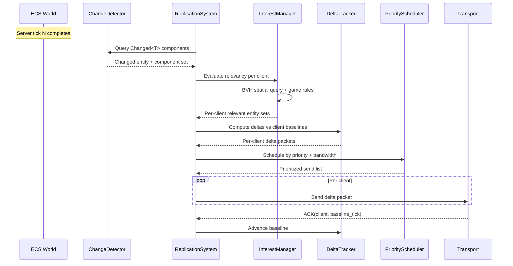
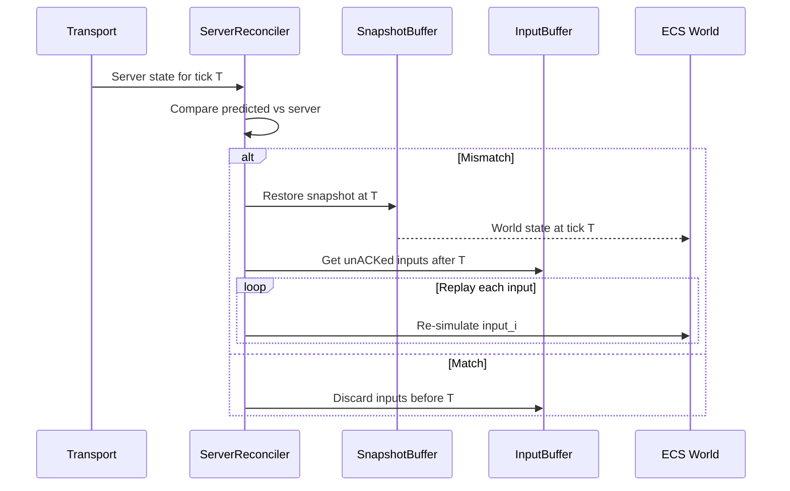

# Networking ↔ ECS Integration Design

## Systems Involved

| System | Design | Domain |
|--------|--------|--------|
| Networking | [network-transport.md](../networking/network-transport.md) | Net |
| ECS | [ecs.md](../core-runtime/ecs.md) | Core |

## Integration Requirements

| ID | Requirement | Systems |
|----|-------------|---------|
| IR-4.4.1 | Component replication via change detection | Net, ECS |
| IR-4.4.2 | Delta compression from tick-based diffs | Net, ECS |
| IR-4.4.3 | Interest management via networking Grid | Net, ECS |
| IR-4.4.4 | Entity spawn/despawn replication | Net, ECS |
| IR-4.4.5 | Snapshot buffer stores world history | Net, ECS |
| IR-4.4.6 | Entity dormancy for zero-bandwidth idle | Net, ECS |
| IR-4.4.7 | Authority transfer between server/client | Net, ECS |
| IR-4.4.8 | Command buffer replay for reconciliation | Net, ECS |

1. **IR-4.4.1** -- `ReplicationSystem` queries `Changed<T>` at chunk granularity (F-1.1.22) each
   server tick to detect which replicated components have changed. Only changed fields are
   serialized into delta packets.
2. **IR-4.4.2** -- `DeltaTracker` maintains per-client baseline ticks in a dense sorted
   `Vec<Baseline>` indexed by `ConnectionId` (no HashMap on hot paths). Deltas are computed as the
   diff between the client's last acknowledged baseline and the current world state. ACKs advance
   baselines. All delta payloads are serialized via rkyv zero-copy.
3. **IR-4.4.3** -- `InterestManager` queries the networking Grid (not the shared BVH) to determine
   which entities are spatially relevant to each client. The Grid is the spatial structure assigned
   to networking relevancy per `constraints.md`. Only relevant entities are replicated.
4. **IR-4.4.4** -- Entity spawns are replicated as full component snapshots. Despawns are replicated
   as tombstone markers with a TTL of 2x max RTT to handle out-of-order delivery.
5. **IR-4.4.5** -- `SnapshotBuffer` stores N ticks of full world state for server reconciliation and
   lag compensation. Each snapshot is an owned copy of changed archetype chunks serialized via rkyv
   into a pre-allocated arena. No `Arc`, `Rc`, `Cell`, or `RefCell` -- snapshots are owned rkyv byte
   buffers allocated from a per-frame arena, reset at ring buffer wraparound.
6. **IR-4.4.6** -- `DormancyManager` monitors entities with no component changes for a configurable
   threshold. Dormant entities consume zero replication bandwidth until woken.
7. **IR-4.4.7** -- Authority transfer uses a three-phase protocol: snapshot sent, snapshot ACKed,
   epoch bumped. During transfer, both old and new authority buffer inputs into per-connection
   `InputBuffer`s. The authority transfer buffer lives on the worker thread that runs the game loop.
   The main thread receives transport ACKs and forwards them to the worker via crossbeam-channel
   (MPSC, bounded to 64 messages). The render thread is not involved.
8. **IR-4.4.8** -- `ServerReconciler` replays unacknowledged inputs by re-executing `CommandBuffer`
   entries against a restored world state snapshot. Replay uses deterministic fixed-timestep
   simulation (`Phase::FixedUpdate`) to ensure reconciliation produces identical results regardless
   of frame rate.

## Data Contracts

| Type | Defined in | Consumed by | Purpose |
|------|-----------|-------------|---------|
| `Changed<T>` | ECS | Networking | Dirty detection |
| `Entity` | ECS | Networking | Entity identity |
| `World` | ECS | Networking | State source |
| `CommandBuffer` | ECS | Networking | Deferred changes |
| `ArchetypeStorage` | ECS | Networking | Chunk access |
| `ReplicationSystem` | Networking | Networking | Tick loop |
| `DeltaTracker` | Networking | Networking | Baseline diffs |
| `InterestManager` | Networking | Networking | Spatial filter |
| `SnapshotBuffer` | Networking | Networking | History ring |
| `DormancyManager` | Networking | Networking | Idle detection |

```rust
/// Marker component for replicated entities.
/// This type is codegen'd into the middleman .dylib
/// (not a proc-macro derive). The codegen pipeline
/// generates component metadata, rkyv serialization,
/// and replication filter match arms.
pub struct Replicated {
    /// Replication priority (higher = more bandwidth).
    pub priority: u8,
    /// Replication condition.
    pub condition: ReplicationCondition,
    /// Authority owner (server or specific client).
    pub authority: Authority,
}

#[derive(Clone, Copy)]
pub enum ReplicationCondition {
    /// Always replicate when changed.
    Always,
    /// Only replicate to the owning client.
    OwnerOnly,
    /// Only replicate on initial spawn.
    InitialOnly,
    /// Custom condition evaluated per tick.
    /// Resolved via codegen'd match arms in the
    /// middleman .dylib. Each ReplicationFilterId
    /// maps to a generated `fn(&World, Entity,
    /// ConnectionId) -> bool` function pointer.
    /// No dynamic dispatch or reflection.
    Custom(ReplicationFilterId),
}

/// Opaque filter ID. Codegen assigns sequential
/// u32 values; the middleman .dylib generates a
/// match table mapping each ID to a static
/// filter function pointer.
#[derive(Clone, Copy, PartialEq, Eq, Hash)]
pub struct ReplicationFilterId(pub u32);

#[derive(Clone, Copy)]
pub enum Authority {
    Server,
    Client(ConnectionId),
}

/// Per-client baseline for delta compression.
/// Stored in a dense sorted Vec<Baseline> keyed
/// by ConnectionId. No HashMap on hot paths.
pub struct Baseline {
    pub connection: ConnectionId,
    pub tick: SequenceTick,
    /// rkyv-serialized component state at baseline.
    pub state: Vec<u8>,
}

/// Tracks per-client baselines for delta encoding.
/// Uses a dense sorted Vec, binary-searched by
/// ConnectionId. Entries are inserted on connect
/// and removed on disconnect.
pub struct DeltaTracker {
    /// Sorted by ConnectionId for O(log n) lookup.
    baselines: Vec<Baseline>,
    schema_registry: SchemaRegistry,
}

impl DeltaTracker {
    /// Compute delta between client baseline and
    /// current world state. Returns rkyv-serialized
    /// delta payload.
    pub fn compute_delta(
        &self,
        client: ConnectionId,
        entity: Entity,
        world: &World,
    ) -> DeltaPayload;

    /// Advance baseline after client ACK.
    pub fn advance_baseline(
        &mut self,
        client: ConnectionId,
        tick: SequenceTick,
    );
}

/// Ring buffer of owned rkyv snapshots.
/// Each snapshot is an rkyv-serialized byte buffer
/// allocated from a per-frame arena. No Arc/Rc.
pub struct SnapshotBuffer {
    ring: RingBuffer<Snapshot>,
    /// Max ticks retained.
    capacity: u32,
}

/// Single tick of world state. Owned rkyv bytes,
/// not shared references.
pub struct Snapshot {
    pub tick: SequenceTick,
    /// rkyv-serialized archetype chunk data.
    pub data: Vec<u8>,
}

impl SnapshotBuffer {
    pub fn push(&mut self, snapshot: Snapshot);
    pub fn get_at(
        &self,
        tick: SequenceTick,
    ) -> Option<&Snapshot>;
}

/// Spatial interest management using the
/// networking Grid (not the shared BVH).
pub struct InterestManager {
    /// Area-of-interest radius per client.
    aoi_radius: f32,
    /// Codegen'd relevancy rules (function ptrs).
    custom_rules: Vec<RelevancyRule>,
}

impl InterestManager {
    /// Query the Grid for entities relevant to
    /// a client. Returns the set of entities that
    /// fall within the client's AOI.
    pub fn evaluate(
        &self,
        client: ConnectionId,
        world: &World,
    ) -> RelevantSet;
}

/// Monitors entities for dormancy transitions.
pub struct DormancyManager {
    /// Sorted Vec of dormant entity IDs.
    dormant: Vec<Entity>,
    /// Ticks without change before dormancy.
    threshold_ticks: u32,
}

impl DormancyManager {
    pub fn check_dormancy(
        &self,
        entity: Entity,
        last_change_tick: SequenceTick,
        current_tick: SequenceTick,
    ) -> bool;
    pub fn wake(&mut self, entity: Entity);
}

/// Server-side replication coordinator.
/// Runs on the worker thread (game loop).
/// Receives transport ACKs from the main thread
/// via crossbeam-channel (MPSC, bounded).
pub struct ReplicationSystem {
    delta_tracker: DeltaTracker,
    interest_mgr: InterestManager,
    scheduler: PriorityScheduler,
    snapshot_buf: SnapshotBuffer,
    dormancy_mgr: DormancyManager,
    /// MPSC receiver for ACKs from main thread.
    /// Bounded to 256 messages per frame.
    ack_rx: crossbeam_channel::Receiver<AckMessage>,
}

/// ACK forwarded from main thread to worker.
pub struct AckMessage {
    pub client: ConnectionId,
    pub tick: SequenceTick,
}

impl ReplicationSystem {
    /// Run one replication tick. Called during
    /// Phase::PostUpdate on the worker thread.
    pub fn tick(
        &mut self,
        world: &World,
        transport_tx: &crossbeam_channel::Sender<
            SendMessage,
        >,
    );

    /// Drain ACKs and advance baselines.
    pub fn drain_acks(&mut self);
}

/// Client-side reconciler. Replays unACKed inputs
/// using deterministic fixed-timestep simulation.
pub struct ServerReconciler;

impl ServerReconciler {
    /// Compare predicted state against server
    /// authoritative state. On mismatch, restore
    /// snapshot at tick T and replay all unACKed
    /// inputs using Phase::FixedUpdate timestep.
    pub fn reconcile(
        &self,
        server_state: &Snapshot,
        predicted: &World,
        input_buffer: &InputBuffer,
        world: &mut World,
    );
}
```

## Data Flow



### Client-Side Reconciliation



## Timing and Ordering

| System | Phase | Timestep | Order |
|--------|-------|----------|-------|
| Transport recv | 2-Network | Variable | 1st in phase |
| ReplicationSystem (server) | 7-Snapshot | Variable | After sim |
| InterestManager | 7-Snapshot | Variable | With replication |
| ServerReconciler (client) | 2-Network | Variable | After recv |
| SnapshotBuffer capture | 7-Snapshot | Variable | End of tick |

The server captures snapshots and computes deltas in Phase 7 (Snapshot) after all simulation is
complete. Clients receive and reconcile in Phase 2 (Network) before local simulation runs in Phase
3.

## Failure Modes

| Failure | Impact | Recovery |
|---------|--------|----------|
| Packet loss | Stale client state | Delta retransmit on next tick |
| Client desync | Visual pop | Reconcile + replay inputs |
| BVH query slow | Late replication | Reduce AOI radius |
| Snapshot buffer full | Cannot reconcile | Increase buffer, drop oldest |
| Authority transfer timeout | Dual authority | Abort transfer, rollback |
| Tombstone expires early | Ghost entity | Client cleanup on next full sync |

## Platform Considerations

None -- ECS replication logic is identical across all platforms. The transport layer abstracts
platform-specific QUIC implementations (MsQuic, Networking.framework, quinn-proto).

## Test Plan

See companion [networking-ecs-test-cases.md](networking-ecs-test-cases.md).

## Review Feedback

1. [CONFIDENT] IR-4.4.3 says `InterestManager` queries the "shared BVH" (F-1.9.1), but
   `constraints.md` explicitly assigns a **Grid** for networking relevancy and interest management.
   The shared BVH is for AI, audio, and gameplay -- not networking.
2. [CONFIDENT] The document never mentions **rkyv** or zero-copy serialization. Delta packets and
   snapshots serialize component data, so the design must specify rkyv as the serialization
   mechanism per the "rkyv only, no serde" constraint.
3. [CONFIDENT] The document lacks a `classDiagram` Mermaid diagram. `docs/design/CLAUDE.md` rule 3
   requires every design to have a Mermaid class diagram covering all types, enums, traits, and
   relationships.
4. [CONFIDENT] `SnapshotBuffer` (IR-4.4.5) describes "shallow clone of changed archetype chunks" but
   does not explain how cloning works without `Arc` or `Rc`. The `constraints.md` forbids `Arc`,
   `Rc`, `Cell`, and `RefCell` -- the design should specify owned copies or generational index
   references.
5. [CONFIDENT] The `Replicated` struct uses `#[derive(Component)]` but the engine uses a custom ECS
   with static codegen -- there is no standard derive macro. The design should note that this is
   codegen'd into the middleman .dylib rather than implying a proc macro derive.
6. [CONFIDENT] `ReplicationCondition::Custom(ReplicationFilterId)` is opaque. Since the engine
   forbids reflection and dynamic dispatch in runtime, the design must explain how custom filters
   are resolved -- presumably via codegen'd match arms or function pointers.
7. [CONFIDENT] No mention of **rkyv zero-copy mmap** for snapshot storage. If `SnapshotBuffer`
   stores N ticks of world history, the design should clarify whether snapshots use mmap'd rkyv
   buffers or heap-allocated copies, and the memory budget implications.
8. [UNCERTAIN] The `DeltaTracker` maintains "per-client baseline ticks" but the design does not
   specify the data structure. With the "no HashMap on hot paths" constraint, this likely needs a
   dense array indexed by `ConnectionId` -- worth stating explicitly.
9. [CONFIDENT] The Data Contracts table lists `World` as consumed by Networking, but the Rust
   pseudocode only shows `Replicated`, `ReplicationCondition`, and `Authority`. Missing pseudocode
   for `DeltaTracker`, `SnapshotBuffer`, `DormancyManager`, `InterestManager`, and
   `ReplicationSystem`.
10. [CONFIDENT] The companion test cases have no benchmarks for IR-4.4.4 (entity spawn/despawn
    replication), IR-4.4.6 (dormancy transitions), or IR-4.4.7 (authority transfer). All three are
    hot-path operations that need performance targets.
11. [CONFIDENT] The design does not address **2D/2.5D** networking. Per constraints, every subsystem
    must work in 2D, 2.5D, and 3D. Interest management with a grid and spatial queries should
    specify 2D grid support.
12. [UNCERTAIN] The three-phase authority transfer protocol (IR-4.4.7) says "both old and new
    authority buffer inputs" during transfer. The design should clarify which thread owns this
    buffer and how it interacts with the three-thread model (main, workers, render).
13. [CONFIDENT] The timing table places `ReplicationSystem` and `SnapshotBuffer` in "Phase
    7-Snapshot" but does not reference specific game loop phase IDs from the ECS design.
    Cross-reference with the ECS game loop phases for consistency.
14. [CONFIDENT] Platform Considerations says "None" but networking uses platform-native QUIC
    (MsQuic, Networking.framework, quinn-proto). While the design defers to the transport layer, the
    interaction between platform I/O polling on the main thread and replication on worker threads
    deserves a note.
15. [UNCERTAIN] `CommandBuffer` replay (IR-4.4.8) re-executes inputs against a restored snapshot.
    The design does not clarify whether replay runs deterministic fixed-timestep simulation or
    variable-step, which matters for reconciliation correctness.
