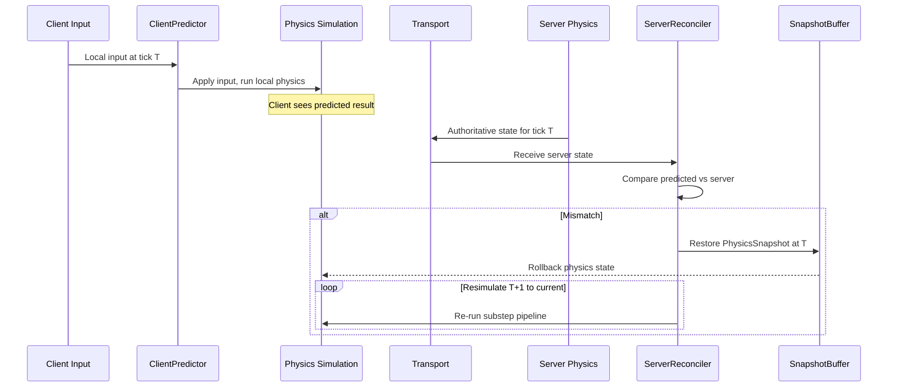
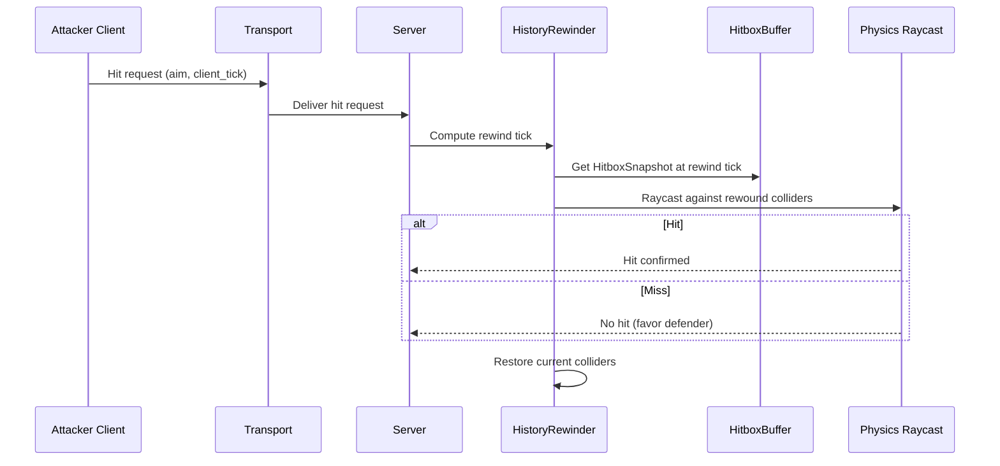

# Networking ↔ Physics Integration Design

## Systems Involved

| System | Design | Domain |
|--------|--------|--------|
| Networking | [network-transport.md](../networking/network-transport.md) | Net |
| Physics | [foundation.md](../physics/foundation.md) | Physics |

## Integration Requirements

| ID | Requirement | Systems |
|----|-------------|---------|
| IR-4.5.1 | Server-authoritative physics simulation | Net, Physics |
| IR-4.5.2 | Client-side physics prediction | Net, Physics |
| IR-4.5.3 | Physics rollback and resimulation | Net, Physics |
| IR-4.5.4 | Deterministic simulation across platforms | Net, Physics |
| IR-4.5.5 | Hitbox rewind for lag compensation | Net, Physics |
| IR-4.5.6 | Interpolation of remote physics bodies | Net, Physics |
| IR-4.5.7 | Physics state snapshot for rollback | Net, Physics |

1. **IR-4.5.1** -- The server runs the authoritative physics simulation. `RigidBody`, `Velocity`,
   `Collider`, and `ContactManifold` are server-owned. Clients receive replicated physics state via
   delta packets.
2. **IR-4.5.2** -- `ClientPredictor` applies local input to predicted physics bodies immediately.
   The local physics simulation runs the same substep pipeline as the server for the predicted
   entity.
3. **IR-4.5.3** -- When `ServerReconciler` detects a mismatch between predicted and authoritative
   `Velocity`/position, it restores the physics snapshot at the server tick and re-simulates all
   subsequent ticks with buffered inputs.
4. **IR-4.5.4** -- Deterministic physics (IEEE 754 strict, no fast-math, deterministic iteration
   order) ensures the client resimulation produces identical results to the server given the same
   inputs.
5. **IR-4.5.5** -- `HistoryRewinder` stores `HitboxSnapshot` entries per tick. On hit validation,
   the server rewinds collider positions to the attacker's perceived tick and performs a raycast
   against rewound hitboxes.
6. **IR-4.5.6** -- Remote physics bodies use `SnapshotInterpolator` to smoothly interpolate between
   two server snapshots. `Extrapolator` extends the last known velocity when snapshots are late.
7. **IR-4.5.7** -- Physics state (position, rotation, velocity, angular velocity, sleeping,
   contacts) is captured into `SnapshotBuffer` each tick for rollback support.

## Data Contracts

| Type | Defined in | Consumed by | Purpose |
|------|-----------|-------------|---------|
| `RigidBody` | Physics | Networking | Body type |
| `Velocity` | Physics | Networking | Linear velocity |
| `AngularVelocity` | Physics | Networking | Angular velocity |
| `Collider` | Physics | Networking | Shape for rewind |
| `PhysicsConfig` | Physics | Networking | Fixed timestep |
| `ClientPredictor` | Networking | Physics | Predicted input |
| `ServerReconciler` | Networking | Physics | Rollback trigger |
| `SnapshotBuffer` | Networking | Networking | State history |
| `HistoryRewinder` | Networking | Physics | Hitbox rewind |
| `HitboxBuffer` | Networking | Networking | Collider history |
| `SnapshotInterpolator` | Networking | Physics | Remote smoothing |
| `ErrorCorrector` | Networking | Physics | Pop reduction |

```rust
/// Physics state captured per entity per tick for
/// rollback support. Stored in SnapshotBuffer.
pub struct PhysicsSnapshot {
    pub position: Vec3,
    pub rotation: Quat,
    pub linear_velocity: Vec3,
    pub angular_velocity: Vec3,
    pub sleeping: bool,
}

/// Hitbox snapshot for lag compensation rewind.
/// Stores collider world-space transform at a tick.
pub struct HitboxSnapshot {
    pub tick: u64,
    pub entity: Entity,
    pub position: Vec3,
    pub rotation: Quat,
    pub collider_shape: ColliderShape,
}
```

## Data Flow



### Lag Compensation Hitbox Rewind



## Timing and Ordering

| System | Phase | Timestep | Order |
|--------|-------|----------|-------|
| Transport recv | 2-Network | Variable | 1st |
| ServerReconciler | 2-Network | Variable | After recv |
| Physics simulation | 5-Physics | Fixed | After sim |
| SnapshotBuffer capture | 7-Snapshot | Variable | After physics |
| Hitbox rewind | 5-Physics | On demand | Server-side |

Physics runs at a fixed timestep in Phase 5. The accumulator decouples physics tick rate from frame
rate. Rollback resimulates multiple fixed ticks within a single frame when mismatch is detected.

## Failure Modes

| Failure | Impact | Recovery |
|---------|--------|----------|
| Prediction mismatch | Visual pop | ErrorCorrector smooths over N frames |
| Rollback too many ticks | Frame spike | Cap max rollback ticks (e.g., 10) |
| Hitbox buffer overflow | Cannot rewind | Reject old hit requests |
| Non-deterministic result | Desync | Log + force full resync |
| Physics snapshot too large | Memory pressure | Compress, limit history depth |
| Extrapolation diverges | Visual artifact | Clamp max extrapolation time |

## Platform Considerations

Deterministic physics requires:

- IEEE 754 strict compliance on all platforms
- No `--ffast-math` compiler flags
- Deterministic iteration order in island solver
- Identical `PhysicsConfig.fixed_dt` on server and client

The engine disables platform-specific FPU modes (e.g., SSE denormal-as-zero on x86) during physics
ticks to ensure cross-platform bit-identical results.

## Test Plan

See companion [networking-physics-test-cases.md](networking-physics-test-cases.md).
