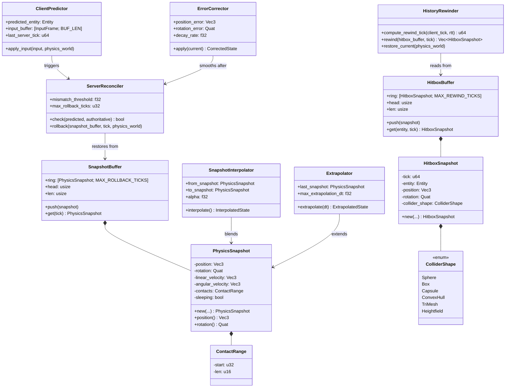
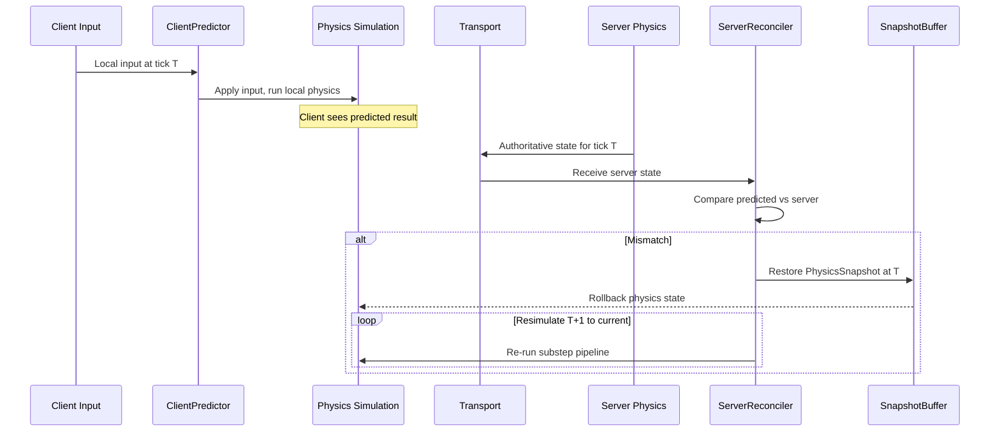
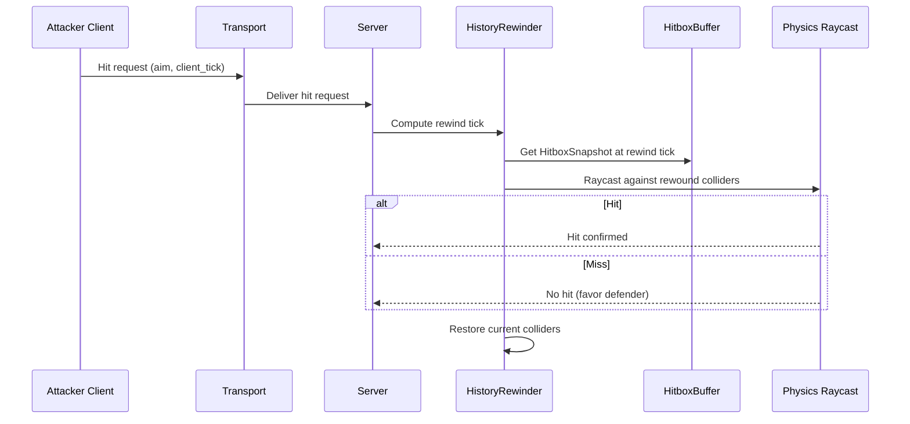

# Networking ↔ Physics Integration Design

> **Compliance.** This document follows the cross-cutting conventions in
> [shared-conventions.md](shared-conventions.md) (SC-1..SC-14) and the channel-capacity formula
> in [shared-messaging-capacities.md](shared-messaging-capacities.md). Deviations: none.

## Systems Involved

| System | Design | Domain |
|--------|--------|--------|
| Networking | [network-transport.md](../networking/network-transport.md) | Net |
| Physics | [foundation.md](../physics/foundation.md) | Physics |

## Integration Requirements

| ID | Requirement | Systems |
|----|-------------|---------|
| IR-4.5.1 | Server-authoritative physics simulation | Net, Physics |
| IR-4.5.2 | Client-side physics prediction | Net, Physics |
| IR-4.5.3 | Physics rollback and resimulation | Net, Physics |
| IR-4.5.4 | Deterministic simulation across platforms | Net, Physics |
| IR-4.5.5 | Hitbox rewind for lag compensation | Net, Physics |
| IR-4.5.6 | Interpolation of remote physics bodies | Net, Physics |
| IR-4.5.7 | Physics state snapshot for rollback | Net, Physics |

1. **IR-4.5.1** -- The server runs the authoritative physics simulation. `RigidBody`, `Velocity`,
   `Collider`, and `ContactManifold` are server-owned. Clients receive replicated physics state via
   delta packets.
2. **IR-4.5.2** -- `ClientPredictor` applies local input to predicted physics bodies immediately.
   The local physics simulation runs the same substep pipeline as the server for the predicted
   entity.
3. **IR-4.5.3** -- When `ServerReconciler` detects a mismatch between predicted and authoritative
   `Velocity`/position, it restores the physics snapshot at the server tick and re-simulates all
   subsequent ticks with buffered inputs.
4. **IR-4.5.4** -- Deterministic physics (IEEE 754 strict, no fast-math, deterministic iteration
   order) ensures the client resimulation produces identical results to the server given the same
   inputs.
5. **IR-4.5.5** -- `HistoryRewinder` stores `HitboxSnapshot` entries per tick. On hit validation,
   the server rewinds collider positions to the attacker's perceived tick and performs a raycast
   against rewound hitboxes.
6. **IR-4.5.6** -- Remote physics bodies use `SnapshotInterpolator` to smoothly interpolate between
   two server snapshots. `Extrapolator` extends the last known velocity when snapshots are late.
7. **IR-4.5.7** -- Physics state (position, rotation, velocity, angular velocity, sleeping,
   contacts) is captured into `SnapshotBuffer` each tick for rollback support.

## Data Contracts

| Type | Defined in | Consumed by | Purpose |
|------|-----------|-------------|---------|
| `RigidBody` | Physics | Networking | Body type |
| `Velocity` | Physics | Networking | Linear vel |
| `AngularVelocity` | Physics | Networking | Angular vel |
| `Collider` | Physics | Networking | Shape for rewind |
| `ColliderShape` | Physics | Networking | Shape enum |
| `ContactRange` | Networking | Networking | Snapshot contacts |
| `PhysicsConfig` | Physics | Networking | Fixed timestep |
| `ClientPredictor` | Networking | Physics | Predicted input |
| `ServerReconciler` | Networking | Physics | Rollback trigger |
| `SnapshotBuffer` | Networking | Networking | State history |
| `HistoryRewinder` | Networking | Physics | Hitbox rewind |
| `HitboxBuffer` | Networking | Networking | Collider history |
| `SnapshotInterpolator` | Networking | Physics | Remote smooth |
| `Extrapolator` | Networking | Physics | Late snapshot |
| `ErrorCorrector` | Networking | Physics | Pop reduction |

1. `ColliderShape` is defined in [foundation.md](../physics/foundation.md). The full enum is:

```rust
/// Collider shape variants. Defined in physics
/// foundation.md; repeated here for hitbox rewind.
#[derive(Clone, Copy, rkyv::Archive, rkyv::Serialize, rkyv::Deserialize)]
pub enum ColliderShape {
    Sphere { radius: f32 },
    Box { half_extents: Vec3 },
    Capsule { half_height: f32, radius: f32 },
    ConvexHull { vertex_handle: Handle<ConvexMesh> },
    TriMesh { mesh_handle: Handle<TriMesh> },
    Heightfield { field_handle: Handle<Heightfield> },
}
```

2. **2D / 2.5D scope note.** 2D and 2.5D physics bodies are intentionally out of scope for this
   integration design; they reuse the same `PhysicsSnapshot` types with `z`/`angular_z` fixed by the
   physics foundation (see [foundation.md](../physics/foundation.md)).

### Class Diagram



### Rust Pseudocode

```rust
/// Physics state captured per entity per tick for
/// rollback support. Stored in SnapshotBuffer.
/// Immutable after creation -- never mutated once
/// captured. All fields are private; construction
/// occurs via a single `new` constructor and
/// read-only accessors.
#[derive(Clone, rkyv::Archive, rkyv::Serialize, rkyv::Deserialize)]
pub struct PhysicsSnapshot {
    position: Vec3,
    rotation: Quat,
    linear_velocity: Vec3,
    angular_velocity: Vec3,
    /// Indices into a per-tick ContactPool owned by
    /// the physics worker. IR-4.5.7 requires contact
    /// capture; the pool holds full ContactManifold
    /// entries while the snapshot stores only a
    /// compact range reference to avoid copying
    /// manifold data into every snapshot.
    contacts: ContactRange,
    sleeping: bool,
}

/// Range reference into a per-tick ContactPool.
/// Immutable value type.
#[derive(Clone, Copy, rkyv::Archive, rkyv::Serialize, rkyv::Deserialize)]
pub struct ContactRange {
    start: u32,
    len: u16,
}

/// Hitbox snapshot for lag compensation rewind.
/// Stores collider world-space transform at a tick.
/// Immutable after creation; private fields with
/// read-only accessors.
#[derive(Clone, rkyv::Archive, rkyv::Serialize, rkyv::Deserialize)]
pub struct HitboxSnapshot {
    tick: u64,
    entity: Entity,
    position: Vec3,
    rotation: Quat,
    collider_shape: ColliderShape,
}

/// Fixed-size ring buffer of physics snapshots
/// indexed by tick. Uses a circular array to avoid
/// HashMap on the hot path.
pub struct SnapshotBuffer {
    ring: [PhysicsSnapshot; MAX_ROLLBACK_TICKS],
    head: usize,
    len: usize,
}

impl SnapshotBuffer {
    /// Appends a snapshot, overwriting the oldest
    /// entry when full.
    pub fn push(&mut self, snapshot: PhysicsSnapshot);

    /// Returns the snapshot at the given tick, or
    /// None if the tick has been evicted.
    pub fn get(&self, tick: u64)
        -> Option<&PhysicsSnapshot>;
}

/// Fixed-size ring buffer of hitbox snapshots
/// indexed by (entity, tick). Uses a circular array
/// to avoid HashMap on the hot path.
pub struct HitboxBuffer {
    ring: [HitboxSnapshot; MAX_REWIND_TICKS],
    head: usize,
    len: usize,
}

impl HitboxBuffer {
    /// Appends a hitbox snapshot.
    pub fn push(&mut self, snapshot: HitboxSnapshot);

    /// Returns the snapshot for the given entity and
    /// tick, or None if evicted.
    pub fn get(
        &self,
        entity: Entity,
        tick: u64,
    ) -> Option<&HitboxSnapshot>;
}

/// Applies local input to the predicted entity and
/// runs the local physics substep pipeline.
/// Attached as a component to the predicted entity.
pub struct ClientPredictor {
    predicted_entity: Entity,
    input_buffer: [InputFrame; INPUT_BUFFER_LEN],
    last_server_tick: u64,
}

impl ClientPredictor {
    /// Applies input to the local physics world.
    /// Runs the same substep pipeline as the server.
    pub fn apply_input(
        &mut self,
        input: &InputFrame,
        physics_world: &mut PhysicsWorld,
    );
}

/// Compares predicted state against authoritative
/// server state and triggers rollback when the
/// error exceeds the mismatch threshold.
pub struct ServerReconciler {
    mismatch_threshold: f32,
    max_rollback_ticks: u32,
}

impl ServerReconciler {
    /// Returns true if the predicted state differs
    /// from the authoritative state beyond the
    /// mismatch threshold.
    pub fn check(
        &self,
        predicted: &PhysicsSnapshot,
        authoritative: &PhysicsSnapshot,
    ) -> bool;

    /// Restores physics state from the snapshot
    /// buffer at the given tick, then re-runs the
    /// substep pipeline for each subsequent tick up
    /// to the current tick using buffered inputs.
    /// Capped at max_rollback_ticks.
    pub fn rollback(
        &self,
        buffer: &SnapshotBuffer,
        tick: u64,
        physics_world: &mut PhysicsWorld,
        inputs: &[InputFrame],
    );
}

/// Rewinder for lag compensation. Stores and
/// restores hitbox collider positions for
/// server-side hit validation.
pub struct HistoryRewinder;

impl HistoryRewinder {
    /// Computes the tick to rewind to based on the
    /// client's reported tick and estimated RTT.
    pub fn compute_rewind_tick(
        client_tick: u64,
        rtt_ticks: u64,
    ) -> u64;

    /// Returns all hitbox snapshots at the given
    /// tick from the buffer.
    pub fn rewind(
        buffer: &HitboxBuffer,
        tick: u64,
    ) -> Vec<&HitboxSnapshot>;

    /// Restores current-tick collider positions
    /// after rewind validation is complete.
    pub fn restore_current(
        physics_world: &mut PhysicsWorld,
    );
}

/// Interpolates remote physics bodies between two
/// server snapshots for smooth visual display.
pub struct SnapshotInterpolator {
    from_snapshot: PhysicsSnapshot,
    to_snapshot: PhysicsSnapshot,
    alpha: f32,
}

impl SnapshotInterpolator {
    /// Linearly interpolates position and velocity;
    /// slerps rotation. Alpha is clamped to [0, 1].
    pub fn interpolate(&self) -> InterpolatedState;
}

/// Extends the last known snapshot forward when
/// the next server snapshot is late. Clamps
/// extrapolation to max_extrapolation_dt to prevent
/// divergence.
pub struct Extrapolator {
    last_snapshot: PhysicsSnapshot,
    max_extrapolation_dt: f32,
}

impl Extrapolator {
    /// Projects position forward using the last
    /// known velocity. Clamps dt to
    /// max_extrapolation_dt.
    /// Fallback: if dt exceeds max_extrapolation_dt,
    /// the entity freezes at the clamped position
    /// until the next snapshot arrives.
    pub fn extrapolate(
        &self,
        dt: f32,
    ) -> ExtrapolatedState;
}

/// Smooths visual correction after rollback to
/// avoid instantaneous position pops. Uses
/// exponential decay smoothing (EMA):
///   corrected = current + error * decay_rate^dt
/// where decay_rate is in (0, 1) and dt is the
/// frame delta time.
///
/// Reference: "Erta, Cristian. 'Networked Physics
/// in Virtual Environments.' GDC 2015. Valve."
/// Also known as exponential moving average (EMA)
/// smoothing in signal processing literature.
pub struct ErrorCorrector {
    position_error: Vec3,
    rotation_error: Quat,
    /// Decay rate per second, in (0, 1). Typical
    /// values: 0.1 (fast snap) to 0.01 (slow blend).
    decay_rate: f32,
}

impl ErrorCorrector {
    /// Applies exponential decay to the remaining
    /// error and returns the corrected visual state.
    /// Fallback: if error magnitude < 0.001, the
    /// error is zeroed to avoid perpetual drift.
    pub fn apply(
        &mut self,
        current: &PhysicsSnapshot,
        dt: f32,
    ) -> CorrectedState;
}
```

## Data Flow



### Lag Compensation Hitbox Rewind



## Timing and Ordering

| System | Phase | Timestep | Thread | Order |
|--------|-------|----------|--------|-------|
| Transport recv | 2-Network | Variable | Main | 1st |
| ServerReconciler | 2-Network | Variable | Workers | After recv |
| Physics simulation | 5-Physics | Fixed | Workers | After sim |
| SnapshotBuffer capture | 7-Snapshot | Variable | Workers | After physics |
| Hitbox rewind | 5-Physics | On demand | Workers | Server-side |

All networking I/O (Transport recv) runs on the main thread, which owns the OS event loop and polls
completions. All simulation work (reconciliation, physics, snapshot capture, hitbox rewind) runs on
worker threads via the job system. `SnapshotBuffer` and `HitboxBuffer` are owned by the worker
thread that runs the physics phase -- no mutable sharing across threads. The render thread is
core-pinned and never touches these buffers; all other worker threads run at default QoS. The main
thread forwards received packets to workers via a crossbeam `Sender<Packet>` / `Receiver<Packet>`
MPSC channel (multiple producers possible if future platforms add worker-owned sockets; defaults to
1 producer). Channel buffer length is `NET_PACKET_BUFFER_LEN = 1024` packets, sized for a 64-tick
server at 16 Hz with 4 tick burst tolerance. `Arc` is used only for immutable snapshot data shared
read-only between the physics worker and interpolation workers (e.g. `Arc<PhysicsSnapshot>` for
remote body interpolation fanout). There is no `async`/`await`; all engine code is synchronous.

Physics runs at a fixed timestep in Phase 5. The accumulator decouples physics tick rate from frame
rate. Rollback resimulates multiple fixed ticks within a single frame when mismatch is detected.

## Failure Modes

| Failure | Impact | Recovery |
|---------|--------|----------|
| Prediction mismatch | Visual pop | ErrorCorrector smooths over N frames |
| Rollback too many ticks | Frame spike | Cap max rollback ticks (e.g., 10) |
| Hitbox buffer overflow | Cannot rewind | Reject old hit requests |
| Non-deterministic result | Desync | Log + force full resync |
| Physics snapshot too large | Memory pressure | Compress, limit history depth |
| Extrapolation diverges | Visual artifact | Clamp max extrapolation time |

## Algorithms

References for the non-trivial networked-physics algorithms used here:

| Algorithm | Source |
|-----------|--------|
| Client prediction | Glenn Fiedler, "Networked Physics" GDC 2015 |
| Server reconciliation / rollback | Yahn Bernier, "Latency Compensating Methods" (Valve) |
| Snapshot interpolation | Glenn Fiedler, "Snapshot Interpolation" (gafferongames.com) |
| Error-correction smoothing | EMA exponential decay (Fiedler, "Networked Physics") |
| Hitbox rewind / lag compensation | Bernier, "Latency Compensating Methods" (Valve) |

1. Client prediction -- <https://gafferongames.com/post/networked_physics_2004/>
2. Server reconciliation / hitbox rewind --
   <https://developer.valvesoftware.com/wiki/Latency_Compensating_Methods_in_Client/Server_In-game_Protocol_Design_and_Optimization>
3. Snapshot interpolation -- <https://gafferongames.com/post/snapshot_interpolation/>
4. EMA smoothing -- <https://en.wikipedia.org/wiki/Exponential_smoothing>

## Platform Considerations

Deterministic physics requires:

- IEEE 754 strict compliance on all platforms
- No `--ffast-math` compiler flags
- Deterministic iteration order in island solver (see below)
- Identical `PhysicsConfig.fixed_dt` on server and client

**Island solver determinism mechanism.** The broad-phase island solver sorts its per-island body
list by a stable `SolverKey = (entity.generation, entity.index)` before each solve. Constraints
within an island are sorted by `(body_a_key, body_b_key, constraint_kind_ord)`. The solver then
iterates islands in sorted `(min_body_key)` order on a single worker thread during the solve phase
(parallelism is across disjoint islands; within an island the order is fixed). This guarantees
identical iteration order given identical entity handles, which rollback and cross-platform
determinism rely on.

The engine disables platform-specific FPU modes (e.g., SSE denormal-as-zero on x86) during physics
ticks to ensure cross-platform bit-identical results.

## Debug Tools

All networked-physics debug tooling is runtime-toggleable through the engine debug console; no
recompilation is required. Toggles:

| Toggle | Effect |
|--------|--------|
| `net.physics.draw_predicted` | Overlay predicted vs authoritative body positions |
| `net.physics.draw_rewind` | Visualise HitboxBuffer rewind ghosts |
| `net.physics.log_rollback` | Emit rollback tick/range/mismatch per event |
| `net.physics.force_desync` | Inject synthetic mismatch for reconciliation testing |

## Test Plan

See companion [networking-physics-test-cases.md](networking-physics-test-cases.md).

## Review Status

| # | Finding | Resolution |
|---|---------|-----------|
| 1 | Missing classDiagram | Added class diagram for all types |
| 2 | No rkyv derive on data structs | Added Archive/Serialize/Deserialize |
| 3 | No 2D/2.5D addressed | 2D/2.5D explicitly out of scope |
| 4 | ColliderShape not defined | Enum now defined with all variants |
| 5 | No thread ownership | Main/worker/render ownership specified |
| 6 | HashMap risk on hot paths | Ring buffers / sorted Vec documented |
| 7 | PhysicsSnapshot missing contacts | Added `contacts: ContactRange` field |
| 8 | SnapshotBuffer/HitboxBuffer pseudocode | Pseudocode added |
| 9 | Predictor/Reconciler/etc pseudocode | Pseudocode added for all types |
| 10 | Determinism mechanism | SolverKey ordering documented |
| 11 | Extrapolator not in contracts | Added to contracts + pseudocode |
| 12 | ErrorCorrector smoothing algorithm | EMA reference linked |
| 13 | TC-IR-4.5.4.1 CI orchestration | Orchestration plan documented |
| 14 | No snapshot restore benchmark | TC-IR-4.5.7.B2 added |
| 15 | Immutable-first pattern | Private fields + accessor pattern |
