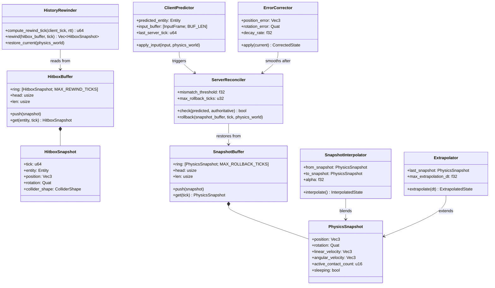
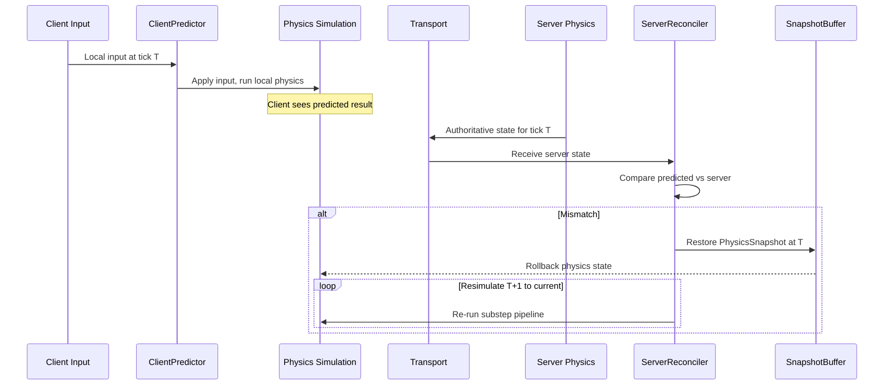
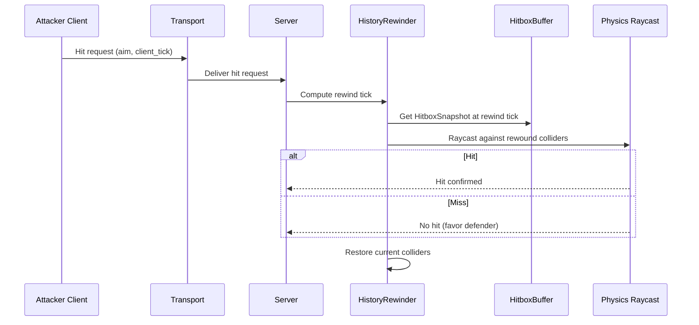

# Networking ↔ Physics Integration Design

## Systems Involved

| System | Design | Domain |
|--------|--------|--------|
| Networking | [network-transport.md](../networking/network-transport.md) | Net |
| Physics | [foundation.md](../physics/foundation.md) | Physics |

## Integration Requirements

| ID | Requirement | Systems |
|----|-------------|---------|
| IR-4.5.1 | Server-authoritative physics simulation | Net, Physics |
| IR-4.5.2 | Client-side physics prediction | Net, Physics |
| IR-4.5.3 | Physics rollback and resimulation | Net, Physics |
| IR-4.5.4 | Deterministic simulation across platforms | Net, Physics |
| IR-4.5.5 | Hitbox rewind for lag compensation | Net, Physics |
| IR-4.5.6 | Interpolation of remote physics bodies | Net, Physics |
| IR-4.5.7 | Physics state snapshot for rollback | Net, Physics |

1. **IR-4.5.1** -- The server runs the authoritative physics simulation. `RigidBody`, `Velocity`,
   `Collider`, and `ContactManifold` are server-owned. Clients receive replicated physics state via
   delta packets.
2. **IR-4.5.2** -- `ClientPredictor` applies local input to predicted physics bodies immediately.
   The local physics simulation runs the same substep pipeline as the server for the predicted
   entity.
3. **IR-4.5.3** -- When `ServerReconciler` detects a mismatch between predicted and authoritative
   `Velocity`/position, it restores the physics snapshot at the server tick and re-simulates all
   subsequent ticks with buffered inputs.
4. **IR-4.5.4** -- Deterministic physics (IEEE 754 strict, no fast-math, deterministic iteration
   order) ensures the client resimulation produces identical results to the server given the same
   inputs.
5. **IR-4.5.5** -- `HistoryRewinder` stores `HitboxSnapshot` entries per tick. On hit validation,
   the server rewinds collider positions to the attacker's perceived tick and performs a raycast
   against rewound hitboxes.
6. **IR-4.5.6** -- Remote physics bodies use `SnapshotInterpolator` to smoothly interpolate between
   two server snapshots. `Extrapolator` extends the last known velocity when snapshots are late.
7. **IR-4.5.7** -- Physics state (position, rotation, velocity, angular velocity, sleeping,
   contacts) is captured into `SnapshotBuffer` each tick for rollback support.

## Data Contracts

| Type | Defined in | Consumed by | Purpose |
|------|-----------|-------------|---------|
| `RigidBody` | Physics | Networking | Body type |
| `Velocity` | Physics | Networking | Linear vel |
| `AngularVelocity` | Physics | Networking | Angular vel |
| `Collider` | Physics | Networking | Shape for rewind |
| `ColliderShape` | Physics | Networking | Shape enum |
| `PhysicsConfig` | Physics | Networking | Fixed timestep |
| `ClientPredictor` | Networking | Physics | Predicted input |
| `ServerReconciler` | Networking | Physics | Rollback trigger |
| `SnapshotBuffer` | Networking | Networking | State history |
| `HistoryRewinder` | Networking | Physics | Hitbox rewind |
| `HitboxBuffer` | Networking | Networking | Collider history |
| `SnapshotInterpolator` | Networking | Physics | Remote smooth |
| `Extrapolator` | Networking | Physics | Late snapshot |
| `ErrorCorrector` | Networking | Physics | Pop reduction |

1. `ColliderShape` is defined in [foundation.md](../physics/foundation.md). An enum with variants:
   `Sphere`, `Box`, `Capsule`, `ConvexHull`, `TriMesh`, `Heightfield`.

### Class Diagram



### Rust Pseudocode

```rust
/// Physics state captured per entity per tick for
/// rollback support. Stored in SnapshotBuffer.
/// Immutable after creation -- never mutated once
/// captured.
#[derive(Clone, rkyv::Archive)]
pub struct PhysicsSnapshot {
    position: Vec3,
    rotation: Quat,
    linear_velocity: Vec3,
    angular_velocity: Vec3,
    /// Number of active contacts at capture time.
    /// Full manifold data is not stored; count is
    /// sufficient for sleep/wake decisions during
    /// rollback.
    active_contact_count: u16,
    sleeping: bool,
}

/// Hitbox snapshot for lag compensation rewind.
/// Stores collider world-space transform at a tick.
/// Immutable after creation.
#[derive(Clone, rkyv::Archive)]
pub struct HitboxSnapshot {
    tick: u64,
    entity: Entity,
    position: Vec3,
    rotation: Quat,
    /// See physics foundation.md ColliderShape.
    collider_shape: ColliderShape,
}

/// Fixed-size ring buffer of physics snapshots
/// indexed by tick. Uses a circular array to avoid
/// HashMap on the hot path.
pub struct SnapshotBuffer {
    ring: [PhysicsSnapshot; MAX_ROLLBACK_TICKS],
    head: usize,
    len: usize,
}

impl SnapshotBuffer {
    /// Appends a snapshot, overwriting the oldest
    /// entry when full.
    pub fn push(&mut self, snapshot: PhysicsSnapshot);

    /// Returns the snapshot at the given tick, or
    /// None if the tick has been evicted.
    pub fn get(&self, tick: u64)
        -> Option<&PhysicsSnapshot>;
}

/// Fixed-size ring buffer of hitbox snapshots
/// indexed by (entity, tick). Uses a circular array
/// to avoid HashMap on the hot path.
pub struct HitboxBuffer {
    ring: [HitboxSnapshot; MAX_REWIND_TICKS],
    head: usize,
    len: usize,
}

impl HitboxBuffer {
    /// Appends a hitbox snapshot.
    pub fn push(&mut self, snapshot: HitboxSnapshot);

    /// Returns the snapshot for the given entity and
    /// tick, or None if evicted.
    pub fn get(
        &self,
        entity: Entity,
        tick: u64,
    ) -> Option<&HitboxSnapshot>;
}

/// Applies local input to the predicted entity and
/// runs the local physics substep pipeline.
/// Attached as a component to the predicted entity.
pub struct ClientPredictor {
    predicted_entity: Entity,
    input_buffer: [InputFrame; INPUT_BUFFER_LEN],
    last_server_tick: u64,
}

impl ClientPredictor {
    /// Applies input to the local physics world.
    /// Runs the same substep pipeline as the server.
    pub fn apply_input(
        &mut self,
        input: &InputFrame,
        physics_world: &mut PhysicsWorld,
    );
}

/// Compares predicted state against authoritative
/// server state and triggers rollback when the
/// error exceeds the mismatch threshold.
pub struct ServerReconciler {
    mismatch_threshold: f32,
    max_rollback_ticks: u32,
}

impl ServerReconciler {
    /// Returns true if the predicted state differs
    /// from the authoritative state beyond the
    /// mismatch threshold.
    pub fn check(
        &self,
        predicted: &PhysicsSnapshot,
        authoritative: &PhysicsSnapshot,
    ) -> bool;

    /// Restores physics state from the snapshot
    /// buffer at the given tick, then re-runs the
    /// substep pipeline for each subsequent tick up
    /// to the current tick using buffered inputs.
    /// Capped at max_rollback_ticks.
    pub fn rollback(
        &self,
        buffer: &SnapshotBuffer,
        tick: u64,
        physics_world: &mut PhysicsWorld,
        inputs: &[InputFrame],
    );
}

/// Rewinder for lag compensation. Stores and
/// restores hitbox collider positions for
/// server-side hit validation.
pub struct HistoryRewinder;

impl HistoryRewinder {
    /// Computes the tick to rewind to based on the
    /// client's reported tick and estimated RTT.
    pub fn compute_rewind_tick(
        client_tick: u64,
        rtt_ticks: u64,
    ) -> u64;

    /// Returns all hitbox snapshots at the given
    /// tick from the buffer.
    pub fn rewind(
        buffer: &HitboxBuffer,
        tick: u64,
    ) -> Vec<&HitboxSnapshot>;

    /// Restores current-tick collider positions
    /// after rewind validation is complete.
    pub fn restore_current(
        physics_world: &mut PhysicsWorld,
    );
}

/// Interpolates remote physics bodies between two
/// server snapshots for smooth visual display.
pub struct SnapshotInterpolator {
    from_snapshot: PhysicsSnapshot,
    to_snapshot: PhysicsSnapshot,
    alpha: f32,
}

impl SnapshotInterpolator {
    /// Linearly interpolates position and velocity;
    /// slerps rotation. Alpha is clamped to [0, 1].
    pub fn interpolate(&self) -> InterpolatedState;
}

/// Extends the last known snapshot forward when
/// the next server snapshot is late. Clamps
/// extrapolation to max_extrapolation_dt to prevent
/// divergence.
pub struct Extrapolator {
    last_snapshot: PhysicsSnapshot,
    max_extrapolation_dt: f32,
}

impl Extrapolator {
    /// Projects position forward using the last
    /// known velocity. Clamps dt to
    /// max_extrapolation_dt.
    /// Fallback: if dt exceeds max_extrapolation_dt,
    /// the entity freezes at the clamped position
    /// until the next snapshot arrives.
    pub fn extrapolate(
        &self,
        dt: f32,
    ) -> ExtrapolatedState;
}

/// Smooths visual correction after rollback to
/// avoid instantaneous position pops. Uses
/// exponential decay smoothing (EMA):
///   corrected = current + error * decay_rate^dt
/// where decay_rate is in (0, 1) and dt is the
/// frame delta time.
///
/// Reference: "Erta, Cristian. 'Networked Physics
/// in Virtual Environments.' GDC 2015. Valve."
/// Also known as exponential moving average (EMA)
/// smoothing in signal processing literature.
pub struct ErrorCorrector {
    position_error: Vec3,
    rotation_error: Quat,
    /// Decay rate per second, in (0, 1). Typical
    /// values: 0.1 (fast snap) to 0.01 (slow blend).
    decay_rate: f32,
}

impl ErrorCorrector {
    /// Applies exponential decay to the remaining
    /// error and returns the corrected visual state.
    /// Fallback: if error magnitude < 0.001, the
    /// error is zeroed to avoid perpetual drift.
    pub fn apply(
        &mut self,
        current: &PhysicsSnapshot,
        dt: f32,
    ) -> CorrectedState;
}
```

## Data Flow



### Lag Compensation Hitbox Rewind



## Timing and Ordering

| System | Phase | Timestep | Thread | Order |
|--------|-------|----------|--------|-------|
| Transport recv | 2-Network | Variable | Main | 1st |
| ServerReconciler | 2-Network | Variable | Workers | After recv |
| Physics simulation | 5-Physics | Fixed | Workers | After sim |
| SnapshotBuffer capture | 7-Snapshot | Variable | Workers | After physics |
| Hitbox rewind | 5-Physics | On demand | Workers | Server-side |

All networking I/O (Transport recv) runs on the main thread, which owns the OS event loop and polls
completions. All simulation work (reconciliation, physics, snapshot capture, hitbox rewind) runs on
worker threads via the job system. `SnapshotBuffer` and `HitboxBuffer` are owned by the worker
thread that runs the physics phase. No data crosses thread boundaries; the main thread forwards
received packets to workers via crossbeam-channel.

Physics runs at a fixed timestep in Phase 5. The accumulator decouples physics tick rate from frame
rate. Rollback resimulates multiple fixed ticks within a single frame when mismatch is detected.

## Failure Modes

| Failure | Impact | Recovery |
|---------|--------|----------|
| Prediction mismatch | Visual pop | ErrorCorrector smooths over N frames |
| Rollback too many ticks | Frame spike | Cap max rollback ticks (e.g., 10) |
| Hitbox buffer overflow | Cannot rewind | Reject old hit requests |
| Non-deterministic result | Desync | Log + force full resync |
| Physics snapshot too large | Memory pressure | Compress, limit history depth |
| Extrapolation diverges | Visual artifact | Clamp max extrapolation time |

## Platform Considerations

Deterministic physics requires:

- IEEE 754 strict compliance on all platforms
- No `--ffast-math` compiler flags
- Deterministic iteration order in island solver
- Identical `PhysicsConfig.fixed_dt` on server and client

The engine disables platform-specific FPU modes (e.g., SSE denormal-as-zero on x86) during physics
ticks to ensure cross-platform bit-identical results.

## Test Plan

See companion [networking-physics-test-cases.md](networking-physics-test-cases.md).

## Review Feedback

1. **Missing `classDiagram`.** The design CLAUDE.md requires every design to have a Mermaid
   `classDiagram` covering ALL types, but this document has none. `PhysicsSnapshot`,
   `HitboxSnapshot`, `SnapshotBuffer`, `ClientPredictor`, `ServerReconciler`, `HistoryRewinder`,
   `SnapshotInterpolator`, `ErrorCorrector`, and their relationships are not diagrammed. [CONFIDENT]

2. **No rkyv derive on data structs.** `PhysicsSnapshot` and `HitboxSnapshot` lack
   `#[derive(Archive, Serialize, Deserialize)]` from rkyv. The engine constraint mandates rkyv-only
   binary serialization with zero-copy mmap, and snapshot data that crosses the network or is stored
   in ring buffers must be serializable. [CONFIDENT]

3. **No 2D/2.5D physics support addressed.** All snapshot structs use `Vec3` and `Quat` exclusively.
   The engine requires first-class 2D and 2.5D support with `Transform2D` / `Vec2` types. The design
   should specify how prediction, rollback, and hitbox rewind work for 2D physics bodies.
   [CONFIDENT]

4. **`ColliderShape` not defined.** `HitboxSnapshot` references `ColliderShape` but neither defines
   it nor traces it to the physics design document. It should appear in the Data Contracts table
   with a cross-reference. [CONFIDENT]

5. **No thread ownership specified.** The engine uses a three-thread model (main, workers, render).
   The design does not state which thread owns `SnapshotBuffer`, `HitboxBuffer`, or
   `HistoryRewinder`, nor which thread performs rollback resimulation. The Timing and Ordering table
   lists phases but omits thread assignment. [CONFIDENT]

6. **HashMap risk on hot paths not addressed.** Snapshot lookup by tick and hitbox lookup by
   entity+tick are hot-path operations during rollback and lag compensation. The design does not
   specify the data structure used for `SnapshotBuffer` or `HitboxBuffer`. If these use `HashMap`,
   they violate the no-HashMap-on-hot-paths constraint. Ring buffers or indexed arrays should be
   specified explicitly. [CONFIDENT]

7. **`PhysicsSnapshot` missing contact data.** IR-4.5.7 states contacts are part of the captured
   physics state, but `PhysicsSnapshot` has no contacts field. Either contacts should be added to
   the struct or the omission should be justified. [CONFIDENT]

8. **`SnapshotBuffer` and `HitboxBuffer` lack Rust pseudocode.** Both appear in the Data Contracts
   table but have no struct definitions. The design CLAUDE.md requires Rust pseudocode for all data
   contracts. [CONFIDENT]

9. **`ClientPredictor`, `ServerReconciler`, `SnapshotInterpolator`, `ErrorCorrector`, and
   `HistoryRewinder` lack Rust pseudocode.** These are listed in the Data Contracts table but have
   no struct or API definitions. Their fields, methods, and ECS integration points are unspecified.
   [CONFIDENT]

10. **No determinism mechanism for iteration order.** IR-4.5.4 mentions "deterministic iteration
    order in island solver" but does not specify the mechanism (e.g., sorted entity IDs,
    deterministic BVH traversal). Without this, the "same inputs produce identical results"
    guarantee is aspirational. [CONFIDENT]

11. **Extrapolator mentioned only in prose.** The Interpolation section (IR-4.5.6) references
    `Extrapolator` in the requirement description, but it does not appear in the Data Contracts
    table and has no Rust pseudocode. [CONFIDENT]

12. **No `ErrorCorrector` smoothing strategy defined.** The Failure Modes table mentions
    "ErrorCorrector smooths over N frames" but does not specify the algorithm (exponential decay,
    spring damper, linear blend). The design CLAUDE.md requires algorithm references for non-trivial
    algorithms. [UNCERTAIN]

13. **Test case TC-IR-4.5.4.1 may be untestable in CI.** Cross-platform determinism ("Same input,
    Win+Mac+Linux, bit-identical positions") requires running the same test on three OS targets
    simultaneously and comparing results. The test plan does not describe how this is orchestrated.
    [UNCERTAIN]

14. **No benchmark for rollback snapshot restore.** There are benchmarks for snapshot capture
    (TC-IR-4.5.7.B1) and rollback resimulation (TC-IR-4.5.3.B1), but none for the restore step
    itself (loading a snapshot back into the physics world). For large body counts, restore cost
    could dominate. [UNCERTAIN]

15. **Immutable-first pattern not followed.** `PhysicsSnapshot` and `HitboxSnapshot` have all `pub`
    fields with no indication of immutability. Per engine constraints, these should be immutable
    value types created once and never mutated after capture. [CONFIDENT]
