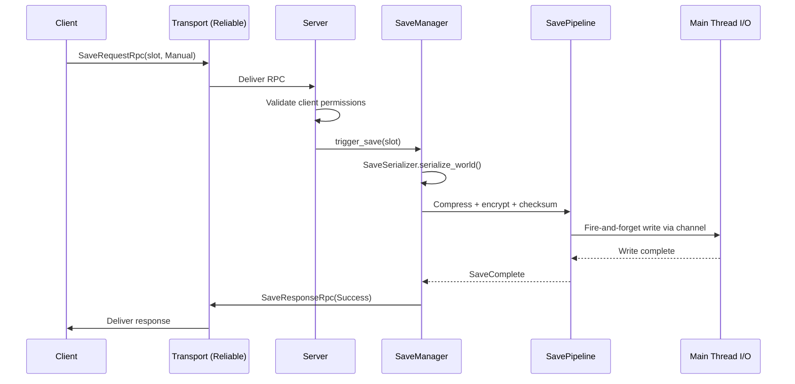
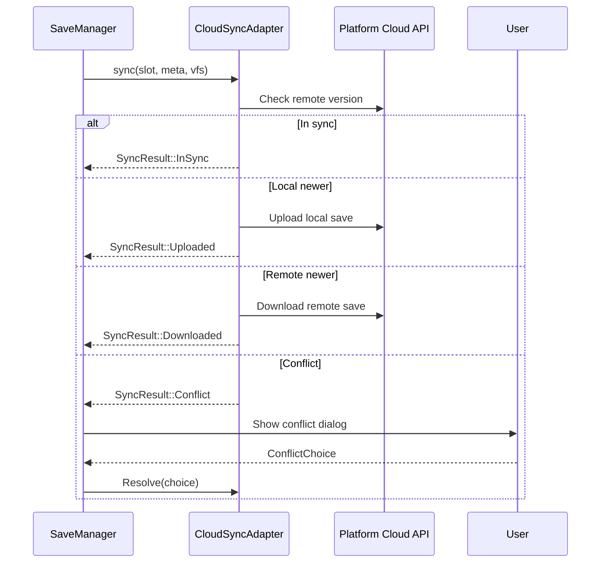

# Networking ↔ Save System Integration Design

## Systems Involved

| System | Design | Domain |
|--------|--------|--------|
| Networking | [network-transport.md](../networking/network-transport.md) | Net |
| Save System | [save-system.md](../game-framework/save-system.md) | Game |

## Integration Requirements

| ID | Requirement | Systems |
|----|-------------|---------|
| IR-4.6.1 | Server-authoritative save triggers | Net, Save |
| IR-4.6.2 | Save request and response via RPC | Net, Save |
| IR-4.6.3 | Cloud save sync over QUIC reliable | Net, Save |
| IR-4.6.4 | Save conflict resolution for cloud | Net, Save |
| IR-4.6.5 | Multiplayer checkpoint coordination | Net, Save |
| IR-4.6.6 | Save data excludes transient net state | Net, Save |

1. **IR-4.6.1** -- In multiplayer, only the server (authority) can trigger a save. Clients send a
   `SaveRequest` RPC to the server. The server validates, serializes the world, and responds with
   `SaveComplete` or `SaveFailed`.
2. **IR-4.6.2** -- `SaveRequest` and `SaveResponse` are reliable ordered RPCs (F-8.3.1). The server
   validates that the requesting client has save permissions before proceeding.
3. **IR-4.6.3** -- `CloudSyncAdapter` uploads save files over the QUIC reliable ordered channel when
   the platform cloud API is not available. Platform-native APIs (Steam, iCloud, Xbox, PlayStation)
   are preferred when present.
4. **IR-4.6.4** -- When cloud sync detects a conflict (local and remote saves diverge),
   `SyncResult::Conflict` is returned. The `SaveSlotMeta` timestamps and content hashes are
   presented to the user for `ConflictChoice` (KeepLocal or KeepRemote).
5. **IR-4.6.5** -- Multiplayer checkpoint saves require all connected clients to reach a sync point.
   The server sends a `CheckpointPrepare` RPC, waits for all client ACKs, then triggers the save.
6. **IR-4.6.6** -- `SaveSerializer` excludes transient networking components (`ConnectionId`,
   `ReplicationState`, `PredictionState`, `InterpolationState`) from the save. Only
   `Saveable`-tagged components are serialized.

## Data Contracts

| Type | Defined in | Consumed by | Purpose |
|------|-----------|-------------|---------|
| `SaveManager` | Save | Save | Orchestrates saves |
| `SaveSerializer` | Save | Save | World to bytes |
| `SavePipeline` | Save | Save | Compress + encrypt |
| `CloudSyncAdapter` | Save | Net | Cloud upload |
| `SaveSlotMeta` | Save | Save | Slot metadata |
| `SaveEvent` | Save | Net | Save lifecycle |
| `RpcDispatcher` | Networking | Save | RPC routing |
| `ConnectionId` | Networking | Save | Client identity |
| `Saveable` | Save | Save | Component filter |
| `SaveDirty` | Save | Save | Dirty tracking |

```rust
/// RPC sent by client to request a save.
pub struct SaveRequestRpc {
    /// Which slot to save into.
    pub slot_id: SlotId,
    /// Save type (manual, quicksave).
    pub save_type: SaveType,
}

/// RPC sent by server after save completes.
pub struct SaveResponseRpc {
    pub slot_id: SlotId,
    pub result: SaveRpcResult,
}

pub enum SaveRpcResult {
    Success { meta: SaveSlotMeta },
    Failed { reason: SaveError },
    PermissionDenied,
}

/// RPC for multiplayer checkpoint coordination.
pub struct CheckpointPrepareRpc {
    pub checkpoint_id: u64,
}

/// Client ACK for checkpoint readiness.
pub struct CheckpointReadyRpc {
    pub checkpoint_id: u64,
}
```

## Data Flow

### Server-Authoritative Save



### Cloud Save Sync



## Timing and Ordering

| System | Phase | Timestep | Order |
|--------|-------|----------|-------|
| Transport recv | 2-Network | Variable | 1st |
| RPC dispatch | 2-Network | Variable | After recv |
| SaveManager | 8-FrameEnd | Variable | End of frame |
| SaveSerializer | 8-FrameEnd | Variable | With manager |
| SavePipeline I/O | Main thread | Async | Fire-and-forget |

Save serialization runs at Phase 8 (FrameEnd) to ensure all simulation state is settled. The actual
I/O write is submitted to the main thread via crossbeam-channel and completes asynchronously.

## Failure Modes

| Failure | Impact | Recovery |
|---------|--------|----------|
| Save I/O failure | Save lost | Retry, keep last good save |
| Cloud upload timeout | Not synced | Retry on next opportunity |
| Conflict unresolved | Stale cloud | Prompt user for choice |
| Checkpoint timeout | No MP save | Abort, retry next opportunity |
| Permission denied | Save blocked | Inform client via RPC |
| Corruption detected | Load fails | Fallback to previous slot |

## Platform Considerations

| Platform | Cloud API | Transport |
|----------|----------|-----------|
| Windows (Steam) | Steam Cloud | MsQuic |
| macOS | iCloud | Networking.framework |
| PlayStation | PS Cloud | quinn-proto |
| Xbox | Xbox Cloud | MsQuic |
| Nintendo | Nintendo Cloud | quinn-proto |
| Linux | Steam Cloud | quinn-proto |

Platform-native cloud APIs are used when available. QUIC-based cloud sync is the fallback for
platforms without native cloud save support.

## Test Plan

See companion [networking-save-system-test-cases.md](networking-save-system-test-cases.md).
