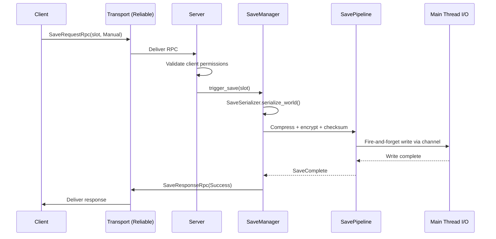
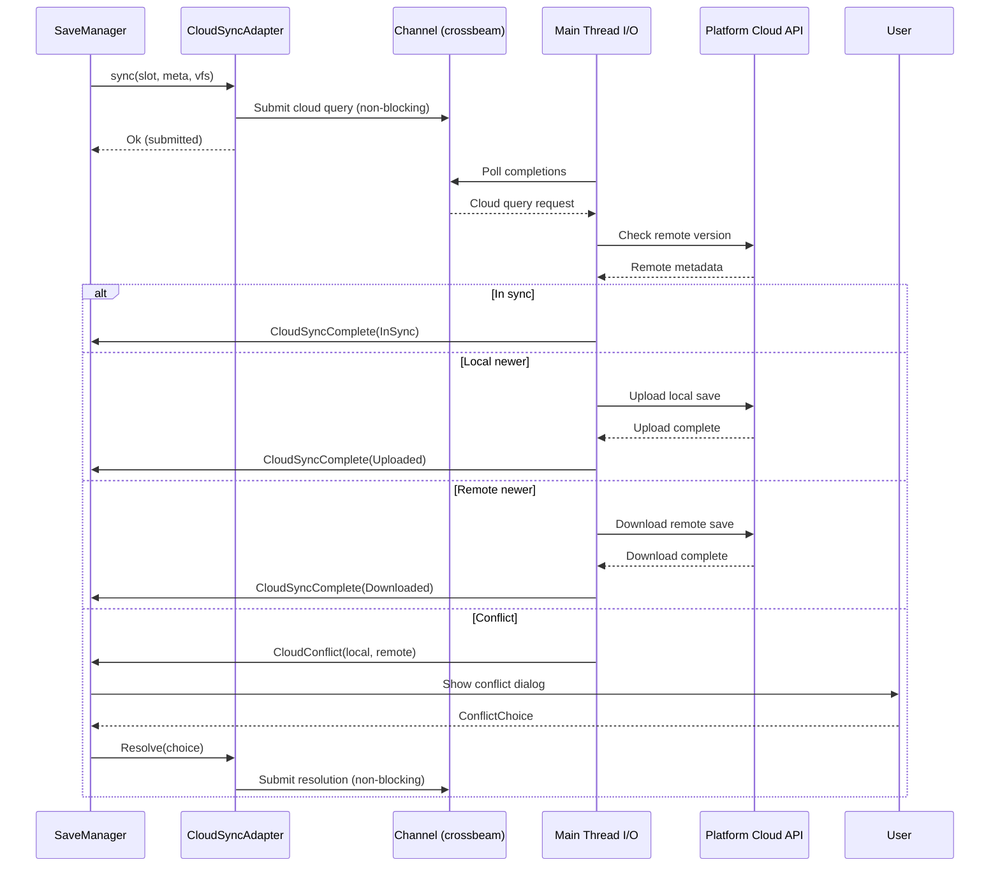

# Networking ↔ Save System Integration Design

## Systems Involved

| System | Design | Domain |
|--------|--------|--------|
| Networking | [network-transport.md](../networking/network-transport.md) | Net |
| Save System | [save-system.md](../game-framework/save-system.md) | Game |

## Integration Requirements

| ID | Requirement | Systems |
|----|-------------|---------|
| IR-4.6.1 | Server-authoritative save triggers | Net, Save |
| IR-4.6.2 | Save request and response via RPC | Net, Save |
| IR-4.6.3 | Cloud save sync over QUIC reliable | Net, Save |
| IR-4.6.4 | Save conflict resolution for cloud | Net, Save |
| IR-4.6.5 | Multiplayer checkpoint coordination | Net, Save |
| IR-4.6.6 | Save data excludes transient net state | Net, Save |

1. **IR-4.6.1** -- In multiplayer, only the server (authority) can trigger a save. Clients send a
   `SaveRequest` RPC to the server. The server validates, serializes the world, and responds with
   `SaveComplete` or `SaveFailed`.
2. **IR-4.6.2** -- `SaveRequest` and `SaveResponse` are reliable ordered RPCs (F-8.3.1). The server
   validates that the requesting client has save permissions before proceeding.
3. **IR-4.6.3** -- `CloudSyncAdapter` uploads save files over the QUIC reliable ordered channel when
   the platform cloud API is not available. Platform-native APIs (Steam, iCloud, Xbox, PlayStation)
   are preferred when present.
4. **IR-4.6.4** -- When cloud sync detects a conflict (local and remote saves diverge),
   `SyncResult::Conflict` is returned. The `SaveSlotMeta` timestamps and content hashes are
   presented to the user for `ConflictChoice` (KeepLocal or KeepRemote).
5. **IR-4.6.5** -- Multiplayer checkpoint saves require all connected clients to reach a sync point.
   The server sends a `CheckpointPrepare` RPC, waits for all client ACKs, then triggers the save.
6. **IR-4.6.6** -- `SaveSerializer` excludes transient networking components (`ConnectionId`,
   `Replicated`, `NetworkOwner`, `NetworkAuthority`, `ClientPredictor`, `SnapshotInterpolator`) from
   the save. Only `Saveable`-tagged components are serialized. These names match the networking
   design (`network-transport.md`).

## Data Contracts

| Type | Defined in | Consumed by | Purpose |
|------|-----------|-------------|---------|
| `SaveManager` | Save | Save | Orchestrates saves |
| `SaveSerializer` | Save | Save | World to bytes |
| `SavePipeline` | Save | Save | Compress + encrypt |
| `CloudSyncAdapter` | Save | Save (uses Net) | Cloud upload |
| `SaveSlotMeta` | Save | Save | Slot metadata |
| `SaveEvent` | Save | Net | Save lifecycle |
| `RpcDispatcher` | Networking | Save | RPC routing |
| `ConnectionId` | Networking | Save | Client identity |
| `Saveable` | Save | Save | Component filter |
| `SaveDirty` | Save | Save | Dirty tracking |

```rust
/// RPC sent by client to request a save.
/// Wire-serialized via rkyv (no serde).
#[derive(Archive, Serialize, Deserialize)]
pub struct SaveRequestRpc {
    /// Which slot to save into.
    pub slot_id: SlotId,
    /// Save type (manual, quicksave).
    pub save_type: SaveType,
}

/// RPC sent by server after save completes.
/// Wire-serialized via rkyv (no serde).
#[derive(Archive, Serialize, Deserialize)]
pub struct SaveResponseRpc {
    pub slot_id: SlotId,
    pub result: SaveRpcResult,
}

/// All variants are rkyv-serialized for the wire.
/// `SaveSlotMeta` in `Success` is rkyv-encoded inline.
#[derive(Archive, Serialize, Deserialize)]
pub enum SaveRpcResult {
    Success { meta: SaveSlotMeta },
    Failed { reason: SaveError },
    PermissionDenied,
}

/// RPC for multiplayer checkpoint coordination.
#[derive(Archive, Serialize, Deserialize)]
pub struct CheckpointPrepareRpc {
    pub checkpoint_id: u64,
}

/// Client ACK for checkpoint readiness.
#[derive(Archive, Serialize, Deserialize)]
pub struct CheckpointReadyRpc {
    pub checkpoint_id: u64,
}

/// Cloud sync outcome.
/// Defined in save-system.md; shown here for cross-ref.
#[derive(Clone, Debug)]
pub enum SyncResult {
    InSync,
    Uploaded,
    Downloaded,
    Conflict {
        local: SaveSlotMeta,
        remote: SaveSlotMeta,
    },
}

/// User's choice when cloud save conflict is detected.
/// Defined in save-system.md; shown here for cross-ref.
#[derive(Clone, Copy, Debug)]
pub enum ConflictChoice {
    KeepLocal,
    KeepRemote,
}

/// Platform cloud abstraction.
/// Defined in save-system.md; shown here for cross-ref.
/// Submits I/O via channel; never blocks the game loop.
pub struct CloudSyncAdapter {
    platform: CloudPlatform,
}

impl CloudSyncAdapter {
    /// Submits sync I/O via channel; returns immediately.
    pub fn sync(
        &self, slot: SlotId,
        local_meta: &SaveSlotMeta,
        vfs: &VirtualFileSystem,
    ) -> Result<SyncResult, SaveError>;
}
```

## Data Flow

### Server-Authoritative Save



### Cloud Save Sync

All platform cloud API calls use the channel-submission pattern. `CloudSyncAdapter` submits I/O
requests via crossbeam-channel and returns immediately. The main thread polls completions at the
frame boundary and fires `CloudSyncComplete` or `CloudConflict` events.



## Timing and Ordering

| System | Phase | Timestep | Order |
|--------|-------|----------|-------|
| Transport recv | 2-Network | Variable | 1st |
| RPC dispatch | 2-Network | Variable | After recv |
| SaveManager | 8-FrameEnd | Variable | End of frame |
| SaveSerializer | 8-FrameEnd | Variable | With manager |
| SavePipeline I/O | Main thread | Channel-submitted | Fire-and-forget |

Save serialization runs at Phase 8 (FrameEnd) to ensure all simulation state is settled. The actual
I/O write is submitted to the main thread via crossbeam-channel and completes asynchronously.

## Failure Modes

| Failure | Impact | Recovery |
|---------|--------|----------|
| Save I/O failure | Save lost | Retry, keep last good save |
| Cloud upload timeout | Not synced | Retry on next opportunity |
| Conflict unresolved | Stale cloud | Prompt user for choice |
| Checkpoint timeout | No MP save | Abort, retry next opportunity |
| Permission denied | Save blocked | Inform client via RPC |
| Corruption detected | Load fails | Fallback to previous slot |

## Platform Considerations

| Platform | Cloud API | Transport |
|----------|----------|-----------|
| Windows (Steam) | Steam Cloud | MsQuic |
| macOS | iCloud | Networking.framework |
| PlayStation | PS Cloud | quinn-proto |
| Xbox | Xbox Cloud | MsQuic |
| Nintendo | Nintendo Cloud | quinn-proto |
| Linux | Steam Cloud | quinn-proto |

Platform-native cloud APIs are used when available. QUIC-based cloud sync is the fallback for
platforms without native cloud save support.

> **Dependency:** The network transport design (`network-transport.md`) still uses
> `Future`-returning APIs and Tokio. This integration design assumes reliable ordered RPC delivery
> via the post-RF-1 platform-native I/O transport. All RPC and cloud sync paths depend on RF-1
> completion (crossbeam-channel submission, main-thread poll).

## Test Plan

See companion [networking-save-system-test-cases.md](networking-save-system-test-cases.md).

## Review Feedback

1. [CONFIDENT] RPC structs (`SaveRequestRpc`, `SaveResponseRpc`, `CheckpointPrepareRpc`,
   `CheckpointReadyRpc`) lack `#[derive(Archive, Serialize, Deserialize)]` from rkyv. All
   network-serialized types must use rkyv per the "no serde, rkyv only" constraint.

2. [CONFIDENT] The Timing table labels SavePipeline I/O as "Async" in the Timestep column. The
   engine forbids async/await in runtime. Relabel to "Fire-and-forget" or "Channel-submitted" to
   match the crossbeam-channel pattern described in the prose.

3. [CONFIDENT] `ReplicationState`, `PredictionState`, and `InterpolationState` (referenced in
   IR-4.6.6) are not defined in any networking design document. These component names should either
   be added to the networking design or mapped to the actual component names used there.

4. [CONFIDENT] The Data Contracts table lists `CloudSyncAdapter` as "Consumed by: Net" but it is
   owned by the Save system and consumes Net transport internally. The direction is inverted; it
   should be "Consumed by: Save" (or "Uses: Net").

5. [CONFIDENT] Missing `classDiagram`. Per `docs/design/ CLAUDE.md` rule 3, every design must have a
   Mermaid class diagram covering all types, enums, traits, and relationships. No class diagram is
   present.

6. [CONFIDENT] The network transport design (`network-transport.md`) still uses `Future`-returning
   APIs and Tokio (see its RF-1). This integration design assumes reliable ordered RPC delivery but
   does not acknowledge that the transport API is pending migration to platform-native I/O. A note
   or dependency on RF-1 completion should be added.

7. [UNCERTAIN] The cloud sync sequence diagram shows `CloudSyncAdapter` calling a
   `Platform Cloud API` synchronously (blocking arrows). If the platform API is non-blocking (Steam,
   iCloud), the diagram should show the channel-submission pattern used for all I/O, with the main
   thread polling completions.

8. [CONFIDENT] The server-authoritative save sequence diagram shows
   `SaveSerializer.serialize_world()` as a self-call on `SaveManager`. For large worlds this is a
   potentially expensive operation. No mention of whether this runs as a job system task via
   `scope()` or blocks the game loop. The design should clarify thread ownership of serialization.

9. [CONFIDENT] The Data Contracts pseudocode does not show `SyncResult`, `ConflictChoice`, or
   `CloudSyncAdapter` structs, even though they appear in the Data Flow diagrams and IR-4.6.4. These
   types should be included or explicitly cross-referenced to the save-system design.

10. [UNCERTAIN] No 2D/2.5D considerations. The engine requires first-class 2D and 2.5D support. The
    design does not address whether multiplayer save semantics differ for 2D games (e.g., simpler
    world state, smaller save sizes). This may be intentionally identical, but should be stated.

11. [CONFIDENT] `SaveSlotMeta` in `SaveRpcResult::Success` is returned by value over the network.
    The design does not specify whether this is rkyv-serialized for the RPC or uses a separate
    encoding. All wire types must use rkyv.

12. [CONFIDENT] No error handling for partial checkpoint ACKs. IR-4.6.5 describes an all-or-nothing
    checkpoint but the failure mode table only covers "timeout on disconnect." The design should
    address what happens if a client ACKs but then disconnects before the save completes.

13. [CONFIDENT] The Timing table places RPC dispatch in phase "2-Network" but `SaveManager` in phase
    "8-FrameEnd." There is a 6-phase gap between receiving a save RPC and acting on it. The design
    should clarify whether the save request is queued as an event and consumed at FrameEnd, or
    whether a different mechanism bridges the phases.
