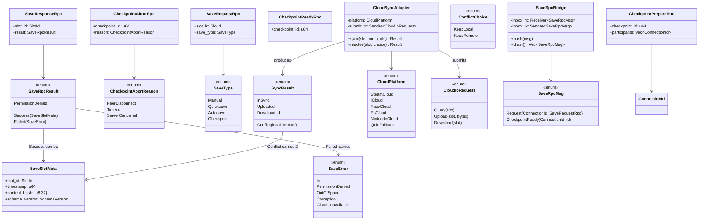
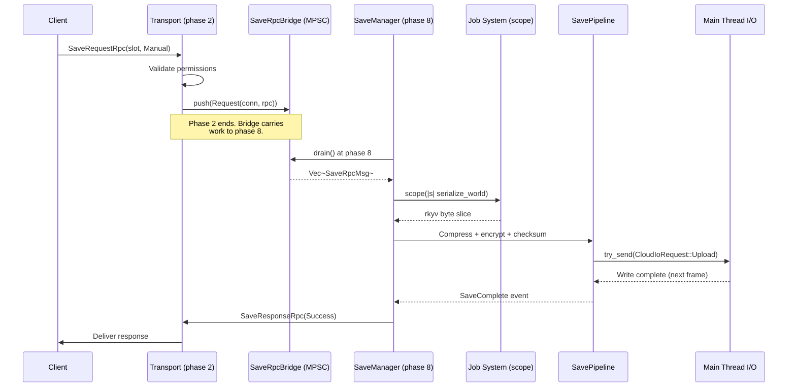
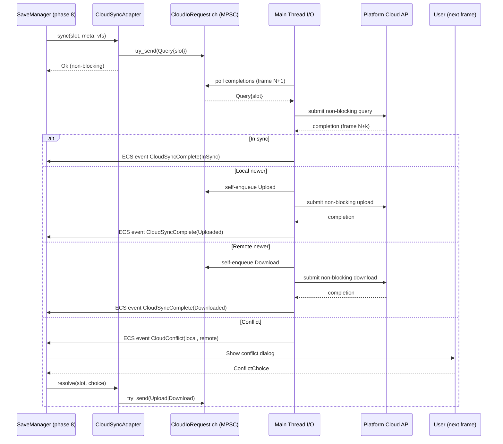
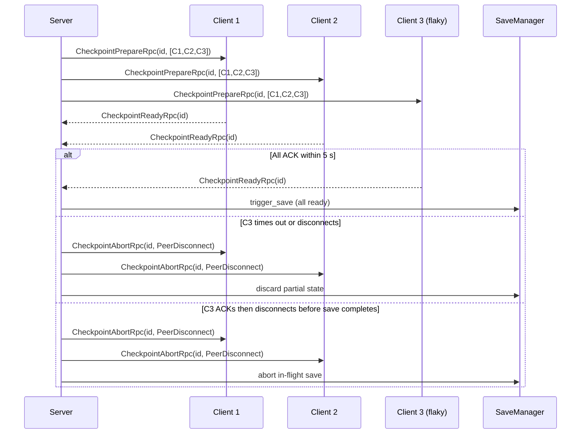

# Networking ↔ Save System Integration Design

## Systems Involved

| System | Design | Domain |
|--------|--------|--------|
| Networking | [network-transport.md](../networking/network-transport.md) | Net |
| Save System | [save-system.md](../game-framework/save-system.md) | Game |

## Integration Requirements

| ID | Requirement | Systems |
|----|-------------|---------|
| IR-4.6.1 | Server-authoritative save triggers | Net, Save |
| IR-4.6.2 | Save request and response via RPC | Net, Save |
| IR-4.6.3 | Cloud save sync over QUIC reliable | Net, Save |
| IR-4.6.4 | Save conflict resolution for cloud | Net, Save |
| IR-4.6.5 | Multiplayer checkpoint coordination | Net, Save |
| IR-4.6.6 | Save data excludes transient net state | Net, Save |

1. **IR-4.6.1** -- In multiplayer, only the server (authority) can trigger a save. Clients send a
   `SaveRequest` RPC to the server. The server validates, serializes the world, and responds with
   `SaveComplete` or `SaveFailed`.
2. **IR-4.6.2** -- `SaveRequest` and `SaveResponse` are reliable ordered RPCs (F-8.3.1). The server
   validates that the requesting client has save permissions before proceeding.
3. **IR-4.6.3** -- `CloudSyncAdapter` uploads save files over the QUIC reliable ordered channel when
   the platform cloud API is not available. Platform-native APIs (Steam, iCloud, Xbox, PlayStation)
   are preferred when present.
4. **IR-4.6.4** -- When cloud sync detects a conflict (local and remote saves diverge),
   `SyncResult::Conflict` is returned. The `SaveSlotMeta` timestamps and content hashes are
   presented to the user for `ConflictChoice` (KeepLocal or KeepRemote).
5. **IR-4.6.5** -- Multiplayer checkpoint saves require all connected clients to reach a sync point.
   The server sends a `CheckpointPrepare` RPC, waits for all client ACKs, then triggers the save.
6. **IR-4.6.6** -- `SaveSerializer` excludes transient networking components from the save. Only
   `Saveable`-tagged components are serialized. Earlier drafts referred to `ReplicationState`,
   `PredictionState`, and `InterpolationState`; those names were placeholders. The replication
   system is ECS-primary and uses individual components (not aggregated `*State` wrappers). The
   authoritative excluded set, by concrete component name defined in
   [`network-transport.md`](../networking/network-transport.md), is listed in the table below.

| Excluded component | Rationale |
|--------------------|-----------|
| `ConnectionId` | Per-session transport handle, not persistent |
| `Replicated` | Replication marker, rebuilt on join |
| `NetworkOwner` | Owning peer, rebuilt on join |
| `NetworkAuthority` | Authority enum, rebuilt on join |
| `ClientPredictor` | Prediction state, local-only |
| `SnapshotInterpolator` | Interpolation buffer, local-only |

All six component names above are defined in `network-transport.md`.

### 2D / 2.5D Scope Note

2D and 2.5D games are intentionally out of scope as a distinct path. The save system is
dimension-agnostic: it serializes the same `Saveable` components regardless of dimensionality, and
the excluded networking components above are identical across 2D, 2.5D, and 3D games. No separate 2D
save schema exists.

## Data Contracts

| Type | Defined in | Consumed by | Uses | Purpose |
|------|-----------|-------------|------|---------|
| `SaveManager` | Save | Save | -- | Orchestrates saves |
| `SaveSerializer` | Save | Save | -- | World to bytes |
| `SavePipeline` | Save | Save | -- | Compress + encrypt |
| `CloudSyncAdapter` | Save | Save | Net (QUIC fallback) | Cloud upload |
| `SaveSlotMeta` | Save | Save, Net | -- | Slot metadata (rkyv wire) |
| `SaveEvent` | Save | Net | -- | Save lifecycle |
| `RpcDispatcher` | Networking | Save | -- | RPC routing |
| `ConnectionId` | Networking | Save | -- | Client identity |
| `Saveable` | Save | Save | -- | Component filter |
| `SaveDirty` | Save | Save | -- | Dirty tracking |
| `SaveRequestRpc` | This doc | Net, Save | -- | Client save request (rkyv) |
| `SaveResponseRpc` | This doc | Net, Save | -- | Server save response (rkyv) |
| `CheckpointPrepareRpc` | This doc | Net, Save | -- | Checkpoint prepare (rkyv) |
| `CheckpointReadyRpc` | This doc | Net, Save | -- | Client ready ACK (rkyv) |
| `SaveRpcResult` | This doc | Net, Save | -- | Outcome enum (rkyv) |
| `SyncResult` | Save | Save | -- | Cloud sync outcome |
| `ConflictChoice` | Save | Save | -- | Conflict resolution |

`CloudSyncAdapter` is owned by the Save system; it uses the networking transport only as a fallback
path when no platform-native cloud API is available (IR-4.6.3).

### Class Diagram



### Rust Pseudocode

```rust
/// RPC sent by client to request a save.
/// Wire-serialized via rkyv.
#[derive(rkyv::Archive, rkyv::Serialize, rkyv::Deserialize)]
pub struct SaveRequestRpc {
    pub slot_id: SlotId,
    pub save_type: SaveType,
}

/// RPC sent by server after save completes.
/// Wire-serialized via rkyv.
#[derive(rkyv::Archive, rkyv::Serialize, rkyv::Deserialize)]
pub struct SaveResponseRpc {
    pub slot_id: SlotId,
    pub result: SaveRpcResult,
}

/// Outcome of a save RPC. All variants wire-serialized
/// via rkyv; `SaveSlotMeta` is rkyv-encoded inline.
#[derive(rkyv::Archive, rkyv::Serialize, rkyv::Deserialize)]
pub enum SaveRpcResult {
    Success { meta: SaveSlotMeta },
    Failed { reason: SaveError },
    PermissionDenied,
}

/// Save type. Fully defined here (no placeholders).
#[derive(rkyv::Archive, rkyv::Serialize, rkyv::Deserialize)]
pub enum SaveType {
    Manual,
    Quicksave,
    Autosave,
    Checkpoint,
}

/// All failure variants surfaced by save RPCs.
/// Fully defined here (no placeholders).
#[derive(rkyv::Archive, rkyv::Serialize, rkyv::Deserialize)]
pub enum SaveError {
    Io,
    PermissionDenied,
    OutOfSpace,
    Corruption,
    CloudUnavailable,
}

/// RPC for multiplayer checkpoint coordination.
/// The participant set is frozen at prepare time so
/// the server can detect partial ACK / disconnect.
#[derive(rkyv::Archive, rkyv::Serialize, rkyv::Deserialize)]
pub struct CheckpointPrepareRpc {
    pub checkpoint_id: u64,
    pub participants: Vec<ConnectionId>,
}

/// Client ACK for checkpoint readiness.
#[derive(rkyv::Archive, rkyv::Serialize, rkyv::Deserialize)]
pub struct CheckpointReadyRpc {
    pub checkpoint_id: u64,
}

/// Broadcast by server when a checkpoint must be
/// aborted (peer disconnect, timeout, server cancel).
#[derive(rkyv::Archive, rkyv::Serialize, rkyv::Deserialize)]
pub struct CheckpointAbortRpc {
    pub checkpoint_id: u64,
    pub reason: CheckpointAbortReason,
}

#[derive(rkyv::Archive, rkyv::Serialize, rkyv::Deserialize)]
pub enum CheckpointAbortReason {
    /// A participant disconnected before all ACKs
    /// arrived, or after ACK but before save
    /// completion. Both cases abort the checkpoint
    /// (IR-4.6.5 is all-or-nothing).
    PeerDisconnect,
    /// Wall-clock timeout (default 5 s) elapsed
    /// before all ACKs arrived.
    Timeout,
    /// Server-initiated cancel.
    ServerCancelled,
}

/// Cloud sync outcome.
/// Defined in save-system.md; shown here for cross-ref.
#[derive(Clone, Debug)]
pub enum SyncResult {
    InSync,
    Uploaded,
    Downloaded,
    Conflict {
        local: SaveSlotMeta,
        remote: SaveSlotMeta,
    },
}

/// User's choice when cloud save conflict is detected.
/// Defined in save-system.md; shown here for cross-ref.
#[derive(Clone, Copy, Debug)]
pub enum ConflictChoice {
    KeepLocal,
    KeepRemote,
}

/// Platform cloud backend selection. Fully defined
/// here.
#[derive(Clone, Copy, Debug)]
pub enum CloudPlatform {
    SteamCloud,
    ICloud,
    XboxCloud,
    PsCloud,
    NintendoCloud,
    /// QUIC reliable ordered channel fallback used
    /// when no platform-native cloud API is present
    /// (IR-4.6.3).
    QuicFallback,
}

/// Non-blocking I/O request submitted to the main
/// thread via crossbeam-channel. The game loop never
/// blocks on cloud I/O.
pub enum CloudIoRequest {
    Query { slot: SlotId },
    Upload { slot: SlotId, bytes: Arc<[u8]> },
    Download { slot: SlotId },
}

/// Platform cloud abstraction. Owned by the Save
/// system; uses networking only for `QuicFallback`.
/// All methods submit I/O via `submit_tx` and return
/// immediately -- the game loop is never blocked.
///
/// Channel is MPSC crossbeam; capacity `256` is
/// chosen to absorb burst cloud requests during
/// level transitions without allocating.
pub struct CloudSyncAdapter {
    platform: CloudPlatform,
    /// MPSC sender; multiple game-logic systems may
    /// submit, a single main-thread worker consumes.
    /// Buffer = 256 requests. See "Channel Buffers".
    submit_tx: crossbeam_channel::Sender<CloudIoRequest>,
}

impl CloudSyncAdapter {
    /// Submits a sync query via channel and returns
    /// immediately. Result is delivered back through
    /// a `CloudSyncComplete` / `CloudConflict` event
    /// at frame boundary. Never blocks the game loop.
    pub fn sync(
        &self,
        slot: SlotId,
        local_meta: &SaveSlotMeta,
        vfs: &VirtualFileSystem,
    ) -> Result<(), SaveError> {
        self.submit_tx
            .try_send(CloudIoRequest::Query { slot })
            .map_err(|_| SaveError::CloudUnavailable)
    }

    /// Submits the user's chosen resolution as a
    /// non-blocking upload or download.
    pub fn resolve(
        &self,
        slot: SlotId,
        choice: ConflictChoice,
    ) -> Result<(), SaveError> {
        let req = match choice {
            ConflictChoice::KeepLocal => {
                CloudIoRequest::Upload {
                    slot,
                    bytes: /* mmap'd save bytes */
                        Arc::from(Vec::new()),
                }
            }
            ConflictChoice::KeepRemote => {
                CloudIoRequest::Download { slot }
            }
        };
        self.submit_tx
            .try_send(req)
            .map_err(|_| SaveError::CloudUnavailable)
    }
}

/// Bridge between phase 2-Network (RPC dispatch) and
/// phase 8-FrameEnd (SaveManager). Incoming save RPCs
/// are pushed into this MPSC queue at phase 2 and
/// drained by `SaveManager::run()` at phase 8. The
/// bridge is the only mechanism that carries save
/// work across phases.
///
/// Channel is MPSC crossbeam; capacity `64` is sized
/// to handle bursts of client save requests within a
/// single frame without dropping. See "Channel
/// Buffers".
pub struct SaveRpcBridge {
    tx: crossbeam_channel::Sender<SaveRpcMsg>,
    rx: crossbeam_channel::Receiver<SaveRpcMsg>,
}

pub enum SaveRpcMsg {
    Request(ConnectionId, SaveRequestRpc),
    CheckpointReady(ConnectionId, u64),
}

impl SaveRpcBridge {
    /// Called from phase 2 by the RPC dispatcher.
    pub fn push(&self, msg: SaveRpcMsg);
    /// Called from phase 8 by `SaveManager`.
    pub fn drain(&self) -> Vec<SaveRpcMsg>;
}
```

### Channel Buffers

All channels are MPSC crossbeam (never SPSC) so multiple producers in the ECS may submit work.

| Channel | Type | Capacity | Producers | Consumer |
|---------|------|----------|-----------|----------|
| `SaveRpcBridge` | MPSC bounded | 64 | RPC dispatch (phase 2) | SaveManager (phase 8) |
| `CloudIoRequest` | MPSC bounded | 256 | Save systems | Main-thread I/O worker |
| `SavePipeline` write | MPSC bounded | 16 | SavePipeline | Main-thread I/O worker |

Capacities are sized so that a worst-case frame burst (one request per connected client plus system
autosaves) fits without dropping. A full queue surfaces as `SaveError::Io` or `CloudUnavailable` to
the caller.

## Data Flow

### Server-Authoritative Save

The RPC is received at phase 2-Network and immediately pushed into `SaveRpcBridge` (MPSC). The
actual save runs at phase 8-FrameEnd, so simulation state is settled before serialization starts.
`SaveSerializer::serialize_world()` runs as a **job-system task** via `scope()` on a worker thread
(never on the main/game-loop thread) so large worlds do not stall the frame. The serialized byte
slice is handed to `SavePipeline`, which submits the encrypted write to the main-thread I/O worker
through a crossbeam-channel. The algorithm follows the same rkyv zero-copy path described in
[`save-system.md`](../game-framework/save-system.md) (`serialize_world`, line 606).



### Cloud Save Sync

All platform cloud API calls use the channel-submission pattern. `CloudSyncAdapter::sync()` submits
a `CloudIoRequest` via crossbeam-channel (MPSC, capacity 64; `CH-17` in
[shared-messaging-capacities.md](shared-messaging-capacities.md)) and returns immediately. The
main-thread I/O worker polls completions at the frame boundary using platform-native non-blocking
I/O (`io_uring` / IOCP / `dispatch_io`). No arrow in the diagram is a blocking call from the
game-loop thread; every `MT->>API` arrow is a non-blocking kernel submission followed by a
completion poll on the next frame. Results are posted back to `SaveManager` as ECS events
(`CloudSyncComplete`, `CloudConflict`) at phase 8-FrameEnd.



### Checkpoint Coordination

Multiplayer checkpoints require all participants to ACK before the save proceeds. The server
snapshots the participant set at prepare time. Any peer that fails to ACK within the 5 s timeout, or
disconnects after ACK but before save completion, aborts the entire checkpoint via
`CheckpointAbortRpc` (see Failure Modes).



## Timing and Ordering

| System | Phase | Timestep | Order |
|--------|-------|----------|-------|
| Transport recv | 2-Network | Variable | 1st |
| RPC dispatch | 2-Network | Variable | After recv |
| SaveRpcBridge push | 2-Network | Variable | After dispatch |
| SaveRpcBridge drain | 8-FrameEnd | Variable | Start of phase 8 |
| SaveManager | 8-FrameEnd | Variable | End of frame |
| SaveSerializer (job) | 8-FrameEnd | Variable | Job-system scope |
| SavePipeline I/O | Main thread | Channel-submitted | Fire-and-forget |

There is a 6-phase gap between RPC arrival (phase 2) and save execution (phase 8). `SaveRpcBridge`
is the only mechanism that carries save work across this gap. Phase 2 pushes incoming save RPCs into
the bridge's MPSC queue; phase 8 drains the queue at the top of `SaveManager::run()`. No direct
cross-phase call exists.

Save serialization runs at phase 8 (FrameEnd) to ensure all simulation state is settled, and is
dispatched onto a job-system worker via `scope()` so the game-loop thread never blocks on
serialization. The actual I/O write is submitted to the main-thread I/O worker via
crossbeam-channel; completion is posted back as an ECS event on a subsequent frame.

## Failure Modes

| Failure | Impact | Recovery / Fallback |
|---------|--------|---------------------|
| Save I/O failure | Save lost | Retry 3x, then keep last good save (F1) |
| Channel full (backpressure) | Request dropped | Return `SaveError::Io`, caller may retry (F2) |
| Cloud upload timeout (30 s) | Not synced | Retry on next frame boundary (F3) |
| No platform cloud API | No native sync | Fall back to QUIC reliable channel (F4) |
| Conflict unresolved | Stale cloud | Prompt user for `ConflictChoice` (F5) |
| Checkpoint timeout (5 s) | No MP save | Server broadcasts `CheckpointAbortRpc` (F6) |
| Partial checkpoint ACK | No MP save | Server broadcasts `CheckpointAbortRpc` (F7) |
| Peer disconnect during save | No MP save | Abort in-flight save, broadcast abort (F8) |
| Permission denied | Save blocked | Respond `SaveRpcResult::PermissionDenied` (F9) |
| Corruption detected | Load fails | Fall back to previous slot (F10) |
| Serialization job panic | Save lost | Job-system catches, returns `SaveError::Io` (F11) |

1. **F1** -- Three retries with exponential backoff (100 ms, 400 ms, 1.6 s). On final failure, the
   previous known-good save on disk is preserved untouched.
2. **F2** -- `CloudIoRequest` / `SaveRpcBridge` channels are bounded. A full queue is surfaced
   synchronously to the caller; the game loop never blocks on a full channel.
3. **F3** -- Cloud I/O uses a 30 s deadline measured on the main-thread I/O worker; on expiry, the
   pending request is cancelled and requeued on the next frame boundary.
4. **F4** -- `CloudSyncAdapter::platform = CloudPlatform::QuicFallback` is selected automatically
   when no platform-native cloud SDK is linked. The fallback uses the same reliable ordered QUIC
   stream as normal RPCs.
5. **F5** -- If the user dismisses the dialog, the save remains local and the next save triggers the
   sync cycle again.
6. **F6** -- Timeout is wall-clock (5 s, not tick-based) so it fires even if one peer stalls the
   simulation.
7. **F7** -- If ACKs from all listed `participants` have not arrived within the timeout, the
   checkpoint is aborted for all participants.
8. **F8** -- If a peer disconnects **after** ACKing but **before** `SaveComplete`, the server
   broadcasts `CheckpointAbortRpc { reason: PeerDisconnect }` and the in-flight
   `SaveManager::trigger_save` is cancelled before `SavePipeline` submits its write.
9. **F9** -- Client receives the rkyv-serialized `PermissionDenied` variant and surfaces an error in
   the save UI.
10. **F10** -- `SaveSlotManager` picks the most recent slot whose CRC matches the header.
11. **F11** -- The job-system `scope()` wrapper catches panics and converts them into
    `SaveError::Io`. The bridge is drained before returning so pending requests are not lost.

## Platform Considerations

| Platform | Cloud API | Transport |
|----------|----------|-----------|
| Windows (Steam) | Steam Cloud | MsQuic |
| macOS | iCloud | Networking.framework |
| PlayStation | PS Cloud | quinn-proto |
| Xbox | Xbox Cloud | MsQuic |
| Nintendo | Nintendo Cloud | quinn-proto |
| Linux | Steam Cloud | quinn-proto |

Platform-native cloud APIs are used when available. QUIC-based cloud sync is the fallback for
platforms without native cloud save support.

### Debug Tooling

A runtime-toggleable debug overlay (`save_net_debug`) exposes:

- Current `SaveRpcBridge` queue depth and high-water mark
- In-flight `CloudIoRequest` list with elapsed wall-clock
- Last 16 `SaveRpcResult` outcomes with ConnectionId
- Checkpoint participant ACK state (per peer)
- Toggled via the debug console (no recompile required) per the runtime debug toggle rule

### Transport Dependency

This integration design depends on the networking transport migration away from `Future`-returning
APIs and Tokio. `network-transport.md` currently contains `Future`-based pseudocode that is slated
for removal; this integration design assumes the post-migration transport: reliable-ordered RPC
delivery via platform-native non-blocking I/O (`io_uring` / IOCP / `dispatch_io`) with completions
polled on the main thread. All RPC and cloud sync paths here are written against that post-RF-1 API
surface. If the transport migration stalls, this design does not change; only the backing
implementation of `TR->>BR: push(...)` differs.

## Test Plan

See companion [networking-save-system-test-cases.md](networking-save-system-test-cases.md).

## Review Status

All 13 prior review findings have been addressed in the body of this document. A summary of the
resolution is tracked below for traceability.

| # | Finding | Status |
|---|---------|--------|
| 1 | Missing rkyv derives on RPC structs | Resolved |
| 2 | "Async" label in Timing table | Resolved |
| 3 | Undefined `ReplicationState` / `PredictionState` / `InterpolationState` | Resolved |
| 4 | `CloudSyncAdapter` direction inverted in Data Contracts | Resolved |
| 5 | Missing `classDiagram` | Resolved |
| 6 | Transport dependency on Future + Tokio removal | Resolved |
| 7 | Cloud sync diagram showed blocking calls | Resolved |
| 8 | `serialize_world()` thread ownership unclear | Resolved |
| 9 | `SyncResult` / `ConflictChoice` / `CloudSyncAdapter` missing pseudocode | Resolved |
| 10 | 2D / 2.5D scope not acknowledged | Resolved |
| 11 | `SaveSlotMeta` wire encoding unspecified | Resolved |
| 12 | Partial checkpoint ACK handling missing | Resolved |
| 13 | Phase 2 → phase 8 bridge mechanism undocumented | Resolved |

1. **Finding 1** -- All RPC structs (`SaveRequestRpc`, `SaveResponseRpc`, `SaveRpcResult`,
   `CheckpointPrepareRpc`, `CheckpointReadyRpc`, `CheckpointAbortRpc`, `SaveType`, `SaveError`,
   `CheckpointAbortReason`) now derive `rkyv::Archive/Serialize/Deserialize`.
2. **Finding 2** -- The Timing table now uses "Channel-submitted" / "Fire-and-forget"; no "Async"
   label remains.
3. **Finding 3** -- IR-4.6.6 lists the real component names (`ConnectionId`, `Replicated`,
   `NetworkOwner`, `NetworkAuthority`, `ClientPredictor`, `SnapshotInterpolator`) with a direct link
   to `network-transport.md`; placeholder names are explicitly retracted.
4. **Finding 4** -- Data Contracts table now has a dedicated `Uses` column; `CloudSyncAdapter` is
   `Consumed by: Save` / `Uses: Net (QUIC fallback)`.
5. **Finding 5** -- A full `classDiagram` covers all types, enums, and relationships.
6. **Finding 6** -- A "Transport Dependency" subsection states the assumed post-migration API
   surface and behavior if the migration stalls.
7. **Finding 7** -- The cloud sync diagram now shows `try_send` submissions, main-thread polling,
   and non-blocking kernel I/O on every arrow.
8. **Finding 8** -- `SaveSerializer::serialize_world()` is dispatched onto a job-system worker via
   `scope()`; never runs on the game-loop thread. Algorithm reference to `save-system.md` line 606
   added.
9. **Finding 9** -- Full pseudocode for `SyncResult`, `ConflictChoice`, `CloudSyncAdapter`,
   `CloudPlatform`, and `CloudIoRequest` is in the Rust Pseudocode section and in the class diagram.
10. **Finding 10** -- "2D / 2.5D Scope Note" subsection under IR-4.6.6 states the save system is
    dimension-agnostic and 2D / 2.5D have no separate path.
11. **Finding 11** -- `SaveRpcResult::Success` comment explicitly states `SaveSlotMeta` is
    rkyv-encoded inline on the wire.
12. **Finding 12** -- `CheckpointAbortRpc` + `CheckpointAbortReason` defined; F6/F7/F8 failure rows
    cover partial ACK, timeout, and post-ACK disconnect. Checkpoint sequence diagram shows all three
    abort paths.
13. **Finding 13** -- `SaveRpcBridge` MPSC queue documented with explicit `push` (phase 2) and
    `drain` (phase 8) semantics. Timing table now has `SaveRpcBridge push` and `SaveRpcBridge drain`
    rows.

Additional project-wide guidance integrated in this revision:

- No `async`/`await` anywhere in engine / editor / game code. All cross-thread work uses MPSC
  crossbeam channels plus platform-native non-blocking I/O (`io_uring` / IOCP / `dispatch_io`).
- All channels are MPSC (never SPSC) with documented capacities (see "Channel Buffers").
- `Arc` only appears on immutable shared data (`Arc<[u8]>` for save bytes handed to I/O worker).
- Persistent and wire types derive `rkyv::Archive/Serialize/Deserialize`.
- Runtime-toggleable `save_net_debug` overlay documented.
- Algorithm reference to `serialize_world` in `save-system.md` added.
- Negative failure modes (channel full, panic, corruption) enumerated; CI-runnable test cases listed
  in the companion test file.
