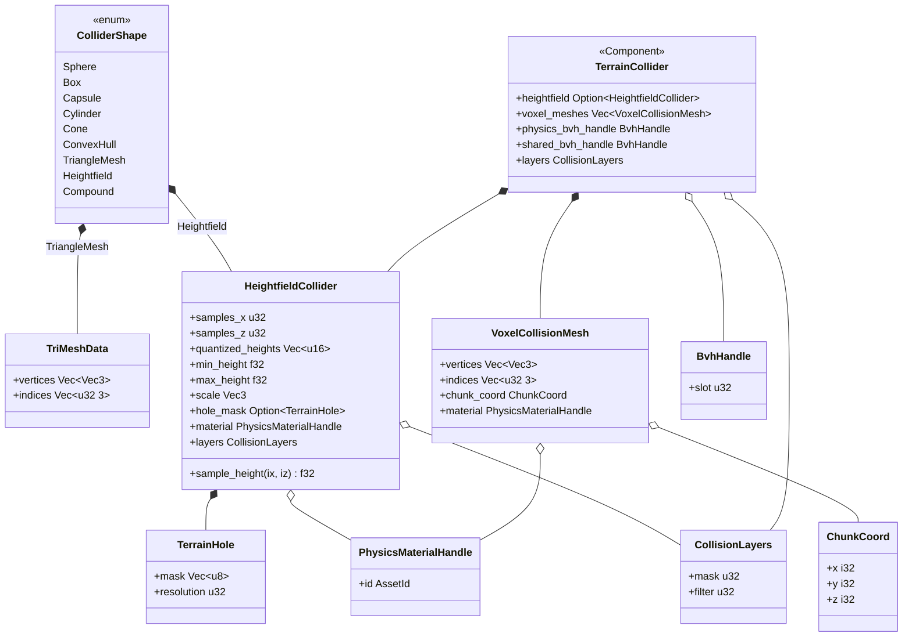
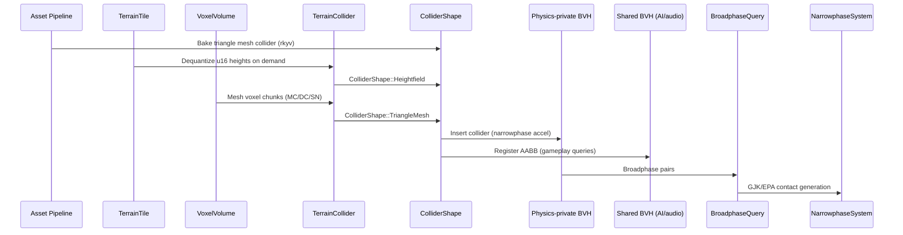

# Physics ↔ World Geometry Integration Design

> **Compliance.** This document follows the cross-cutting conventions in
> [shared-conventions.md](shared-conventions.md) (SC-1..SC-14) and the channel-capacity formula in
> [shared-messaging-capacities.md](shared-messaging-capacities.md). Deviations: none.

## Systems Involved

| System | Design | Domain |
|--------|--------|--------|
| Physics | [foundation.md](../physics/foundation.md) | Simulation |
| Geometry | [world-geometry.md](../geometry/world-geometry.md) | Meshes/terrain |

## Overview

World geometry produces collision shapes consumed by the physics broadphase and narrowphase. Data
flows one direction: geometry produces collider data, physics consumes it. Physics maintains a
private BVH for narrowphase acceleration; a lightweight AABB is also registered in the shared BVH
for AI, audio, and gameplay spatial queries.

## Direction

Geometry -> Physics. Collider data is produced by the geometry subsystem (offline bake for static
meshes, runtime dequantize for terrain tiles, runtime meshing for voxel volumes) and consumed by
physics. Physics never writes back to geometry.

## Mechanism

| Channel | Type | Producer | Consumer | Capacity | Notes |
|---------|------|----------|----------|----------|-------|
| Collider bake queue | MPSC | Asset pipeline | Physics loader | 256 | Static mesh bake events |
| Tile collider queue | MPSC | Terrain streamer | Physics loader | 128 | Tile load/unload |
| Voxel remesh queue | MPSC | Voxel system | Physics loader | 128 | Chunk rebuild events |

All channels are MPSC (crossbeam). Capacities are frame-budgeted; backpressure drops the oldest
remesh event (voxel) or blocks the loader (tiles, static bake). The physics loader drains each queue
at the start of Phase 5 before running the broadphase. ECS components (`TerrainCollider`,
`HeightfieldCollider`, `VoxelCollisionMesh`) are inserted on entities as the loader consumes each
event.

## Thread Ownership

| Data | Owner thread | Handoff | Shared? |
|------|-------------|---------|---------|
| `TerrainTile.heights` | Streamer | MPSC to physics | `Arc<[u16]>` immutable |
| `HeightfieldCollider` | Physics | Inserted as component | Owned |
| `VoxelVolume<T>` chunk | Worker (meshing) | MPSC to physics | `Arc` immutable snapshot |
| `VoxelCollisionMesh` | Physics | Inserted as component | Owned |
| `TerrainCollider` | Physics | ECS component | Owned |
| Physics-private BVH | Physics thread | Internal | Not shared |
| Shared-BVH AABB handle | Any reader | Read-only queries | Registered once |

`Arc` is permitted only for immutable baked payloads (`Arc<[u16]>` heights, `Arc<VoxelChunkSnap>`).
All mutable state is owned by the physics thread. No `Arc<Mutex<_>>`. No scoped async. No
`async fn`.

## Frame-Boundary Handoff

1. **Frame N, Phase 3 (Simulation).** Terrain streamer and voxel worker complete their work and push
   events into the MPSC queues.
2. **Frame N, Phase 5 (Physics), start.** Physics loader drains all three queues. For each event it
   builds the appropriate collider, inserts it into the physics-private BVH, and registers an AABB
   handle in the shared BVH.
3. **Frame N, Phase 5, mid.** Broadphase runs against the physics-private BVH. Narrowphase runs
   GJK/EPA on the resolved pairs.
4. **Frame N, Phase 6+ (downstream).** AI, audio, and gameplay queries read the shared BVH for
   spatial queries (line-of-sight, sound propagation, trigger volumes).

No data crosses the frame boundary unresolved. A pending tile whose event arrives after Phase 5
starts is processed next frame; the shared-BVH AABB is inserted eagerly so queries have coarse data
even when narrowphase geometry lags by one frame.

## Performance Budget

| Operation | Target | Platform |
|-----------|--------|----------|
| Heightfield build 257x257 | < 5 ms CPU | Desktop/Console |
| Voxel remesh 16^3 chunk | < 5 ms CPU | Desktop/Console |
| Tri-mesh narrowphase 10K pairs | < 2 ms CPU | Desktop/Console |
| Physics Phase 5 total | <= 4 ms | Desktop/Console |
| Collider insert to BVH | < 0.5 ms | All |

Budgets trace to R-4.2.NF2 and US-9.4.10 character-count requirements. Overruns trigger the
failure-mode recovery paths in the Failure Modes table.

## Integration Requirements

| ID | Requirement | Systems |
|----|-------------|---------|
| IR-3.8.1 | Triangle mesh colliders from meshlet data | Geo, Phys |
| IR-3.8.2 | Heightfield collider from terrain tiles | Geo, Phys |
| IR-3.8.3 | Collision LOD independent of visual LOD | Geo, Phys |
| IR-3.8.4 | Terrain hole masks mirror in collision | Geo, Phys |
| IR-3.8.5 | Voxel volume generates collision mesh | Geo, Phys |
| IR-3.8.6 | Collision layers filter terrain contacts | Geo, Phys |

1. **IR-3.8.1** -- Static mesh geometry is processed offline into `ColliderShape::TriangleMesh`. The
   asset pipeline extracts a simplified collision mesh from the source geometry via quadric-error
   mesh decimation (Garland-Heckbert), independent of the meshlet DAG used for rendering. The
   collision mesh is stored as a separate rkyv-archived asset alongside the visual mesh and loaded
   zero-copy via mmap.
2. **IR-3.8.2** -- `TerrainTile` height data feeds `ColliderShape::Heightfield` (F-4.2.4). The
   collider dequantizes `TerrainTile.heights` (`Vec<u16>`) to `f32` via
   `min_height + (sample as f32 / 65535.0) * (max_height - min_height)`. Precision at a 1 km tile
   span is ~1.5 cm, acceptable for character contact. Physics resolution is independent of the
   visual CDLOD clipmap level (F-3.2.6).
3. **IR-3.8.3** -- Visual LOD (meshlet DAG screen-space error) and collision LOD are decoupled.
   Physics always uses the full-resolution collision mesh or heightfield. No LOD switching for
   collision shapes.
4. **IR-3.8.4** -- Per-tile 1-bit hole masks (F-3.2.4) are mirrored in the heightfield collider.
   Holes produce zero collision response, allowing entities to fall through designated openings. The
   mask layout matches the geometry `TerrainHole { mask: Vec<u8>, resolution: u32 }` contract
   exactly so no conversion is required.
5. **IR-3.8.5** -- `VoxelVolume<T>` generates collision geometry via the same meshing algorithms
   used for rendering (Marching Cubes, Dual Contouring, Surface Nets, Transvoxel). Runtime voxel
   edits trigger incremental collision mesh rebuild for affected chunks. Indices match the physics
   `TriMeshData` contract: `Vec<[u32; 3]>` per-triangle triplets.
6. **IR-3.8.6** -- Terrain and static geometry use `CollisionLayers` (u32 bitmask) to filter
   contacts. Character controllers, vehicles, and projectiles can selectively interact with terrain
   layers.

## Dimensionality

3D only. 2D and 2.5D are out of scope for this integration; those modes do not use world-geometry
terrain or voxel volumes.

## Data Contracts

| Type | Defined in | Consumed by | Purpose |
|------|-----------|-------------|---------|
| `ColliderShape` | Physics | Geometry | Shape enum |
| `TerrainTile` | Geometry | Physics | Height data |
| `VoxelVolume<T>` | Geometry | Physics | Voxel data |
| `CollisionLayers` | Physics | Geometry | Layer filter |
| `PhysicsMaterialHandle` | Physics | Geometry | Material ref |
| `TerrainCollider` | Integration | Physics | Terrain bridge |
| `HeightfieldCollider` | Integration | Physics | Heightfield |
| `VoxelCollisionMesh` | Integration | Physics | Voxel mesh |
| `TerrainHole` | Geometry | Integration | Hole mask |
| `ChunkCoord` | Geometry | Integration | Voxel coord |
| `BvhHandle` | Physics | Integration | BVH slot |
| `TriMeshData` | Physics | Integration | Shape payload |

1. **`ColliderShape`** -- physics-side enum, fully defined below.
2. **`TerrainTile`** -- defined in world-geometry design; provides `heights: Vec<u16>`,
   `min_height: f32`, `max_height: f32`, `holes: Option<TerrainHole>`.
3. **`PhysicsMaterialHandle`** -- `AssetId`-backed indirection to a `PhysicsMaterial` asset. The
   integration never inlines `PhysicsMaterial`; it stores handles and lets the physics runtime
   resolve them. This matches the canonical physics API.
4. **`TerrainHole`** -- defined in world-geometry design as
   `struct TerrainHole { mask: Vec<u8>, resolution: u32 }`. Bit `(r * resolution + c)` of `mask` is
   1 if the cell is a hole.
5. **`ChunkCoord`** -- defined in world-geometry design as
   `struct ChunkCoord { x: i32, y: i32, z: i32 }`. Listed here for completeness.
6. **`BvhHandle`** -- opaque slot id returned by the physics-private BVH or the shared BVH on
   insert; used for removal and update.

```rust
/// Physics collider shape. Fully enumerated; all
/// variants are implemented by the narrowphase.
#[derive(Archive, Serialize, Deserialize)]
pub enum ColliderShape {
    Sphere { radius: f32 },
    Box { half_extents: Vec3 },
    Capsule { radius: f32, half_height: f32 },
    Cylinder { radius: f32, half_height: f32 },
    Cone { radius: f32, half_height: f32 },
    ConvexHull { points: Vec<Vec3> },
    TriangleMesh { data: TriMeshData },
    Heightfield { field: HeightfieldCollider },
    Compound { shapes: Vec<(Isometry, ColliderShape)> },
}

/// Per-triangle triplet indices, matching the physics
/// foundation TriMeshData contract exactly.
#[derive(Archive, Serialize, Deserialize)]
pub struct TriMeshData {
    pub vertices: Vec<Vec3>,
    pub indices: Vec<[u32; 3]>,
}

/// Heightfield collider built from a TerrainTile.
/// Heights are dequantized on demand from the
/// quantized u16 samples; the raw u16 payload is
/// kept so baked assets remain small and
/// mmap-friendly. Dequantization:
///   min_height + (sample as f32 / 65535.0)
///     * (max_height - min_height)
/// Baked assets use rkyv for zero-copy mmap access;
/// at runtime the quantized_heights field becomes an
/// ArchivedVec<u16> directly backed by the mmap.
#[derive(Archive, Serialize, Deserialize)]
pub struct HeightfieldCollider {
    pub samples_x: u32,
    pub samples_z: u32,
    /// Quantized u16 heights from TerrainTile.
    pub quantized_heights: Vec<u16>,
    pub min_height: f32,
    pub max_height: f32,
    pub scale: Vec3,
    /// Mirrors geometry TerrainHole exactly.
    pub hole_mask: Option<TerrainHole>,
    pub material: PhysicsMaterialHandle,
    pub layers: CollisionLayers,
}

impl HeightfieldCollider {
    /// Dequantize a sample to f32 world height.
    #[inline]
    pub fn sample_height(&self, ix: u32, iz: u32) -> f32 {
        let s = self.quantized_heights
            [(iz * self.samples_x + ix) as usize];
        self.min_height
            + (s as f32 / 65535.0)
                * (self.max_height - self.min_height)
    }
}

/// Collision mesh from a voxel volume chunk.
/// Indices use per-triangle [u32; 3] triplets to
/// match TriMeshData. Baked assets use rkyv for
/// zero-copy mmap access. Runtime rebuilds allocate
/// into a pooled arena keyed by chunk_coord.
#[derive(Archive, Serialize, Deserialize)]
pub struct VoxelCollisionMesh {
    pub vertices: Vec<Vec3>,
    pub indices: Vec<[u32; 3]>,
    pub chunk_coord: ChunkCoord,
    pub material: PhysicsMaterialHandle,
}

/// Bridges terrain/voxel geometry to the physics
/// broadphase. Owns the collider data and manages
/// insertion into the physics-private BVH. Also
/// registers a lightweight AABB in the shared BVH
/// for AI/audio/gameplay spatial queries.
///
/// Inserted as an ECS component on the owning
/// terrain or voxel-volume entity.
#[derive(Component)]
pub struct TerrainCollider {
    pub heightfield: Option<HeightfieldCollider>,
    pub voxel_meshes: Vec<VoxelCollisionMesh>,
    /// Slot in the physics-private BVH (narrowphase).
    pub physics_bvh_handle: BvhHandle,
    /// Slot in the shared BVH (AI/audio/gameplay).
    pub shared_bvh_handle: BvhHandle,
    pub layers: CollisionLayers,
}

/// Collision layer bitmask. 32 bits = 32 layers.
/// Contacts are generated when
///   (a.layers.mask & b.layers.filter) != 0 &&
///   (b.layers.mask & a.layers.filter) != 0.
#[derive(Copy, Clone, Archive, Serialize, Deserialize)]
pub struct CollisionLayers {
    pub mask: u32,
    pub filter: u32,
}
```

### Persistent vs Runtime Types

| Type | Persistent (rkyv) | Notes |
|------|-------------------|-------|
| `ColliderShape` | Yes | Baked mesh assets |
| `TriMeshData` | Yes | Baked mesh assets |
| `HeightfieldCollider` | Yes | Baked terrain tiles |
| `VoxelCollisionMesh` | Yes | Baked and runtime |
| `TerrainCollider` | No | ECS component, runtime |
| `CollisionLayers` | Yes | Inline inside others |
| `TerrainHole` | Yes | Inline inside field |

Persistent types derive `Archive`, `Serialize`, `Deserialize`. At load time the `ArchivedT` view is
used directly from mmap; only runtime ECS components deep-deserialize into owned `Vec`s.

## Class Diagram



## Data Flow



### Private vs Shared BVH

Physics maintains its own private BVH specialised for narrowphase acceleration (tight leaf nodes,
SAH build, contact-pair caching). AI, audio, and gameplay spatial queries use the separate shared
BVH (looser leaves, register-only AABBs, read-mostly). `TerrainCollider` inserts into both: the full
shape into the physics-private BVH, and a single world-space AABB into the shared BVH.

## Algorithms

| Stage | Algorithm | Reference |
|-------|-----------|-----------|
| Mesh decimation (bake) | Quadric error metric | Garland-Heckbert 1997 |
| Broadphase | SAH BVH | Wald 2007 |
| Narrowphase (convex) | GJK + EPA | Gilbert-Johnson-Keerthi 1988 |
| Narrowphase (tri-mesh) | SAT against triangles | Ericson 2005 |
| Voxel meshing | Marching Cubes | Lorensen-Cline 1987 |
| Voxel meshing | Dual Contouring | Ju et al. 2002 |
| Voxel meshing | Surface Nets | Gibson 1998 |
| Voxel meshing (LOD) | Transvoxel | Lengyel 2010 |
| Heightfield raycast | DDA over grid | Amanatides-Woo 1987 |

## Timing and Ordering

| System | Phase | Timestep | Order |
|--------|-------|----------|-------|
| Terrain tile load | Non-blocking I/O | Polled | On demand |
| Heightfield collider build | 3-Simulation | Variable | On load |
| Voxel mesh rebuild | 3-Simulation | Variable | On edit |
| Collider insert to BVH | 5-Physics | Fixed | Before broad |
| Broadphase query | 5-Physics | Fixed | First in sub |
| Narrowphase contacts | 5-Physics | Fixed | After broad |

Platform-native non-blocking I/O (io_uring, IOCP, GCD `dispatch_io`) submits tile and mesh reads
from the main thread; completions are polled at the frame boundary. No `async`/`await` is used
anywhere.

## Failure Modes

| ID | Failure | Impact | Recovery |
|----|---------|--------|----------|
| FM-1 | Mesh too complex | Slow narrowphase | Simplify offline |
| FM-2 | Heightfield not loaded | Fall-through | Blocking load fence |
| FM-3 | Voxel remesh slow | Stale collision | Budget remesh/frame |
| FM-4 | Hole mask mismatch | Invisible wall | Sync on tile load |
| FM-5 | Scale mismatch | Offset collision | Validate on build |
| FM-6 | Remesh queue overflow | Dropped event | Coalesce neighbours |
| FM-7 | Material handle unresolved | Default friction | Log warn once |

**Fallback paths:**

1. **FM-1.** Triangle count exceeds platform budget (see Platform Considerations). The asset
   pipeline emits a simplified mesh; runtime falls back to the lowest-res collision LOD already
   shipped in the asset bundle. Logged `warn` at bake time, never at runtime.
2. **FM-2.** A character stands on a tile whose heightfield has not yet loaded. Physics inserts a
   temporary infinite-plane collider at the tile's baseline height until the real collider arrives.
   The tile-load path is promoted to a blocking fence when the character is within 1 tile of the
   gap. Logged `debug`.
3. **FM-3.** Voxel remesh budget exceeded for the frame. The remaining chunks stay with their
   previous collision mesh; affected dynamic bodies may interpenetrate the freshly-edited voxel.
   Remesh resumes next frame. Logged `debug` with deferred chunk count.
4. **FM-4.** Hole mask resolution in the heightfield does not match the tile geometry. Physics
   re-bakes the mask at tile resolution using nearest-neighbour sampling. Logged `warn` once per
   tile.
5. **FM-5.** Scale mismatch between authored and runtime heightfield. Build step validates
   `scale.x * samples_x == tile.world_size`. On mismatch the collider is rejected. Logged `error`.
6. **FM-6.** The voxel remesh MPSC queue fills up faster than physics drains it. The producer
   coalesces consecutive edits to the same chunk into a single remesh event and drops older ones.
   Logged `debug` with drop count.
7. **FM-7.** `PhysicsMaterialHandle` references an asset that is not yet loaded. Physics uses the
   default material (friction 0.5, restitution 0.0) until the asset resolves. Logged `warn` once per
   handle.

## Platform Considerations

| Platform | Max tri-mesh | Heightfield res | Voxel remesh |
|----------|-------------|-----------------|-------------|
| Desktop | 100K tris | 257x257 per tile | 16^3 chunks |
| Console | 100K tris | 257x257 per tile | 16^3 chunks |
| Switch | 50K tris | 129x129 per tile | 8^3 chunks |
| Mobile | 25K tris | 129x129 per tile | 8^3 chunks |

## Debug Tools

All debug tooling is gated on a runtime `PhysicsDebug` resource with boolean toggles; no compile-
time `cfg` flags. Toggles: `draw_physics_bvh`, `draw_shared_bvh_aabb`, `draw_contact_pairs`,
`draw_heightfield_wireframe`, `draw_voxel_collision_mesh`, `draw_hole_mask`. Each toggle submits
lines to the shared debug-line renderer during Phase 5. Toggles can be flipped from the dev console,
the profiler, or a hotkey binding at any time.

## Test Plan

See companion [physics-geometry-test-cases.md](physics-geometry-test-cases.md). Coverage includes
all six integration requirements (IR-3.8.1 through IR-3.8.6), negative/error-path tests for every
failure mode (FM-1 through FM-7), and benchmarks tied to the Performance Budget targets. All tests
run under `cargo test` in CI with no external fixtures beyond the checked-in asset bundle.

## Review Status

1. **APPLIED** -- `HeightfieldTile` removed from the Data Contracts table; `TerrainTile` is the
   authoritative geometry type and is listed instead.
2. **APPLIED** -- `HeightfieldCollider.heights` replaced with `quantized_heights: Vec<u16>` that
   matches `TerrainTile.heights` directly; dequantization is documented inline with formula and
   precision analysis, and exposed via the `sample_height` helper.
3. **APPLIED** -- `HeightfieldCollider.material` now stores `PhysicsMaterialHandle` (asset
   indirection). `PhysicsMaterial` is never inlined.
4. **APPLIED** -- `HeightfieldCollider.hole_mask` now stores `Option<TerrainHole>` with the same
   `{ mask: Vec<u8>, resolution: u32 }` layout defined in the geometry design. No conversion.
5. **APPLIED** -- `VoxelCollisionMesh.indices` is `Vec<[u32; 3]>` per-triangle triplets, matching
   the physics foundation `TriMeshData` contract. `TriMeshData` is defined inline for clarity.
6. **APPLIED** -- All persistent types (`ColliderShape`, `TriMeshData`, `HeightfieldCollider`,
   `VoxelCollisionMesh`, `CollisionLayers`, `TerrainHole`) derive `Archive`, `Serialize`,
   `Deserialize`. Persistent vs runtime split is documented in a dedicated table.
7. **APPLIED** -- Baked collision assets are loaded via rkyv archived views (`ArchivedVec`) from
   mmap; only runtime ECS components deep-deserialize into owned `Vec`s. Documented in the
   Persistent vs Runtime Types section and inline on each struct.
8. **APPLIED** -- Added Mermaid `classDiagram` covering `ColliderShape`, `TriMeshData`,
   `HeightfieldCollider`, `VoxelCollisionMesh`, `TerrainCollider`, `CollisionLayers`, `TerrainHole`,
   `ChunkCoord`, `PhysicsMaterialHandle`, `BvhHandle` and their relationships.
9. **ACKNOWLEDGED-OUT-OF-SCOPE** -- 2D and 2.5D are out of scope for this integration; documented in
   the Dimensionality section.
10. **APPLIED** -- Renamed "Async I/O" row to "Non-blocking I/O / Polled" and added a note that
    platform-native I/O (io_uring, IOCP, GCD `dispatch_io`) is used with frame-boundary polling; no
    `async`/`await` anywhere.
11. **APPLIED** -- Sequence diagram and a dedicated "Private vs Shared BVH" subsection clearly
    distinguish the physics-private BVH (narrowphase) from the shared BVH (AI/audio/gameplay).
    Participant labels updated accordingly.
12. **APPLIED** -- Added Direction, Mechanism, Thread Ownership, Frame-Boundary Handoff, and
    Performance Budget sections per the integration design template.
13. **APPLIED** -- `TerrainCollider` has a full Rust definition with field-level documentation; its
    relationship to `HeightfieldCollider` and `VoxelCollisionMesh` is shown in the class diagram and
    captured in the struct body.
14. **CONFIRMED** -- Companion test cases cover all six IRs (IR-3.8.1 through IR-3.8.6) plus seven
    negative tests (FM-1 through FM-7) and four benchmarks tied to the Performance Budget.
15. **APPLIED** -- `ChunkCoord` is listed in the Data Contracts table with its inline definition
    `struct ChunkCoord { x: i32, y: i32, z: i32 }` and pointer to the geometry design.
