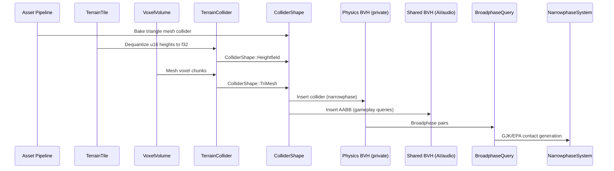

# Physics ↔ World Geometry Integration Design

## Systems Involved

| System | Design | Domain |
|--------|--------|--------|
| Physics | [foundation.md](../physics/foundation.md) | Simulation |
| Geometry | [world-geometry.md](../geometry/world-geometry.md) | Meshes/terrain |

## Overview

World geometry produces collision shapes consumed by the physics broadphase and narrowphase. Data
flows one direction: geometry produces collider data, physics consumes it.

| Aspect | Detail |
|--------|--------|
| Direction | Geometry -> Physics |
| Mechanism | ECS components, asset pipeline |
| Data exchanged | Collider shapes, heightfields, voxel meshes |
| Frequency | On load, on edit, per physics substep |

## Integration Requirements

| ID | Requirement | Systems |
|----|-------------|---------|
| IR-3.8.1 | Triangle mesh colliders from meshlet data | Geo, Phys |
| IR-3.8.2 | Heightfield collider from terrain tiles | Geo, Phys |
| IR-3.8.3 | Collision LOD independent of visual LOD | Geo, Phys |
| IR-3.8.4 | Terrain hole masks mirror in collision | Geo, Phys |
| IR-3.8.5 | Voxel volume generates collision mesh | Geo, Phys |
| IR-3.8.6 | Collision layers filter terrain contacts | Geo, Phys |

1. **IR-3.8.1** -- Static mesh geometry is processed offline into `ColliderShape::TriangleMesh`. The
   asset pipeline extracts a simplified collision mesh from the source geometry, independent of the
   meshlet DAG used for rendering. The collision mesh is stored as a separate asset alongside the
   visual mesh.
2. **IR-3.8.2** -- `TerrainTile` height data feeds `ColliderShape::Heightfield` (F-4.2.4). The
   collider dequantizes `TerrainTile.heights` (`Vec<u16>`) to f32 via
   `min_height + (sample / 65535.0) * (max_height - min_height)`. Physics resolution is independent
   of the visual CDLOD clipmap level (F-3.2.6).
3. **IR-3.8.3** -- Visual LOD (meshlet DAG screen-space error) and collision LOD are decoupled.
   Physics always uses the full-resolution collision mesh or heightfield. No LOD switching for
   collision shapes.
4. **IR-3.8.4** -- Per-tile 1-bit hole masks (F-3.2.4) are mirrored in the heightfield collider.
   Holes produce zero collision response, allowing entities to fall through designated openings.
5. **IR-3.8.5** -- `VoxelVolume` generates collision geometry via the same meshing algorithms used
   for rendering (Marching Cubes, Dual Contouring, Surface Nets, Transvoxel). Runtime voxel edits
   trigger incremental collision mesh rebuild for affected chunks.
6. **IR-3.8.6** -- Terrain and static geometry use `CollisionLayers` (u32 bitmask) to filter
   contacts. Character controllers, vehicles, and projectiles can selectively interact with terrain
   layers.

## Data Contracts

| Type | Defined in | Consumed by | Purpose |
|------|-----------|-------------|---------|
| `ColliderShape` | Physics | Geometry | Shape types |
| `TerrainTile` | Geometry | Physics | Height data |
| `VoxelVolume<T>` | Geometry | Physics | Voxel data |
| `CollisionLayers` | Physics | Geometry | Layer filter |
| `PhysicsMaterialHandle` | Physics | Geometry | Material ref |
| `TerrainCollider` | Integration | Physics | Terrain col |
| `ChunkCoord` | Geometry | Integration | Voxel coord |

```rust
/// Heightfield collider built from a TerrainTile.
/// Heights are dequantized from TerrainTile.heights
/// (Vec<u16>) to f32 via:
///   min_height + (sample / 65535.0)
///     * (max_height - min_height)
/// Baked assets use rkyv for zero-copy mmap access.
#[derive(Archive, Serialize, Deserialize)]
pub struct HeightfieldCollider {
    pub samples_x: u32,
    pub samples_z: u32,
    /// Dequantized f32 heights from TerrainTile.
    pub heights: Vec<f32>,
    pub scale: Vec3,
    /// Mirrors geometry TerrainHole. Packed u8 mask
    /// with resolution metadata for bit indexing.
    pub hole_mask: Option<Vec<u8>>,
    pub hole_resolution: u32,
    pub material: PhysicsMaterialHandle,
    pub layers: CollisionLayers,
}

/// Collision mesh from voxel volume chunk.
/// Indices use per-triangle [u32; 3] triplets to
/// match TriMeshData from the physics foundation.
/// Baked assets use rkyv for zero-copy mmap access.
///
/// ChunkCoord is defined in world-geometry.md:
///   pub struct ChunkCoord { x: i32, y: i32, z: i32 }
#[derive(Archive, Serialize, Deserialize)]
pub struct VoxelCollisionMesh {
    pub vertices: Vec<Vec3>,
    pub indices: Vec<[u32; 3]>,
    pub chunk_coord: ChunkCoord,
    pub material: PhysicsMaterialHandle,
}

/// Bridges terrain/voxel geometry to the physics
/// broadphase. Owns the collider data and manages
/// insertion into the physics-private BVH. Also
/// registers a lightweight AABB in the shared BVH
/// for AI/audio/gameplay spatial queries.
pub struct TerrainCollider {
    pub heightfield: Option<HeightfieldCollider>,
    pub voxel_meshes: Vec<VoxelCollisionMesh>,
    pub physics_bvh_handle: BvhHandle,
    pub shared_bvh_handle: BvhHandle,
    pub layers: CollisionLayers,
}
```

## Data Flow



## Timing and Ordering

| System | Phase | Timestep | Order |
|--------|-------|----------|-------|
| Terrain tile load | Async I/O | Async | On demand |
| Heightfield collider build | 3-Simulation | Variable | On load |
| Voxel mesh rebuild | 3-Simulation | Variable | On edit |
| Collider insert to BVH | 5-Physics | Fixed | Before broad |
| Broadphase query | 5-Physics | Fixed | First in sub |
| Narrowphase contacts | 5-Physics | Fixed | After broad |

## Failure Modes

| Failure | Impact | Recovery |
|---------|--------|----------|
| Mesh too complex | Slow narrowphase | Simplify offline |
| Heightfield not loaded | Fall-through | Blocking load fence |
| Voxel remesh slow | Stale collision | Budget remesh/frame |
| Hole mask mismatch | Invisible wall | Sync on tile load |
| Scale mismatch | Offset collision | Validate on build |

## Platform Considerations

| Platform | Max tri-mesh | Heightfield res | Voxel remesh |
|----------|-------------|-----------------|-------------|
| Desktop | 100K tris | 257x257 per tile | 16^3 chunks |
| Console | 100K tris | 257x257 per tile | 16^3 chunks |
| Switch | 50K tris | 129x129 per tile | 8^3 chunks |
| Mobile | 25K tris | 129x129 per tile | 8^3 chunks |

## Test Plan

See companion [physics-geometry-test-cases.md](physics-geometry-test-cases.md).

## Review Feedback

1. [CONFIDENT] `HeightfieldTile` in the Data Contracts table is listed as "Defined in Geometry," but
   the geometry design defines `TerrainTile` as the actual struct -- `HeightfieldTile` is a
   module-diagram label, not a type.
2. [CONFIDENT] `HeightfieldCollider.heights` is `Vec<f32>`, but the geometry design's
   `TerrainTile.heights` is `Vec<u16>` (quantized); the conversion path and precision loss are not
   documented.
3. [CONFIDENT] `HeightfieldCollider.material` stores `PhysicsMaterial` directly, but the physics
   foundation uses `PhysicsMaterialHandle` (asset indirection via `AssetId`); this is inconsistent
   with the canonical physics API.
4. [CONFIDENT] `HeightfieldCollider.hole_mask` uses `Option<BitVec>`, but the geometry design
   defines `TerrainHole { mask: Vec<u8>, resolution: u32 }` -- representation and resolution
   metadata do not match.
5. [CONFIDENT] `VoxelCollisionMesh.indices` is `Vec<u32>` (flat), but the physics foundation's
   `TriMeshData.indices` is `Vec<[u32; 3]>` (per-triangle triplets); one of these must change so the
   voxel mesh can be used as `ColliderShape::TriMesh`.
6. [CONFIDENT] No `#[derive(Archive)]` or rkyv annotations on `HeightfieldCollider` or
   `VoxelCollisionMesh`, yet the design says collision meshes are "stored as a separate asset
   alongside the visual mesh" -- asset serialization must use rkyv per the zero-copy mmap
   constraint.
7. [CONFIDENT] `Vec<f32>`, `Vec<Vec3>`, and `Vec<u32>` are heap-allocated owned buffers; for baked
   collision assets loaded via mmap, these should be rkyv archived slices (`ArchivedVec`) to
   preserve zero-copy access.
8. [CONFIDENT] Missing required Mermaid `classDiagram` covering all types (`HeightfieldCollider`,
   `VoxelCollisionMesh`, `ColliderShape`, `CollisionLayers`, `PhysicsMaterial`, `TerrainCollider`)
   -- the design CLAUDE.md mandates one.
9. [CONFIDENT] No 2D or 2.5D coverage; the constraints require every subsystem to work in 2D, 2.5D,
   and 3D modes, but this design only addresses 3D terrain, heightfields, and voxels.
10. [UNCERTAIN] The Timing table lists "Terrain tile load" as "Async I/O / Async" -- this is
    technically correct (platform- native non-blocking I/O), but the wording risks confusion with
    async/await which is forbidden; clarify as "platform I/O polled on main thread."
11. [CONFIDENT] The sequence diagram labels the BVH as "physics BVH" without distinguishing between
    the physics-private BVH (for broadphase collision) and the shared BVH (for AI/audio/ gameplay
    queries) -- the constraints specify these are separate.
12. [CONFIDENT] Missing sections that the integration design PROMPT template requires: Direction,
    Mechanism (ECS query / event channel / etc.), Thread ownership per data type, Frame-boundary
    handoff points, and Performance budget.
13. [CONFIDENT] `TerrainCollider` appears in the Data Contracts table and the sequence diagram but
    has no Rust pseudocode definition; its relationship to `HeightfieldCollider` and
    `VoxelCollisionMesh` is undefined.
14. [CONFIDENT] The companion test cases file covers all six IRs (IR-3.8.1 through IR-3.8.6) with 14
    functional tests and 4 benchmarks -- IR coverage is complete.
15. [UNCERTAIN] `VoxelCollisionMesh.chunk_coord` uses `ChunkCoord` which is not defined or imported
    in this design; it likely comes from the geometry design but should be listed in the Data
    Contracts table as a dependency.
