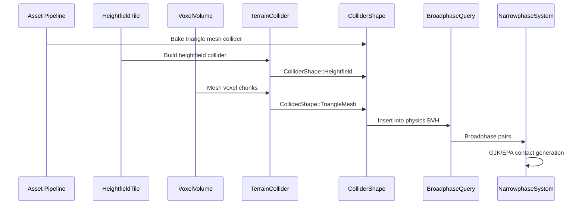

# Physics ↔ World Geometry Integration Design

## Systems Involved

| System | Design | Domain |
|--------|--------|--------|
| Physics | [foundation.md](../physics/foundation.md) | Simulation |
| Geometry | [world-geometry.md](../geometry/world-geometry.md) | Meshes/terrain |

## Integration Requirements

| ID | Requirement | Systems |
|----|-------------|---------|
| IR-3.8.1 | Triangle mesh colliders from meshlet data | Geo, Phys |
| IR-3.8.2 | Heightfield collider from terrain tiles | Geo, Phys |
| IR-3.8.3 | Collision LOD independent of visual LOD | Geo, Phys |
| IR-3.8.4 | Terrain hole masks mirror in collision | Geo, Phys |
| IR-3.8.5 | Voxel volume generates collision mesh | Geo, Phys |
| IR-3.8.6 | Collision layers filter terrain contacts | Geo, Phys |

1. **IR-3.8.1** -- Static mesh geometry is processed offline into `ColliderShape::TriangleMesh`. The
   asset pipeline extracts a simplified collision mesh from the source geometry, independent of the
   meshlet DAG used for rendering. The collision mesh is stored as a separate asset alongside the
   visual mesh.
2. **IR-3.8.2** -- `HeightfieldTile` height data feeds `ColliderShape::Heightfield` (F-4.2.4). The
   collider samples the heightfield at physics resolution, which is independent of the visual CDLOD
   clipmap level (F-3.2.6). Height values are f32 per sample.
3. **IR-3.8.3** -- Visual LOD (meshlet DAG screen-space error) and collision LOD are decoupled.
   Physics always uses the full-resolution collision mesh or heightfield. No LOD switching for
   collision shapes.
4. **IR-3.8.4** -- Per-tile 1-bit hole masks (F-3.2.4) are mirrored in the heightfield collider.
   Holes produce zero collision response, allowing entities to fall through designated openings.
5. **IR-3.8.5** -- `VoxelVolume` generates collision geometry via the same meshing algorithms used
   for rendering (Marching Cubes, Dual Contouring, Surface Nets, Transvoxel). Runtime voxel edits
   trigger incremental collision mesh rebuild for affected chunks.
6. **IR-3.8.6** -- Terrain and static geometry use `CollisionLayers` (u32 bitmask) to filter
   contacts. Character controllers, vehicles, and projectiles can selectively interact with terrain
   layers.

## Data Contracts

| Type | Defined in | Consumed by | Purpose |
|------|-----------|-------------|---------|
| `ColliderShape` | Physics | Geometry | Shape types |
| `HeightfieldTile` | Geometry | Physics | Height data |
| `VoxelVolume<T>` | Geometry | Physics | Voxel data |
| `CollisionLayers` | Physics | Geometry | Layer filter |
| `PhysicsMaterial` | Physics | Geometry | Surface props |
| `TerrainCollider` | Geometry | Physics | Terrain col |

```rust
/// Heightfield collider built from terrain tile.
/// Physics resolution is independent of visual LOD.
pub struct HeightfieldCollider {
    pub samples_x: u32,
    pub samples_z: u32,
    pub heights: Vec<f32>,
    pub scale: Vec3,
    pub hole_mask: Option<BitVec>,
    pub material: PhysicsMaterial,
    pub layers: CollisionLayers,
}

/// Collision mesh from voxel volume chunk.
pub struct VoxelCollisionMesh {
    pub vertices: Vec<Vec3>,
    pub indices: Vec<u32>,
    pub chunk_coord: ChunkCoord,
    pub material: PhysicsMaterial,
}
```

## Data Flow



## Timing and Ordering

| System | Phase | Timestep | Order |
|--------|-------|----------|-------|
| Terrain tile load | Async I/O | Async | On demand |
| Heightfield collider build | 3-Simulation | Variable | On load |
| Voxel mesh rebuild | 3-Simulation | Variable | On edit |
| Collider insert to BVH | 5-Physics | Fixed | Before broad |
| Broadphase query | 5-Physics | Fixed | First in sub |
| Narrowphase contacts | 5-Physics | Fixed | After broad |

## Failure Modes

| Failure | Impact | Recovery |
|---------|--------|----------|
| Mesh too complex | Slow narrowphase | Simplify offline |
| Heightfield not loaded | Fall-through | Blocking load fence |
| Voxel remesh slow | Stale collision | Budget remesh/frame |
| Hole mask mismatch | Invisible wall | Sync on tile load |
| Scale mismatch | Offset collision | Validate on build |

## Platform Considerations

| Platform | Max tri-mesh | Heightfield res | Voxel remesh |
|----------|-------------|-----------------|-------------|
| Desktop | 100K tris | 257x257 per tile | 16^3 chunks |
| Console | 100K tris | 257x257 per tile | 16^3 chunks |
| Switch | 50K tris | 129x129 per tile | 8^3 chunks |
| Mobile | 25K tris | 129x129 per tile | 8^3 chunks |

## Test Plan

See companion [physics-geometry-test-cases.md](physics-geometry-test-cases.md).
