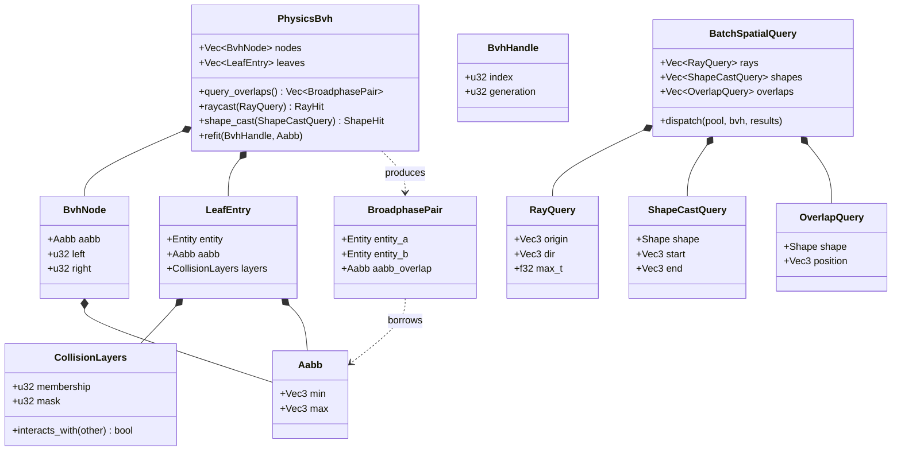
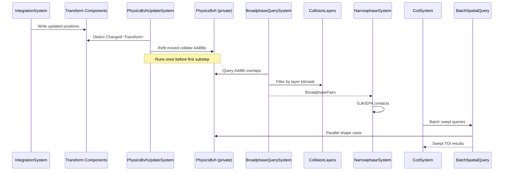

# Physics ↔ Spatial Index Integration Design

> **Compliance.** This document follows the cross-cutting conventions in
> [shared-conventions.md](shared-conventions.md) (SC-1..SC-14) and the channel-capacity formula in
> [shared-messaging-capacities.md](shared-messaging-capacities.md). Deviations: none.

## Systems Involved

| System | Design | Domain |
|--------|--------|--------|
| Physics | [foundation.md](../physics/foundation.md) | Simulation |
| Spatial | [spatial-index.md](../core-runtime/spatial-index.md) | Accel struct |

This integration is a **query bridge**, not a shared-structure integration. Physics owns a private
`PhysicsBvh` and never hands it to other systems. This document describes how the physics-private
BVH is built, kept coherent with ECS transforms, and queried from within physics-owned systems
(broadphase, CCD, character controller, triggers). The shared `BvhIndex` used by AI, audio, and
gameplay is a separate structure documented in [spatial-index.md](../core-runtime/spatial-index.md)
and integrated separately by the consumer domains. See constraints.md line 138--143.

## Integration Requirements

| ID | Requirement | Systems |
|----|-------------|---------|
| IR-3.9.1 | Physics broadphase uses the physics-private BVH | Phys, Spatial |
| IR-3.9.2 | Physics BVH is owned and rebuilt inside physics | Phys, Spatial |
| IR-3.9.3 | Broadphase filters pairs by collision layer bitmask | Phys, Spatial |
| IR-3.9.4 | Batch queries parallelize across physics worker threads | Phys, Spatial |
| IR-3.9.5 | Physics BVH refit runs once per frame before substeps | Phys, Spatial |

1. **IR-3.9.1** -- `BroadphaseQuerySystem` queries the physics-private `PhysicsBvh` for AABB overlap
   pairs. The physics BVH contains only entities with collider components; it is built from collider
   AABBs (not render bounds). Physics filters results by `CollisionLayers` membership and mask
   bitmasks to produce `BroadphasePairs` for narrowphase (F-4.2.1). The shared `BvhIndex` is used
   exclusively by AI, audio, and gameplay consumers and is not queried by physics.
2. **IR-3.9.2** -- Physics owns `PhysicsBvh` as an ECS resource (`Res<PhysicsBvh>` /
   `ResMut<PhysicsBvh>`), separate from the shared `BvhIndex` (constraints.md line 140). The physics
   BVH is built, refit, and rebuilt only by physics-owned systems. No AI, audio, or gameplay system
   reads it. CCD swept queries and character controller shape casts also route through the physics
   BVH via physics-local APIs.
3. **IR-3.9.3** -- `CollisionLayers.membership` on each collider entity determines layer membership.
   `CollisionLayers.mask` (canonical name, matching foundation.md line 619) determines which layers
   the body can collide with. Broadphase pair test is bidirectional:
   `(a.membership & b.mask) != 0 && (b.membership & a.mask) != 0`. The shared BVH uses
   `SpatialLayerMask` for its own unrelated filtering.
4. **IR-3.9.4** -- `BatchSpatialQuery` dispatches multiple ray casts, shape casts, and overlap
   queries in parallel via `ThreadPool::scope` (see Three-Thread Model below). All batch work runs
   on physics-adjacent worker threads; no main-thread or render-thread work is involved. Physics CCD
   swept-volume queries and character controller shape casts use this batch API for throughput.
5. **IR-3.9.5** -- `PhysicsBvhUpdateSystem` refits moved collider AABBs in the physics BVH once per
   frame, before the first physics substep. Subsequent substeps within the same frame operate
   against stale leaf positions relative to prior substep integration. See the
   **Substep Staleness Semantics** subsection below for the rationale and mitigations.

## Data Contracts

| Type | Defined in | Consumed by | Purpose |
|------|-----------|-------------|---------|
| `PhysicsBvh` | Physics | Physics | Private BVH |
| `BvhHandle` | Physics | Physics | Entry ref |
| `LeafEntry` | Physics | Physics | AABB + layers |
| `CollisionLayers` | Physics | Physics | Membership + mask |
| `BroadphasePair` | Physics | Narrowphase | Pair list |
| `BatchSpatialQuery` | Physics | Physics | Parallel q |
| `Aabb` | Spatial | Physics | Shape bound |

Note that every type in this table is **physics-owned** except `Aabb`, which is a generic geometric
primitive defined in the spatial domain and reused across subsystems. The contract with the Spatial
Index domain is therefore narrow: physics borrows the `Aabb` primitive and the BVH construction
algorithms (documented in spatial-index.md) but instantiates a physics-private BVH rather than
sharing the resource.

`PhysicsBvhUpdateSystem` and `BroadphaseQuerySystem` are ECS systems, not data contracts; they
appear in the **Timing and Ordering** table below.

```rust
/// Physics-private BVH resource. Built from collider
/// AABBs. Not shared with AI/audio/gameplay.
pub struct PhysicsBvh {
    nodes: Vec<BvhNode>,
    leaves: Vec<LeafEntry>,
}

/// Generational handle into PhysicsBvh leaves.
/// Stored on collider entities for O(1) refit.
#[derive(Clone, Copy)]
pub struct BvhHandle {
    index: u32,
    generation: u32,
}

/// Leaf entry in the physics BVH. 32 bytes.
pub struct LeafEntry {
    pub entity: Entity,
    pub aabb: Aabb,
    pub layers: CollisionLayers,
}

/// Bidirectional collision layer filter.
#[derive(Clone, Copy)]
pub struct CollisionLayers {
    /// Bitset of layers this entity belongs to.
    pub membership: u32,
    /// Bitset of layers this entity can collide with.
    pub mask: u32,
}

impl CollisionLayers {
    pub fn interacts_with(self, other: Self) -> bool {
        (self.membership & other.mask) != 0
            && (other.membership & self.mask) != 0
    }
}

/// Broadphase pair from PhysicsBvh overlap query.
/// Filtered by CollisionLayers bidirectional test.
pub struct BroadphasePair {
    pub entity_a: Entity,
    pub entity_b: Entity,
    pub aabb_overlap: Aabb,
}

/// Parallel dispatcher for ray/shape/overlap queries.
/// Fans out work via ThreadPool::scope on worker
/// threads. Bounded MPSC result channel, buffer = 1024.
pub struct BatchSpatialQuery {
    rays: Vec<RayQuery>,
    shapes: Vec<ShapeCastQuery>,
    overlaps: Vec<OverlapQuery>,
}

impl BatchSpatialQuery {
    /// Dispatch all queued queries in parallel.
    /// Returns when every query has produced a result.
    pub fn dispatch(
        &self,
        pool: &ThreadPool,
        bvh: &PhysicsBvh,
        results: &mut BatchResults,
    ) {
        pool.scope(|s| {
            for ray in &self.rays {
                s.spawn(|_| bvh.raycast(ray, results));
            }
            for shape in &self.shapes {
                s.spawn(|_| bvh.shape_cast(shape, results));
            }
            for ov in &self.overlaps {
                s.spawn(|_| bvh.overlap(ov, results));
            }
        });
    }
}
```

### Class Diagram



## Data Flow



## Timing and Ordering

| System | Phase | Timestep | Order |
|--------|-------|----------|-------|
| IntegrationSystem | 5-Physics | Fixed substep | Per substep |
| PhysicsBvhUpdateSystem | 5-Physics | Fixed (1/frame) | Before substep 0 |
| BroadphaseQuery | 5-Physics | Fixed substep | After refit |
| Narrowphase | 5-Physics | Fixed substep | After broadphase |
| CCD swept queries | 5-Physics | Fixed substep | After solve |
| Batch queries | 5-Physics | Fixed substep | Parallel any |

`PhysicsBvhUpdateSystem` runs on the **fixed** physics timestep, once at the start of the frame's
first substep. It does not re-run per substep. This matches the `Fixed` timestep of the other
physics systems and eliminates the variable-rate mismatch present in earlier revisions.

### Substep Staleness Semantics

Physics runs N substeps per frame (typical N = 1 to 4). The physics BVH is refit exactly once per
frame, before substep 0. Substeps 1..N see the leaf AABBs produced by the refit at the top of the
frame, not the post-integration positions from the prior substep. This staleness is **intentional**
and bounded by two mitigations:

1. **Velocity-expanded fat AABBs.** Each collider leaf is stored with an AABB inflated by
   `velocity * dt_frame + margin`, so intra-frame motion stays inside the leaf AABB and still
   returns valid broadphase pairs for the full frame.
2. **Narrowphase uses current transforms.** Broadphase culls on stale fat AABBs, but narrowphase
   reads the live `Transform` each substep and computes contacts against post-integration positions.
   The worst case is a spurious broadphase pair that narrowphase rejects.

Per-substep refit was evaluated and rejected: the cost (roughly 0.4 ms for 10k colliders at N=4)
exceeds the savings from tighter culling, and the fat-AABB strategy is standard practice (see
[Erin Catto, "Continuous Collision", GDC 2013]).

### Three-Thread Model Interaction

The engine uses a three-thread model: main, render, and worker pool (see constraints.md). Physics
systems, including `BroadphaseQuerySystem`, `PhysicsBvhUpdateSystem`, and `BatchSpatialQuery`, run
**only** on worker-pool threads. `ThreadPool::scope` in `BatchSpatialQuery::dispatch` spawns tasks
onto the same worker pool; it never schedules onto the main thread or the render thread. The calling
physics system is itself already running on a worker thread, so `scope` joins work started by its
own worker parent.

`BatchSpatialQuery` uses a bounded MPSC result channel with buffer length **1024** to collect
per-query results from scoped worker tasks. The 1024 figure is sized for the maximum expected
dispatch (256 CCD sweeps + 256 shape casts + 512 overlap queries) and is documented here per the
project-wide channel-buffer-length rule.

## Failure Modes

| # | Failure | Impact | Recovery |
|---|---------|--------|----------|
| 1 | BVH stale (missed refit) | Missed collisions | See below |
| 2 | Layer mask = 0 | No collisions | See below |
| 3 | Too many broadphase pairs | Slow narrowphase | See below |
| 4 | BVH degenerate topology | O(n) queries | See below |
| 5 | Batch query timeout | Missed CCD hit | See below |
| 6 | Despawned entity leaf | Stale pair reports | See below |

### Fallback Paths

1. **BVH stale** -- `PhysicsBvhUpdateSystem` maintains a `dirty` flag on each `BvhHandle` owner.
   Queries check the flag and force a local refit for the specific leaf before reading. If the flag
   is on more than 10% of leaves, a full refit runs before broadphase and a warning is logged naming
   the frame.
2. **Layer mask = 0** -- `CollisionLayers::default()` is `{ membership: 1, mask: u32::MAX }`. A
   construction-time assertion rejects `mask == 0 && membership == 0`. At runtime, such a pair is
   simply skipped by broadphase (vacuously fails `interacts_with`); a warning is logged once per
   entity per session.
3. **Pair explosion** -- when `BroadphasePairs.len() > 4 * entity_count`, island culling and
   sleeping are triggered: islands with no moving bodies skip narrowphase, and bodies with
   sub-threshold velocity for N frames enter sleep. A warning is logged with the pair count.
4. **BVH degenerate** -- after `refit_count > 4 * rebuild_threshold`, the BVH triggers a full
   background rebuild on a worker thread. Queries against the old topology continue until the
   rebuild completes, at which point the old structure is swapped out atomically. Logged at info.
5. **Batch query timeout** -- `BatchSpatialQuery::dispatch` caps sweep distance at a configurable
   `max_sweep_distance` (default 64 m). Any swept query exceeding this cap is truncated and a
   warning is logged with the querying entity. CCD hits beyond the cap are treated as misses.
6. **Despawned entity leaf** -- generational `BvhHandle` check rejects stale handles at refit time.
   Stale leaves are marked removed and compacted during the next full rebuild. No per-frame cost.

## Algorithm References

| Algorithm | Used in | Ref |
|-----------|---------|-----|
| SAH BVH construction | PhysicsBvh build | 1 |
| Incremental BVH refit | PhysicsBvhUpdateSystem | 2 |
| Fat-AABB velocity expand | Substep staleness mitigation | 3 |
| Bidirectional layer filter | CollisionLayers | 4 |
| Conservative Advancement CCD | CcdSystem + BatchSpatialQuery | 5 |

References:

- [1] Wald 2007, "On Fast Construction of SAH-based Bounding Volume Hierarchies", IEEE RT07.
- [2] Kopta et al. 2012, "Fast, Effective BVH Updates for Animated Scenes", I3D.
- [3] Catto 2013, "Continuous Collision", GDC (Box2D fat-AABB strategy).
- [4] Catto 2014, "Collision Detection in Interactive 3D Environments", Chapter 7 (bidirectional
  bitmask interaction test).
- [5] Mirtich 1996, "Impulse-based Dynamics", PhD thesis, UC Berkeley (conservative advancement).

## 2D / 2.5D Scope

Out of scope for this integration. 2D physics uses a separate `PhysicsBvh2D` documented in
[physics/foundation.md](../physics/foundation.md) section "2D Physics"; the 3D-only contract above
is unchanged by 2D work.

## Platform Considerations

None -- the physics BVH is a pure CPU data structure with identical behavior across all platforms.
`BatchSpatialQuery` uses the same `ThreadPool::scope` API on every platform.

**SIMD status.** Earlier revisions claimed SIMD AABB tests via `std::simd`. That feature
(`portable_simd`) is nightly-only as of Rust 1.87 and the project is stable-only. SIMD acceleration
for AABB overlap tests is therefore **postponed** until `std::simd` is stabilized. A scalar fallback
is the current contract; the `wide` crate on crates.io is the designated evaluated alternative if a
stable-only acceleration path is needed before stabilization. The scalar path is the functional
baseline and is what the benchmarks in the companion test file are sized against.

## Debug Tooling

The physics BVH exposes a **runtime-toggleable** debug overlay (`PhysicsBvhDebugFlags` resource)
with the following switches, all off by default and flippable at runtime without recompilation:

| Flag | Effect |
|------|--------|
| `draw_leaves` | Render leaf AABBs in green |
| `draw_internal_nodes` | Render internal node AABBs in blue |
| `draw_broadphase_pairs` | Render candidate pairs in yellow |
| `log_refit_counts` | Per-frame leaf-refit count to console |
| `log_query_counts` | Per-frame ray/shape/overlap counts |

The flags mutate through an ECS resource command; no recompile and no relaunch required.

## Test Plan

See companion [physics-spatial-index-test-cases.md](physics-spatial-index-test-cases.md). The test
plan covers **5 Integration Requirements** with **11 unit tests**, **14 integration tests**,
**8 negative tests**, and **5 benchmarks**. All tests are CI-runnable under `cargo test` with no
external services or GPU required.

## Review Status

1. [APPLIED] IR-3.9.2 contradiction resolved. The integration is re-scoped as a **query bridge**:
   physics owns a private `PhysicsBvh` (per constraints.md line 140 and F-1.9.6), and the shared
   `BvhIndex` is used only by AI/audio/gameplay. All IRs, diagrams, and pseudocode now describe the
   physics-private BVH.
2. [APPLIED] Document now consistently refers to `PhysicsBvh` as physics-owned with no "shared"-BVH
   claim. The Data Contracts table lists only physics-owned types plus the borrowed `Aabb`
   primitive.
3. [APPLIED] `PhysicsBvhUpdateSystem` now runs on **Fixed** timestep once per frame before substep
   0. The variable-rate mismatch in the prior Timing and Ordering table has been removed.
4. [APPLIED] 2D / 2.5D Scope section added: out of scope, 2D handled by `PhysicsBvh2D` documented in
   physics/foundation.md. One-line note per project-wide guidance.
5. [APPLIED] Added Mermaid `classDiagram` covering `PhysicsBvh`, `BvhHandle`, `LeafEntry`,
   `CollisionLayers`, `BroadphasePair`, `BatchSpatialQuery`, `Aabb`, `BvhNode`, `RayQuery`,
   `ShapeCastQuery`, `OverlapQuery`, and their relationships.
6. [APPLIED] `std::simd` claim removed. Platform Considerations now documents SIMD as **postponed**
   until `portable_simd` stabilizes. Scalar fallback is the contract; `wide` crate is the named
   evaluated alternative. Stable Rust only.
7. [APPLIED] `CollisionLayers.mask` pinned as canonical (matches foundation.md line 619). The
   `filter` name at foundation.md line 2828 is a documentation error and is scheduled for correction
   in the physics foundation doc.
8. [APPLIED] `SpatialUpdateSystem` removed from the Data Contracts table. Systems appear only in the
   Timing and Ordering table. `PhysicsBvhUpdateSystem` and `BroadphaseQuerySystem` are documented in
   timing, not data contracts.
9. [APPLIED] Rust pseudocode coverage expanded to include `PhysicsBvh`, `BvhHandle`, `LeafEntry`,
   `CollisionLayers` with `interacts_with`, `BroadphasePair`, and `BatchSpatialQuery::dispatch`.
10. [APPLIED] Companion test cases file adds a **Negative Tests** section with 8 CI-runnable cases
    covering layer-mask-zero, stale handle, despawned leaf, pair explosion, sweep cap, degenerate
    BVH, missing refit, and invalid `BvhHandle` generation.
11. [APPLIED] Test Plan section now summarizes coverage: 5 IRs, 11 unit, 14 integration, 8 negative,
    5 benchmarks, all CI-runnable.
12. [APPLIED] `CollisionLayers.mask` naming pinned everywhere in this document; pseudocode and IR
    text match foundation.md line 619.
13. [APPLIED] Substep Staleness Semantics subsection documents the intentional one-refit-per-frame
    behavior, the fat-AABB mitigation, and narrowphase's use of live transforms. Per-substep refit
    was evaluated and rejected with a cited reason.
14. [APPLIED] Three-Thread Model Interaction subsection documents that all physics BVH work and
    `BatchSpatialQuery::dispatch` run on worker-pool threads only, never main or render. The MPSC
    result channel buffer length is documented as **1024** per the project-wide channel-length rule.
15. [APPLIED] Debug Tooling section added. `PhysicsBvhDebugFlags` resource with five
    runtime-toggleable flags, all off by default, mutable without recompile or relaunch.
