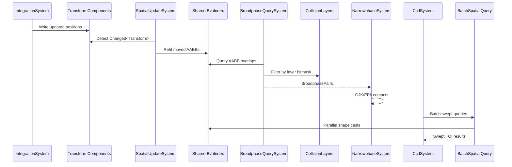

# Physics ↔ Spatial Index Integration Design

## Systems Involved

| System | Design | Domain |
|--------|--------|--------|
| Physics | [foundation.md](../physics/foundation.md) | Simulation |
| Spatial | [spatial-index.md](../core-runtime/spatial-index.md) | Accel struct |

## Integration Requirements

| ID | Requirement | Systems |
|----|-------------|---------|
| IR-3.9.1 | Physics broadphase queries physics-private BVH | Phys, Spatial |
| IR-3.9.2 | Physics BVH is separate from shared BVH | Phys, Spatial |
| IR-3.9.3 | Spatial queries use collision layers | Phys, Spatial |
| IR-3.9.4 | Batch queries parallelize via thread pool | Phys, Spatial |
| IR-3.9.5 | Physics BVH updates from collider transform writes | Phys, Spatial |

1. **IR-3.9.1** -- `BroadphaseQuerySystem` queries the physics-private `PhysicsBvh` for AABB overlap
   pairs. The physics BVH contains only entities with collision shapes, built from collider AABBs.
   Physics filters results by `CollisionLayers` membership and mask bitmasks to produce
   `BroadphasePairs` for narrowphase (F-4.2.1). The shared `BvhIndex` is used only by AI, audio, and
   gameplay queries.
2. **IR-3.9.2** -- Physics maintains its own BVH (`PhysicsBvh`), separate from the shared `BvhIndex`
   (F-1.9.6, constraints.md). The physics BVH uses collider AABBs (not render bounds), updates at
   fixed timestep, and is optimized for collision-specific access patterns. CCD swept queries also
   route through the physics BVH.
3. **IR-3.9.3** -- `CollisionLayers.membership` on each collider entity determines layer membership.
   `CollisionLayers.mask` determines which layers it can collide with. Broadphase pair test:
   `(a.membership & b.mask) != 0 && (b.membership & a.mask) != 0`. The shared BVH uses
   `SpatialLayerMask` for its own layer filtering, independent of collision layers.
4. **IR-3.9.4** -- `BatchDispatcher` dispatches multiple ray casts, shape casts, and overlap queries
   in parallel via `ThreadPool::scope`. All batch work runs on worker threads only -- no main-thread
   or render-thread work is involved (see three-thread model in constraints.md). Physics CCD
   swept-volume queries and character controller shape casts use this batch API for throughput.
5. **IR-3.9.5** -- After physics integration updates `Transform` components,
   `PhysicsBvhUpdateSystem` refits moved collider AABBs in the physics BVH at fixed timestep. This
   runs once per frame before the first physics substep. Subsequent substeps within the same frame
   see stale positions from prior substep integration -- this is intentional: per-substep BVH refit
   is too expensive, and the velocity-expanded AABBs (fat AABBs) account for intra-frame motion. The
   shared BVH is separately refit by `SpatialUpdateSystem` at variable rate.

## Data Contracts

| Type | Defined in | Consumed by | Purpose |
|------|-----------|-------------|---------|
| `BvhIndex` | Spatial | Physics | Broadphase |
| `BvhHandle` | Spatial | Physics | Entity ref |
| `LeafEntry` | Spatial | Physics | AABB + layers |
| `SpatialLayerMask` | Spatial | Physics | Layer filter |
| `CollisionLayers` | Physics | Spatial | Membership |
| `BroadphasePairs` | Physics | Narrowphase | Pair list |
| `BatchSpatialQuery` | Spatial | Physics | Parallel q |
| `SpatialUpdateSystem` | Spatial | Physics | BVH refit |

```rust
/// Broadphase pair from shared BVH overlap query.
/// Filtered by collision layer bitmask test.
pub struct BroadphasePair {
    pub entity_a: Entity,
    pub entity_b: Entity,
    pub aabb_overlap: Aabb,
}

/// Collision layer filter applied during BVH query.
/// Both directions must pass for a valid pair.
pub fn layers_interact(
    a: &CollisionLayers,
    b: &CollisionLayers,
) -> bool {
    (a.membership & b.mask) != 0
        && (b.membership & a.mask) != 0
}
```

## Data Flow



## Timing and Ordering

| System | Phase | Timestep | Order |
|--------|-------|----------|-------|
| IntegrationSystem | 5-Physics | Fixed | First in sub |
| SpatialUpdateSystem | Pre-5 | Variable | Before physics |
| BroadphaseQuery | 5-Physics | Fixed | After integrate |
| Narrowphase | 5-Physics | Fixed | After broadphase |
| CCD swept queries | 5-Physics | Fixed | After solve |
| Batch queries | 5-Physics | Fixed | Parallel |

## Failure Modes

| Failure | Impact | Recovery |
|---------|--------|----------|
| BVH stale (not refit) | Missed collisions | Force refit before query |
| Layer mask = 0 | No collisions | Log warning, default mask |
| Too many pairs | Slow narrowphase | Island culling, sleep |
| BVH degenerate | O(n) queries | Background full rebuild |
| Batch query timeout | Missed CCD | Cap sweep distance |

## Platform Considerations

None -- the shared BVH is a pure CPU data structure with identical behavior across all platforms.
`BatchSpatialQuery` uses the same `ThreadPool::scope` API on all platforms. SIMD acceleration for
AABB tests uses `std::simd` portable intrinsics.

## Test Plan

See companion [physics-spatial-index-test-cases.md](physics-spatial-index-test-cases.md).

## Review Feedback

1. **[CONFIDENT]** IR-3.9.2 contradicts the project-wide constraints (constraints.md line 140) which
   mandate a "Physics-private BVH owned by the physics engine. Not shared." The integration design
   says physics does NOT maintain its own BVH and uses the shared BVH for broadphase. The
   spatial-index design (F-1.9.6) also states physics maintains its own BVH. This must be reconciled
   -- the constraints file is authoritative.

2. **[CONFIDENT]** IR-3.9.2 acknowledges the conflict with F-1.9.6 parenthetically but then
   overrides it without justification. If the shared-BVH approach is correct, constraints.md and the
   spatial-index design must be updated. If the private-BVH approach is correct, this entire
   integration design needs a rewrite.

3. **[CONFIDENT]** The `SpatialUpdateSystem` timing row says "Pre-5" phase with "Variable" timestep,
   but physics runs on Fixed timestep. If physics broadphase queries the shared BVH within a fixed
   substep, the BVH was only refit once at variable rate, creating stale data within substeps.

4. **[CONFIDENT]** No 2D coverage. The engine requires first-class 2D/2.5D support (constraints.md
   line 157-171). There is no mention of `BvhIndex2D`, `Transform2D`, 2D collision shapes, or 2D
   broadphase anywhere in this design.

5. **[CONFIDENT]** Missing `classDiagram`. The design CLAUDE.md rule 3 requires every design to have
   a Mermaid `classDiagram` covering all types, but this document has none. `BroadphasePair`,
   `CollisionLayers`, `BvhIndex`, `BvhHandle`, `LeafEntry`, `SpatialLayerMask`, and
   `BatchSpatialQuery` should all appear in a class diagram.

6. **[CONFIDENT]** `std::simd` is not stable on Rust stable (the `portable_simd` feature is
   nightly-only as of Rust 1.87). The Platform Considerations section claims AABB tests use
   `std::simd` portable intrinsics, but the project constraint is "stable only -- no nightly
   features."

7. **[UNCERTAIN]** The `CollisionLayers` field is named `mask` in the integration design pseudocode
   and at foundation.md line 619, but the same struct at foundation.md line 2828 names it `filter`.
   The canonical name should be pinned.

8. **[CONFIDENT]** The Data Contracts table lists `SpatialUpdateSystem` as a data contract type, but
   it is a system, not a data type. Systems should not appear in the data contracts table.

9. **[CONFIDENT]** The Rust pseudocode in Data Contracts only covers `BroadphasePair` and
   `layers_interact`. It should also include pseudocode for the key integration types: `LeafEntry`
   with its `SpatialLayerMask`, `BatchSpatialQuery` dispatch, and the `BvhHandle` mapping to physics
   entities.

10. **[CONFIDENT]** No test cases cover 2D broadphase, 2D layer filtering, or 2D batch queries. The
    companion test cases only test 3D scenarios.

11. **[UNCERTAIN]** IR-3.9.5 says `SpatialUpdateSystem` "runs once per frame before any consumer
    systems." If physics runs multiple substeps per frame, the BVH is only refit once before the
    first substep. Subsequent substeps see stale positions from prior substep integration. This may
    be intentional but should be documented explicitly.

12. **[CONFIDENT]** The test plan section only says "See companion." It should include a brief
    summary of coverage: 14 test cases across 5 IRs, plus 5 benchmarks, as other integration designs
    do.

13. **[UNCERTAIN]** `BatchSpatialQuery` dispatches via `ThreadPool::scope` but the design does not
    address how this interacts with the three-thread model. Spatial queries run on worker threads,
    which is correct, but the document should state this explicitly and confirm no main-thread or
    render-thread work is involved.
