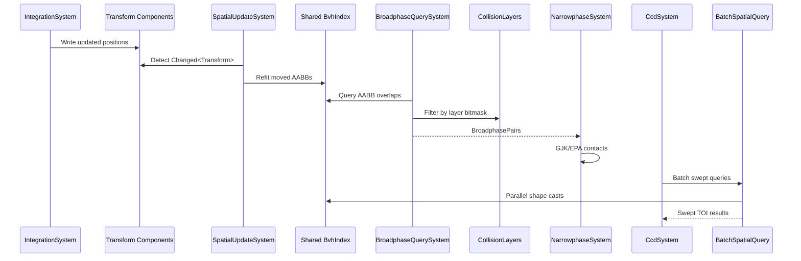

# Physics ↔ Spatial Index Integration Design

## Systems Involved

| System | Design | Domain |
|--------|--------|--------|
| Physics | [foundation.md](../physics/foundation.md) | Simulation |
| Spatial | [spatial-index.md](../core-runtime/spatial-index.md) | Accel struct |

## Integration Requirements

| ID | Requirement | Systems |
|----|-------------|---------|
| IR-3.9.1 | Physics broadphase queries shared BVH | Phys, Spatial |
| IR-3.9.2 | Physics BVH is separate from shared BVH | Phys, Spatial |
| IR-3.9.3 | Spatial queries use collision layers | Phys, Spatial |
| IR-3.9.4 | Batch queries parallelize via thread pool | Phys, Spatial |
| IR-3.9.5 | BVH updates from physics transform writes | Phys, Spatial |

1. **IR-3.9.1** -- `BroadphaseQuerySystem` queries the shared `BvhIndex` (ECS resource) for AABB
   overlap pairs. The shared BVH contains all spatially-indexed entities. Physics filters results by
   `CollisionLayers` membership and mask bitmasks to produce `BroadphasePairs` for narrowphase
   (F-4.2.1).
2. **IR-3.9.2** -- Physics does NOT maintain its own BVH (F-1.9.6 states physics maintains a
   separate BVH, but the foundation design uses the shared BVH for broadphase). The shared BVH
   serves as the single broadphase acceleration structure. CCD swept queries also route through the
   shared BVH.
3. **IR-3.9.3** -- `SpatialLayerMask` in the BVH leaf entries maps to `CollisionLayers.membership`.
   Query filters use `CollisionLayers.mask` to test overlap:
   `(a.membership & b.mask) != 0 && (b.membership & a.mask) != 0`.
4. **IR-3.9.4** -- `BatchSpatialQuery` dispatches multiple ray casts, shape casts, and overlap
   queries in parallel via `ThreadPool::scope`. Physics CCD swept-volume queries and character
   controller shape casts use this batch API for throughput.
5. **IR-3.9.5** -- After physics integration updates `Transform` components, `SpatialUpdateSystem`
   detects changes via `Changed<Transform>` and refits moved entities in the BVH. This runs once per
   frame before any consumer systems query the BVH.

## Data Contracts

| Type | Defined in | Consumed by | Purpose |
|------|-----------|-------------|---------|
| `BvhIndex` | Spatial | Physics | Broadphase |
| `BvhHandle` | Spatial | Physics | Entity ref |
| `LeafEntry` | Spatial | Physics | AABB + layers |
| `SpatialLayerMask` | Spatial | Physics | Layer filter |
| `CollisionLayers` | Physics | Spatial | Membership |
| `BroadphasePairs` | Physics | Narrowphase | Pair list |
| `BatchSpatialQuery` | Spatial | Physics | Parallel q |
| `SpatialUpdateSystem` | Spatial | Physics | BVH refit |

```rust
/// Broadphase pair from shared BVH overlap query.
/// Filtered by collision layer bitmask test.
pub struct BroadphasePair {
    pub entity_a: Entity,
    pub entity_b: Entity,
    pub aabb_overlap: Aabb,
}

/// Collision layer filter applied during BVH query.
/// Both directions must pass for a valid pair.
pub fn layers_interact(
    a: &CollisionLayers,
    b: &CollisionLayers,
) -> bool {
    (a.membership & b.mask) != 0
        && (b.membership & a.mask) != 0
}
```

## Data Flow



## Timing and Ordering

| System | Phase | Timestep | Order |
|--------|-------|----------|-------|
| IntegrationSystem | 5-Physics | Fixed | First in sub |
| SpatialUpdateSystem | Pre-5 | Variable | Before physics |
| BroadphaseQuery | 5-Physics | Fixed | After integrate |
| Narrowphase | 5-Physics | Fixed | After broadphase |
| CCD swept queries | 5-Physics | Fixed | After solve |
| Batch queries | 5-Physics | Fixed | Parallel |

## Failure Modes

| Failure | Impact | Recovery |
|---------|--------|----------|
| BVH stale (not refit) | Missed collisions | Force refit before query |
| Layer mask = 0 | No collisions | Log warning, default mask |
| Too many pairs | Slow narrowphase | Island culling, sleep |
| BVH degenerate | O(n) queries | Background full rebuild |
| Batch query timeout | Missed CCD | Cap sweep distance |

## Platform Considerations

None -- the shared BVH is a pure CPU data structure with identical behavior across all platforms.
`BatchSpatialQuery` uses the same `ThreadPool::scope` API on all platforms. SIMD acceleration for
AABB tests uses `std::simd` portable intrinsics.

## Test Plan

See companion [physics-spatial-index-test-cases.md](physics-spatial-index-test-cases.md).
