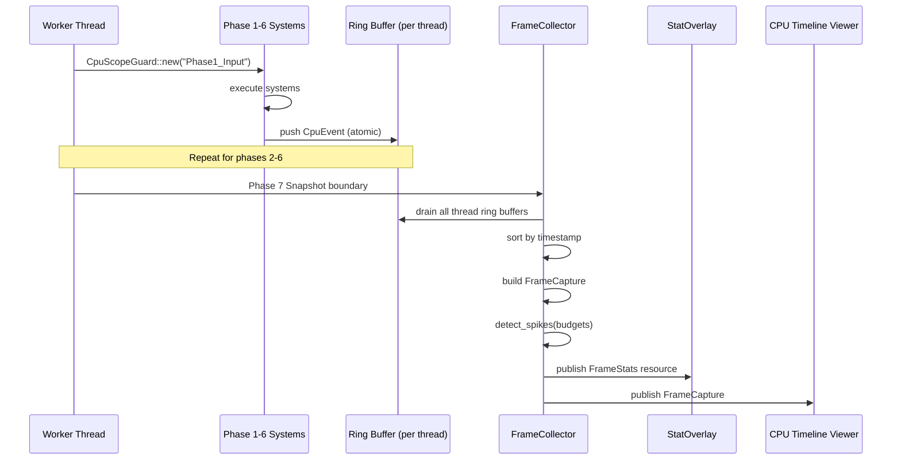

# Profiler ↔ Game Loop Integration Design

## Systems Involved

| System | Design | Domain |
|--------|--------|--------|
| Profiler | [profiler.md](../tools/profiler.md) | Tools |
| Game Loop | [game-loop.md](../core-runtime/game-loop.md) | Core Runtime |

## Integration Requirements

| ID | Requirement | Systems |
|----|-------------|---------|
| IR-5.6.1 | Per-phase CPU timing via CpuScope guards | Profiler, Game Loop |
| IR-5.6.2 | Frame budget tracking with phase breakdown | Profiler, Game Loop |
| IR-5.6.3 | Spike detection when phase exceeds budget | Profiler, Game Loop |
| IR-5.6.4 | FrameCollector drains ring buffers at boundary | Profiler, Game Loop |
| IR-5.6.5 | Per-system timing via EcsSystemTracker | Profiler, Game Loop |
| IR-5.6.6 | Fixed-timestep substep profiling | Profiler, Game Loop |
| IR-5.6.7 | Stat overlay reads FrameStats resource | Profiler, Game Loop |

## Data Contracts

| Type | Defined in | Consumed by | Purpose |
|------|-----------|-------------|---------|
| `CpuEvent` | Profiler | FrameCollector | TSC timestamps |
| `FrameCapture` | Profiler | Timeline/Flame viewers | Full frame data |
| `FrameStats` | Profiler | Stat overlay / game loop | Summary metrics |
| `CpuScopeGuard` | Profiler | Game loop phases | RAII timing guard |
| `CompiledFrame` | Game Loop | Profiler | Phase/task structure |

```rust
/// Each game loop phase is wrapped in a CpuScope.
/// The profiler reads TSC timestamps at begin/end.
pub fn execute_phase(
    phase: Phase,
    world: &mut World,
    scope: &job_system::Scope,
) {
    let _guard = CpuScopeGuard::new(phase.name());
    // ... execute systems in phase
}

/// FrameCollector runs at the Phase 8 (FrameEnd)
/// boundary, draining all per-thread ring buffers.
pub struct FrameCollector {
    pub frame_number: u64,
    pub phase_budgets: [f64; 8],
}

impl FrameCollector {
    /// Drain ring buffers, build FrameCapture,
    /// detect spikes. Runs once per frame.
    pub fn collect(
        &mut self,
        ring_buffers: &[RingBuffer],
    ) -> FrameCapture;

    /// Check each phase duration against budget.
    /// Returns spike entries for over-budget phases.
    pub fn detect_spikes(
        &self,
        capture: &FrameCapture,
    ) -> Vec<SpikeEntry>;
}

pub struct SpikeEntry {
    pub phase: Phase,
    pub duration_ms: f64,
    pub budget_ms: f64,
    pub frame_number: u64,
}
```

## Data Flow



## Timing and Ordering

| System | Game loop phase | Timestep | Ordering |
|--------|----------------|----------|----------|
| CpuScope begin | Each phase start | Variable | First instruction |
| CpuScope end | Each phase end | Variable | Last instruction |
| FrameCollector | Phase 8 FrameEnd | Variable | After snapshot |
| StatOverlay | Phase 8 FrameEnd | Variable | After collector |

The profiler instruments every phase with zero allocation. CpuScopeGuard reads the TSC register (~10
ns) at construction and on drop, then pushes a CpuEvent into the thread-local ring buffer via atomic
write. FrameCollector runs at Phase 8 to aggregate and publish.

## Failure Modes

| Failure | Impact | Recovery |
|---------|--------|----------|
| Ring buffer full | Events dropped | Increase capacity; log warning |
| TSC not monotonic | Negative durations | Clamp to zero, flag event |
| Spike detector false positive | Noisy alerts | Use rolling average filter |
| FrameCollector exceeds 1% budget | Profiler perturbs | Reduce collection frequency |
| Thread count exceeds ring buffer slots | Missing thread data | Dynamic slot allocation |

## Platform Considerations

| Platform | Timer source | Resolution |
|----------|-------------|------------|
| Windows | `QueryPerformanceCounter` | ~100 ns |
| macOS | `mach_absolute_time` | ~40 ns |
| Linux | `clock_gettime(MONOTONIC)` | ~20 ns |

TSC read is abstracted behind a platform timestamp function selected at compile time via `cfg`. All
platforms provide sub-microsecond resolution.

## Test Plan

See companion [profiler-game-loop-test-cases.md](profiler-game-loop-test-cases.md).
