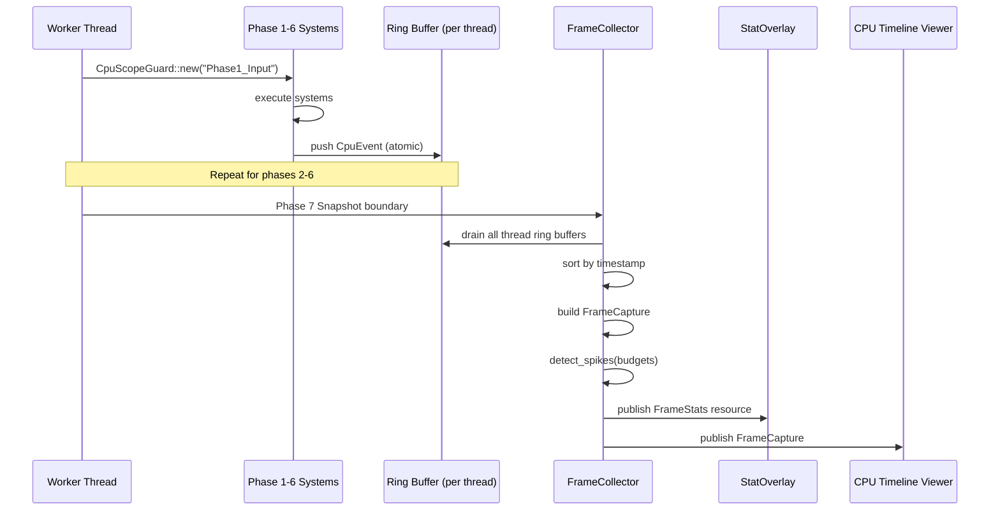

# Profiler ↔ Game Loop Integration Design

## Systems Involved

| System | Design | Domain |
|--------|--------|--------|
| Profiler | [profiler.md](../tools/profiler.md) | Tools |
| Game Loop | [game-loop.md](../core-runtime/game-loop.md) | Core Runtime |

## Integration Requirements

| ID | Requirement | Systems |
|----|-------------|---------|
| IR-5.6.1 | Per-phase CPU timing via CpuScope guards | Profiler, Game Loop |
| IR-5.6.2 | Frame budget tracking with phase breakdown | Profiler, Game Loop |
| IR-5.6.3 | Spike detection when phase exceeds budget | Profiler, Game Loop |
| IR-5.6.4 | FrameCollector drains ring buffers at boundary | Profiler, Game Loop |
| IR-5.6.5 | Per-system timing via EcsSystemTracker | Profiler, Game Loop |
| IR-5.6.6 | Fixed-timestep substep profiling | Profiler, Game Loop |
| IR-5.6.7 | Stat overlay reads FrameStats resource | Profiler, Game Loop |

## Data Contracts

| Type | Defined in | Consumed by | Purpose |
|------|-----------|-------------|---------|
| `CpuEvent` | Profiler | FrameCollector | TSC timestamps |
| `FrameCapture` | Profiler | Timeline/Flame viewers | Full frame data |
| `FrameStats` | Profiler | Stat overlay / game loop | Summary metrics |
| `CpuScopeGuard` | Profiler | Game loop phases | RAII timing guard |
| `CompiledFrame` | Game Loop | Profiler | Phase/task structure |

```rust
/// Each game loop phase is wrapped in a CpuScope.
/// The profiler reads TSC timestamps at begin/end.
pub fn execute_phase(
    phase: Phase,
    world: &mut World,
    scope: &job_system::Scope,
) {
    let _guard = CpuScopeGuard::new(phase.name());
    // ... execute systems in phase
}

/// FrameCollector runs at the Phase 8 (FrameEnd)
/// boundary, draining all per-thread ring buffers.
pub struct FrameCollector {
    pub frame_number: u64,
    pub phase_budgets: [f64; 8],
}

impl FrameCollector {
    /// Drain ring buffers, build FrameCapture,
    /// detect spikes. Runs once per frame.
    pub fn collect(
        &mut self,
        ring_buffers: &[RingBuffer],
    ) -> FrameCapture;

    /// Check each phase duration against budget.
    /// Returns spike entries for over-budget phases.
    pub fn detect_spikes(
        &self,
        capture: &FrameCapture,
    ) -> Vec<SpikeEntry>;
}

pub struct SpikeEntry {
    pub phase: Phase,
    pub duration_ms: f64,
    pub budget_ms: f64,
    pub frame_number: u64,
}
```

## Data Flow



## Timing and Ordering

| System | Game loop phase | Timestep | Ordering |
|--------|----------------|----------|----------|
| CpuScope begin | Each phase start | Variable | First instruction |
| CpuScope end | Each phase end | Variable | Last instruction |
| FrameCollector | Phase 8 FrameEnd | Variable | After snapshot |
| StatOverlay | Phase 8 FrameEnd | Variable | After collector |

The profiler instruments every phase with zero allocation. CpuScopeGuard reads the TSC register (~10
ns) at construction and on drop, then pushes a CpuEvent into the thread-local ring buffer via atomic
write. FrameCollector runs at Phase 8 to aggregate and publish.

## Failure Modes

| Failure | Impact | Recovery |
|---------|--------|----------|
| Ring buffer full | Events dropped | Increase capacity; log warning |
| TSC not monotonic | Negative durations | Clamp to zero, flag event |
| Spike detector false positive | Noisy alerts | Use rolling average filter |
| FrameCollector exceeds 1% budget | Profiler perturbs | Reduce collection frequency |
| Thread count exceeds ring buffer slots | Missing thread data | Dynamic slot allocation |

## Platform Considerations

| Platform | Timer source | Resolution |
|----------|-------------|------------|
| Windows | `QueryPerformanceCounter` | ~100 ns |
| macOS | `mach_absolute_time` | ~40 ns |
| Linux | `clock_gettime(MONOTONIC)` | ~20 ns |

TSC read is abstracted behind a platform timestamp function selected at compile time via `cfg`. All
platforms provide sub-microsecond resolution.

## Test Plan

See companion [profiler-game-loop-test-cases.md](profiler-game-loop-test-cases.md).

## Review Feedback

1. [CONFIDENT] The sequence diagram says FrameCollector runs at "Phase 7 Snapshot boundary", but the
   Timing and Ordering table says "Phase 8 FrameEnd". The parent game-loop design places stats
   collection in Phase 8, and the profiler design says collect_frame runs "after present submit,
   before next frame begin". The diagram must be corrected to Phase 8.

2. [CONFIDENT] `FrameCollector::collect` takes `&[RingBuffer]` as a parameter, but the parent
   profiler design defines `collect_frame(&mut self)` with no parameters -- ring buffers are
   registered separately via `register_thread`. The integration design's API signature contradicts
   the parent.

3. [CONFIDENT] `detect_spikes` returns `Vec<SpikeEntry>`, which allocates on a hot path (runs every
   frame). This violates the "no HashMap on hot paths" constraint and the profiler's own < 1%
   overhead budget. Use an arena-backed slice or a fixed-capacity array instead.

4. [CONFIDENT] `SpikeEntry` and `detect_spikes` are not defined in the parent profiler design. The
   integration design invents new types without tracing them back to the profiler design's API.
   These should either be added to profiler.md first or explicitly noted as integration-only
   additions.

5. [CONFIDENT] `FrameCollector.phase_budgets: [f64; 8]` is not present in the parent profiler
   design's `FrameCollector` struct. The parent design has no concept of per-phase budgets. This
   field needs to be back-propagated or marked as an extension.

6. [CONFIDENT] The Data Contracts table lists `CompiledFrame` as "Defined in: Game Loop, Consumed
   by: Profiler", but the design body never shows how the profiler reads or uses `CompiledFrame`.
   There is no pseudocode or data flow demonstrating this contract.

7. [CONFIDENT] The profiler design uses `FrameArena` for zero-allocation draining of ring buffers
   (`drain_into(&self, arena: &mut FrameArena)`). The integration design omits this entirely -- the
   `collect` method returns `FrameCapture` with no mention of arena allocation, losing the
   zero-alloc guarantee from the parent design.

8. [UNCERTAIN] The Timing table lists CpuScope begin/end as "First instruction" and "Last
   instruction" of each phase. With parallel system execution within a phase, individual system
   scopes may overlap. The design does not clarify whether phase-level scopes wrap all parallel
   systems (fork-join boundary) or whether only per-system scopes exist within the phase.

9. [CONFIDENT] The design references `Res<FrameStats>` in IR-5.6.7 (StatOverlay reads FrameStats
   resource), but the parent profiler design publishes `Res<LatestFrameCapture>` (which contains
   `FrameStats`). The integration design should reference the actual ECS resource name for
   consistency.

10. [CONFIDENT] Missing IR detail list. Other integration designs (e.g., rendering-camera.md)
    include a numbered detail list below the IR table explaining each requirement in 1-2 sentences.
    This document has no such list.

11. [CONFIDENT] The design has no class diagram. Per `docs/design/CLAUDE.md` rule 3, every design
    MUST have a Mermaid classDiagram covering all types. The Data Contracts table lists five types
    but none are shown in a class diagram.

12. [UNCERTAIN] The ring buffer push is described as "atomic" in the data flow, but the parent
    profiler design uses single-producer single-consumer ring buffers (`drain_into` is single
    consumer). If each thread has its own buffer and only pushes to it, the push is not contended
    and "atomic" is misleading -- it may just be a plain write with a release fence.

13. [CONFIDENT] The Failure Modes table lists "Thread count exceeds ring buffer slots" with recovery
    "Dynamic slot allocation". Dynamic allocation contradicts the zero-allocation hot-path
    constraint. The parent design pre-registers threads via `register_thread`, so the slot count is
    fixed at startup.

14. [CONFIDENT] No integration requirements reference specific parent requirement IDs (R-X.Y.Z) or
    feature IDs (F-X.Y.Z). Per CLAUDE.md, all references MUST use specific IDs. The IR table should
    trace back to the parent profiler and game-loop requirements.

15. [CONFIDENT] Test case TC-IR-5.6.4.1 says "50 events across 4 threads" but the profiler
    three-thread model has workers (N), main, and render. The test should clarify whether "4
    threads" means 4 worker threads or includes the main/render threads, since the parent profiler
    design only instruments worker threads.

16. [CONFIDENT] The document is missing several sections required by the integration design template
    (per PROMPT.md Phase 3): Direction, Mechanism, Thread ownership, Error handling (distinct from
    Failure Modes), and Performance budget. These are present in peer integration designs like
    rendering-camera.md.
