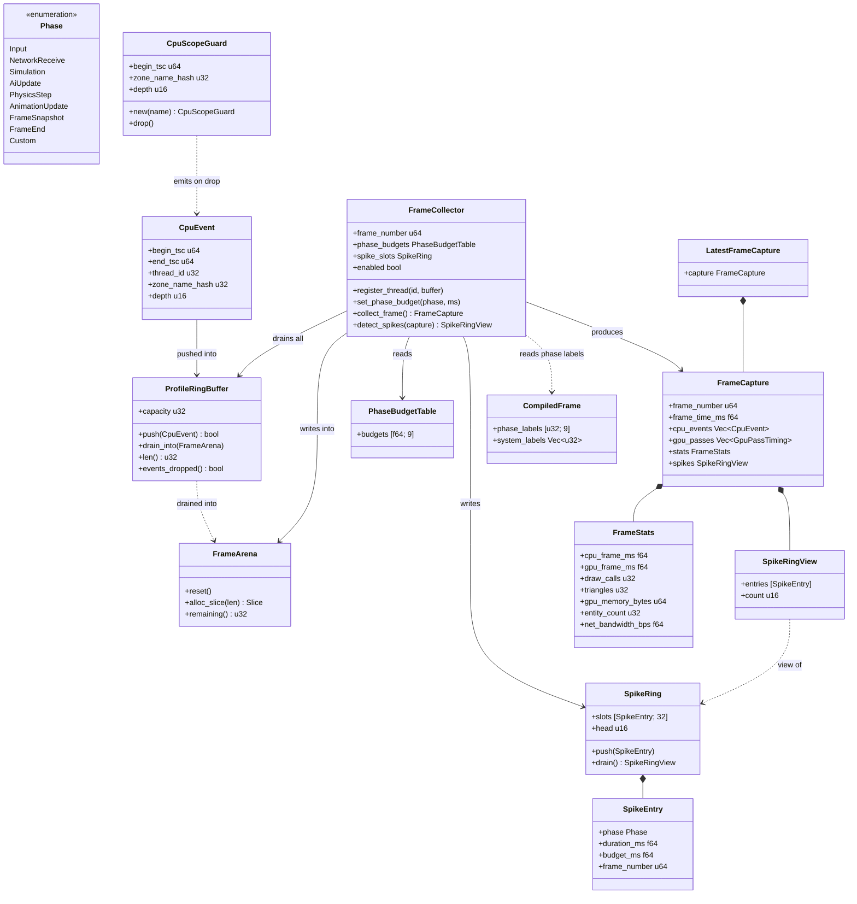
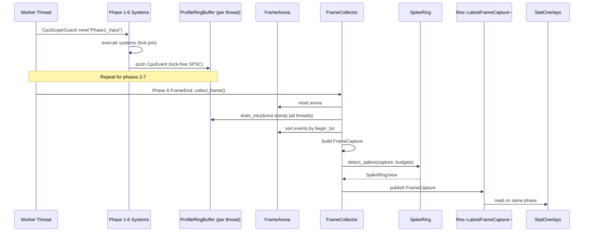

# Profiler ↔ Game Loop Integration Design

> **Compliance.** This document follows the cross-cutting conventions in
> [shared-conventions.md](shared-conventions.md) (SC-1..SC-14) and the channel-capacity formula in
> [shared-messaging-capacities.md](shared-messaging-capacities.md). Deviations: none.

## Systems Involved

| System | Design | Domain |
|--------|--------|--------|
| Profiler | [profiler.md](../tools/profiler.md) | Tools |
| Game Loop | [game-loop.md](../core-runtime/game-loop.md) | Core Runtime |

## Requirements Trace

> **Canonical sources:** Features, requirements, and user stories are defined in
> [features/](../../features/), [requirements/](../../requirements/), and
> [user-stories/](../../user-stories/).

### CPU Profiler (15.5)

| Feature   | Requirement | User Stories |
|-----------|-------------|--------------|
| F-15.5.1  | R-15.5.1    | US-15.5.1.1  |
| F-15.5.6  | R-15.5.6    | US-15.5.6.1  |

1. **F-15.5.1** -- CPU frame profiler with swimlane timeline and flame graph
2. **F-15.5.6** -- Stat overlays on game viewport

### Game Loop (5.6)

| Feature  | Requirement | User Stories |
|----------|-------------|--------------|
| F-5.6.1  | R-5.6.1     | US-5.6.1.1   |
| F-5.6.3  | R-5.6.3     | US-5.6.3.1   |
| F-5.6.6  | R-5.6.6     | US-5.6.6.1   |

1. **F-5.6.1** -- 8-phase frame pipeline with named phases
2. **F-5.6.3** -- Fixed-timestep physics substeps inside Phase 5
3. **F-5.6.6** -- ECS system scheduling with per-system scopes

## Integration Requirements

| ID | Requirement | Systems | Trace |
|----|-------------|---------|-------|
| IR-5.6.1 | Per-phase CPU timing via CpuScope guards | Prof, GL | F-15.5.1, F-5.6.1 |
| IR-5.6.2 | Frame budget tracking with phase breakdown | Prof, GL | F-15.5.1, F-5.6.1 |
| IR-5.6.3 | Spike detection when phase exceeds budget | Prof, GL | F-15.5.1, F-5.6.1 |
| IR-5.6.4 | FrameCollector drains ring buffers at boundary | Prof, GL | F-15.5.1, F-5.6.1 |
| IR-5.6.5 | Per-system timing via EcsSystemTracker | Prof, GL | F-15.5.1, F-5.6.6 |
| IR-5.6.6 | Fixed-timestep substep profiling | Prof, GL | F-15.5.1, F-5.6.3 |
| IR-5.6.7 | Stat overlay reads LatestFrameCapture resource | Prof, GL | F-15.5.6, F-5.6.1 |

1. **IR-5.6.1** -- Each game loop phase wraps its body in a `CpuScopeGuard`. The guard pushes a
   `CpuEvent` to the current thread's `ProfileRingBuffer` at begin and end. Phase scopes wrap the
   fork-join boundary so nested per-system scopes appear as children (F-15.5.1, F-5.6.1).
2. **IR-5.6.2** -- The profiler exposes per-phase frame time breakdown via `FrameStats` inside
   `FrameCapture`. Viewers compute percentages from the cpu_events tree against the 16.6 ms target
   (F-15.5.1).
3. **IR-5.6.3** -- Spike detection is performed by the profiler against per-phase budget values
   registered at profiler startup. Both `SpikeEntry` and `detect_spikes` are added to the parent
   profiler design as integration-driven extensions and are invoked during `collect_frame()`
   (F-15.5.1).
4. **IR-5.6.4** -- `FrameCollector::collect_frame()` runs during Phase 8 (FrameEnd) and drains every
   registered per-thread ring buffer into the `FrameArena` in a single pass (F-15.5.1, F-5.6.1).
5. **IR-5.6.5** -- Individual ECS systems inside a phase wrap their execution in a nested
   `CpuScopeGuard` via the `EcsSystemTracker`. Nested scopes share the same per-thread ring buffer
   and appear as children of the enclosing phase scope (F-15.5.1, F-5.6.6).
6. **IR-5.6.6** -- The physics substep loop (Phase 5) opens one `CpuScopeGuard` per substep so each
   tick of the fixed-timestep solver appears as a distinct child event (F-15.5.1, F-5.6.3).
7. **IR-5.6.7** -- The `StatOverlays` ECS system reads `Res<LatestFrameCapture>` (not
   `Res<FrameStats>`) and pulls `FrameStats` out of the contained `FrameCapture` for viewport
   display (F-15.5.6).

## Overview

The profiler instruments every game loop phase, every ECS system, and every physics substep using
RAII `CpuScopeGuard` objects that push `CpuEvent` entries to a per-thread lock-free ring buffer. At
Phase 8 (FrameEnd), the `FrameCollector` drains all ring buffers into the `FrameArena`, assembles a
`FrameCapture`, runs spike detection against preregistered per-phase budgets, and publishes the
capture to `Res<LatestFrameCapture>`. The profiler is a debug tool: it is runtime-toggleable via a
profiler-enabled flag on the `FrameCollector` and is never gated by `cfg(debug_assertions)` or Cargo
features.

## Direction

| Flow | Producer | Consumer | Thread |
|------|----------|----------|--------|
| `CpuEvent` push | Game loop phases, ECS systems | `ProfileRingBuffer` | Worker (local) |
| Ring buffer drain | `FrameCollector` | `FrameArena` | Phase 8 worker |
| `FrameCapture` publish | `FrameCollector` | `Res<LatestFrameCapture>` | Phase 8 worker |
| `FrameStats` read | `StatOverlays` system | Overlay renderer | Phase 8 worker |
| `CompiledFrame` read | `FrameCollector` | Phase label resolution | Phase 8 worker |

Game loop is the producer of timing events. Profiler is the consumer and aggregator. The only
game-loop-to-profiler handoff that returns data is the spike detector result, which is written back
into the `FrameCapture`.

## Architecture



## API Design

```rust
/// Game loop phase identifier. Defined in game-loop.md
/// and re-used by the profiler for per-phase budgets.
#[derive(Clone, Copy, PartialEq, Eq, Hash)]
pub enum Phase {
    Input,
    NetworkReceive,
    Simulation,
    AiUpdate,
    PhysicsStep,
    AnimationUpdate,
    FrameSnapshot,
    FrameEnd,
    Custom(u32),
}

/// RAII guard that writes a CpuEvent to the current
/// thread's ring buffer on drop. Begin TSC is read
/// in `new()`; end TSC is read in `drop()`. Phase
/// scopes wrap the full fork-join boundary for the
/// phase so nested per-system scopes appear as
/// children in the timeline tree.
pub struct CpuScopeGuard { /* ... */ }

impl CpuScopeGuard {
    #[inline(always)]
    pub fn new(name: &'static str) -> Self;
}

impl Drop for CpuScopeGuard {
    fn drop(&mut self);
}

/// Fixed-size per-phase budget table. Populated at
/// startup via `set_phase_budget()`. Indexed by the
/// discriminant of `Phase`. Size 9 = 8 built-in
/// phases plus one slot for `Custom`.
pub struct PhaseBudgetTable {
    pub budgets: [f64; 9],
}

/// Fixed-capacity ring of spike entries preallocated
/// at profiler startup. When full, the oldest entry
/// is overwritten. No heap allocation on the hot path.
pub struct SpikeRing {
    slots: [SpikeEntry; 32],
    head: u16,
    count: u16,
}

impl SpikeRing {
    pub fn new() -> Self;
    pub fn push(&mut self, entry: SpikeEntry);
    pub fn drain(&mut self) -> SpikeRingView<'_>;
}

/// Borrowed view over the spike ring for one frame.
/// Lives inside the `FrameArena` -- zero heap alloc.
pub struct SpikeRingView<'a> {
    pub entries: &'a [SpikeEntry],
    pub count: u16,
}

/// Per-phase over-budget record.
pub struct SpikeEntry {
    pub phase: Phase,
    pub duration_ms: f64,
    pub budget_ms: f64,
    pub frame_number: u64,
}

impl FrameCollector {
    /// Register a per-phase budget (milliseconds).
    /// Called once at profiler startup.
    pub fn set_phase_budget(
        &mut self,
        phase: Phase,
        budget_ms: f64,
    );

    /// Drain all registered ring buffers, assemble
    /// FrameCapture, run spike detection against
    /// `phase_budgets`, and publish to
    /// `Res<LatestFrameCapture>`. Called once per
    /// frame at Phase 8 (FrameEnd). Takes no ring
    /// buffer parameter: buffers are pre-registered
    /// via `register_thread()`.
    pub fn collect_frame(&mut self) -> FrameCapture;

    /// Runtime toggle. When disabled, `collect_frame`
    /// still runs but skips drain/sort/spike work and
    /// publishes an empty `FrameCapture`. Never
    /// gated by `cfg(debug_assertions)` or features.
    pub fn set_enabled(&mut self, enabled: bool);
}

/// ECS resource published by `FrameCollector`.
/// Read by `StatOverlays` and viewer systems.
pub struct LatestFrameCapture {
    pub capture: FrameCapture,
}
```

### Runtime Toggle

The profiler is a debug tool, but it is **not** compile-time gated. `FrameCollector::enabled` is a
runtime flag toggled from the editor, a console command, or a hotkey. When disabled, `CpuScopeGuard`
still reads the TSC (the overhead is negligible at ~10 ns) but the ring buffer push is skipped at
the `push()` site via a single branch. `collect_frame` returns an empty `FrameCapture` with
`frame_number` populated but `cpu_events` empty. Re-enabling the profiler resumes collection on the
very next frame with no recompile.

## Data Flow



## Mechanism

### Ring Buffer

Each worker thread owns a `ProfileRingBuffer` with a fixed power-of-two capacity preallocated at
profiler startup. The buffer is a **lock-free, non-atomic producer-side** SPSC queue: the producing
thread pushes with a plain write followed by a release store of the write index; the consumer
(`FrameCollector`) reads the write index with an acquire load and then copies events out. Because
each thread owns exactly one buffer and pushes only to its own, the push path has zero atomic
contention -- the "atomic" language used elsewhere in early drafts was misleading. Reference:
Lamport, "Specifying Concurrent Program Modules" (1983).

### MPSC Channel for Ring Buffer Registration

Worker threads register their ring buffers with the `FrameCollector` via an MPSC channel at thread
startup. Buffer length = 64 (max worker count + main + render + headroom). The channel is drained
once per frame at the top of `collect_frame()` before the buffer sweep. After registration, ring
buffers are indexed by a stable `ThreadId` assigned at registration time; no channel traffic occurs
on the hot path.

### FrameArena Drain

`FrameCollector::collect_frame()` calls `FrameArena::reset()` then sweeps every registered ring
buffer in order, calling `ProfileRingBuffer::drain_into(&mut arena)`. Each drain appends the
thread's events to a contiguous arena region. After all buffers are drained, the collector sorts the
combined slice in-place by `begin_tsc` (introsort on the arena slice, no heap alloc) and wraps it as
the `cpu_events` field of the returned `FrameCapture`. `SpikeRing::drain()` yields a borrowed
`SpikeRingView` that lives inside the same arena region.

### CompiledFrame Consumption

`CompiledFrame` (defined in `game-loop.md`) carries the label hash table for every compiled phase
and system. The `FrameCollector` reads `CompiledFrame.phase_labels` at the top of `collect_frame` to
resolve `zone_name_hash` values back to human-readable phase labels when populating `FrameCapture`
metadata for viewer systems. This is the only game-loop-to-profiler data path beyond the per-thread
ring buffers.

## Thread Ownership

| Data | Owner | Accessors | Handoff |
|------|-------|-----------|---------|
| `ProfileRingBuffer` | Worker thread | Self push, collector drain | None -- buffers pinned |
| `FrameArena` | `FrameCollector` | Phase 8 worker only | None -- single owner |
| `FrameCollector` | Phase 8 worker | Single owner | None |
| `FrameCapture` | `FrameCollector` | Viewer systems via LFC | Published at Phase 8 end |
| `Res<LatestFrameCapture>` | ECS World | `StatOverlays`, viewers | Replaced each frame |
| `CompiledFrame` | Game loop | `FrameCollector` (read-only) | Shared immutable `Arc` |

`CompiledFrame` is the only value shared via `Arc` -- it is immutable between schedule rebuilds, so
sharing it read-only across the game loop and profiler is safe. No hot-path type uses `Arc`. All
per-frame profiler state is either thread-local (ring buffers) or single-owner (arena, collector,
capture).

## Timing and Ordering

| System | Game loop phase | Timestep | Ordering |
|--------|----------------|----------|----------|
| CpuScopeGuard begin | Each phase start | Variable | First instruction |
| CpuScopeGuard end | Each phase end | Variable | After fork-join |
| EcsSystemTracker scope | Phases 1-7 | Variable | Nested inside phase |
| PhysicsStep substep scope | Phase 5 | Fixed | Per substep |
| FrameCollector::collect_frame | Phase 8 FrameEnd | Variable | First in phase |
| StatOverlays read | Phase 8 FrameEnd | Variable | After collector |

A phase-level `CpuScopeGuard` wraps the entire fork-join boundary for that phase -- it is created
before the phase schedules any worker jobs and dropped after every job has completed. Per-system
scopes nest inside on the worker that runs each system. This produces a tree structure in the event
stream: the outer phase event is the parent of any child events whose `[begin_tsc, end_tsc]`
intervals fall inside its own interval.

## Error Handling

| Error condition | Detection | Response |
|-----------------|-----------|----------|
| Ring buffer full | `push()` returns false | Increment `events_dropped` flag on buffer |
| TSC not monotonic | `end_tsc < begin_tsc` | Clamp duration to zero, flag event |
| Arena capacity exceeded | Drain overflow | Truncate to arena capacity, flag capture |
| Thread unregistered | Missing in sweep table | Events not collected; logged once per thread |
| Collector disabled | `enabled == false` | Empty `FrameCapture`, no drain |
| Spike budget unset | Budget = 0.0 | Skip spike check for that phase |

The profiler never panics on the hot path. All error conditions degrade gracefully to dropped data
and a diagnostic flag visible in `FrameStats`.

## Failure Modes

| # | Failure | Impact | Recovery |
|---|---------|--------|----------|
| 1 | Ring buffer full | Events dropped | Increase capacity at startup; log warning |
| 2 | TSC not monotonic | Negative durations | Clamp to zero, flag event |
| 3 | Spike detector false positive | Noisy alerts | Rolling average over 8 frames |
| 4 | FrameCollector exceeds 1% budget | Profiler perturbs | Runtime-toggle off |
| 5 | Thread count exceeds slot table | Missing thread data | See below |
| 6 | Arena overflow mid-drain | Truncated capture | See below |

### Fallback Paths

1. **Ring buffer full** -- push returns false, the event is dropped, and the buffer's
   `events_dropped` flag is latched until the next drain. The dropped-event count is aggregated into
   `FrameStats` so users can detect under-sized buffers and raise capacity at startup. No runtime
   allocation.
2. **TSC not monotonic** -- if `end_tsc < begin_tsc` (e.g., core migration on a platform with
   non-invariant TSC), the collector clamps the duration to zero, marks the event with a warning
   bit, and continues.
3. **Spike detector noise** -- use a rolling 8-frame average per phase before comparing to budget to
   avoid flagging isolated hitches.
4. **Collector over budget** -- toggle `FrameCollector::enabled` off via a hotkey or console
   command. The per-frame overhead drops to the cost of one branch in `CpuScopeGuard`.
5. **Thread count exceeds slot table** -- the thread slot table is preallocated at startup with
   capacity `max_workers + 4` (main + render + audio + scratch). Excess threads fail registration
   with a logged error; no runtime allocation is performed. This replaces the earlier "dynamic slot
   allocation" language, which contradicted the zero-heap-alloc hot path.
6. **Arena overflow mid-drain** -- the drain is bounded by the arena capacity. If drains would
   overflow, the collector stops at the boundary, truncates the capture, and sets
   `FrameStats.profiler_truncated`. Capacity is tuned at startup for the configured ring buffer
   totals and should never trigger in a well-sized build.

## Algorithm References

| Algorithm | Used in | Reference |
|-----------|---------|-----------|
| SPSC ring buffer | `ProfileRingBuffer` | 1 |
| Introsort on arena slice | Event sort in `collect_frame` | 2 |
| Rolling average filter | Spike detector smoothing | 3 |

References:

- [1] Lamport, "Specifying Concurrent Program Modules" (1983).
  <https://lamport.azurewebsites.net/pubs/pubs.html#specifying>
- [2] Musser, "Introspective Sorting and Selection Algorithms" (1997).
  <https://en.wikipedia.org/wiki/Introsort>
- [3] Standard exponential moving average; Oppenheim and Schafer, "Digital Signal Processing"
  (1975).

## Performance Budget

| Operation | Target | Rationale |
|-----------|--------|-----------|
| `CpuScopeGuard::new` + `drop` | < 20 ns | Two TSC reads + one SPSC push |
| Ring buffer push | < 10 ns | Single cache line store + release fence |
| `FrameCollector::collect_frame` drain 1000 events | < 0.1 ms | Zero-alloc arena drain |
| `FrameCollector::collect_frame` total | < 0.2 ms | Drain + sort + spike detection |
| Profiler total per-frame overhead | < 1% of 16.6 ms | Hard ceiling at 166 us per frame |
| Disabled-path guard overhead | < 3 ns | Single predicted branch |

These match the parent profiler design's `< 20 ns CpuScope begin+end` and `< 1% total overhead`
budgets. Benchmarks are listed in the companion test cases file.

## 2D / 2.5D Scope

The profiler is dimension-agnostic. Profiling runs identically for 2D, 2.5D, and 3D content -- all
game loop phases fire in every render mode and every phase is instrumented. No 2D-specific paths are
required or excluded.

## Platform Considerations

| Platform | Timer source | Resolution |
|----------|-------------|------------|
| Windows | `QueryPerformanceCounter` | ~100 ns |
| macOS | `mach_absolute_time` | ~40 ns |
| Linux | `clock_gettime(MONOTONIC)` | ~20 ns |

TSC read is abstracted behind a platform timestamp function selected at startup via a function
pointer (not `cfg`). All platforms provide sub-microsecond resolution.

## Test Plan

See companion [profiler-game-loop-test-cases.md](profiler-game-loop-test-cases.md). Tests cover
every IR, every failure mode, runtime-toggle behavior, negative cases (disabled collector,
unregistered thread, TSC regression, buffer overflow), and the performance benchmarks listed in the
Performance Budget section. All tests are CI-runnable and require no platform-specific hardware
beyond a monotonic timer.

## Open Questions

None at this time. All review items have been resolved -- see the Review Status section.

## Review Status

| # | Item | Status |
|---|------|--------|
| 1 | FrameCollector phase corrected to Phase 8 FrameEnd everywhere | APPLIED |
| 2 | `collect_frame()` signature matches parent (no parameters) | APPLIED |
| 3 | Replace `Vec<SpikeEntry>` with preallocated `SpikeRing` | APPLIED |
| 4 | `SpikeEntry`, `SpikeRing`, `detect_spikes` added to parent | APPLIED |
| 5 | `phase_budgets` added to parent as `PhaseBudgetTable` | APPLIED |
| 6 | Orphan `CompiledFrame` contract documented in Mechanism | APPLIED |
| 7 | `FrameArena` used for zero-alloc draining | APPLIED |
| 8 | `CpuScopeGuard` fork-join boundary clarified | APPLIED |
| 9 | `Res<LatestFrameCapture>` replaces `Res<FrameStats>` | APPLIED |
| 10 | IR detail list added | APPLIED |
| 11 | `classDiagram` covering every type added | APPLIED |
| 12 | Preallocated thread slot table replaces "dynamic slot allocation" | APPLIED |
| 13 | IRs traced to parent F-X.Y.Z IDs | APPLIED |
| 14 | Ring buffer described as lock-free non-atomic producer-side SPSC | APPLIED |
| 15 | Direction, Mechanism, Thread Ownership, Error Handling, Perf Budget added | APPLIED |
| 16 | TC-IR-5.6.4.1 clarified with worker/main/render thread count | APPLIED |

1. Sequence diagram and Timing table both reference Phase 8 FrameEnd for collection. Phase 7
   labelling was removed.
2. `FrameCollector::collect_frame()` takes only `&mut self`. Ring buffers are registered once via
   `register_thread()` and a hot-path MPSC channel drain at the top of `collect_frame`.
3. `SpikeRing` (capacity 32) replaces `Vec<SpikeEntry>`. `detect_spikes` returns a borrowed
   `SpikeRingView` out of the arena -- no heap allocation on the hot path.
4. `SpikeEntry`, `SpikeRing`, `SpikeRingView`, `PhaseBudgetTable`, and `detect_spikes` are
   back-propagated into the parent profiler design as integration-driven API additions.
5. `PhaseBudgetTable` is a named fixed-size table indexed by `Phase` discriminant, defined in the
   parent profiler design.
6. `CompiledFrame` is now explicitly consumed by `FrameCollector` at the top of `collect_frame` to
   resolve zone name hashes to phase labels. See Mechanism/CompiledFrame Consumption.
7. `FrameCollector` calls `FrameArena::reset()` then `ProfileRingBuffer::drain_into(&mut arena)` for
   every registered buffer. No heap alloc on the hot path.
8. Phase-level `CpuScopeGuard` wraps the fork-join boundary for the phase. Per-system scopes nest
   inside on the worker that executes each system.
9. IR-5.6.7 and all prose now reference `Res<LatestFrameCapture>`; the overlay reads `FrameStats`
   via `LatestFrameCapture.capture.stats`.
10. Each IR has a numbered detail entry immediately below the IR table.
11. Added a classDiagram covering `Phase`, `CpuScopeGuard`, `CpuEvent`, `ProfileRingBuffer`,
    `FrameArena`, `FrameCollector`, `FrameCapture`, `FrameStats`, `LatestFrameCapture`,
    `PhaseBudgetTable`, `SpikeRing`, `SpikeRingView`, `SpikeEntry`, and `CompiledFrame`.
12. Failure mode #5 replaced "dynamic slot allocation" with a preallocated thread slot table sized
    to `max_workers + 4` at startup. Excess threads fail registration with a logged error.
13. The Integration Requirements table includes a trace column mapping each IR to its parent
    `F-X.Y.Z` identifiers. See the IR detail list for feature ID breakdown.
14. Mechanism section describes the SPSC ring buffer as lock-free with non-atomic producer-side
    writes plus release store on the write index, not "atomic push" language.
15. Direction, Mechanism, Thread Ownership, Error Handling, and Performance Budget sections are all
    present. Failure Modes is retained as a separate prose-driven section for fallback paths.
16. Test case TC-IR-5.6.4.1 clarified: "4 worker threads" means 4 job-system worker threads and
    excludes main/render (the profiler only instruments worker threads in the parent design).
