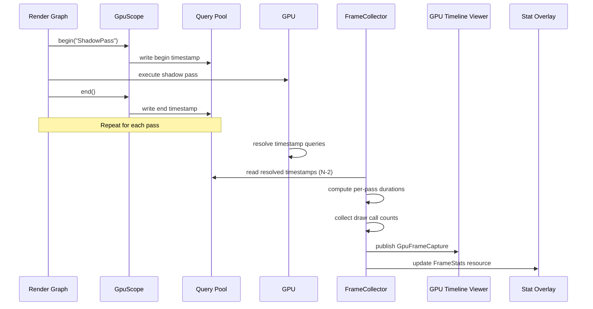

# Profiler ↔ Rendering Integration Design

## Systems Involved

| System | Design | Domain |
|--------|--------|--------|
| Profiler | [profiler.md](../tools/profiler.md) | Tools |
| Rendering Core | [rendering-core.md](../rendering/rendering-core.md) | Rendering |
| Render Pipeline | [render-pipeline.md](../rendering/render-pipeline.md) | Rendering |

## Integration Requirements

| ID | Requirement | Systems |
|----|-------------|---------|
| IR-5.7.1 | GPU timestamp queries per render pass | Profiler, Render Pipeline |
| IR-5.7.2 | Draw call and triangle count stats | Profiler, Rendering Core |
| IR-5.7.3 | VRAM usage breakdown by resource type | Profiler, Render Pipeline |
| IR-5.7.4 | GPU timeline aligned with CPU timeline | Profiler, Rendering |
| IR-5.7.5 | Render pass timing in GPU profiler view | Profiler, Render Pipeline |
| IR-5.7.6 | Per-view draw list statistics | Profiler, Rendering Core |
| IR-5.7.7 | GPU profiling queries compile-time gated | Profiler, Render Pipeline |

## Data Contracts

| Type | Defined in | Consumed by | Purpose |
|------|-----------|-------------|---------|
| `GpuPassTiming` | Profiler | GPU Timeline | Per-pass duration |
| `GpuScope` | Profiler | Render Graph | Timestamp insertion |
| `FrameStats` | Profiler | Stat overlay | Draw calls, tris |
| `ProfilingQueries` | Render Pipeline | Profiler | Query pool manager |
| `DrawList` | Rendering Core | Profiler | Command counts |

```rust
/// GpuScope wraps a render pass with begin/end
/// timestamp queries. Inserted by the render graph
/// around each pass execution.
pub struct GpuScope {
    pub pass_name: &'static str,
    pub begin_query: u32,
    pub end_query: u32,
}

impl GpuScope {
    /// Insert a begin-timestamp query into the
    /// command buffer before the pass executes.
    pub fn begin(
        cmd: &mut CommandBuffer,
        pool: &mut QueryPool,
        name: &'static str,
    ) -> Self;

    /// Insert an end-timestamp query after
    /// the pass executes.
    pub fn end(
        self,
        cmd: &mut CommandBuffer,
        pool: &mut QueryPool,
    );
}

/// Resolved GPU timing for one render pass.
/// Populated after GPU resolves timestamp queries.
pub struct GpuPassTiming {
    pub pass_id: u32,
    pub pass_name: &'static str,
    pub begin_ms: f64,
    pub end_ms: f64,
    pub duration_ms: f64,
}

/// Per-frame GPU statistics collected from
/// draw lists and memory allocator.
pub struct GpuFrameStats {
    pub draw_calls: u32,
    pub triangles: u32,
    pub meshlets_submitted: u32,
    pub meshlets_culled: u32,
    pub gpu_memory_bytes: u64,
    pub vram_textures: u64,
    pub vram_buffers: u64,
    pub vram_render_targets: u64,
}
```

## Data Flow



## Timing and Ordering

| System | Game loop phase | Timestep | Ordering |
|--------|----------------|----------|----------|
| GpuScope insert | Render thread | Variable | Around each pass |
| GPU resolve | GPU timeline | Variable | After frame submit |
| Query readback | Render thread N+2 | Variable | 2-frame latency |
| FrameCollector | Phase 8 FrameEnd | Variable | After readback |

GPU timestamp queries have a 2-frame readback latency. The FrameCollector reads resolved queries
from frame N-2 while frame N is executing. This avoids GPU stalls from synchronous readback.

## Failure Modes

| Failure | Impact | Recovery |
|---------|--------|----------|
| Query pool exhausted | Missing pass timings | Double pool size next frame |
| GPU timestamp overflow | Incorrect durations | Detect wrap, adjust math |
| Readback stall | Frame hitch | Skip readback, use stale data |
| Vendor counter unavailable | Missing detailed stats | Fall back to basic queries |
| Shipping build includes queries | Unnecessary overhead | Compile-time cfg gate removes all |

## Platform Considerations

| Platform | Timestamp API | Vendor counters |
|----------|--------------|-----------------|
| D3D12 | `ID3D12GraphicsCommandList::EndQuery` | PIX, AMD GPUPerfAPI |
| Metal | `MTLCounterSampleBuffer` | Metal System Trace |
| Vulkan | `vkCmdWriteTimestamp2` | VK_KHR_performance_query |

Query pool management differs per backend. The `ProfilingQueries` abstraction in
`harmonius_gpu_runtime` provides a unified interface. All backends support basic timestamp queries;
vendor-specific counters are optional extensions.

## Test Plan

See companion [profiler-rendering-test-cases.md](profiler-rendering-test-cases.md).
