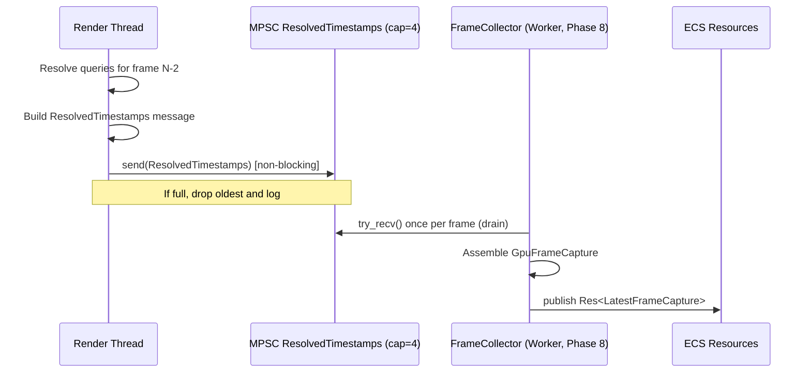
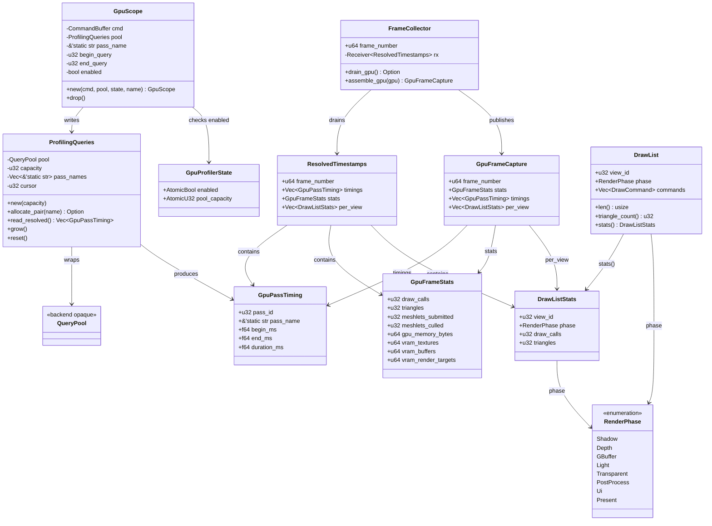
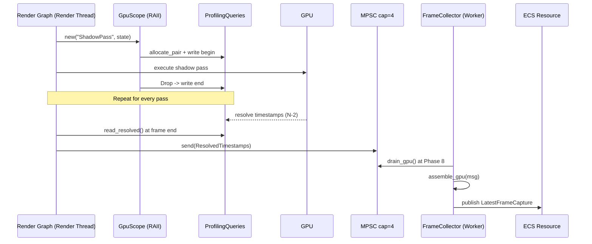

# Profiler ↔ Rendering Integration Design

## Systems Involved

| System | Design | Domain |
|--------|--------|--------|
| Profiler | [profiler.md](../tools/profiler.md) | Tools |
| Rendering Core | [rendering-core.md](../rendering/rendering-core.md) | Rendering |
| Render Pipeline | [render-pipeline.md](../rendering/render-pipeline.md) | Rendering |

## Scope Note

This integration targets 3D render pipelines (mesh shader meshlets, deferred materials, V-buffer).
2D and 2.5D sprite/tilemap rendering are intentionally out of scope and covered by a future profiler
↔ 2D-renderer integration.

## Integration Requirements

| ID | Requirement | Systems |
|----|-------------|---------|
| IR-5.7.1 | GPU timestamp queries per render pass | Profiler, Render Pipeline |
| IR-5.7.2 | Draw call and triangle count stats | Profiler, Rendering Core |
| IR-5.7.3 | VRAM usage breakdown by resource type | Profiler, Render Pipeline |
| IR-5.7.4 | GPU timeline aligned with CPU timeline | Profiler, Rendering |
| IR-5.7.5 | Render pass timing in GPU profiler view | Profiler, Render Pipeline |
| IR-5.7.6 | Per-view draw list statistics | Profiler, Rendering Core |
| IR-5.7.7 | GPU profiling queries runtime-toggleable | Profiler, Render Pipeline |

1. **IR-5.7.1** -- `ProfilingQueries` (render-thread-owned) allocates begin/end timestamp slots via
   `allocate_pair`. `GpuScope` is an RAII guard that issues the begin query on construction and the
   end query on `Drop`, even if the pass panics. Slots are referenced by flat-array index (no
   HashMap).
2. **IR-5.7.2** -- `DrawList::len()` and `DrawList::triangle_count()` feed `GpuFrameStats` each
   frame. Counts are produced on worker threads during Phase 7 Snapshot while building draw lists,
   then posted with the resolved-timestamp message at frame end.
3. **IR-5.7.3** -- The GPU allocator reports per-category totals (textures, buffers, render targets)
   into `GpuFrameStats` at frame end. Totals are read from atomic counters the allocator updates on
   allocation/free.
4. **IR-5.7.4** -- Each `GpuPassTiming` carries `begin_ms` / `end_ms` on the GPU timebase, already
   corrected for the 2-frame readback latency. The profiler UI aligns them with CPU timestamps using
   a calibration delta captured at backend init (see "Timebase calibration" below).
5. **IR-5.7.5** -- `GpuFrameCapture::timings` is the ordered set of `GpuPassTiming`s; the GPU
   timeline viewer renders one bar per entry using `pass_name` as the label.
6. **IR-5.7.6** -- `GpuFrameCapture` carries one `DrawListStats` entry per view so split-screen and
   shadow cameras are attributed separately.
7. **IR-5.7.7** -- Profiling is gated at runtime by an atomic flag in `GpuProfilerState`
   (`enabled: AtomicBool`). The flag is checked on the render thread once per pass. Debug tools are
   NEVER cfg-gated; shipping builds still contain the code path and can toggle it live.

### Timebase Calibration

On backend init the renderer records a paired `(cpu_tsc, gpu_ticks)` sample via `calibrate_timer`
(D3D12 `GetClockCalibration`, Metal `MTLCounterSampleBuffer.sampleTimestamps`, Vulkan
`vkGetCalibratedTimestampsEXT`). Ticks are multiplied by `gpu_hz` to produce milliseconds on the CPU
timeline. Algorithm: linear interpolation against a single anchor, re-anchored every 256 frames to
bound drift.

## Thread Ownership

| Data | Owner thread | Cross-thread handoff |
|------|--------------|----------------------|
| `ProfilingQueries` | Render | None (read+write render-local) |
| `QueryPool` | Render | None (GPU state, render-local) |
| `GpuScope` | Render | None (RAII, single pass) |
| `DrawList` | Workers | Channel to render at Phase 7 |
| `DrawListStats` | Workers | MPSC payload to FrameCollector |
| `GpuFrameStats` | Render (assembled) | MPSC payload to FrameCollector |
| `ResolvedTimestamps` | Render (produced) | MPSC to FrameCollector (worker) |
| `GpuFrameCapture` | Workers (FrameCollector) | Published via ECS resource |
| `FrameCollector` | Worker (Phase 8 FrameEnd) | Reads MPSC drain |

1. The render thread issues GPU commands only. It allocates queries, inserts timestamps, resolves
   readback from frame N-2, and posts a single `ResolvedTimestamps` message per frame.
2. `Arc` is used only for immutable shared data (e.g., backend caps snapshot). Mutable state is
   owned by exactly one thread and handed off by value through MPSC channels.
3. The render thread is core-pinned; the profiler must never add CPU work to it beyond the fixed
   per-pass query emit + one end-of-frame readback + one channel send.

## Frame-Boundary Handoff



1. The channel is a bounded MPSC `crossbeam_channel::bounded(4)` -- one slot for the in-flight frame
   plus three of slack. MPSC is the project default; a single producer today, but keeping it MPSC
   future-proofs against additional GPU contexts.
2. If the channel is full (worker thread stalled), the render thread drops the oldest entry and
   logs. The profiler UI then shows stale data until the worker catches up.
3. All handoff occurs at the frame boundary; no per-pass cross-thread messaging.

## Performance Budget

| Metric | Budget | Rationale |
|--------|--------|-----------|
| `GpuScope` begin+end CPU | < 0.5 us | Two CPU writes into a command list |
| `GpuScope` GPU cost | < 1 us | Vendor timestamp write |
| `ProfilingQueries::read_resolved` | < 50 us | 128 pass pairs, no GPU stall |
| MPSC `send` p99 | < 5 us | Bounded crossbeam channel |
| Render-thread profiler overhead | < 1 % frame | Hard ceiling at 16.6 ms budget |
| `FrameCollector::assemble` | < 0.1 ms | Worker thread, Phase 8 only |
| Shipping build (toggle off) | 0 ms amortized | Early-out on `enabled` atomic load |

## Runtime Debug Toggle

`GpuProfilerState` is an ECS resource with an `AtomicBool` `enabled` flag. Toggling is instant
(single relaxed store). When disabled:

1. `GpuScope::new` performs a single atomic load; on `false` it returns a no-op guard whose `Drop`
   does nothing.
2. The render thread skips `read_resolved` and the MPSC send.
3. `FrameCollector` skips assembly when no message is queued.

The flag is exposed via the editor overlay (hotkey) and via console command. There is NO
`#[cfg(feature = ...)]` gate anywhere in this integration.

## Data Contracts

| Type | Defined in | Consumed by | Purpose |
|------|-----------|-------------|---------|
| `GpuPassTiming` | Profiler | GPU Timeline | Per-pass duration |
| `GpuScope` | Profiler | Render Graph | RAII timestamp guard |
| `GpuFrameStats` | Profiler | Stat overlay | Draw calls, tris, VRAM |
| `GpuFrameCapture` | Profiler | Timeline viewer | Assembled frame record |
| `ProfilingQueries` | Render Pipeline | Profiler | Query slot manager |
| `QueryPool` | GPU Runtime | ProfilingQueries | Backend query pool |
| `ResolvedTimestamps` | Profiler | FrameCollector | MPSC payload |
| `DrawList` | Rendering Core | Profiler | Per-view command list |
| `DrawListStats` | Rendering Core | Profiler | Per-view counts |
| `GpuProfilerState` | Profiler | Render Thread | Runtime toggle |
| `FrameCollector` | Profiler | ECS | Phase 8 assembly |

```rust
/// Runtime toggle state. Never cfg-gated.
pub struct GpuProfilerState {
    pub enabled: AtomicBool,
    pub pool_capacity: AtomicU32,
}

/// RAII guard wrapping a render pass with begin/end
/// timestamp queries. Inserted by the render graph
/// around each pass execution.
///
/// Ownership: Render-thread-owned. GpuScope and the
/// underlying QueryPool are never shared across
/// threads.
///
/// Pass names: All `pass_name` values are
/// `&'static str` literals defined at compile time.
/// No runtime string construction is permitted.
///
/// Transient type: GpuScope is never serialized.
/// It exists only within a single frame's render
/// graph execution. No rkyv derives.
///
/// Panic safety: Drop is invoked even on unwind.
/// If the pass panics between `new` and Drop, the
/// end-timestamp is still written. `read_resolved`
/// also skips any unpaired queries defensively and
/// logs a warning.
pub struct GpuScope<'a> {
    cmd: &'a mut CommandBuffer,
    pool: &'a mut ProfilingQueries,
    pass_name: &'static str,
    begin_query: u32,
    end_query: u32,
    enabled: bool,
}

impl<'a> GpuScope<'a> {
    /// Insert a begin-timestamp query if profiling is
    /// enabled at runtime. Returns a no-op guard when
    /// disabled.
    pub fn new(
        cmd: &'a mut CommandBuffer,
        pool: &'a mut ProfilingQueries,
        state: &GpuProfilerState,
        name: &'static str,
    ) -> Self;
}

impl<'a> Drop for GpuScope<'a> {
    /// Writes the end-timestamp query. Exactly-once
    /// guarantee via Drop; panic-safe.
    fn drop(&mut self);
}

/// Resolved GPU timing for one render pass.
/// Populated after GPU resolves timestamp queries.
///
/// Transient type: GpuPassTiming is never persisted.
/// It is computed from raw timestamps each frame.
/// No rkyv derives.
pub struct GpuPassTiming {
    pub pass_id: u32,
    pub pass_name: &'static str,
    pub begin_ms: f64,
    pub end_ms: f64,
    pub duration_ms: f64,
}

/// Per-frame GPU statistics collected from draw
/// lists and the GPU memory allocator.
///
/// Transient type: GpuFrameStats is never persisted;
/// it is recomputed each frame. No rkyv derives.
pub struct GpuFrameStats {
    pub draw_calls: u32,
    pub triangles: u32,
    pub meshlets_submitted: u32,
    pub meshlets_culled: u32,
    pub gpu_memory_bytes: u64,
    pub vram_textures: u64,
    pub vram_buffers: u64,
    pub vram_render_targets: u64,
}

/// Assembled capture for one frame. Published by
/// FrameCollector as an ECS resource.
///
/// Optional persistent capture: when the user asks
/// to save a capture to disk, a clone with
/// `&'static str` pass names interned into a side
/// table is serialized via rkyv. The in-memory form
/// here remains transient.
pub struct GpuFrameCapture {
    pub frame_number: u64,
    pub stats: GpuFrameStats,
    pub timings: Vec<GpuPassTiming>,
    pub per_view: Vec<DrawListStats>,
}

/// Backend-agnostic GPU timestamp query pool. Owned
/// exclusively by the render thread; never shared.
/// Wraps the platform-specific query heap (D3D12
/// query heap, Metal counter sample buffer, Vulkan
/// query pool).
pub struct QueryPool {
    // Opaque, backend-specific fields.
}

/// Render-thread-owned manager over a flat array of
/// query slots. Maps slot index to pass name without
/// a HashMap.
pub struct ProfilingQueries {
    pool: QueryPool,
    capacity: u32,
    /// Flat array: index = query slot, value = name.
    pass_names: Vec<&'static str>,
    /// Next free slot. Reset at frame begin.
    cursor: u32,
}

impl ProfilingQueries {
    pub fn new(capacity: u32) -> Self;

    /// Allocate a begin/end query pair. Returns None
    /// if pool is exhausted; caller should call
    /// `grow` and request next frame.
    pub fn allocate_pair(
        &mut self,
        pass_name: &'static str,
    ) -> Option<(u32, u32)>;

    /// Read resolved timestamps from frame N-2 into
    /// a worker-thread-safe message. Non-blocking;
    /// never stalls the GPU.
    ///
    /// Fallback: if the GPU has not yet resolved the
    /// queries (very long frame), returns an empty
    /// Vec. The profiler UI keeps displaying the
    /// previous successful capture until the next
    /// frame resolves. Missing data is logged once.
    pub fn read_resolved(
        &mut self,
    ) -> Vec<GpuPassTiming>;

    /// Double the pool capacity. Called after
    /// `allocate_pair` returns None.
    pub fn grow(&mut self);

    /// Reset the cursor; called at frame begin on
    /// the render thread.
    pub fn reset(&mut self);
}

/// Message posted by the render thread to the
/// FrameCollector worker once per frame via a
/// bounded MPSC channel (`crossbeam_channel`,
/// capacity 4).
pub struct ResolvedTimestamps {
    pub frame_number: u64,
    pub timings: Vec<GpuPassTiming>,
    pub stats: GpuFrameStats,
    pub per_view: Vec<DrawListStats>,
}

/// Per-view draw list from rendering core. Builds on
/// worker threads during Phase 7 Snapshot.
/// See rendering-core.md for the full definition.
pub struct DrawList {
    pub view_id: u32,
    pub phase: RenderPhase,
    pub commands: Vec<DrawCommand>,
}

impl DrawList {
    /// Number of draw commands in this list.
    pub fn len(&self) -> usize;

    /// Total triangle count across all commands.
    /// Summed linearly; no allocation.
    pub fn triangle_count(&self) -> u32;

    /// Snapshot the list's counts for profiling.
    pub fn stats(&self) -> DrawListStats;
}

/// Per-view counts attached to the frame capture.
/// Workers compute this during draw-list build.
pub struct DrawListStats {
    pub view_id: u32,
    pub phase: RenderPhase,
    pub draw_calls: u32,
    pub triangles: u32,
}

/// Render graph phase enum. Every pass in the render
/// graph belongs to exactly one phase.
pub enum RenderPhase {
    Shadow,
    Depth,
    GBuffer,
    Light,
    Transparent,
    PostProcess,
    Ui,
    Present,
}

/// Worker-side consumer. Drains the MPSC channel
/// once per frame during Phase 8 FrameEnd, assembles
/// GpuFrameCapture, and publishes it as an ECS
/// resource.
///
/// Cross-reference: the broader FrameCollector
/// definition (ring-buffer draining for CPU events)
/// lives in profiler-game-loop.md. This document
/// extends it with the GPU-side ingest path.
pub struct FrameCollector {
    pub frame_number: u64,
    rx: crossbeam_channel::Receiver<ResolvedTimestamps>,
}

impl FrameCollector {
    /// Drain the MPSC channel (try_recv in a loop,
    /// bounded). Returns the latest message or None.
    pub fn drain_gpu(
        &mut self,
    ) -> Option<ResolvedTimestamps>;

    /// Assemble the published capture. Pure function
    /// over the drained message plus CPU-side data.
    pub fn assemble_gpu(
        &self,
        gpu: ResolvedTimestamps,
    ) -> GpuFrameCapture;
}
```

## Architecture



## Pseudocode

```rust
/// Render-thread hot path for one pass. Runtime
/// toggle; no cfg gating.
fn record_pass(
    cmd: &mut CommandBuffer,
    queries: &mut ProfilingQueries,
    state: &GpuProfilerState,
    graph: &RenderGraph,
    pass: PassId,
) {
    let _scope = GpuScope::new(
        cmd, queries, state, graph.name(pass),
    );
    graph.execute(cmd, pass);
    // Drop runs here; end-timestamp is emitted even
    // on panic unwind.
}

/// End-of-frame on the render thread.
fn render_frame_end(
    queries: &mut ProfilingQueries,
    state: &GpuProfilerState,
    draw_lists: &[DrawList],
    tx: &crossbeam_channel::Sender<ResolvedTimestamps>,
    frame: u64,
    vram: &GpuAllocatorStats,
) {
    if !state.enabled.load(Relaxed) {
        queries.reset();
        return;
    }
    let timings = queries.read_resolved();
    let per_view: Vec<DrawListStats> =
        draw_lists.iter().map(DrawList::stats).collect();
    let stats = GpuFrameStats {
        draw_calls: per_view.iter().map(|v| v.draw_calls).sum(),
        triangles:  per_view.iter().map(|v| v.triangles).sum(),
        meshlets_submitted: vram.meshlets_submitted,
        meshlets_culled:    vram.meshlets_culled,
        gpu_memory_bytes:   vram.total,
        vram_textures:      vram.textures,
        vram_buffers:       vram.buffers,
        vram_render_targets: vram.render_targets,
    };
    let msg = ResolvedTimestamps {
        frame_number: frame, timings, stats, per_view,
    };
    // Non-blocking; drop oldest on full.
    let _ = tx.try_send(msg);
    queries.reset();
}

/// Phase 8 FrameEnd on a worker thread.
fn frame_collector_gpu_tick(
    collector: &mut FrameCollector,
    world: &mut World,
) {
    if let Some(msg) = collector.drain_gpu() {
        let cap = collector.assemble_gpu(msg);
        world.insert_resource(LatestFrameCapture(cap));
    }
}
```

## Data Flow



## Timing and Ordering

| System | Game loop phase | Timestep | Ordering |
|--------|-----------------|----------|----------|
| `GpuScope::new` | Render thread | Variable | Before each pass |
| `GpuScope::drop` | Render thread | Variable | After each pass |
| `read_resolved` | Render thread | Variable | Frame end |
| MPSC send | Render thread | Variable | After read_resolved |
| `FrameCollector::drain_gpu` | Phase 8 FrameEnd | Variable | After render submit |
| `assemble_gpu` | Phase 8 FrameEnd | Variable | After drain |

GPU timestamp queries have a 2-frame readback latency. The render thread reads resolved queries from
frame N-2 while frame N is executing, avoiding GPU stalls from synchronous readback.

## Failure Modes

| Failure | Impact | Recovery |
|---------|--------|----------|
| Query pool exhausted | Missing pass timings | `grow()` doubles capacity next frame |
| GPU timestamp overflow | Incorrect durations | Detect wrap via delta sign, re-anchor |
| Readback not ready | Empty Vec | Reuse previous capture, log once |
| Vendor counter unavailable | No detailed counters | Fall back to basic timestamp queries |
| MPSC channel full | Stale capture | Drop oldest, log; profiler UI shows prior |
| Pass panics mid-execution | End query still emitted | Drop guarantees; unpaired skipped on read |
| `enabled` toggled off mid-frame | Tail passes untimed | Read_resolved yields partial; UI marks |

## Platform Considerations

| Platform | Timestamp API | Calibration API | Vendor counters |
|----------|---------------|-----------------|-----------------|
| D3D12 | `EndQuery(TIMESTAMP)` | `GetClockCalibration` | PIX, AMD GPUPerfAPI |
| Metal | `MTLCounterSampleBuffer` | `sampleTimestamps` | Metal System Trace |
| Vulkan | `vkCmdWriteTimestamp2` | `vkGetCalibratedTimestampsEXT` | `VK_KHR_performance_query` |

Query pool management differs per backend. The `ProfilingQueries` abstraction in
`harmonius_gpu_runtime` provides a unified interface. All backends support basic timestamp queries;
vendor-specific counters are optional extensions discovered at backend init.

## Test Plan

See companion [profiler-rendering-test-cases.md](profiler-rendering-test-cases.md). Every IR
(IR-5.7.1 through IR-5.7.7) has positive, negative, and benchmark coverage. All tests are
CI-runnable without GPU vendor tooling via a headless backend fake.

## Review Status

| # | Item | Status |
|---|------|--------|
| 1 | Document `QueryPool` as render-thread-owned GPU state | APPLIED |
| 2 | Fix `FrameStats` vs `GpuFrameStats` naming collision | APPLIED |
| 3 | Add `DrawList` pseudocode with `DrawListStats` | APPLIED |
| 4 | Mark transient types as non-rkyv; note persistent capture path | APPLIED |
| 5 | Document `pass_name: &'static str` contract | APPLIED |
| 6 | Add `ProfilingQueries` full pseudocode | APPLIED |
| 7 | Define + cross-reference `FrameCollector` | APPLIED |
| 8 | Render-thread to worker handoff via MPSC channel | APPLIED |
| 9 | Add `classDiagram` covering all types + `RenderPhase` enum | APPLIED |
| 10 | Add Thread Ownership, Performance Budget, Frame-Boundary Handoff sections | APPLIED |
| 11 | Replace cfg gating with runtime `GpuProfilerState.enabled` toggle | APPLIED |
| 12 | Use `GpuScope` RAII guard pattern (Drop) for panic safety | APPLIED |
| 13 | Test coverage confirmed for IR-5.7.1 through IR-5.7.7 | APPLIED |
| 14 | Query-index lookup uses flat array, not HashMap | APPLIED |
| 15 | MPSC channel capacity (4) and overflow behavior documented | APPLIED |
| 16 | Algorithm reference for timebase calibration | APPLIED |
| 17 | 2D/2.5D intentionally out of scope noted | APPLIED |
| 18 | Negative test cases + CI-runnable fake backend | APPLIED |
| 19 | Benchmarks retained and expanded | APPLIED |
| 20 | All enums (RenderPhase) fully defined | APPLIED |
