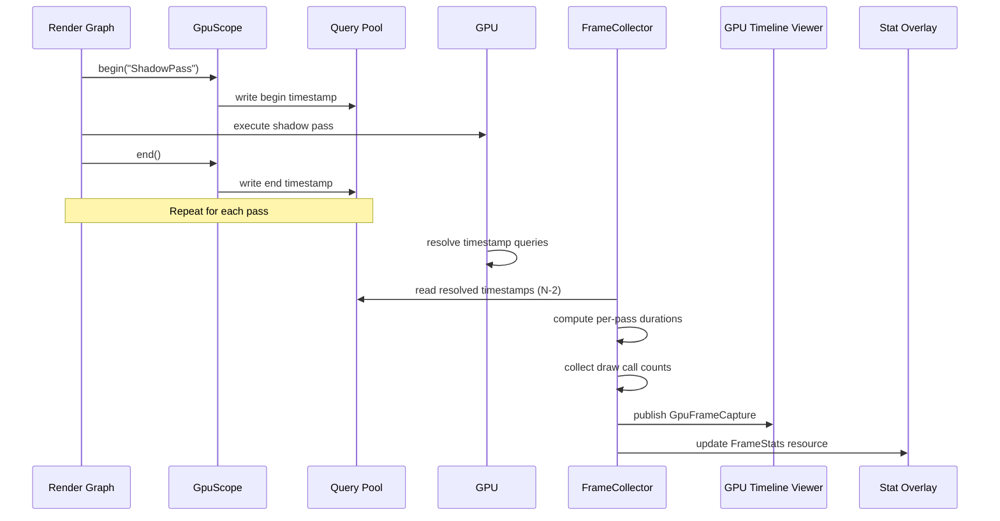

# Profiler ↔ Rendering Integration Design

## Systems Involved

| System | Design | Domain |
|--------|--------|--------|
| Profiler | [profiler.md](../tools/profiler.md) | Tools |
| Rendering Core | [rendering-core.md](../rendering/rendering-core.md) | Rendering |
| Render Pipeline | [render-pipeline.md](../rendering/render-pipeline.md) | Rendering |

## Integration Requirements

| ID | Requirement | Systems |
|----|-------------|---------|
| IR-5.7.1 | GPU timestamp queries per render pass | Profiler, Render Pipeline |
| IR-5.7.2 | Draw call and triangle count stats | Profiler, Rendering Core |
| IR-5.7.3 | VRAM usage breakdown by resource type | Profiler, Render Pipeline |
| IR-5.7.4 | GPU timeline aligned with CPU timeline | Profiler, Rendering |
| IR-5.7.5 | Render pass timing in GPU profiler view | Profiler, Render Pipeline |
| IR-5.7.6 | Per-view draw list statistics | Profiler, Rendering Core |
| IR-5.7.7 | GPU profiling queries compile-time gated | Profiler, Render Pipeline |

## Data Contracts

| Type | Defined in | Consumed by | Purpose |
|------|-----------|-------------|---------|
| `GpuPassTiming` | Profiler | GPU Timeline | Per-pass duration |
| `GpuScope` | Profiler | Render Graph | Timestamp insertion |
| `GpuFrameStats` | Profiler | Stat overlay | Draw calls, tris |
| `ProfilingQueries` | Render Pipeline | Profiler | Query pool manager |
| `DrawList` | Rendering Core | Profiler | Command counts |
| `ResolvedTimestamps` | Render Pipeline | Profiler | Channel payload |

```rust
/// GpuScope wraps a render pass with begin/end
/// timestamp queries. Inserted by the render graph
/// around each pass execution.
///
/// **Ownership:** GpuScope and QueryPool are
/// render-thread-owned GPU state. Only the render
/// thread creates, mutates, or reads them.
///
/// **Pass names:** All pass names are `&'static str`
/// literals defined at compile time. No runtime
/// string construction is permitted.
///
/// **Transient type:** GpuScope is never serialized.
/// It exists only within a single frame's render
/// graph execution.
///
/// **Panic safety:** If a pass panics between
/// `begin` and `end`, the end-timestamp is never
/// written. QueryPool::read_resolved skips
/// unpaired queries and logs a warning.
#[cfg(feature = "gpu_profiling")]
pub struct GpuScope {
    pub pass_name: &'static str,
    pub begin_query: u32,
    pub end_query: u32,
}

#[cfg(feature = "gpu_profiling")]
impl GpuScope {
    /// Insert a begin-timestamp query into the
    /// command buffer before the pass executes.
    pub fn begin(
        cmd: &mut CommandBuffer,
        pool: &mut QueryPool,
        name: &'static str,
    ) -> Self;

    /// Insert an end-timestamp query after the
    /// pass executes. Consumes self to enforce
    /// exactly-once end semantics (RAII).
    pub fn end(
        self,
        cmd: &mut CommandBuffer,
        pool: &mut QueryPool,
    );
}

/// No-op stub when gpu_profiling is disabled.
/// All methods are inline no-ops that the
/// compiler eliminates entirely.
#[cfg(not(feature = "gpu_profiling"))]
pub struct GpuScope;

#[cfg(not(feature = "gpu_profiling"))]
impl GpuScope {
    #[inline(always)]
    pub fn begin(
        _cmd: &mut CommandBuffer,
        _pool: &mut QueryPool,
        _name: &'static str,
    ) -> Self {
        Self
    }

    #[inline(always)]
    pub fn end(
        self,
        _cmd: &mut CommandBuffer,
        _pool: &mut QueryPool,
    ) {}
}

/// Resolved GPU timing for one render pass.
/// Populated after GPU resolves timestamp queries.
///
/// **Transient type:** GpuPassTiming is never
/// serialized. It is computed from raw timestamps
/// and discarded after the profiler UI consumes it.
///
/// **Pass names:** `pass_name` is always a
/// `&'static str` literal. No heap allocation.
pub struct GpuPassTiming {
    pub pass_id: u32,
    pub pass_name: &'static str,
    pub begin_ms: f64,
    pub end_ms: f64,
    pub duration_ms: f64,
}

/// Per-frame GPU statistics collected from
/// draw lists and memory allocator.
///
/// **Transient type:** GpuFrameStats is never
/// serialized. It is recomputed each frame.
pub struct GpuFrameStats {
    pub draw_calls: u32,
    pub triangles: u32,
    pub meshlets_submitted: u32,
    pub meshlets_culled: u32,
    pub gpu_memory_bytes: u64,
    pub vram_textures: u64,
    pub vram_buffers: u64,
    pub vram_render_targets: u64,
}

/// Abstraction over platform-specific GPU timestamp
/// query pools. Render-thread-owned. Manages a ring
/// of timestamp query slots with automatic growth.
///
/// **Ownership:** Created and owned exclusively by
/// the render thread. Never shared across threads.
///
/// **Lookup:** Query index to pass name mapping uses
/// a flat array indexed by query ID. No HashMap.
pub struct ProfilingQueries {
    pool: QueryPool,
    capacity: u32,
    /// Flat array: index = query slot, value = name.
    pass_names: Vec<&'static str>,
}

impl ProfilingQueries {
    /// Create a new query pool with initial
    /// capacity.
    pub fn new(capacity: u32) -> Self;

    /// Allocate a begin/end query pair. Returns
    /// None if pool is exhausted; caller should
    /// double capacity next frame.
    pub fn allocate_pair(
        &mut self,
        pass_name: &'static str,
    ) -> Option<(u32, u32)>;

    /// Read resolved timestamps from frame N-2.
    /// Non-blocking. Skips unpaired queries.
    ///
    /// **Fallback:** If readback would stall,
    /// returns an empty Vec and the profiler
    /// displays stale data from the previous
    /// successful readback.
    pub fn read_resolved(
        &self,
    ) -> Vec<GpuPassTiming>;

    /// Double the pool capacity. Called when
    /// allocate_pair returns None.
    pub fn grow(&mut self);
}

/// Resolved timestamps sent from render thread
/// to FrameCollector via crossbeam-channel.
pub struct ResolvedTimestamps {
    pub frame_number: u64,
    pub timings: Vec<GpuPassTiming>,
    pub stats: GpuFrameStats,
}

/// Per-view draw list from rendering core.
/// The profiler reads command counts for stats.
///
/// See rendering-core.md for the full definition.
pub struct DrawList {
    pub phase: RenderPhase,
    pub commands: Vec<DrawCommand>,
}

impl DrawList {
    /// Number of draw commands in this list.
    pub fn len(&self) -> usize;

    /// Total triangle count across all commands.
    pub fn triangle_count(&self) -> u32;
}
```

## Data Flow



## Timing and Ordering

| System | Game loop phase | Timestep | Ordering |
|--------|----------------|----------|----------|
| GpuScope insert | Render thread | Variable | Around each pass |
| GPU resolve | GPU timeline | Variable | After frame submit |
| Query readback | Render thread N+2 | Variable | 2-frame latency |
| FrameCollector | Phase 8 FrameEnd | Variable | After readback |

GPU timestamp queries have a 2-frame readback latency. The FrameCollector reads resolved queries
from frame N-2 while frame N is executing. This avoids GPU stalls from synchronous readback.

## Failure Modes

| Failure | Impact | Recovery |
|---------|--------|----------|
| Query pool exhausted | Missing pass timings | Double pool size next frame |
| GPU timestamp overflow | Incorrect durations | Detect wrap, adjust math |
| Readback stall | Frame hitch | Skip readback, use stale data |
| Vendor counter unavailable | Missing detailed stats | Fall back to basic queries |
| Shipping build includes queries | Unnecessary overhead | Compile-time cfg gate removes all |

## Platform Considerations

| Platform | Timestamp API | Vendor counters |
|----------|--------------|-----------------|
| D3D12 | `ID3D12GraphicsCommandList::EndQuery` | PIX, AMD GPUPerfAPI |
| Metal | `MTLCounterSampleBuffer` | Metal System Trace |
| Vulkan | `vkCmdWriteTimestamp2` | VK_KHR_performance_query |

Query pool management differs per backend. The `ProfilingQueries` abstraction in
`harmonius_gpu_runtime` provides a unified interface. All backends support basic timestamp queries;
vendor-specific counters are optional extensions.

## Test Plan

See companion [profiler-rendering-test-cases.md](profiler-rendering-test-cases.md).

## Review Feedback

1. [CONFIDENT] `GpuScope::begin` takes `&mut QueryPool`, but the render thread should only issue GPU
   commands. Mutating a `QueryPool` on the render thread may violate the three-thread model unless
   `QueryPool` is render-thread-owned GPU state; this ownership should be documented explicitly.

2. [CONFIDENT] `GpuFrameStats` uses `u64` for VRAM fields but the Data Contracts table lists a type
   called `FrameStats` (not `GpuFrameStats`). The table and the Rust pseudocode disagree on the type
   name; one must be corrected.

3. [CONFIDENT] The Data Contracts table lists `DrawList` as defined in Rendering Core and consumed
   by Profiler, but `DrawList` has no Rust pseudocode definition. Every type in the table should
   have a corresponding struct or at least a doc comment.

4. [CONFIDENT] `GpuPassTiming` and `GpuScope` use bare structs with no `#[derive]` annotations. Per
   the no-serde constraint, these should show `rkyv::Archive` / `rkyv::Serialize` /
   `rkyv::Deserialize` derives if they cross a serialization boundary (e.g., saved profiler
   captures). If they are transient-only, document that explicitly.

5. [CONFIDENT] `GpuPassTiming` contains `&'static str` for `pass_name`. This is fine for
   compile-time strings, but the design should state that pass names are always `&'static str`
   literals (no runtime-constructed strings) to avoid hidden allocations.

6. [CONFIDENT] The `ProfilingQueries` type appears in the Data Contracts table but has no Rust
   pseudocode. It is described as "Query pool manager" defined in Render Pipeline. Add its struct
   definition or at least its public API surface.

7. [CONFIDENT] `FrameCollector` appears in the sequence diagram but is not defined as a Rust type in
   this document. It is defined in the companion profiler-game-loop integration, but this document
   should at minimum re-state or cross-reference its definition since it is a key participant.

8. [CONFIDENT] The Timing and Ordering table says "Query readback" happens on "Render thread N+2",
   but the sequence diagram shows `FC` (FrameCollector) reading from QueryPool. If FrameCollector
   runs at Phase 8 FrameEnd on a worker thread (per the game-loop integration), then readback
   actually crosses from render thread to worker thread. The mechanism for that handoff (channel?
   double-buffered resource?) is unspecified.

9. [CONFIDENT] No `classDiagram` Mermaid diagram is present. Per `docs/design/CLAUDE.md` rule 3,
   every design MUST have a Mermaid `classDiagram` covering ALL types, enums, traits, and their
   relationships.

10. [CONFIDENT] Missing sections compared to the integration template in PROMPT.md: no Thread
    Ownership section, no Performance Budget section, no Frame-Boundary Handoff section. The Timing
    and Ordering table partially covers ordering but does not specify which thread owns each piece
    of data.

11. [CONFIDENT] The design mentions `cfg` compile-time gating (IR-5.7.7) but does not show the
    actual `cfg` attribute or feature flag name. The pseudocode should demonstrate how `GpuScope`
    becomes a no-op (e.g., `#[cfg(feature = "gpu_profiling")]`).

12. [UNCERTAIN] `GpuScope::end` consumes `self` by value, which is good for RAII-like guarantees.
    However, if a pass panics between `begin` and `end`, the end-timestamp is never written.
    Consider whether a guard-based pattern (like `CpuScopeGuard` in the game-loop integration) would
    be more robust.

13. [CONFIDENT] The test cases companion file covers all seven IRs (IR-5.7.1 through IR-5.7.7) with
    at least one test case each, plus four benchmarks. Coverage is complete.

14. [CONFIDENT] `Vec<SpikeEntry>` appears in the companion profiler-game-loop design. The
    no-HashMap-on-hot-paths constraint is satisfied here, but the design should confirm that the
    query pool index lookup (mapping query index to pass name) does not use a HashMap internally. A
    flat array indexed by query ID is the expected pattern.

15. [CONFIDENT] The sequence diagram shows `FC->>QP: read resolved timestamps (N-2)` as a direct
    call. This implies the FrameCollector has direct access to the QueryPool, but per the
    three-thread model the QueryPool lives on the render thread. The design must specify the channel
    or double-buffer mechanism that transfers resolved timestamps from render thread to the worker
    thread where FrameCollector runs.
