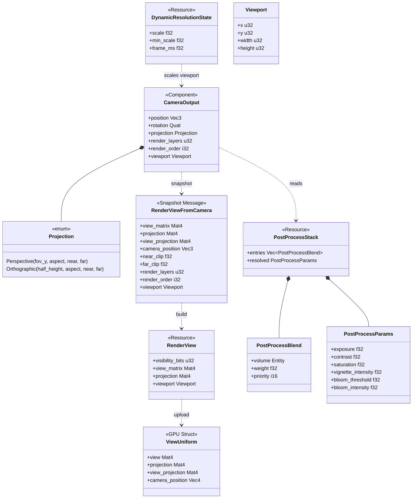
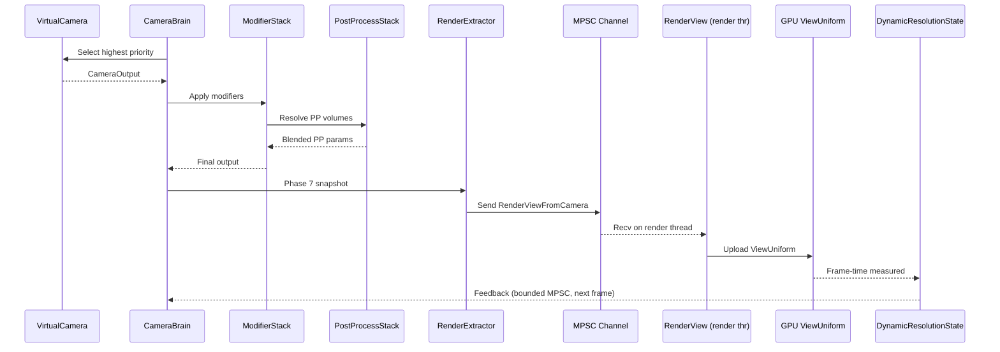

# Rendering ↔ Camera Integration Design

> **Compliance.** This document follows the cross-cutting conventions in
> [shared-conventions.md](shared-conventions.md) (SC-1..SC-14) and the channel-capacity formula
> in [shared-messaging-capacities.md](shared-messaging-capacities.md). Deviations: none.

## Scope

This integration covers **3D camera output** (perspective + orthographic) feeding the renderer.
**2D / 2.5D cameras are intentionally out of scope** for this document — the camera subsystem is
3D-first; pure 2D UI framing lives in the UI integration and does not traverse `CameraBrain`.

## Systems Involved

| System | Design | Domain |
|--------|--------|--------|
| Rendering | [rendering-core.md](../rendering/rendering-core.md) | GPU pipeline |
| Camera | [camera.md](../game-framework/camera.md) | View control |

## Requirements Trace

> **Canonical sources:** Features, requirements, and user stories are defined in
> [features/](../../features/), [requirements/](../../requirements/), and
> [user-stories/](../../user-stories/).

### Camera Framework (13.25)

| Feature    | Requirement | User Stories |
|------------|-------------|--------------|
| F-13.25.1  | R-13.25.1   | US-13.25.1.1 |
| F-13.25.2  | R-13.25.2   | US-13.25.2.1 |
| F-13.25.36 | R-13.25.36  | US-13.25.36.1 |

1. **F-13.25.1** -- Virtual camera entity with priority
2. **F-13.25.2** -- Camera brain and output controller
3. **F-13.25.36** -- Camera modifier stack

### Scene Rendering (2.3)

| Feature  | Requirement | User Stories |
|----------|-------------|--------------|
| F-2.3.5  | R-2.3.5     | US-2.3.5.1   |
| F-2.3.6  | R-2.3.6     | US-2.3.6.1   |
| F-2.3.11 | R-2.3.11    | US-2.3.11.1  |

1. **F-2.3.5** -- Orthographic camera projection
2. **F-2.3.6** -- Perspective projection with reverse-Z
3. **F-2.3.11** -- Dynamic resolution scaling with GPU feedback

### Render Pipeline (2.10)

| Feature  | Requirement | User Stories |
|----------|-------------|--------------|
| F-2.10.4 | R-2.10.4    | US-2.10.4.1  |
| F-2.10.5 | R-2.10.5    | US-2.10.5.1  |

1. **F-2.10.4** -- View/camera registration with projection
2. **F-2.10.5** -- Multi-view rendering from single snapshot

## Integration Requirements

| ID | Requirement | Systems | Traces |
|----|-------------|---------|--------|
| IR-3.1.1 | Camera brain output produces RenderView | Cam, Ren | F-13.25.2, F-2.10.4 |
| IR-3.1.2 | Render layers filter visible objects | Cam, Ren | F-13.25.1, R-2.10.4 |
| IR-3.1.3 | Post-process volumes blend per camera | Cam, Ren | F-13.25.36, R-13.25.36 |
| IR-3.1.4 | Multi-camera renders from one snapshot | Cam, Ren | F-2.10.5, R-2.10.5 |
| IR-3.1.5 | Camera projection feeds GPU ViewUniform | Cam, Ren | F-2.3.5, F-2.3.6 |
| IR-3.1.6 | DRS feedback adjusts camera resolution | Ren, Cam | F-2.3.11, R-2.3.11 |

1. **IR-3.1.1** -- `CameraBrain` final `CameraOutput` is converted to a `RenderView` during Phase 7
   snapshot extraction (F-13.25.2, F-2.10.4, US-13.25.2.1). Position, rotation, projection, near/far
   clip, and render order are copied.
2. **IR-3.1.2** -- `VirtualCamera.render_layers` (u32 bitmask) is propagated to
   `RenderView.visibility_bits` (F-13.25.1, R-2.10.4). Only entities whose
   `VisibilityComponent.render_layers` overlap the camera mask appear in draw lists.
3. **IR-3.1.3** -- `CameraModifierStack` entries of type `PostProcessBlend` reference post-process
   volume entities (F-13.25.36, R-13.25.36). The `PostProcessStack` system resolves blending per
   camera before snapshot extraction.
4. **IR-3.1.4** -- Multiple `CameraBrain` entities produce multiple `RenderView` entries in the same
   `RenderWorld` (F-2.10.5, US-2.10.5.1). The render graph executes all views from the single
   snapshot.
5. **IR-3.1.5** -- `CameraOutput.projection` (Perspective or Orthographic) is converted to a 4x4
   matrix and written into `ViewUniform.projection` for GPU upload (F-2.3.5, F-2.3.6). Perspective
   uses reverse-Z.
6. **IR-3.1.6** -- `DynamicResolutionState.scale` feeds back to the camera viewport dimensions each
   frame (F-2.3.11, R-2.3.11).

## Thread Ownership

Harmonius uses a fixed three-thread model: **main** (platform I/O), **workers** (simulation pool),
and **render** (core-pinned, highest QoS). All other camera/render threads run at default QoS.

| Data | Owner thread | Handoff |
|------|-------------|---------|
| `VirtualCamera` | Workers | ECS-local, Phase 6 |
| `CameraBrain` / `CameraOutput` | Workers | ECS-local, Phase 6 |
| `CameraModifierStack` | Workers | ECS-local, Phase 6 |
| `PostProcessStack` | Workers | Phase 6 write, Phase 7 read |
| `RenderViewFromCamera` | Built on workers, owned by render | MPSC channel |
| `RenderView` | Render | Render graph internal |
| `ViewUniform` | Render | GPU upload |
| `DynamicResolutionState` | Render | MPSC back to workers |

All cross-thread handoffs use **MPSC channels** (crossbeam `unbounded` on the snapshot path,
**bounded=4** on the DRS feedback path to bound memory and detect stalls). `Arc` is permitted only
for shared **immutable** baked data (e.g., a frozen post-process LUT); mutable integration state is
never wrapped in `Arc`. No `async`/`await` anywhere on the hot path — all code is synchronous.

## Data Contracts

| Type | Defined in | Consumed by | ECS | Purpose |
|------|-----------|-------------|-----|---------|
| `CameraOutput` | Camera | Rendering | Component | View params |
| `RenderView` | Rendering | Render graph | Resource | Per-view data |
| `RenderViewFromCamera` | Integration | Render thread | Snapshot | Built on workers |
| `ViewUniform` | Rendering | GPU shaders | GPU struct | GPU constants |
| `RenderLayerMask` | Rendering | Camera, Ren | Component | Visibility |
| `DynamicResolutionState` | Rendering | Camera | Resource | DRS scale |
| `PostProcessBlend` | Camera | Integration | Modifier | PP stack entry |
| `PostProcessStack` | Rendering | Camera | Resource | PP config |
| `Viewport` | Rendering | Render graph | Value | Pixel rect |
| `Projection` | Camera | Rendering | Enum | Ortho/perspective |

```rust
use glam::{Mat4, Vec3};
use rkyv::{Archive, Deserialize, Serialize};

/// Projection mode for a CameraOutput. Fully defined —
/// no hidden variants.
#[derive(Clone, Copy, Debug, PartialEq)]
pub enum Projection {
    /// Perspective with vertical FOV (radians), aspect,
    /// near and far clip. Matrix built with reverse-Z
    /// (Foley/van Dam reverse-Z formulation).
    Perspective {
        fov_y_radians: f32,
        aspect: f32,
        near: f32,
        far: f32,
    },
    /// Orthographic symmetric about origin with half
    /// height in world units and aspect ratio.
    Orthographic {
        half_height: f32,
        aspect: f32,
        near: f32,
        far: f32,
    },
}

/// Snapshot of camera state crossing worker -> render.
/// Built on workers in Phase 7 and sent across an MPSC
/// channel to the render thread. NOT an ECS Component
/// on the render side: it is the message payload.
///
/// rkyv: this type carries POD only (floats and an i32)
/// so it does NOT need rkyv derives for cross-thread
/// send — it is `Copy`. rkyv derives are added only for
/// types that must persist (save files or on-disk
/// caches). If a future feature persists view history,
/// add `#[derive(Archive, Serialize, Deserialize)]`
/// then.
#[derive(Clone, Copy, Debug, PartialEq)]
pub struct RenderViewFromCamera {
    pub view_matrix: Mat4,
    pub projection: Mat4,
    pub view_projection: Mat4,
    pub camera_position: Vec3,
    pub near_clip: f32,
    pub far_clip: f32,
    pub render_layers: u32,
    /// Signed draw order. Lower values render first.
    /// Stable sort — ties preserve insertion order
    /// (workers push CameraBrains in ECS iteration
    /// order). Negative values are valid and render
    /// before zero (e.g., underlays, HUD backgrounds).
    pub render_order: i32,
    pub viewport: Viewport,
}

/// A modifier-stack entry that references a post-
/// process volume entity. Defined in the camera
/// subsystem; consumed here to resolve per-camera
/// blended PP parameters before snapshot extraction.
#[derive(Clone, Copy, Debug, PartialEq)]
pub struct PostProcessBlend {
    /// Volume entity referenced by this stack entry.
    pub volume: Entity,
    /// Blend weight in [0, 1]. Clamped on write.
    pub weight: f32,
    /// Priority — higher wins ties at equal weight.
    pub priority: i16,
}

/// Runtime PP parameter stack built per camera per
/// frame. Evaluated in Phase 6 and read by the
/// snapshot extractor in Phase 7. Always ECS-resident;
/// no Arc.
///
/// Fallback: if no volumes contain the camera, the
/// stack contains only the scene default entry and
/// uses `PostProcessParams::default()`.
#[derive(Debug, Default)]
pub struct PostProcessStack {
    /// Ordered entries after weight resolution.
    pub entries: Vec<PostProcessBlend>,
    /// Resolved blended output for this frame.
    pub resolved: PostProcessParams,
}

/// Resolved PP parameters. Fully defined enum-free
/// struct — flat POD for GPU upload.
#[derive(Clone, Copy, Debug, Default, PartialEq)]
pub struct PostProcessParams {
    pub exposure: f32,
    pub contrast: f32,
    pub saturation: f32,
    pub vignette_intensity: f32,
    pub bloom_threshold: f32,
    pub bloom_intensity: f32,
}

/// DRS state written by the render thread and sent back
/// to workers via a bounded MPSC channel (buffer=4).
/// Not `Arc` — message is `Copy`.
#[derive(Clone, Copy, Debug, PartialEq)]
pub struct DynamicResolutionState {
    /// Current scale factor in [min_scale, 1.0].
    pub scale: f32,
    /// Lower clamp; defaults to 0.5.
    pub min_scale: f32,
    /// Smoothed frame-time in milliseconds.
    pub frame_ms: f32,
}
```

**Algorithm references.**

1. Reverse-Z perspective matrix construction follows NVIDIA's "Depth Precision Visualized" (2015)
   [nv-depth-precision] -- swap near/far and use `[0, 1]` depth clip.
2. Post-process volume blending uses weighted average ordered by `(weight, priority)`, equivalent to
   the Unreal Engine Post Process Volume algorithm (Karis, 2013) adapted to ECS components.
3. DRS scale update uses a PI controller on GPU frame time (see Drobot, "Dynamic Resolution", GDC
   2017) with proportional gain 0.1 and integral gain 0.02, clamped to `[min_scale, 1.0]`.

[nv-depth-precision]: https://developer.nvidia.com/content/depth-precision-visualized

## Architecture



## Data Flow



## Timing and Ordering

| System | Phase | Timestep | Order |
|--------|-------|----------|-------|
| VirtualCamera eval | 6-Animation | Variable | First |
| CameraBrain blend | 6-Animation | Variable | After VC |
| ModifierStack | 6-Animation | Variable | After blend |
| PostProcessStack | 6-Animation | Variable | After mods |
| RenderExtractor | 7-Snapshot | Variable | After cam |
| RenderView build | Render thread | Variable | On recv |
| GPU upload | Render thread | Variable | After build |
| DRS feedback | Render thread | Variable | Post-present |

## Failure Modes

| Failure | Impact | Recovery |
|---------|--------|----------|
| No active camera | Black screen | Fallback identity view at origin, log once |
| Invalid projection (FOV=0) | GPU artifacts | Clamp `fov_y_radians` to [1 deg, 179 deg] |
| Missing PP volume entity | No post-process | Skip entry, use scene default params |
| Camera outside all PP volumes | No override | Use `PostProcessParams::default()` |
| DRS scale <= 0 | Zero viewport | Clamp to `min_scale` (0.5) |
| Render layer mask = 0 | Nothing visible | Log warning once, substitute `0xFFFF_FFFF` |
| Snapshot channel full | Back-pressure | Drop oldest `DynamicResolutionState` msg (bounded=4) |
| Duplicate `render_order` | Undefined order risk | Stable sort preserves ECS iteration order |

All fallbacks above are logged exactly once per camera entity via the debug tools channel, which is
**runtime-toggleable** through the profiler overlay (no rebuild required).

## Platform Considerations

None -- identical across all platforms. Camera-to-render view conversion is pure CPU math with no
platform API dependencies. DRS controller runs on the render thread and is portable.

## Test Plan

See companion [rendering-camera-test-cases.md](rendering-camera-test-cases.md). All tests are
CI-runnable (pure CPU, no GPU dependency beyond the headless render-thread harness). Every
failure-mode row above has at least one negative test case. Benchmarks cover the hot paths: snapshot
build, multi-view extraction, and ViewUniform upload.

## Open Questions

1. Should `RenderViewFromCamera` eventually gain rkyv derives for profiler capture / deterministic
   replay? Currently POD `Copy` is sufficient; revisit once the replay feature lands.
2. Should the DRS PI-controller gains (0.1, 0.02) be exposed as tunable `DynamicResolutionConfig`
   fields, or remain compile-time constants? Leaning tunable for per-title shipping.
3. Should `PostProcessBlend` support curves (non-linear weight ramps) at the volume boundary, or is
   linear sufficient? Linear matches UE4 behavior and is good enough for Wave 1.

## Review Status

| # | Item | Status |
|---|------|--------|
| 1 | Missing Mermaid `classDiagram` covering all types | APPLIED |
| 2 | 2D/2.5D camera coverage | ACKNOWLEDGED-OUT-OF-SCOPE |
| 3 | Thread Ownership section (three-thread model) | APPLIED |
| 4 | Open Questions section | APPLIED |
| 5 | `PostProcessBlend` / `PostProcessStack` Rust pseudocode | APPLIED |
| 6 | DRS feedback loop in sequence diagram | APPLIED |
| 7 | R-/F-/US- traceability for each IR | APPLIED |
| 8 | Test-case companion 100-char line limit | APPLIED |
| 9 | IR-3.1.3 edge-case tests (overlap/nested/boundary/outside) | APPLIED |
| 10 | `RenderViewFromCamera` derive clarification (rkyv vs Component) | APPLIED |
| 11 | `render_order: i32` sort stability + negative semantics | APPLIED |
| 12 | Unused `focus_distance` field | REMOVED |
| 13 | MPSC channel buffer lengths documented | APPLIED |
| 14 | All enums fully defined (`Projection`) | APPLIED |
| 15 | Algorithm references (reverse-Z, PP blend, DRS PI) | APPLIED |
| 16 | All fallbacks documented | APPLIED |
| 17 | Negative test cases, CI-runnable | APPLIED |
| 18 | Benchmarks required | APPLIED |
| 19 | Debug tools runtime-toggleable | APPLIED |
| 20 | No async/await anywhere | APPLIED |
| 21 | Arc only for immutable shared data | APPLIED |
