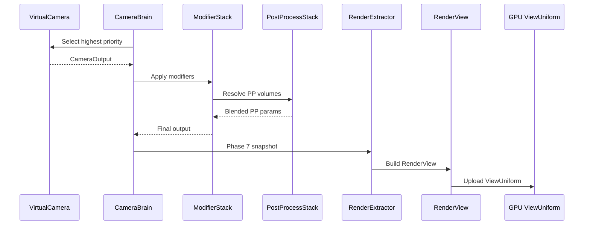

# Rendering ↔ Camera Integration Design

## Systems Involved

| System | Design | Domain |
|--------|--------|--------|
| Rendering | [rendering-core.md](../rendering/rendering-core.md) | GPU pipeline |
| Camera | [camera.md](../game-framework/camera.md) | View control |

## Requirements Trace

> **Canonical sources:** Features, requirements, and user stories are defined in
> [features/](../../features/), [requirements/](../../requirements/), and
> [user-stories/](../../user-stories/).

### Camera Framework (13.25)

| Feature    | Requirement | User Stories |
|------------|-------------|--------------|
| F-13.25.1  | R-13.25.1   | US-13.25.1.1 |
| F-13.25.2  | R-13.25.2   | US-13.25.2.1 |
| F-13.25.36 | R-13.25.36  | US-13.25.36.1 |

1. **F-13.25.1** -- Virtual camera entity with priority
2. **F-13.25.2** -- Camera brain and output controller
3. **F-13.25.36** -- Camera modifier stack

### Scene Rendering (2.3)

| Feature | Requirement | User Stories |
|---------|-------------|--------------|
| F-2.3.5 | R-2.3.5     | US-2.3.5.1   |
| F-2.3.6 | R-2.3.6     | US-2.3.6.1   |
| F-2.3.11 | R-2.3.11   | US-2.3.11.1  |

1. **F-2.3.5** -- Orthographic camera projection
2. **F-2.3.6** -- Perspective projection with reverse-Z
3. **F-2.3.11** -- Dynamic resolution scaling with GPU feedback

### Render Pipeline (2.10)

| Feature  | Requirement | User Stories |
|----------|-------------|--------------|
| F-2.10.4 | R-2.10.4    | US-2.10.4.1  |
| F-2.10.5 | R-2.10.5    | US-2.10.5.1  |

1. **F-2.10.4** -- View/camera registration with projection
2. **F-2.10.5** -- Multi-view rendering from single snapshot

## Integration Requirements

| ID | Requirement | Systems |
|----|-------------|---------|
| IR-3.1.1 | Camera brain output produces RenderView | Cam, Ren |
| IR-3.1.2 | Render layers filter visible objects | Cam, Ren |
| IR-3.1.3 | Post-process volumes blend per camera | Cam, Ren |
| IR-3.1.4 | Multi-camera renders from one snapshot | Cam, Ren |
| IR-3.1.5 | Camera projection feeds GPU ViewUniform | Cam, Ren |
| IR-3.1.6 | DRS feedback adjusts camera resolution | Ren, Cam |

1. **IR-3.1.1** -- `CameraBrain` final `CameraOutput` is converted to a `RenderView` during Phase 7
   snapshot extraction (F-13.25.2, F-2.10.4). Position, rotation, projection, near/far clip, and
   render order are copied.
2. **IR-3.1.2** -- `VirtualCamera.render_layers` (u32 bitmask) is propagated to
   `RenderView.visibility_bits` (F-13.25.1). Only entities whose `VisibilityComponent.render_layers`
   overlap the camera mask appear in draw lists.
3. **IR-3.1.3** -- `CameraModifierStack` entries of type `PostProcessBlend` reference post-process
   volume entities (F-13.25.36). The `PostProcessStack` system resolves blending per camera before
   snapshot extraction.
4. **IR-3.1.4** -- Multiple `CameraBrain` entities produce multiple `RenderView` entries in the same
   `RenderWorld` (F-2.10.5). The render graph executes all views from the single snapshot.
5. **IR-3.1.5** -- `CameraOutput.projection` (Perspective or Orthographic) is converted to a 4x4
   matrix and written into `ViewUniform.projection` for GPU upload (F-2.3.5, F-2.3.6). Perspective
   uses reverse-Z.
6. **IR-3.1.6** -- `DynamicResolutionState.scale` feeds back to the camera viewport dimensions each
   frame (F-2.3.11, R-2.3.11).

## Data Contracts

| Type | Defined in | Consumed by | Purpose |
|------|-----------|-------------|---------|
| `CameraOutput` | Camera | Rendering | View params |
| `RenderView` | Rendering | Render graph | Per-view data |
| `ViewUniform` | Rendering | GPU shaders | GPU constants |
| `RenderLayerMask` | Rendering | Camera, Ren | Visibility |
| `DynamicResolutionState` | Rendering | Camera | DRS scale |
| `PostProcessStack` | Rendering | Camera | PP config |

```rust
/// Snapshot of camera state for the render thread.
/// Built during Phase 7 from CameraOutput.
pub struct RenderViewFromCamera {
    pub view_matrix: Mat4,
    pub projection: Mat4,
    pub view_projection: Mat4,
    pub camera_position: Vec3,
    pub near_clip: f32,
    pub far_clip: f32,
    pub render_layers: u32,
    pub render_order: i32,
    pub viewport: Viewport,
    pub focus_distance: f32,
}
```

## Data Flow



## Timing and Ordering

| System | Phase | Timestep | Order |
|--------|-------|----------|-------|
| VirtualCamera eval | 6-Animation | Variable | First |
| CameraBrain blend | 6-Animation | Variable | After VC |
| ModifierStack | 6-Animation | Variable | After blend |
| PostProcessStack | 6-Animation | Variable | After mods |
| RenderExtractor | 7-Snapshot | Variable | After cam |
| RenderView build | 7-Snapshot | Variable | In extract |
| GPU upload | Render thread | Variable | After snap |

## Failure Modes

| Failure | Impact | Recovery |
|---------|--------|----------|
| No active camera | Black screen | Use fallback identity view |
| Invalid projection | GPU artifacts | Clamp FOV to [1, 179] deg |
| Missing PP volume | No post-process | Skip PP, use defaults |
| DRS scale <= 0 | Zero viewport | Clamp to min_scale (0.5) |
| Render layer = 0 | Nothing visible | Log warning, use 0xFF |

## Platform Considerations

None -- identical across all platforms. Camera-to-render view conversion is pure CPU math with no
platform API dependencies.

## Test Plan

See companion [rendering-camera-test-cases.md](rendering-camera-test-cases.md).

## Review Feedback

1. [CONFIDENT] Missing Mermaid `classDiagram`. The design CLAUDE.md requires every design to have a
   classDiagram covering all types, but this document has none.
2. [CONFIDENT] No 2D/2.5D camera coverage. The engine requires first-class 2D/2.5D support, but the
   design only addresses 3D perspective and orthographic projections without mentioning
   `Transform2D`, 2D viewports, or how 2D cameras produce a `RenderView`.
3. [CONFIDENT] No thread ownership section. The PROMPT.md template requires a "Thread ownership"
   discussion, and the three-thread model is a hard constraint; the design never states which thread
   owns `RenderViewFromCamera` or how ownership transfers from worker to render thread.
4. [CONFIDENT] Missing "Open Questions" section required by the design document template.
5. [CONFIDENT] `PostProcessBlend` and `PostProcessStack` are mentioned in IR-3.1.3 prose but have no
   Rust pseudocode in Data Contracts; their struct layout and per-camera blending API are
   unspecified.
6. [CONFIDENT] DRS feedback loop (IR-3.1.6) is absent from the sequence diagram.
   `DynamicResolutionState` appears in the Data Contracts table but has no pseudocode and no arrow
   in the Mermaid data flow.
7. [CONFIDENT] Only two specific feature IDs referenced (F-2.10.5, F-2.3.6). The CLAUDE.md requires
   all references use specific R-X.Y.Z / F-X.Y.Z / US-X.Y.Z IDs; the six IRs should trace to their
   originating requirements and features.
8. [CONFIDENT] Test case table rows in the companion file exceed the 100-character line limit
   mandated by CLAUDE.md. Tables need to be split with detail lists below.
9. [CONFIDENT] IR-3.1.3 has only one test case (TC-IR-3.1.3.1). Missing edge cases: overlapping PP
   volumes, nested volumes, camera on volume boundary, and all cameras outside all volumes.
10. [UNCERTAIN] `RenderViewFromCamera` has no `#[derive]` annotations. If it is an ECS component or
    crosses thread boundaries via the snapshot mechanism, it may need `#[derive(Archive)]` for rkyv
    zero-copy transfer or `#[derive(Component)]` if stored as a component.
11. [UNCERTAIN] `render_order: i32` allows negative values and the design does not specify sort
    stability or what happens when two cameras share the same order value.
12. [CONFIDENT] The `RenderViewFromCamera` struct lacks a `focus_distance` usage path. It appears in
    the struct but is never mentioned in the IRs, data flow, or test cases, so its purpose and
    producing system are unclear.
