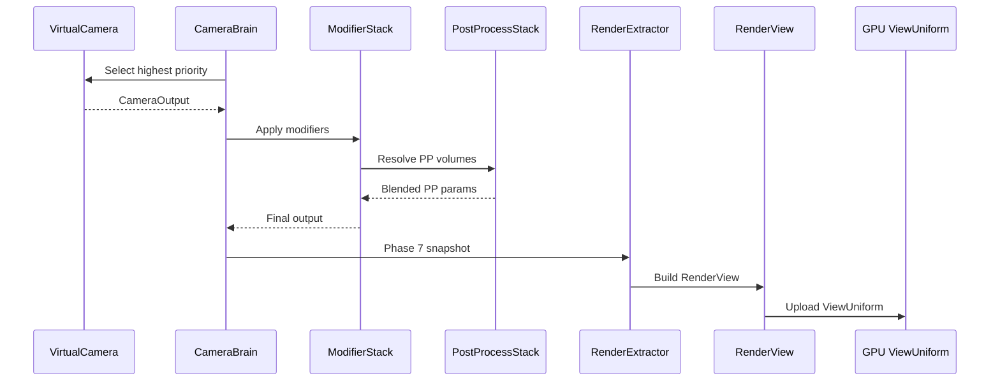

# Rendering ↔ Camera Integration Design

## Systems Involved

| System | Design | Domain |
|--------|--------|--------|
| Rendering | [rendering-core.md](../rendering/rendering-core.md) | GPU pipeline |
| Camera | [camera.md](../game-framework/camera.md) | View control |

## Integration Requirements

| ID | Requirement | Systems |
|----|-------------|---------|
| IR-3.1.1 | Camera brain output produces RenderView | Cam, Ren |
| IR-3.1.2 | Render layers filter visible objects | Cam, Ren |
| IR-3.1.3 | Post-process volumes blend per camera | Cam, Ren |
| IR-3.1.4 | Multi-camera renders from one snapshot | Cam, Ren |
| IR-3.1.5 | Camera projection feeds GPU ViewUniform | Cam, Ren |
| IR-3.1.6 | DRS feedback adjusts camera resolution | Ren, Cam |

1. **IR-3.1.1** -- `CameraBrain` final `CameraOutput` is converted to a `RenderView` during Phase 7
   snapshot extraction. Position, rotation, projection, near/far clip, and render order are copied.
2. **IR-3.1.2** -- `VirtualCamera.render_layers` (u32 bitmask) is propagated to
   `RenderView.visibility_bits`. Only entities whose `VisibilityComponent.render_layers` overlap the
   camera mask appear in draw lists.
3. **IR-3.1.3** -- `CameraModifierStack` entries of type `PostProcessBlend` reference post-process
   volume entities. The `PostProcessStack` system resolves blending per camera before snapshot
   extraction.
4. **IR-3.1.4** -- Multiple `CameraBrain` entities produce multiple `RenderView` entries in the same
   `RenderWorld`. The render graph executes all views from the single snapshot (F-2.10.5).
5. **IR-3.1.5** -- `CameraOutput.projection` (Perspective or Orthographic) is converted to a 4x4
   matrix and written into `ViewUniform.projection` for GPU upload. Perspective uses reverse-Z
   (F-2.3.6).
6. **IR-3.1.6** -- `DynamicResolutionState.scale` feeds back to the camera viewport dimensions each
   frame.

## Data Contracts

| Type | Defined in | Consumed by | Purpose |
|------|-----------|-------------|---------|
| `CameraOutput` | Camera | Rendering | View params |
| `RenderView` | Rendering | Render graph | Per-view data |
| `ViewUniform` | Rendering | GPU shaders | GPU constants |
| `RenderLayerMask` | Rendering | Camera, Ren | Visibility |
| `DynamicResolutionState` | Rendering | Camera | DRS scale |
| `PostProcessStack` | Rendering | Camera | PP config |

```rust
/// Snapshot of camera state for the render thread.
/// Built during Phase 7 from CameraOutput.
pub struct RenderViewFromCamera {
    pub view_matrix: Mat4,
    pub projection: Mat4,
    pub view_projection: Mat4,
    pub camera_position: Vec3,
    pub near_clip: f32,
    pub far_clip: f32,
    pub render_layers: u32,
    pub render_order: i32,
    pub viewport: Viewport,
    pub focus_distance: f32,
}
```

## Data Flow



## Timing and Ordering

| System | Phase | Timestep | Order |
|--------|-------|----------|-------|
| VirtualCamera eval | 6-Animation | Variable | First |
| CameraBrain blend | 6-Animation | Variable | After VC |
| ModifierStack | 6-Animation | Variable | After blend |
| PostProcessStack | 6-Animation | Variable | After mods |
| RenderExtractor | 7-Snapshot | Variable | After cam |
| RenderView build | 7-Snapshot | Variable | In extract |
| GPU upload | Render thread | Variable | After snap |

## Failure Modes

| Failure | Impact | Recovery |
|---------|--------|----------|
| No active camera | Black screen | Use fallback identity view |
| Invalid projection | GPU artifacts | Clamp FOV to [1, 179] deg |
| Missing PP volume | No post-process | Skip PP, use defaults |
| DRS scale <= 0 | Zero viewport | Clamp to min_scale (0.5) |
| Render layer = 0 | Nothing visible | Log warning, use 0xFF |

## Platform Considerations

None -- identical across all platforms. Camera-to-render view conversion is pure CPU math with no
platform API dependencies.

## Test Plan

See companion [rendering-camera-test-cases.md](rendering-camera-test-cases.md).
