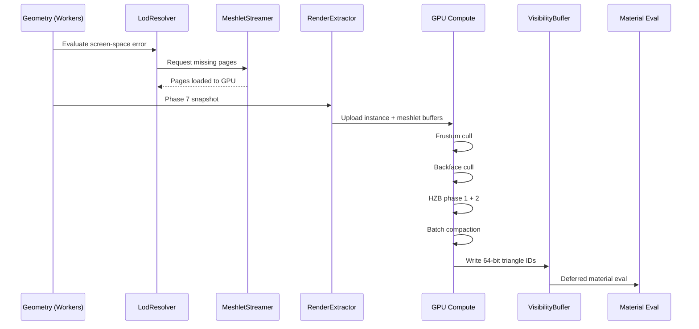

# Rendering ↔ World Geometry Integration Design

## Systems Involved

| System | Design | Domain |
|--------|--------|--------|
| Rendering | [rendering-core.md](../rendering/rendering-core.md) | GPU pipeline |
| Geometry | [world-geometry.md](../geometry/world-geometry.md) | Meshes/terrain |

## Integration Requirements

| ID | Requirement | Systems |
|----|-------------|---------|
| IR-3.2.1 | Meshlet DAG feeds GPU culling pipeline | Geo, Ren |
| IR-3.2.2 | LOD selection via screen-space error | Geo, Ren |
| IR-3.2.3 | Visibility buffer writes triangle IDs | Geo, Ren |
| IR-3.2.4 | Terrain clipmap registers render passes | Geo, Ren |
| IR-3.2.5 | Foliage GPU instancing via compute cull | Geo, Ren |
| IR-3.2.6 | Water/sky register render graph passes | Geo, Ren |
| IR-3.2.7 | Meshlet page streaming feeds GPU buffers | Geo, Ren |
| IR-3.2.8 | ProxyStore provides render instance data | Ren, Geo |
| IR-3.2.9 | HZB shared between meshlet and foliage | Ren |
| IR-3.2.10 | Mobile indirect-draw fallback path | Geo, Ren |

1. **IR-3.2.1** -- `MeshletDAG` hierarchy is uploaded to GPU buffers as `GpuMeshletCluster` arrays
   (immutable after bake, `#[repr(C)]`). The `GpuCullingPipeline` dispatches frustum, backface (via
   baked normal cones), and two-phase HZB culling compute passes over meshlet clusters. The
   `HzbResource` is shared with foliage culling (IR-3.2.9).
2. **IR-3.2.2** -- `LodResolver` (ECS system, runs on workers) evaluates screen-space error per
   meshlet group. The coarsest DAG cut below one-pixel error is selected. Result feeds the GPU
   culling input buffer.
3. **IR-3.2.3** -- `VisibilityBuffer` (ECS resource, render thread) writes 64-bit triangle+instance
   IDs per pixel. Material evaluation runs as a deferred compute pass reading the V-buffer. On
   mobile, V-buffer uses 32-bit packed IDs (see IR-3.2.10).
4. **IR-3.2.4** -- `ClipmapLod` and `VirtualTexture` register render graph passes for terrain
   geometry and material splatting. Terrain uses its own draw path separate from the meshlet
   pipeline.
5. **IR-3.2.5** -- `FoliageCull` (ECS system, render thread) dispatches a GPU compute pass that
   reads the foliage instance buffer and produces indirect draw args. Culled via the same
   `HzbResource` as meshlets (IR-3.2.9).
6. **IR-3.2.6** -- `OceanFFT`, `WaterRender`, `ProceduralSky`, `VolumetricCloud`, and
   `AtmosphereLut` each register dedicated passes in the render graph with explicit resource
   dependencies.
7. **IR-3.2.7** -- `MeshletStreamer` streams 64 KiB pages via platform-native I/O (io_uring on
   Linux, IOCP on Windows, GCD dispatch_io on macOS). I/O requests are submitted from the main
   thread; completions are polled at frame boundary. Loaded pages are uploaded to GPU mesh buffers.
   Missing pages use the lowest resident LOD as fallback. Baked pages use rkyv zero-copy layout and
   are mmap'd directly into memory.
8. **IR-3.2.8** -- `ProxyStore` (ECS resource, owned by render thread) holds per-entity render proxy
   data (transforms, material IDs, visibility flags). The `RenderExtractor` snapshots ECS components
   into `ProxyStore` during Phase 7. Geometry systems read `ProxyStore` indirectly via GPU instance
   buffers built from it.
9. **IR-3.2.9** -- `HzbResource` (ECS resource, render thread) stores the hierarchical Z-buffer mip
   chain. Built after initial depth pass, consumed by meshlet culling (IR-3.2.1) and foliage culling
   (IR-3.2.5) as a shared read-only resource within the same frame.
10. **IR-3.2.10** -- On platforms without mesh shader support, the pipeline falls back to indirect
    draw calls. Meshlet clusters are expanded to index buffers on the CPU, and `DrawIndexedIndirect`
    replaces mesh dispatch. V-buffer uses 32-bit packed IDs (20-bit instance + 12-bit triangle). LOD
    granularity is reduced. This path is validated by dedicated test cases.

### Serialization and Asset Format

All baked geometry assets (`MeshletDAG`, terrain clipmaps, foliage instance buffers) use rkyv binary
serialization with zero-copy mmap access. Assets are loaded via `mmap` (or platform equivalent) and
accessed directly without deserialization. The `GpuMeshletCluster` struct uses `#[repr(C)]` to
guarantee layout matches the GPU upload format.

### Thread Ownership

| Data | Owner thread | Handoff |
|------|-------------|---------|
| `MeshletDAG` | Workers | Channel to render |
| `LodResolver` | Workers | Writes GPU input buf |
| `MeshletStreamer` | Main (I/O submit) | Completion to render |
| `ProxyStore` | Render | Phase 7 snapshot |
| `HzbResource` | Render | Internal to GPU |
| `VisibilityBuffer` | Render | Internal to GPU |
| `FoliageCull` | Render | Reads HZB, writes draws |
| `ClipmapLod` | Workers | Channel to render |

All cross-thread handoffs use channels. No `Arc` is used for mutable shared state. `Arc` is
permitted only for shared immutable baked data (e.g., `Arc<MeshletDAG>` after asset load).

## Data Contracts

| Type | Defined in | Consumed by | ECS | Purpose |
|------|-----------|-------------|-----|---------|
| `MeshletDAG` | Geometry | Rendering | Component | LOD hierarchy |
| `MeshletBaker` | Geometry | Asset pipeline | None | Offline bake |
| `GpuMeshletCluster` | Geometry | GPU | None | GPU struct |
| `VisibilityBuffer` | Rendering | Rendering | Resource | V-buffer |
| `LodResolver` | Geometry | Rendering | System | LOD selection |
| `ProxyStore` | Rendering | Rendering | Resource | Instance data |
| `ClipmapLod` | Geometry | Render graph | Component | Terrain LOD |
| `FoliageCull` | Geometry | Render graph | System | Foliage cull |
| `HzbResource` | Rendering | Rendering | Resource | Shared HZB |
| `VolumetricCloud` | Geometry | Render graph | System | Cloud pass |
| `AtmosphereLut` | Geometry | Render graph | System | Atmo LUT |
| `TerrainRenderPass` | Geometry | Render graph | None | GPU struct |

```rust
/// Per-meshlet cluster uploaded to GPU for culling.
/// Immutable after bake -- produced by MeshletBaker,
/// uploaded to GPU once per asset.
#[repr(C)]
pub struct GpuMeshletCluster {
    pub bounding_sphere: Vec4,
    /// Cone axis (xyz) + cos(half-angle) (w).
    /// Baked by MeshletBaker from aggregate triangle
    /// normals. GPU backface cull rejects clusters whose
    /// cone faces away from the camera.
    pub normal_cone: Vec4,
    pub parent_error: f32,
    pub lod_error: f32,
    pub vertex_offset: u32,
    pub triangle_offset: u32,
    pub vertex_count: u8,
    pub triangle_count: u8,
    pub _pad: [u8; 2],
}

/// Terrain tile registered as a render graph pass.
/// Immutable after clipmap construction.
pub struct TerrainRenderPass {
    pub tile_aabb: Aabb,
    pub clipmap_level: u32,
    pub heightmap_srv: GpuTextureView,
    pub splatmap_srv: GpuTextureView,
}
```

## Data Flow



## Timing and Ordering

| System | Phase | Timestep | Order |
|--------|-------|----------|-------|
| LodResolver | 3-Simulation | Variable | Early |
| MeshletStreamer | Async I/O | Async | Background |
| FoliageCull | 7-Snapshot | Variable | With extract |
| RenderExtractor | 7-Snapshot | Variable | After LOD |
| GPU culling | Render thread | Variable | First passes |
| V-buffer write | Render thread | Variable | After cull |
| Material eval | Render thread | Variable | After V-buf |

## Failure Modes

| Failure | Impact | Recovery |
|---------|--------|----------|
| Page not streamed | Missing meshlets | Use lowest LOD fallback |
| LOD error too large | Pop-in artifacts | Hysteresis threshold |
| V-buffer overflow | Pixel corruption | Clamp to buffer size |
| Terrain tile miss | Hole in ground | Low-res fallback tile |
| GPU buffer OOM | Crash | Budget cap, evict LRU |

## Platform Considerations

| Platform | Mesh shaders | V-buffer | Terrain |
|----------|-------------|----------|---------|
| macOS | Metal mesh shaders | 64-bit atomic | CDLOD |
| Windows | D3D12 mesh shaders | 64-bit atomic | CDLOD |
| Linux | Vulkan mesh shaders | 64-bit atomic | CDLOD |
| Mobile | Indirect draw fallback | 32-bit pack | Reduced LOD |

## Test Plan

See companion [rendering-geometry-test-cases.md](rendering-geometry-test-cases.md).

## Review Feedback

1. **No 2D/2.5D geometry coverage.** The constraints require first-class 2D/2.5D support (sprites,
   tilemaps, parallax layers), but the design only covers 3D meshlet/terrain pipelines. An IR for
   sprite batching and tilemap rendering through the render graph is missing. [CONFIDENT]

2. **ECS modeling absent.** The design never describes which types are ECS components, which are ECS
   resources, or which are plain GPU-side structs. Constraints require ECS-primary (~90%); the data
   contracts should clarify ECS residency for every type (e.g., is `LodResolver` a system, a
   resource, or a component?). [CONFIDENT]

3. **No mention of serialization or asset format.** Meshlet DAGs and terrain tiles are baked assets,
   but the design does not specify rkyv zero-copy layout or mmap loading. The constraints mandate
   rkyv-only binary serialization with zero-copy mmap access. [CONFIDENT]

4. **`MeshletStreamer` uses "Async I/O" phase without clarifying mechanism.** The Timing table lists
   the streamer as "Async" phase, but constraints forbid async/await. The design should state that
   streaming uses platform-native I/O (io_uring / IOCP / GCD dispatch_io) submitted from the main
   thread, with completions polled at frame boundary. [CONFIDENT]

5. **Thread ownership not explicit.** The three-thread model (main, workers, render) is a hard
   constraint, but the design does not state which thread owns each data structure or where channel
   handoffs occur. The rendering-camera peer design handles this implicitly via Phase 7 snapshot
   references; this design should be equally or more explicit since it spans I/O, workers, and GPU.
   [CONFIDENT]

6. **Mobile row says "Indirect draw fallback" but mesh shaders are listed as required.** The
   constraints say "Mesh shaders required (Metal 4, D3D12, Vulkan 1.4)." If mobile uses indirect
   draw instead of mesh shaders, the design should clarify whether mobile is a supported tier or a
   degraded fallback, and whether an IR covers the fallback path. [CONFIDENT]

7. **No HashMap/Arc/Rc/Cell/RefCell violations found.** The Rust pseudocode is clean of prohibited
   types. [CONFIDENT]

8. **No async/await violations in pseudocode.** The code blocks contain no `async fn` or `.await`.
   [CONFIDENT]

9. **Data contracts table lists `ProxyStore` as "Defined in Rendering, Consumed by Geometry" but no
   IR references it.** `ProxyStore` appears only in the contracts table; no integration requirement
   explains what it carries or when it is exchanged. Either add an IR or remove the entry.
   [CONFIDENT]

10. **Missing benchmark for IR-3.2.4 (terrain clipmap).** The companion test cases have benchmarks
    for IR-3.2.1, 3.2.2, 3.2.3, 3.2.5, 3.2.6, and 3.2.7, but none for terrain clipmap rendering.
    [CONFIDENT]

11. **No test case for the mobile indirect-draw fallback path.** The platform table defines a
    distinct mobile path (indirect draw, 32-bit V-buffer packing, reduced LOD), but no test case
    validates it. [CONFIDENT]

12. **`GpuMeshletCluster` struct has no `#[repr(C)]` or alignment annotation.** GPU-uploaded structs
    typically need explicit layout guarantees. The pseudocode should show the repr and any padding.
    [UNCERTAIN]

13. **`VolumetricCloud` and `AtmosphereLut` are named in IR-3.2.6 prose but absent from the data
    contracts table.** Only `OceanFFT`, `WaterRender`, and `ProceduralSky` are implied; the cloud
    and atmosphere types should have contract entries or be noted as internal to the render graph.
    [CONFIDENT]

14. **Backface culling via normal cones requires meshlet baking to precompute cones.** The data flow
    diagram shows backface cull as a GPU pass, and `GpuMeshletCluster` has `normal_cone`, but the
    `MeshletBaker` contract does not describe the baking of normal cones. The offline pipeline
    coverage is thin. [UNCERTAIN]

15. **No immutability annotations.** The constraints prefer immutable-first data patterns, but the
    pseudocode does not indicate which fields or structs are immutable after construction. Adding
    `// immutable after bake` or similar would satisfy the constraint documentation requirement.
    [CONFIDENT]

16. **HZB (Hierarchical Z-Buffer) is referenced in the data flow but has no data contract entry.**
    HZB is a shared resource between meshlet culling (IR-3.2.1) and foliage culling (IR-3.2.5); it
    should appear in the contracts table with producer/consumer noted. [CONFIDENT]

17. **Test case TC-IR-3.2.1.2 tests frustum culling but no test covers HZB occlusion culling or
    backface culling.** IR-3.2.1 describes three culling passes (frustum, backface, HZB) but only
    frustum has a dedicated test. [CONFIDENT]
