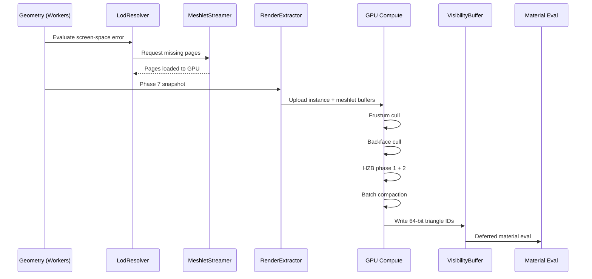

# Rendering ↔ World Geometry Integration Design

## Systems Involved

| System | Design | Domain |
|--------|--------|--------|
| Rendering | [rendering-core.md](../rendering/rendering-core.md) | GPU pipeline |
| Geometry | [world-geometry.md](../geometry/world-geometry.md) | Meshes/terrain |

## Integration Requirements

| ID | Requirement | Systems |
|----|-------------|---------|
| IR-3.2.1 | Meshlet DAG feeds GPU culling pipeline | Geo, Ren |
| IR-3.2.2 | LOD selection via screen-space error | Geo, Ren |
| IR-3.2.3 | Visibility buffer writes triangle IDs | Geo, Ren |
| IR-3.2.4 | Terrain clipmap registers render passes | Geo, Ren |
| IR-3.2.5 | Foliage GPU instancing via compute cull | Geo, Ren |
| IR-3.2.6 | Water/sky register render graph passes | Geo, Ren |
| IR-3.2.7 | Meshlet page streaming feeds GPU buffers | Geo, Ren |

1. **IR-3.2.1** -- `MeshletDAG` hierarchy is uploaded to GPU buffers. The `GpuCullingPipeline`
   dispatches frustum, backface, and HZB culling compute passes over meshlet clusters.
2. **IR-3.2.2** -- `LodResolver` evaluates screen-space error per meshlet group. The coarsest DAG
   cut below one pixel error is selected. Result feeds the GPU culling input buffer.
3. **IR-3.2.3** -- `VisibilityBuffer` writes 64-bit triangle+instance IDs per pixel. Material
   evaluation runs as a deferred compute pass reading the V-buffer.
4. **IR-3.2.4** -- `ClipmapLod` and `VirtualTexture` register render graph passes for terrain
   geometry and material splatting. Terrain uses its own draw path separate from meshlet pipeline.
5. **IR-3.2.5** -- `FoliageCull` dispatches a GPU compute pass that reads the foliage instance
   buffer and produces indirect draw args. Culled via the same HZB as meshlets.
6. **IR-3.2.6** -- `OceanFFT`, `WaterRender`, `ProceduralSky`, `VolumetricCloud`, and
   `AtmosphereLut` each register dedicated passes in the render graph with explicit resource
   dependencies.
7. **IR-3.2.7** -- `MeshletStreamer` streams 64 KiB pages via platform I/O. Loaded pages are
   uploaded to GPU mesh buffers. Missing pages use the lowest LOD resident fallback.

## Data Contracts

| Type | Defined in | Consumed by | Purpose |
|------|-----------|-------------|---------|
| `MeshletDAG` | Geometry | Rendering | LOD hierarchy |
| `MeshletBaker` | Geometry | Asset pipeline | Offline bake |
| `VisibilityBuffer` | Geometry | Rendering | V-buffer |
| `LodResolver` | Geometry | Rendering | LOD selection |
| `ProxyStore` | Rendering | Geometry | Instance data |
| `ClipmapLod` | Geometry | Render graph | Terrain LOD |
| `FoliageCull` | Geometry | Render graph | Foliage cull |

```rust
/// Per-meshlet cluster uploaded to GPU for culling.
pub struct GpuMeshletCluster {
    pub bounding_sphere: Vec4,
    pub normal_cone: Vec4,
    pub parent_error: f32,
    pub lod_error: f32,
    pub vertex_offset: u32,
    pub triangle_offset: u32,
    pub vertex_count: u8,
    pub triangle_count: u8,
}

/// Terrain tile registered as a render graph pass.
pub struct TerrainRenderPass {
    pub tile_aabb: Aabb,
    pub clipmap_level: u32,
    pub heightmap_srv: GpuTextureView,
    pub splatmap_srv: GpuTextureView,
}
```

## Data Flow



## Timing and Ordering

| System | Phase | Timestep | Order |
|--------|-------|----------|-------|
| LodResolver | 3-Simulation | Variable | Early |
| MeshletStreamer | Async I/O | Async | Background |
| FoliageCull | 7-Snapshot | Variable | With extract |
| RenderExtractor | 7-Snapshot | Variable | After LOD |
| GPU culling | Render thread | Variable | First passes |
| V-buffer write | Render thread | Variable | After cull |
| Material eval | Render thread | Variable | After V-buf |

## Failure Modes

| Failure | Impact | Recovery |
|---------|--------|----------|
| Page not streamed | Missing meshlets | Use lowest LOD fallback |
| LOD error too large | Pop-in artifacts | Hysteresis threshold |
| V-buffer overflow | Pixel corruption | Clamp to buffer size |
| Terrain tile miss | Hole in ground | Low-res fallback tile |
| GPU buffer OOM | Crash | Budget cap, evict LRU |

## Platform Considerations

| Platform | Mesh shaders | V-buffer | Terrain |
|----------|-------------|----------|---------|
| macOS | Metal mesh shaders | 64-bit atomic | CDLOD |
| Windows | D3D12 mesh shaders | 64-bit atomic | CDLOD |
| Linux | Vulkan mesh shaders | 64-bit atomic | CDLOD |
| Mobile | Indirect draw fallback | 32-bit pack | Reduced LOD |

## Test Plan

See companion [rendering-geometry-test-cases.md](rendering-geometry-test-cases.md).
