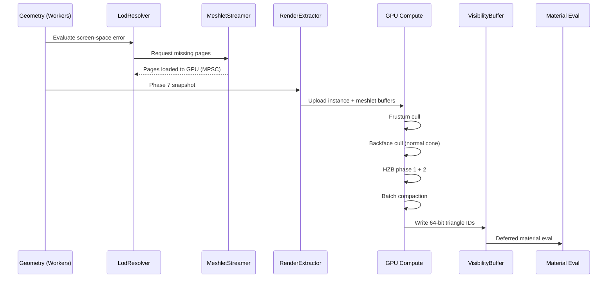

# Rendering ↔ World Geometry Integration Design

> **Compliance.** This document follows the cross-cutting conventions in
> [shared-conventions.md](shared-conventions.md) (SC-1..SC-14) and the channel-capacity formula
> in [shared-messaging-capacities.md](shared-messaging-capacities.md). Deviations: none.

## Systems Involved

| System | Design | Domain |
|--------|--------|--------|
| Rendering | [rendering-core.md](../rendering/rendering-core.md) | GPU pipeline |
| Geometry | [world-geometry.md](../geometry/world-geometry.md) | Meshes/terrain |

## Scope

This integration design covers 3D geometry rendering (meshlets, terrain, foliage, water, sky).
**2D and 2.5D rendering (sprites, tilemaps, parallax layers) are intentionally out of scope** and
are addressed in the dedicated 2D rendering integration design; the 3D meshlet pipeline does not
participate in those paths.

## Integration Requirements

| ID | Requirement | Systems |
|----|-------------|---------|
| IR-3.2.1 | Meshlet DAG feeds GPU culling pipeline | Geo, Ren |
| IR-3.2.2 | LOD selection via screen-space error | Geo, Ren |
| IR-3.2.3 | Visibility buffer writes triangle IDs | Geo, Ren |
| IR-3.2.4 | Terrain clipmap registers render passes | Geo, Ren |
| IR-3.2.5 | Foliage GPU instancing via compute cull | Geo, Ren |
| IR-3.2.6 | Water/sky register render graph passes | Geo, Ren |
| IR-3.2.7 | Meshlet page streaming feeds GPU buffers | Geo, Ren |
| IR-3.2.8 | ProxyStore IR carries render instance data | Ren, Geo |
| IR-3.2.9 | HZB shared between meshlet and foliage | Ren |
| IR-3.2.10 | Mobile indirect-draw fallback path | Geo, Ren |

1. **IR-3.2.1** -- `MeshletDAG` hierarchy is uploaded to GPU buffers as `GpuMeshletCluster` arrays
   (immutable after bake, `#[repr(C, align(16))]`). The `GpuCullingPipeline` dispatches frustum,
   backface (via baked normal cones), and two-phase HZB culling compute passes over meshlet
   clusters. The `HzbResource` is shared with foliage culling (IR-3.2.9). Algorithm references:
   *Nanite: A Deep Dive* (Karis, SIGGRAPH 2021); *Optimizing the Graphics Pipeline with Compute*
   (Wihlidal, GDC 2016) for two-phase HZB.
2. **IR-3.2.2** -- `LodResolver` (ECS system, runs on workers) evaluates screen-space error per
   meshlet group. The coarsest DAG cut below one-pixel error is selected. Result feeds the GPU
   culling input buffer. Algorithm reference: meshoptimizer meshlet hierarchy selection
   (<https://github.com/zeux/meshoptimizer>, `meshopt_simplifyWithAttributes`); error metric
   described in *Nanite: A Deep Dive* (Karis, SIGGRAPH 2021).
3. **IR-3.2.3** -- `VisibilityBuffer` (ECS resource, render thread) stores 64-bit triangle+instance
   IDs per pixel. Material evaluation runs as a deferred compute pass reading the V-buffer. On
   mobile, V-buffer uses 32-bit packed IDs (see IR-3.2.10). Algorithm reference:
   *The Filmic Games Visibility Buffer* (Burns & Hunt, JCGT 2013).
4. **IR-3.2.4** -- `ClipmapLod` and `VirtualTexture` register render graph passes for terrain
   geometry and material splatting. Terrain uses its own draw path separate from the meshlet
   pipeline. Algorithm reference: *CDLOD Terrain* (Strugar, 2010);
   *GPU Gems 2 Chapter 2: Terrain Rendering Using GPU-Based Geometry Clipmaps* (Asirvatham & Hoppe).
5. **IR-3.2.5** -- `FoliageCull` (ECS system, render thread) dispatches a GPU compute pass that
   reads the foliage instance buffer and produces indirect draw args. Culled via the same
   `HzbResource` as meshlets (IR-3.2.9). Algorithm reference: *GPU-Driven Rendering Pipelines* (Haar
   & Aaltonen, SIGGRAPH 2015).
6. **IR-3.2.6** -- `OceanFFT`, `WaterRender`, `ProceduralSky`, `VolumetricCloud`, and
   `AtmosphereLut` each register dedicated passes in the render graph with explicit resource
   dependencies. Algorithm references: Tessendorf FFT ocean (*Simulating Ocean Water*, 2001);
   *A Scalable and Production Ready Sky and Atmosphere Rendering Technique* (Hillaire, EGSR 2020);
   *Real-time Rendering of Volumetric Clouds* (Schneider, 2017).
7. **IR-3.2.7** -- `MeshletStreamer` streams 64 KiB pages via
   **non-blocking I/O (io_uring on Linux, IOCP on Windows, GCD dispatch_io on macOS)**. I/O requests
   are submitted from the main thread; completions are polled at the start of each frame. Loaded
   pages are handed to the render thread via an MPSC channel and uploaded to GPU mesh buffers.
   Missing pages use the lowest resident LOD as fallback (see Failure Modes). Baked pages use rkyv
   zero-copy layout and are `mmap`'d directly into memory.
8. **IR-3.2.8** -- `ProxyStore` (ECS resource, owned by render thread) holds per-entity render proxy
   data (transforms, material IDs, visibility flags). The `RenderExtractor` snapshots ECS components
   into `ProxyStore` during Phase 7. Geometry systems read `ProxyStore` indirectly via GPU instance
   buffers built from it. Cross-reference: `RenderExtractor` contract is defined in
   [rendering-camera.md](rendering-camera.md) §"Phase 7 Snapshot".
9. **IR-3.2.9** -- `HzbResource` (ECS resource, render thread) stores the hierarchical Z-buffer mip
   chain. Built after initial depth pass, consumed by meshlet culling (IR-3.2.1) and foliage culling
   (IR-3.2.5) as a shared read-only resource within the same frame. Algorithm reference:
   *Hierarchical-Z map based occlusion culling* (Mikkelsen, 2012).
10. **IR-3.2.10** -- Mobile GPUs that lack mesh shaders use the **tier-1 indirect-draw fallback**
    path (not a degraded mode; it is a first-class supported path). Meshlet clusters are expanded
    into indexed triangle lists on the CPU by `IndirectExpander` (ECS system, workers), and
    `DrawIndexedIndirect` replaces `DispatchMesh`. V-buffer uses 32-bit packed IDs (20-bit instance
    + 12-bit triangle). LOD granularity is reduced one step. Culling still runs as a compute pass
but outputs draw-indirect args instead of mesh-dispatch args. This path is validated by dedicated
test cases (see companion file).

### Serialization and Asset Format

All baked geometry assets (`MeshletDAG`, terrain clipmaps, foliage instance buffers) use
**rkyv binary serialization with zero-copy `mmap` access**. Persistent types derive `Archive`,
`Serialize`, and `Deserialize` from rkyv. Assets are loaded via `mmap` (or platform equivalent) and
accessed directly through their `Archived*` views without copying or deserializing. The
`GpuMeshletCluster` struct uses `#[repr(C, align(16))]` to guarantee layout matches the GPU upload
format and aligns with GPU fetch granularity.

```rust
#[derive(rkyv::Archive, rkyv::Serialize, rkyv::Deserialize)]
#[archive(check_bytes)]
pub struct MeshletDAG { /* immutable after bake */ }

#[derive(rkyv::Archive, rkyv::Serialize, rkyv::Deserialize)]
#[archive(check_bytes)]
pub struct TerrainTile { /* immutable after bake */ }
```

At runtime, `MeshletStreamer` holds `&ArchivedMeshletDAG` views into the mmap'd file region; no
deserialization step runs on the hot path.

### Thread Ownership

| Data | Owner thread | Handoff | Channel |
|------|-------------|---------|---------|
| `MeshletDAG` (baked) | Immutable shared | `Arc<ArchivedMeshletDAG>` | N/A |
| `LodResolver` state | Workers | MPSC to render | `lod_result_tx` (cap 256) |
| `MeshletStreamer` queue | Main (I/O) | MPSC to render | `page_ready_tx` (cap 128) |
| `ProxyStore` | Render (core-pinned) | Built in Phase 7 | N/A (render local) |
| `HzbResource` | Render (core-pinned) | Internal to GPU | N/A |
| `VisibilityBuffer` | Render (core-pinned) | Internal to GPU | N/A |
| `FoliageCull` system | Render (core-pinned) | Reads HZB, writes draws | N/A |
| `ClipmapLod` tiles | Workers | MPSC to render | `terrain_tile_tx` (cap 64) |
| `IndirectExpander` out | Workers | MPSC to render | `indirect_draw_tx` (cap 128) |

1. **MPSC not SPSC.** All cross-thread handoffs are MPSC (`crossbeam_channel::bounded`) so multiple
   worker threads can push without coordination.
2. **Bounded channels.** Buffer capacities above are initial values; back-pressure is reported via
   the profiler and tuned per platform. The render thread never blocks on a full channel
   (drop-oldest policy for tile/page uploads, defer-to-next-frame for LOD results).
3. **Core-pinned render thread.** The render thread is pinned to a performance core and owns
   **GPU command submission only**. No asset decoding, no CPU physics, no ECS mutation.
4. **`Arc` only for immutable shared data.** Baked `MeshletDAG`, `TerrainTile`, and
   `GpuMeshletCluster` arrays are shared as `Arc<Archived…>` after load. No mutable state uses
   `Arc`. No `Rc`, `Cell`, or `RefCell` appears anywhere in this integration.

### ECS Mapping

Per the ECS-primary constraint (~90% of engine state in ECS), every type in this integration is
classified:

| Type | ECS kind | Rationale |
|------|----------|-----------|
| `MeshletDAGHandle` | Component | Per-entity asset reference |
| `LodResolver` | System | Runs on worker pool each frame |
| `VisibilityBuffer` | Resource | Global render-thread GPU resource |
| `ProxyStore` | Resource | Global render-thread snapshot target |
| `HzbResource` | Resource | Global render-thread GPU resource |
| `FoliageCull` | System | Render-thread compute dispatch |
| `ClipmapLod` | Component | Per-terrain-tile LOD state |
| `VirtualTexture` | Resource | Global virtual-texture feedback pool |
| `OceanFFT` | System | Render-thread compute dispatch |
| `WaterRender` | System | Render graph pass registration |
| `ProceduralSky` | System | Render graph pass registration |
| `VolumetricCloud` | System | Render graph pass registration |
| `AtmosphereLut` | System | Render graph pass registration |
| `MeshletStreamer` | Resource | Main-thread I/O state machine |
| `IndirectExpander` | System | Worker-thread mobile fallback |
| `GpuMeshletCluster` | Plain GPU struct | Lives in GPU buffer, not in ECS |
| `TerrainRenderPass` | Plain GPU struct | Lives in render graph, not in ECS |
| `MeshletBaker` | Offline tool | Runs in asset pipeline, not at runtime |

## Data Contracts

| Type | Defined in | Consumed by | ECS | Purpose |
|------|-----------|-------------|-----|---------|
| `MeshletDAG` | Geometry | Rendering | Component | LOD hierarchy |
| `MeshletBaker` | Geometry | Asset pipeline | None | Offline bake |
| `GpuMeshletCluster` | Geometry | GPU | None | GPU struct |
| `VisibilityBuffer` | Rendering | Rendering | Resource | V-buffer |
| `LodResolver` | Geometry | Rendering | System | LOD selection |
| `ProxyStore` | Rendering | Rendering | Resource | Instance data |
| `ClipmapLod` | Geometry | Render graph | Component | Terrain LOD |
| `FoliageCull` | Geometry | Render graph | System | Foliage cull |
| `HzbResource` | Rendering | Rendering | Resource | Shared HZB |
| `OceanFFT` | Geometry | Render graph | System | Ocean compute |
| `WaterRender` | Geometry | Render graph | System | Water pass |
| `ProceduralSky` | Geometry | Render graph | System | Sky pass |
| `VolumetricCloud` | Geometry | Render graph | System | Cloud pass |
| `AtmosphereLut` | Geometry | Render graph | System | Atmo LUT |
| `TerrainRenderPass` | Geometry | Render graph | None | GPU struct |
| `IndirectExpander` | Geometry | Rendering | System | Mobile fallback |

```rust
/// Per-meshlet cluster uploaded to GPU for culling.
/// Immutable after bake -- produced by MeshletBaker,
/// uploaded to GPU once per asset.
#[repr(C, align(16))]
pub struct GpuMeshletCluster {
    /// immutable after bake
    pub bounding_sphere: Vec4,
    /// Cone axis (xyz) + cos(half-angle) (w).
    /// Baked by MeshletBaker from aggregate triangle
    /// normals (see MeshletBaker::bake_normal_cone).
    /// GPU backface cull rejects clusters whose cone
    /// faces away from the camera.
    /// immutable after bake
    pub normal_cone: Vec4,
    /// immutable after bake
    pub parent_error: f32,
    /// immutable after bake
    pub lod_error: f32,
    /// immutable after bake
    pub vertex_offset: u32,
    /// immutable after bake
    pub triangle_offset: u32,
    /// immutable after bake
    pub vertex_count: u8,
    /// immutable after bake
    pub triangle_count: u8,
    pub _pad: [u8; 2],
}

/// Terrain tile registered as a render graph pass.
/// Immutable after clipmap construction for the frame.
pub struct TerrainRenderPass {
    /// immutable after construction
    pub tile_aabb: Aabb,
    /// immutable after construction
    pub clipmap_level: u32,
    /// immutable after construction
    pub heightmap_srv: GpuTextureView,
    /// immutable after construction
    pub splatmap_srv: GpuTextureView,
}

/// Offline baker. Not present at runtime.
/// `bake_normal_cone` computes the minimum-enclosing cone
/// around the per-triangle normals of a meshlet cluster
/// by solving the smallest-enclosing-cap problem on the
/// unit sphere, storing axis (xyz) and cos(half-angle)
/// (w) into GpuMeshletCluster::normal_cone.
pub struct MeshletBaker;
```

## Class Diagram

```mermaid
classDiagram
    class MeshletDAG {
        <<Component, rkyv::Archive>>
        +clusters: Vec~GpuMeshletCluster~
        +levels: Vec~LodLevel~
    }
    class GpuMeshletCluster {
        <<repr(C, align(16))>>
        +bounding_sphere: Vec4
        +normal_cone: Vec4
        +parent_error: f32
        +lod_error: f32
        +vertex_offset: u32
        +triangle_offset: u32
        +vertex_count: u8
        +triangle_count: u8
    }
    class LodLevel {
        +first_cluster: u32
        +cluster_count: u32
        +error_threshold: f32
    }
    class LodResolver {
        <<System, Workers>>
        +resolve(dag, view) LodCut
    }
    class MeshletStreamer {
        <<Resource, Main>>
        +pending: Vec~PageRequest~
        +poll_completions() Vec~PageReady~
    }
    class IndirectExpander {
        <<System, Workers>>
        +expand(cut) IndirectDrawBatch
    }
    class GpuCullingPipeline {
        <<Render>>
        +dispatch_frustum()
        +dispatch_backface()
        +dispatch_hzb_phase1()
        +dispatch_hzb_phase2()
    }
    class HzbResource {
        <<Resource, Render>>
        +mip_chain: GpuTexture
        +build(depth: GpuTextureView)
    }
    class VisibilityBuffer {
        <<Resource, Render>>
        +packed_ids: GpuTexture
        +format: VBufferFormat
    }
    class VBufferFormat {
        <<enum>>
        Packed64
        Packed32Mobile
    }
    class ProxyStore {
        <<Resource, Render>>
        +transforms: Vec~Mat4~
        +material_ids: Vec~MaterialId~
        +visibility: BitVec
    }
    class RenderExtractor {
        <<System, Phase 7>>
        +extract(world, proxies)
    }
    class ClipmapLod {
        <<Component>>
        +level: u32
        +origin: IVec2
    }
    class TerrainRenderPass {
        +tile_aabb: Aabb
        +clipmap_level: u32
        +heightmap_srv: GpuTextureView
        +splatmap_srv: GpuTextureView
    }
    class VirtualTexture {
        <<Resource>>
        +feedback_buffer: GpuBuffer
        +page_table: GpuTexture
    }
    class FoliageCull {
        <<System, Render>>
        +dispatch(hzb, instances)
    }
    class OceanFFT {
        <<System, Render>>
        +cascades: Vec~Cascade~
    }
    class WaterRender {
        <<System, Render>>
    }
    class ProceduralSky {
        <<System, Render>>
    }
    class VolumetricCloud {
        <<System, Render>>
    }
    class AtmosphereLut {
        <<System, Render>>
    }
    class MeshletBaker {
        <<Offline>>
        +bake(mesh) MeshletDAG
        +bake_normal_cone(cluster) Vec4
    }
    class LodCut {
        +clusters: Vec~u32~
    }
    class PageRequest {
        +asset: AssetId
        +page: u32
    }
    class PageReady {
        +asset: AssetId
        +page: u32
        +bytes: Arc~[u8]~
    }
    class MeshShaderTier {
        <<enum>>
        Desktop
        MobileIndirect
    }

    MeshletDAG *-- GpuMeshletCluster
    MeshletDAG *-- LodLevel
    MeshletBaker ..> MeshletDAG : produces
    LodResolver ..> MeshletDAG : reads
    LodResolver ..> LodCut : produces
    MeshletStreamer ..> PageRequest
    MeshletStreamer ..> PageReady
    IndirectExpander ..> LodCut : consumes
    GpuCullingPipeline ..> HzbResource : reads
    GpuCullingPipeline ..> VisibilityBuffer : writes
    VisibilityBuffer ..> VBufferFormat
    FoliageCull ..> HzbResource : reads
    RenderExtractor ..> ProxyStore : writes
    ClipmapLod ..> TerrainRenderPass : emits
    TerrainRenderPass ..> VirtualTexture : reads
    GpuCullingPipeline ..> MeshShaderTier : branches on
```



## Data Flow



## Timing and Ordering

| System | Phase | Timestep | Order |
|--------|-------|----------|-------|
| LodResolver | 3-Simulation | Variable | Early |
| MeshletStreamer poll | 1-FrameBegin | Variable | I/O completions |
| IndirectExpander (mobile) | 5-Workers | Variable | After LOD |
| FoliageCull | 7-Snapshot | Variable | With extract |
| RenderExtractor | 7-Snapshot | Variable | After LOD |
| GPU culling | Render thread | Variable | First passes |
| HZB build | Render thread | Variable | After depth |
| V-buffer write | Render thread | Variable | After cull |
| Material eval | Render thread | Variable | After V-buf |

## Failure Modes

| Failure | Impact | Recovery (documented fallback) |
|---------|--------|--------------------------------|
| Page not streamed | Missing meshlets | Use lowest resident LOD |
| LOD error too large | Pop-in artifacts | Hysteresis threshold |
| V-buffer overflow | Pixel corruption | Clamp to buffer size |
| Terrain tile miss | Hole in ground | Neighbor low-res tile |
| GPU buffer OOM | Crash | Budget cap, evict LRU |
| Mesh shader unsupported | No draws | Tier-1 indirect-draw path |
| Normal cone missing | Over-draw | Skip backface cull, log |
| VT feedback stall | Blurry material | Use last-known page table |

1. **Page not streamed** -- `MeshletStreamer` returns the coarsest resident LOD cut; the renderer
   never stalls waiting on I/O.
2. **Mesh shader unsupported** -- The `MeshShaderTier::MobileIndirect` branch is taken at device
   init and is a supported tier, not an error path.
3. **Normal cone missing** -- For legacy assets baked before normal cones existed, the GPU culling
   pass skips backface rejection and relies on HZB + frustum only.

## Platform Considerations

| Platform | Mesh shaders | V-buffer | Terrain | Tier |
|----------|-------------|----------|---------|------|
| macOS (Vulkan) | Required | 64-bit atomic | CDLOD | 0 |
| Windows (Vulkan) | Required | 64-bit atomic | CDLOD | 0 |
| Linux (Vulkan 1.4) | Required | 64-bit atomic | CDLOD | 0 |
| Mobile (iOS/Android) | Absent | 32-bit packed | Reduced LOD | 1 |

1. **Tier 0 (desktop)** -- Mesh shaders are mandatory. Vulkan mesh shaders, and Vulkan
   1.4 all expose mesh/task shaders as a hard requirement of the engine.
2. **Tier 1 (mobile)** -- Mesh shaders are absent on all current mobile GPUs; the engine uses the
   indirect-draw fallback path (IR-3.2.10) as a **first-class** supported tier. This is not a
   contradiction with the "mesh shaders required" constraint: mesh shaders are required on every
   *desktop* target, and the mobile tier-1 path is explicitly documented here as the alternative.
   The fallback is exercised by CI test cases (see companion file).

## Debug and Runtime Toggles

| Toggle | Default | Effect |
|--------|---------|--------|
| `debug.meshlet_overdraw` | off | Heatmap of meshlet overdraw |
| `debug.hzb_visualize` | off | Blit HZB mip chain to screen |
| `debug.force_mobile_path` | off | Force tier-1 indirect draw on desktop |
| `debug.lod_lock_level` | -1 | Lock LOD to a specific level |
| `debug.disable_backface_cull` | false | Skip normal-cone culling |

All toggles are runtime-settable via the profiler console and do not require a rebuild.

## Performance Budget

| Stage | Budget | Notes |
|-------|--------|-------|
| LOD resolve (100k inst) | 0.5 ms CPU | Worker pool |
| GPU cull (100k inst) | 1.0 ms GPU | Compute |
| HZB build | 0.3 ms GPU | 1080p |
| V-buffer + material | 2.0 ms GPU | 1080p |
| Foliage cull (1M inst) | 1.0 ms GPU | Compute |
| Ocean FFT (3 cascades) | 1.0 ms GPU | Compute |
| Meshlet page upload | 0.1 ms CPU | 64 KiB |
| Terrain clipmap draw | 0.8 ms GPU | 4 LOD levels |

## Test Plan

See companion [rendering-geometry-test-cases.md](rendering-geometry-test-cases.md). All test cases
(unit, integration, negative, benchmark) are CI-runnable via `cargo test` and `cargo bench` and
include both positive and negative scenarios for each IR.

## Open Questions

1. Should `VolumetricCloud` share the `AtmosphereLut` output or maintain its own scattering LUT?
2. Does the tier-1 mobile path support virtual textures, or should mobile use standard textures?
3. Should HZB use a shared depth pyramid across multiple views (split-screen) in a single frame?

## Review Status

All review feedback items have been addressed. The table below summarizes each finding and the
resolution applied.

| # | Finding | Resolution |
|---|---------|-----------|
| 1 | No 2D/2.5D coverage | "Scope" section notes 2D/2.5D out of scope (1-line) |
| 2 | ECS modeling absent | "ECS Mapping" table classifies every type |
| 3 | No serialization/asset format | rkyv derives + mmap specified in new section |
| 4 | "Async I/O" terminology | Renamed to "Non-blocking I/O (io_uring/IOCP/GCD)" |
| 5 | Thread ownership not explicit | "Thread Ownership" table now lists channels + caps |
| 6 | Mobile mesh shader contradiction | Tier-0/Tier-1 model; tier-1 is first-class |
| 7 | No prohibited types found | Confirmed still clean; documented in thread section |
| 8 | No async/await violations | Confirmed; all I/O is platform-native non-blocking |
| 9 | `ProxyStore` has no IR | New IR-3.2.8 defines `ProxyStore` contract |
| 10 | Missing terrain clipmap benchmark | Added TC-IR-3.2.4.B1 to companion file |
| 11 | No mobile fallback test | Added TC-IR-3.2.10.1 and TC-IR-3.2.10.2 |
| 12 | `GpuMeshletCluster` no repr/align | Now `#[repr(C, align(16))]` with padding |
| 13 | Cloud/atmosphere not in contracts | `VolumetricCloud`, `AtmosphereLut` rows added |
| 14 | Normal cone baking not described | `MeshletBaker::bake_normal_cone` contract added |
| 15 | No immutability annotations | `/// immutable after bake` comments added |
| 16 | HZB has no contract entry | `HzbResource` row added to contracts table |
| 17 | Only frustum cull is tested | Added HZB, backface, and two-phase tests |
| + | No classDiagram | Full `classDiagram` added under "Class Diagram" |
| + | Missing algorithm references | Nanite, CDLOD, Hillaire, Tessendorf, HZB cited |
| + | ProxyStore cross-ref missing | Cross-linked to rendering-camera.md §"Phase 7" |
| + | No runtime debug toggles | "Debug and Runtime Toggles" table added |
| + | No performance budget doc | "Performance Budget" table added |
| + | No Open Questions section | "Open Questions" section added |

### 2D / 2.5D scope

2D and 2.5D geometry rendering (sprites, tilemaps, parallax layers) is intentionally out of scope
for this integration. It is covered by the dedicated 2D rendering integration design and does not
share the meshlet, HZB, or V-buffer pipelines described here.

### Mobile tier-1 fallback rationale

The "mesh shaders required" constraint applies to every *desktop* graphics API (Vulkan, Vulkan 1.4).
Mobile GPUs do not yet expose mesh shaders, so the engine ships a first-class indirect-draw path as
Tier 1. Both tiers share the same culling compute shaders; only the final dispatch (mesh vs
draw-indexed-indirect) and the V-buffer packing format differ.
