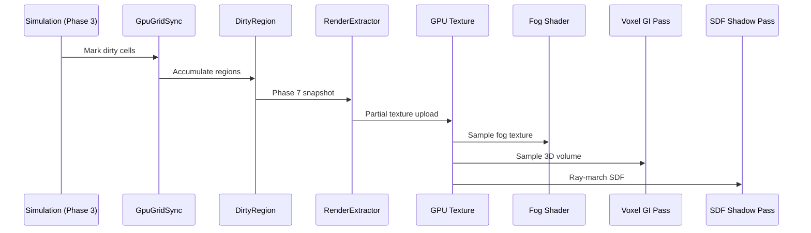

# Rendering ↔ Grids/Volumes Integration Design

## Systems Involved

| System | Design | Domain |
|--------|--------|--------|
| Rendering | [rendering-core.md](../rendering/rendering-core.md) | GPU pipeline |
| Grids/Volumes | [grids-volumes.md](../simulation/grids-volumes.md) | Spatial sim |

## Integration Requirements

| ID | Requirement | Systems |
|----|-------------|---------|
| IR-3.3.1 | Fog of war grid uploads to GPU texture | GV, Ren |
| IR-3.3.2 | Voxel GI reads volume data for lighting | GV, Ren |
| IR-3.3.3 | SDF volumes provide distance field shadows | GV, Ren |
| IR-3.3.4 | Dirty region tracking minimizes uploads | GV, Ren |
| IR-3.3.5 | Tactical grid overlays render as decals | GV, Ren |

1. **IR-3.3.1** -- `GpuGridSync` uploads dirty regions of `UniformGrid<FogCell>` to a GPU texture
   each frame. The fog of war shader samples this texture to darken unexplored/hidden areas.
   Three-state cells (hidden, explored, visible) map to R8 values (0, 128, 255).
2. **IR-3.3.2** -- `VoxelVolume<VoxelGiCell>` provides voxelized scene data for the voxel GI
   fallback path (F-2.5.14). The volume is uploaded as a 3D texture. The GI compute pass reads it
   for light propagation on non-RT hardware.
3. **IR-3.3.3** -- `VoxelVolume<SdfCell>` stores signed distance field data. The distance field
   shadow pass (F-2.4.16) ray-marches this 3D texture to produce soft shadows without shadow maps.
4. **IR-3.3.4** -- `GpuGridSync` tracks `DirtyRegion` rectangles. Only changed cells are uploaded
   via partial texture updates, keeping upload cost proportional to changes (NFR-SIM.GV5 < 1 ms).
5. **IR-3.3.5** -- Tactical grid cell states (cover, elevation, occupancy) render as screen-space
   decal overlays projected onto terrain. The overlay pass reads the grid GPU texture and applies
   color coding.

## Data Contracts

| Type | Defined in | Consumed by | Purpose |
|------|-----------|-------------|---------|
| `GpuGridSync` | Grids/Volumes | Rendering | Upload mgr |
| `DirtyRegion` | Grids/Volumes | Rendering | Changed area |
| `UniformGrid<T>` | Grids/Volumes | Rendering | Grid data |
| `VoxelVolume<T>` | Grids/Volumes | Rendering | 3D volume |
| Render graph pass | Rendering | Grids/Volumes | Pass reg |

```rust
/// GPU-side fog of war texture descriptor.
/// Created from UniformGrid<FogCell> dirty regions.
pub struct FogGpuTexture {
    pub texture: GpuTexture,
    pub width: u32,
    pub height: u32,
    pub format: TextureFormat, // R8Unorm
}

/// GPU-side 3D volume for voxel GI or SDF shadows.
pub struct VolumeGpuTexture {
    pub texture: GpuTexture,
    pub dimensions: UVec3,
    pub format: TextureFormat, // R16Float for SDF
    pub world_origin: Vec3,
    pub voxel_size: f32,
}
```

## Data Flow



## Timing and Ordering

| System | Phase | Timestep | Order |
|--------|-------|----------|-------|
| Grid propagation | 3-Simulation | Fixed | Early |
| LOS computation | 3-Simulation | Fixed | After prop |
| DirtyRegion mark | 3-Simulation | Fixed | After LOS |
| GpuGridSync drain | 7-Snapshot | Variable | In extract |
| Texture upload | Render thread | Variable | Before passes |
| Fog shader | Render thread | Variable | Post-light |
| Voxel GI pass | Render thread | Variable | Before light |
| SDF shadow pass | Render thread | Variable | Shadow phase |

## Failure Modes

| Failure | Impact | Recovery |
|---------|--------|----------|
| Upload exceeds 1 ms | Frame stall | Cap dirty region count |
| 3D texture OOM | No voxel GI | Fall back to baked probes |
| SDF volume stale | Shadow lag | Accept 1-frame latency |
| Grid resize at runtime | Texture mismatch | Recreate GPU texture |
| NaN in SDF data | Shadow artifacts | Clamp SDF to max dist |

## Platform Considerations

| Platform | Fog texture | 3D volume | SDF shadows |
|----------|------------|-----------|-------------|
| Desktop | R8, full res | 128^3 R16F | Enabled |
| Console | R8, full res | 128^3 R16F | Enabled |
| Mobile | R8, half res | 64^3 R16F | Disabled |
| Switch | R8, full res | 64^3 R16F | Disabled |

## Test Plan

See companion [rendering-grids-volumes-test-cases.md](rendering-grids-volumes-test-cases.md).

## Review Feedback

1. **Missing classDiagram.** Design CLAUDE.md requires a Mermaid `classDiagram` covering all types,
   but this document only has a sequence diagram. `FogGpuTexture`, `VolumeGpuTexture`,
   `GpuGridSync`, `DirtyRegion`, `UniformGrid<T>`, `VoxelVolume<T>`, and their relationships are not
   diagrammed. [CONFIDENT]

2. **No rkyv derives on data contracts.** `FogGpuTexture` and `VolumeGpuTexture` lack
   `#[derive(Archive, ...)]`. The constraints mandate rkyv-only binary serialization with zero-copy
   mmap. If these structs cross a snapshot boundary, they must use rkyv. [CONFIDENT]

3. **`GpuTexture` ownership unclear -- potential Arc/Rc.** The `texture: GpuTexture` field is
   opaque. The constraints forbid `Arc`, `Rc`, `Cell`, and `RefCell`. The design should specify
   whether `GpuTexture` is a generational handle/index or an owned resource, and how it avoids
   reference counting. [CONFIDENT]

4. **No crossbeam-channel in data flow.** The three-thread model requires all inter-thread
   communication via crossbeam-channel. The sequence diagram shows `DR -> EX: Phase 7 snapshot` and
   `EX -> GPU: Partial texture upload` without specifying the channel boundary between worker
   threads and the render thread. [CONFIDENT]

5. **No 2D/2.5D considerations.** The constraints require first-class 2D/2.5D support. Fog of war,
   tactical grids, and voxel GI all have 2D analogs. The document does not discuss how these
   features adapt for 2D or 2.5D games (e.g., fog of war on a tilemap, 2D lighting instead of voxel
   GI). [CONFIDENT]

6. **Dirty region data structure unspecified.** The design references `DirtyRegion` but does not
   specify its internal representation. The constraints forbid `HashMap` on hot paths. If dirty
   regions are tracked per-cell in a map, this violates the constraint. A bitfield or region list
   should be specified explicitly. [CONFIDENT]

7. **Missing Open Questions section.** The design template requires an Open Questions section. This
   document omits it entirely. [CONFIDENT]

8. **Missing Overview and Requirements Trace sections.** The standard design template requires a
   Requirements Trace table (mapping R-X.Y.Z / F-X.Y.Z to design elements) and an Overview section.
   Neither is present.
   [UNCERTAIN -- integration designs may follow a lighter template, but the design CLAUDE.md does not exempt them.]

9. **No immutable-first pattern documented.** The constraints prefer immutable data with mutable
   containers. The design does not clarify whether `UniformGrid<FogCell>` is mutated in place or
   rebuilt immutably each frame. The dirty-region approach implies mutation, which should be
   justified per the constraints. [CONFIDENT]

10. **`world_origin` and `voxel_size` on `VolumeGpuTexture` may belong in ECS.** Per the ECS-primary
    constraint, per-volume spatial metadata (origin, voxel size) should be ECS components rather
    than fields on a GPU-side struct. The GPU struct should hold only GPU resource handles; spatial
    data should live in the ECS world. [UNCERTAIN]

11. **No platform-specific upload strategy.** The Platform Considerations table lists texture
    formats and resolutions but does not address platform-specific upload mechanisms (DirectStorage
    on Windows, Metal I/O on Apple, staging buffers on Vulkan). The constraints require
    platform-native I/O for GPU assets. [CONFIDENT]

12. **Test cases lack a 2D/2.5D scenario.** The companion test file covers 3D fog, voxel GI, and SDF
    shadows but has no test case for 2D fog of war on a tilemap or 2D tactical overlays. Given the
    2D/2.5D constraint, at least one 2D-specific test case per IR should exist. [CONFIDENT]

13. **No failure test cases.** The design lists five failure modes (upload exceed, OOM, stale SDF,
    grid resize, NaN) but the companion test file has no test cases for any of them. Each failure
    mode should have a corresponding test verifying the recovery behavior. [CONFIDENT]

14. **Benchmark target mismatch.** TC-IR-3.3.1.B1 benchmarks "full 256x256 upload at < 1 ms" but
    IR-3.3.4 exists specifically to avoid full uploads via dirty regions. The benchmark should also
    cover worst-case partial upload scenarios at realistic grid sizes (e.g., 1024x1024 with 5%
    dirty). [UNCERTAIN]

15. **No render-graph pass registration detail.** The Data Contracts table lists "Render graph pass"
    as a contract but the Rust pseudocode only shows texture structs. The fog overlay pass, voxel GI
    pass, and SDF shadow pass should each have a struct or registration signature in the pseudocode.
    [CONFIDENT]
