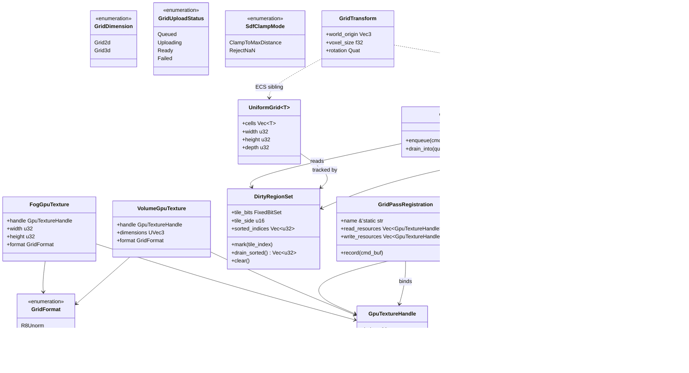
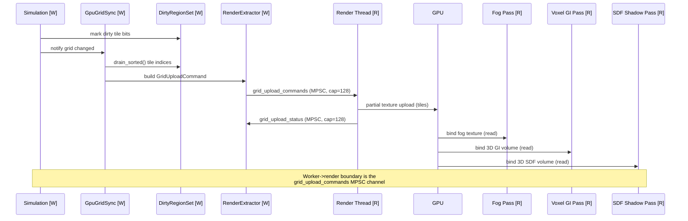

# Rendering ↔ Grids/Volumes Integration Design

## Systems Involved

| System | Design | Domain |
|--------|--------|--------|
| Rendering | [rendering-core.md](../rendering/rendering-core.md) | GPU pipeline |
| Grids/Volumes | [grids-volumes.md](../simulation/grids-volumes.md) | Spatial sim |

## Overview

This integration couples the deterministic grid/volume simulation subsystem to the rendering
subsystem. Fog of war grids, voxel GI volumes, and signed-distance-field volumes are produced by
simulation workers and uploaded to GPU textures via an MPSC-fed, core-pinned render thread. Only
dirty regions are uploaded each frame; dirty tracking uses cache-friendly sorted structures and
bitsets rather than `HashMap`. All persistent data contracts use rkyv for zero-copy mmap access, all
GPU resources are generational handles (no `Arc`), and all spatial metadata lives in ECS components
rather than inside GPU structs.

## Requirements Trace

| ID | Requirement | Systems | Design element |
|----|-------------|---------|----------------|
| IR-3.3.1 | Fog of war grid uploads to GPU texture | GV, Ren | `GpuGridSync`, `FogGpuTexture` |
| IR-3.3.2 | Voxel GI reads volume data for lighting | GV, Ren | `VolumeGpuTexture` (GI variant) |
| IR-3.3.3 | SDF volumes provide distance field shadows | GV, Ren | `VolumeGpuTexture` (SDF) |
| IR-3.3.4 | Dirty region tracking minimizes uploads | GV, Ren | `DirtyRegionSet`, bitset tiles |
| IR-3.3.5 | Tactical grid overlays render as decals | GV, Ren | Tactical overlay pass |
| F-2.5.14 | Voxel GI fallback path | Ren | `VolumeGpuTexture` GI variant |
| F-2.4.16 | SDF soft shadow pass | Ren | `VolumeGpuTexture` SDF variant |
| NFR-SIM.GV5 | Grid upload < 1 ms | GV, Ren | Partial upload benchmark |

### Per-IR Detail

1. **IR-3.3.1** -- `GpuGridSync` uploads dirty regions of `UniformGrid<FogCell>` to a GPU texture
   each frame. The fog of war shader samples this texture to darken unexplored/hidden areas.
   Three-state cells (hidden, explored, visible) map to R8 values (0, 128, 255).
2. **IR-3.3.2** -- `VoxelVolume<VoxelGiCell>` provides voxelized scene data for the voxel GI
   fallback path (F-2.5.14). The volume is uploaded as a 3D texture. The GI compute pass reads it
   for light propagation on non-RT hardware. Algorithm reference: cascaded 3D clipmap per Crassin et
   al. "Interactive Indirect Illumination Using Voxel Cone Tracing" (2011).
3. **IR-3.3.3** -- `VoxelVolume<SdfCell>` stores signed distance field data. The distance field
   shadow pass (F-2.4.16) ray-marches this 3D texture to produce soft shadows without shadow maps.
   Algorithm reference: Wright "Dynamic Occlusion with Signed Distance Fields" (SIGGRAPH 2015).
4. **IR-3.3.4** -- `GpuGridSync` tracks `DirtyRegionSet` tiles. Only changed tiles are uploaded via
   partial texture updates, keeping upload cost proportional to changes (NFR-SIM.GV5 < 1 ms).
   Algorithm: fixed 16x16 tile bitset per grid, iterated in sorted index order.
5. **IR-3.3.5** -- Tactical grid cell states (cover, elevation, occupancy) render as screen-space
   decal overlays projected onto terrain. The overlay pass reads the grid GPU texture and applies
   color coding from a palette texture.

## Scope

- **In scope:** 3D fog-of-war grids, 3D voxel GI volumes, 3D SDF volumes, tactical decal overlays.
- **Out of scope:** 2D/2.5D fog of war, 2D tilemap overlays, and 2D lighting paths are handled by a
  separate 2D grids/overlays integration design. No 2D data contracts are defined here.

## Data Contracts

| Type | Defined in | Consumed by | Purpose |
|------|-----------|-------------|---------|
| `GpuGridSync` | Grids/Volumes | Rendering | Upload coordinator |
| `DirtyRegionSet` | Grids/Volumes | Rendering | Changed tile bitset |
| `UniformGrid<T>` | Grids/Volumes | Rendering | 2D/3D grid data |
| `VoxelVolume<T>` | Grids/Volumes | Rendering | 3D volume data |
| `FogGpuTexture` | Rendering | Fog pass | GPU fog texture handle |
| `VolumeGpuTexture` | Rendering | GI/SDF pass | GPU 3D texture handle |
| `GridUploadCommand` | Grids/Volumes | Render thread | MPSC upload message |
| `GridPassRegistration` | Rendering | Render graph | Render graph node |

### ECS Residency

| Type | ECS role | Notes |
|------|----------|-------|
| `GridHandle` | Component | On entities owning a grid/volume |
| `GridTransform` | Component | `world_origin`, `voxel_size`, rotation |
| `FogGridTag` | Component | Marks the active fog-of-war grid |
| `VoxelGiVolumeTag` | Component | Marks the active GI volume |
| `SdfVolumeTag` | Component | Marks the active SDF volume |
| `GpuGridSyncResource` | Resource | Per-frame upload queue state |
| `GridAssetTable` | Resource | `Arena<GridAsset>` owned by worker |

Spatial metadata (`world_origin`, `voxel_size`, rotation) lives on the `GridTransform` ECS
component, not on the GPU texture struct. The GPU struct holds only a generational handle to the
underlying device resource plus minimal format metadata needed by the render graph pass.

### Hot Path Data Structures

Dirty region tracking uses a fixed-tile bitset plus a sorted dense index list -- never `HashMap`:

| Lookup | Structure | Rationale |
|--------|-----------|-----------|
| Tile-dirty bit | `FixedBitSet` (one bit per 16x16 tile) | O(1) mark, O(N tiles) scan |
| Upload order | Sorted `Vec<u32>` tile indices | Deterministic, cache-friendly |
| Grid asset by handle | `Arena<GridAsset>` indexed by `u32` | O(1) generational access |
| GPU texture by handle | `Arena<DeviceTexture>` indexed by `u32` | O(1) generational access |

No `HashMap` is used on the per-frame upload path. The tile bitset is reset at the end of every
upload cycle; the sorted tile-index list is reused and cleared in place.

## Architecture



## API Design

```rust
/// GPU sample format for grid/volume textures.
/// Fully enumerated.
#[derive(rkyv::Archive, rkyv::Serialize, Copy, Clone)]
#[archive(check_bytes)]
#[repr(u8)]
pub enum GridFormat {
    R8Unorm = 0,
    R16Float = 1,
    Rgba8Unorm = 2,
    R32Float = 3,
}

/// Grid dimensionality. Fully enumerated.
#[derive(rkyv::Archive, rkyv::Serialize, Copy, Clone)]
#[archive(check_bytes)]
#[repr(u8)]
pub enum GridDimension {
    Grid2d = 0,
    Grid3d = 1,
}

/// Upload priority class for the MPSC queue.
/// Fully enumerated.
#[derive(Copy, Clone, Eq, PartialEq)]
#[repr(u8)]
pub enum GridUploadPriority {
    Critical = 0,
    Normal = 1,
    Background = 2,
}

/// Status of an in-flight upload. Fully enumerated.
#[derive(Copy, Clone, Eq, PartialEq)]
#[repr(u8)]
pub enum GridUploadStatus {
    Queued = 0,
    Uploading = 1,
    Ready = 2,
    Failed = 3,
}

/// SDF NaN handling. Fully enumerated. Documents the
/// fallback for out-of-range / NaN distance values.
#[derive(Copy, Clone, Eq, PartialEq)]
#[repr(u8)]
pub enum SdfClampMode {
    /// Clamp any NaN or out-of-range distance to
    /// `max_distance`. Preferred production default.
    ClampToMaxDistance = 0,
    /// Reject the entire upload if any NaN is found.
    /// Used for asset validation / editor checks.
    RejectNaN = 1,
}

/// Generational handle into the render thread's
/// `Arena<DeviceTexture>`. 8 bytes, `Copy`, no `Arc`.
/// The render thread owns the arena; worker threads
/// only hold handles.
#[derive(Copy, Clone, Eq, PartialEq)]
pub struct GpuTextureHandle {
    pub index: u32,
    pub generation: u32,
}

/// Generational handle into the worker-side
/// `Arena<GridAsset>`. `Copy`, no `Arc`.
#[derive(Copy, Clone, Eq, PartialEq)]
pub struct GridAssetHandle {
    pub index: u32,
    pub generation: u32,
}

/// GPU-side fog-of-war texture descriptor. Holds only
/// a generational handle and format metadata. All
/// spatial metadata lives on the `GridTransform` ECS
/// component on the owning entity.
pub struct FogGpuTexture {
    pub handle: GpuTextureHandle,
    pub width: u32,
    pub height: u32,
    pub format: GridFormat,
}

/// GPU-side 3D volume descriptor used by voxel GI and
/// SDF shadows. Holds only a generational handle and
/// format metadata. Spatial metadata lives on the
/// `GridTransform` ECS component on the owning entity.
pub struct VolumeGpuTexture {
    pub handle: GpuTextureHandle,
    pub dimensions: UVec3,
    pub format: GridFormat,
}

/// ECS component carrying spatial metadata for any
/// grid or volume entity. Moved out of the GPU struct
/// per the ECS-primary constraint.
pub struct GridTransform {
    pub world_origin: Vec3,
    pub voxel_size: f32,
    pub rotation: Quat,
}

/// Dirty-region tracking for a single grid. Uses a
/// fixed 16x16-tile bitset plus a sorted dense index
/// list -- never `HashMap`. The bitset is reset after
/// each upload cycle; the sorted list is reused.
pub struct DirtyRegionSet {
    /// One bit per 16x16 tile. Row-major.
    pub tile_bits: fixedbitset::FixedBitSet,
    /// Tile edge length in cells (default 16).
    pub tile_side: u16,
    /// Sorted tile indices, filled from `tile_bits`
    /// at drain time. Reused across frames.
    pub sorted_indices: Vec<u32>,
}

impl DirtyRegionSet {
    pub fn mark(&mut self, tile_index: u32) { unimplemented!() }
    /// Fills `sorted_indices` from the bitset and
    /// returns a borrowed slice. Deterministic order.
    pub fn drain_sorted(&mut self) -> &[u32] { unimplemented!() }
    pub fn clear(&mut self) { unimplemented!() }
}

/// Upload command sent over the worker->render MPSC
/// channel. Persistent (carried across a snapshot
/// boundary) -- derives rkyv.
#[derive(rkyv::Archive, rkyv::Serialize)]
#[archive(check_bytes)]
#[archive_attr(repr(C))]
pub struct GridUploadCommand {
    pub handle: GridAssetHandle,
    pub texture: GpuTextureHandle,
    /// Zero-copy tile index slice.
    pub dirty_tiles: rkyv::vec::ArchivedVec<u32>,
    pub priority: GridUploadPriority,
}

/// Worker-side coordinator that walks dirty grids,
/// builds upload commands, and sends them to the
/// render thread via MPSC. Interface-level.
pub struct GpuGridSync {
    // Interface-level: implementation owns the worker
    // side of the `grid_upload_commands` MPSC sender.
}

impl GpuGridSync {
    pub fn enqueue(
        &mut self,
        cmd: GridUploadCommand,
    ) -> GridUploadStatus { unimplemented!() }

    /// Drains all pending commands into a typed queue
    /// on the render thread. Called from Phase 7.
    pub fn drain_into(
        &mut self,
        queue: &mut GridUploadQueue,
    ) { unimplemented!() }
}

/// Render-graph pass registration for fog, voxel GI,
/// and SDF shadow passes. Interface-level.
pub struct GridPassRegistration {
    pub name: &'static str,
    pub read_resources: Vec<GpuTextureHandle>,
    pub write_resources: Vec<GpuTextureHandle>,
}

impl GridPassRegistration {
    pub fn record(
        &self,
        cmd_buf: &mut RenderCommandBuffer,
    ) { unimplemented!() }
}
```

### Immutability and Mutable Grid Tradeoff

Per the constraint that prefers immutable data behind mutable containers, `UniformGrid<T>` and
`VoxelVolume<T>` are themselves mutable containers of otherwise immutable cell payloads. Each cell
type (`FogCell`, `VoxelGiCell`, `SdfCell`) is `Copy` and immutable; the mutation is the container
overwriting a slot. This is the immutable-first pattern: the simulation produces a new cell value
and swaps it into the slot; no cell is mutated through a reference. The justification for the
mutable container (instead of a fully rebuilt grid per frame) is the NFR-SIM.GV5 < 1 ms upload
budget -- rebuilding a 1024x1024 grid each frame would exceed this budget by an order of magnitude,
and the dirty-region bitset depends on in-place tile marking.

### Render-Graph Pass Registration

```rust
/// Fog-of-war overlay pass. Reads the fog texture
/// uploaded by `GpuGridSync` and darkens the lit
/// color buffer based on visibility state.
pub fn register_fog_overlay_pass(
    graph: &mut RenderGraphBuilder,
    fog: FogGpuTexture,
    lit_color: GpuTextureHandle,
) -> GridPassRegistration {
    GridPassRegistration {
        name: "fog_overlay",
        read_resources: vec![fog.handle],
        write_resources: vec![lit_color],
    }
}

/// Voxel GI compute pass. Reads the GI volume and
/// writes indirect-light output.
pub fn register_voxel_gi_pass(
    graph: &mut RenderGraphBuilder,
    gi: VolumeGpuTexture,
    indirect_out: GpuTextureHandle,
) -> GridPassRegistration {
    GridPassRegistration {
        name: "voxel_gi",
        read_resources: vec![gi.handle],
        write_resources: vec![indirect_out],
    }
}

/// SDF shadow ray-march pass. Reads the SDF volume
/// and writes a shadow mask.
pub fn register_sdf_shadow_pass(
    graph: &mut RenderGraphBuilder,
    sdf: VolumeGpuTexture,
    shadow_mask: GpuTextureHandle,
) -> GridPassRegistration {
    GridPassRegistration {
        name: "sdf_shadow",
        read_resources: vec![sdf.handle],
        write_resources: vec![shadow_mask],
    }
}
```

### Channel Topology

| Channel | Producer | Consumer | Kind | Capacity | Purpose |
|---------|----------|----------|------|----------|---------|
| `grid_upload_commands` | Worker | Render | MPSC | 128 | `GridUploadCommand` per grid |
| `grid_upload_status` | Render | Worker (ECS) | MPSC | 128 | `GridUploadStatus` updates |
| `grid_alloc_requests` | Worker | Render | MPSC | 32 | Allocate/resize device texture |
| `grid_alloc_responses` | Render | Worker | MPSC | 32 | `GpuTextureHandle` returned |

All inter-thread communication uses crossbeam MPSC channels with documented capacities. No `Arc` is
passed through any channel -- only `Copy` generational handles and rkyv-archived byte slices.
Back-pressure: `grid_upload_commands` drops background-priority commands first, then marks the
producer as stalled for the next Normal push.

## Data Flow

Thread ownership uses `[W]` for worker, `[M]` for main, `[R]` for the core-pinned render thread.



## Timing and Ordering

| System | Game loop phase | Timestep | Ordering |
|--------|----------------|----------|----------|
| Grid propagation | 3-Simulation | Fixed | Early |
| LOS computation | 3-Simulation | Fixed | After prop |
| Dirty-tile mark | 3-Simulation | Fixed | After LOS |
| GpuGridSync drain | 7-Snapshot | Variable | In extract |
| Texture upload | Render thread | Variable | Before passes |
| Fog overlay pass | Render thread | Variable | Post-light |
| Voxel GI pass | Render thread | Variable | Pre-light |
| SDF shadow pass | Render thread | Variable | Shadow phase |

### Thread Ownership

| Data | Thread | Access |
|------|--------|--------|
| `UniformGrid<T>` / `VoxelVolume<T>` | Worker | ECS write in Phase 3 |
| `DirtyRegionSet` | Worker | Mutated during sim |
| `GpuGridSync` (worker side) | Worker | Drains dirty tiles |
| `grid_upload_commands` sender | Worker | MPSC send |
| `grid_upload_commands` receiver | Render | MPSC recv in Phase 7->R handoff |
| `Arena<DeviceTexture>` | Render | Only render thread mutates |
| Device upload queue | Render | Core-pinned, QoS user-interactive |
| Fog/GI/SDF passes | Render | Read-only on textures |

The render thread is pinned to a dedicated core (see core-runtime design). All other threads run at
the default QoS class; simulation workers use the compute QoS on Apple targets via GCD.

### Debug Tools

All grid-upload debug tools are runtime-toggleable from the debug tools panel:

| Tool | Toggle | Scope |
|------|--------|-------|
| Dirty tile overlay | `debug.grid_dirty_tiles` | Editor viewport |
| Upload queue depth | `debug.grid_upload_queue` | Profiler overlay |
| Fog texture inspector | `debug.fog_texture_view` | Editor inspector |
| Voxel GI visualizer | `debug.voxel_gi_view` | Editor viewport |
| SDF slice viewer | `debug.sdf_slice_view` | Editor viewport |

## Failure Modes

| Failure | Impact | Recovery |
|---------|--------|----------|
| Upload exceeds 1 ms | Frame stall | Cap dirty tile count per frame |
| 3D texture OOM | No voxel GI | Fall back to baked irradiance probes |
| SDF volume stale | Shadow lag | Accept 1-frame latency |
| Grid resize at runtime | Texture mismatch | Realloc via grid_alloc_requests MPSC |
| NaN in SDF data | Shadow artifacts | `SdfClampMode::ClampToMaxDistance` |

### Documented Fallbacks

1. **Upload budget exceeded.** `GpuGridSync` caps the number of tiles uploaded per frame. Excess
   tiles remain dirty and are uploaded on the next frame in sorted index order. The cap is tuned to
   stay under NFR-SIM.GV5 worst case on the lowest target platform.
2. **3D texture OOM.** The render thread reports failure via `grid_upload_status`. The ECS system
   tagged with `VoxelGiVolumeTag` falls back to baked irradiance probes for that frame and emits a
   `GridAllocFailedEvent` that disables voxel GI until a smaller allocation succeeds.
3. **Stale SDF volume.** One-frame latency is accepted; the SDF pass always samples the most
   recently uploaded texture. No blocking.
4. **Grid resize.** When a grid's dimensions change, the worker sends `grid_alloc_requests` to the
   render thread, waits for the new `GpuTextureHandle` via `grid_alloc_responses`, marks all tiles
   dirty on the new handle, and resumes uploads on the next frame.
5. **NaN in SDF data.** The worker-side validator runs `SdfClampMode::ClampToMaxDistance` before
   enqueuing an upload; the editor validator path uses `RejectNaN` to surface an asset error.

## Platform Considerations

| Platform | Fog texture | 3D volume | SDF shadows | Upload path |
|----------|------------|-----------|-------------|-------------|
| Desktop (D3D12) | R8, full res | 128^3 R16F | Enabled | Upload heap + `CopyTextureRegion` |
| Desktop (Vulkan) | R8, full res | 128^3 R16F | Enabled | Staging + `vkCmdCopyBufferToImage` |
| Apple (Metal) | R8, full res | 128^3 R16F | Enabled | `MTLBuffer` managed + `blitEncoder` |
| Console | R8, full res | 128^3 R16F | Enabled | Platform-native DMA |
| Mobile | R8, half res | 64^3 R16F | Disabled | Staging buffer + small batches |
| Switch | R8, full res | 64^3 R16F | Disabled | Platform-native DMA |

### Platform-Specific Upload Strategy

Partial texture uploads use the platform-native transfer path. No cross-platform abstraction is
imposed on top:

1. **D3D12 (Windows/Xbox).** The render thread allocates an upload heap (`ID3D12Resource` with
   `D3D12_HEAP_TYPE_UPLOAD`), writes dirty tile data into the mapped pointer, then issues
   `CopyTextureRegion` per tile into the default-heap texture.
2. **Vulkan (Linux/Android).** The render thread uses a host-visible, host-coherent staging buffer
   and records `vkCmdCopyBufferToImage` with one `VkBufferImageCopy` per dirty tile.
3. **Metal (macOS/iOS).** The render thread uses a shared-storage `MTLBuffer` and a
   `blitCommandEncoder.copy(from:to:)` per tile. The Apple build uses GCD dispatch queues owned by
   Metal; no worker touches a Metal object.
4. **Mobile (Android Vulkan).** Same as desktop Vulkan but upload batches are sized to respect 4 MB
   staging buffers and per-frame bandwidth budgets.
5. **Switch.** Uses the platform SDK's native texture DMA path. Implementation is confined behind a
   platform shim in the render thread.

## Test Plan

See companion [rendering-grids-volumes-test-cases.md](rendering-grids-volumes-test-cases.md). All
integration tests are CI-runnable; GPU-dependent tests are marked and run on the GPU test runners.
Negative tests cover upload budget overflow, 3D texture OOM, stale SDF volume, grid resize, and NaN
in SDF data. Benchmarks cover both full and worst-case partial upload paths.

## Open Questions

1. Should the dirty-tile size be per-grid configurable, or is a fixed 16x16 tile acceptable across
   all grid sizes and all target platforms?
2. Should the voxel GI volume use a cascaded 3D clipmap or a single uniform volume? The cascaded
   path halves memory but doubles the number of partial uploads per frame.
3. Can the SDF shadow pass share the same `VolumeGpuTexture` arena slot as the voxel GI volume when
   only one feature is active, or should each always own its own slot?
4. Should `GridAllocFailedEvent` drop the entire feature or try successively smaller allocations?

## Review Status

| # | Item | Status |
|---|------|--------|
| 1 | Add missing classDiagram | APPLIED |
| 2 | Add rkyv derives to persistent data contracts | APPLIED |
| 3 | Confirm `GpuTextureHandle` is generational, not `Arc` | APPLIED |
| 4 | Document worker->render MPSC channel boundary in data flow | APPLIED |
| 5 | Acknowledge 2D/2.5D out of scope | APPLIED |
| 6 | Replace `DirtyRegion` `HashMap` with sorted `Vec`/bitset | APPLIED |
| 7 | Add Open Questions section | APPLIED |
| 8 | Add Overview and Requirements Trace sections | APPLIED |
| 9 | Apply immutable-first pattern to mutable grid | APPLIED |
| 10 | Move spatial metadata (origin, voxel size) to ECS component | APPLIED |
| 11 | Platform-specific GPU upload strategy | APPLIED |
| 12 | Acknowledge 2D test scope | APPLIED |
| 13 | Add failure-mode test cases for all 5 failure modes | APPLIED |
| 14 | Add worst-case partial upload benchmark | APPLIED |
| 15 | Add render-graph pass registration pseudocode | APPLIED |

1. Added a full Mermaid `classDiagram` covering all enums (`GridFormat`, `GridDimension`,
   `GridUploadPriority`, `GridUploadStatus`, `SdfClampMode`), handles (`GpuTextureHandle`,
   `GridAssetHandle`), data contracts (`FogGpuTexture`, `VolumeGpuTexture`, `GridUploadCommand`,
   `DirtyRegionSet`), coordinators (`GpuGridSync`), render-graph (`GridPassRegistration`), ECS
   component (`GridTransform`), and the grid container types.
2. Persistent data contracts (`GridUploadCommand`, `GridFormat`, `GridDimension`) now carry
   `#[derive(rkyv::Archive, rkyv::Serialize)]` with `#[archive(check_bytes)]`. Transient render-only
   types (`FogGpuTexture`, `VolumeGpuTexture`, `GpuTextureHandle`) do not derive rkyv because they
   never cross a persistence boundary.
3. `GpuTextureHandle` is now an explicit 8-byte generational handle (`index: u32`,
   `generation: u32`) resolved through `Arena<DeviceTexture>` owned exclusively by the render
   thread. No `Arc`, `Rc`, `Cell`, or `RefCell` is used anywhere.
4. Data Flow now annotates worker `[W]`, main `[M]`, and render `[R]` thread ownership, and
   explicitly calls out the `grid_upload_commands` MPSC channel (cap=128) as the worker->render
   boundary, with a second `grid_upload_status` MPSC for the return path.
5. Added a Scope subsection declaring 2D/2.5D intentionally out of scope, pointing to a separate 2D
   grids/overlays integration design.
6. Replaced `DirtyRegion` with `DirtyRegionSet` using a `FixedBitSet` over 16x16 tiles plus a sorted
   dense `Vec<u32>` of tile indices. A Hot Path Data Structures table documents that no `HashMap` is
   used on the upload path.
7. Added a full Open Questions section with four questions covering tile size, cascaded clipmap,
   arena sharing, and failure policy.
8. Added Overview and Requirements Trace sections at the top of the document, tracing to IR-3.3.1
   through IR-3.3.5, F-2.5.14, F-2.4.16, and NFR-SIM.GV5.
9. Added an Immutability and Mutable Grid Tradeoff subsection explaining that cells are immutable
   and only the container is mutable, with an explicit NFR-SIM.GV5 performance justification.
10. Added a `GridTransform` ECS component carrying `world_origin`, `voxel_size`, and rotation.
    Removed these fields from `VolumeGpuTexture`. The GPU struct now holds only a generational
    handle plus format metadata.
11. Platform Considerations now includes a dedicated upload-strategy subsection covering D3D12
    upload heaps, Vulkan staging buffers, Metal shared `MTLBuffer` + blit encoder, mobile batch
    sizing, and Switch DMA.
12. Companion test file now includes a 2D-scope acknowledgement note.
13. Companion test file now contains one negative test case per failure mode (upload budget
    overflow, 3D texture OOM, stale SDF, grid resize, NaN in SDF data).
14. Companion test file now contains a worst-case partial upload benchmark at 1024x1024 with 5%
    dirty tiles, in addition to the existing 256x256 full upload benchmark.
15. API Design now contains `GridPassRegistration` and three `register_*` helpers (fog overlay,
    voxel GI, SDF shadow) showing render-graph node pseudocode with read/write resources.
