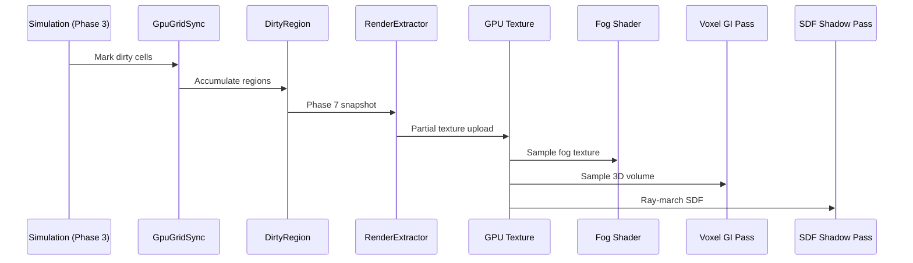

# Rendering ↔ Grids/Volumes Integration Design

## Systems Involved

| System | Design | Domain |
|--------|--------|--------|
| Rendering | [rendering-core.md](../rendering/rendering-core.md) | GPU pipeline |
| Grids/Volumes | [grids-volumes.md](../simulation/grids-volumes.md) | Spatial sim |

## Integration Requirements

| ID | Requirement | Systems |
|----|-------------|---------|
| IR-3.3.1 | Fog of war grid uploads to GPU texture | GV, Ren |
| IR-3.3.2 | Voxel GI reads volume data for lighting | GV, Ren |
| IR-3.3.3 | SDF volumes provide distance field shadows | GV, Ren |
| IR-3.3.4 | Dirty region tracking minimizes uploads | GV, Ren |
| IR-3.3.5 | Tactical grid overlays render as decals | GV, Ren |

1. **IR-3.3.1** -- `GpuGridSync` uploads dirty regions of `UniformGrid<FogCell>` to a GPU texture
   each frame. The fog of war shader samples this texture to darken unexplored/hidden areas.
   Three-state cells (hidden, explored, visible) map to R8 values (0, 128, 255).
2. **IR-3.3.2** -- `VoxelVolume<VoxelGiCell>` provides voxelized scene data for the voxel GI
   fallback path (F-2.5.14). The volume is uploaded as a 3D texture. The GI compute pass reads it
   for light propagation on non-RT hardware.
3. **IR-3.3.3** -- `VoxelVolume<SdfCell>` stores signed distance field data. The distance field
   shadow pass (F-2.4.16) ray-marches this 3D texture to produce soft shadows without shadow maps.
4. **IR-3.3.4** -- `GpuGridSync` tracks `DirtyRegion` rectangles. Only changed cells are uploaded
   via partial texture updates, keeping upload cost proportional to changes (NFR-SIM.GV5 < 1 ms).
5. **IR-3.3.5** -- Tactical grid cell states (cover, elevation, occupancy) render as screen-space
   decal overlays projected onto terrain. The overlay pass reads the grid GPU texture and applies
   color coding.

## Data Contracts

| Type | Defined in | Consumed by | Purpose |
|------|-----------|-------------|---------|
| `GpuGridSync` | Grids/Volumes | Rendering | Upload mgr |
| `DirtyRegion` | Grids/Volumes | Rendering | Changed area |
| `UniformGrid<T>` | Grids/Volumes | Rendering | Grid data |
| `VoxelVolume<T>` | Grids/Volumes | Rendering | 3D volume |
| Render graph pass | Rendering | Grids/Volumes | Pass reg |

```rust
/// GPU-side fog of war texture descriptor.
/// Created from UniformGrid<FogCell> dirty regions.
pub struct FogGpuTexture {
    pub texture: GpuTexture,
    pub width: u32,
    pub height: u32,
    pub format: TextureFormat, // R8Unorm
}

/// GPU-side 3D volume for voxel GI or SDF shadows.
pub struct VolumeGpuTexture {
    pub texture: GpuTexture,
    pub dimensions: UVec3,
    pub format: TextureFormat, // R16Float for SDF
    pub world_origin: Vec3,
    pub voxel_size: f32,
}
```

## Data Flow



## Timing and Ordering

| System | Phase | Timestep | Order |
|--------|-------|----------|-------|
| Grid propagation | 3-Simulation | Fixed | Early |
| LOS computation | 3-Simulation | Fixed | After prop |
| DirtyRegion mark | 3-Simulation | Fixed | After LOS |
| GpuGridSync drain | 7-Snapshot | Variable | In extract |
| Texture upload | Render thread | Variable | Before passes |
| Fog shader | Render thread | Variable | Post-light |
| Voxel GI pass | Render thread | Variable | Before light |
| SDF shadow pass | Render thread | Variable | Shadow phase |

## Failure Modes

| Failure | Impact | Recovery |
|---------|--------|----------|
| Upload exceeds 1 ms | Frame stall | Cap dirty region count |
| 3D texture OOM | No voxel GI | Fall back to baked probes |
| SDF volume stale | Shadow lag | Accept 1-frame latency |
| Grid resize at runtime | Texture mismatch | Recreate GPU texture |
| NaN in SDF data | Shadow artifacts | Clamp SDF to max dist |

## Platform Considerations

| Platform | Fog texture | 3D volume | SDF shadows |
|----------|------------|-----------|-------------|
| Desktop | R8, full res | 128^3 R16F | Enabled |
| Console | R8, full res | 128^3 R16F | Enabled |
| Mobile | R8, half res | 64^3 R16F | Disabled |
| Switch | R8, full res | 64^3 R16F | Disabled |

## Test Plan

See companion [rendering-grids-volumes-test-cases.md](rendering-grids-volumes-test-cases.md).
