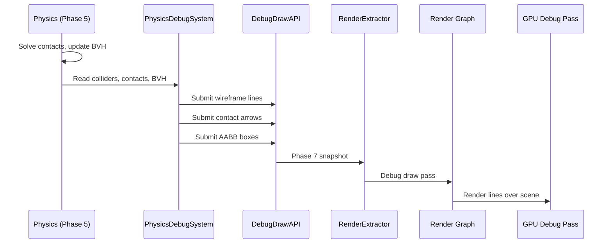

# Rendering ↔ Physics Integration Design

## Systems Involved

| System | Design | Domain |
|--------|--------|--------|
| Rendering | [rendering-core.md](../rendering/rendering-core.md) | GPU pipeline |
| Physics | [foundation.md](../physics/foundation.md) | Simulation |

## Integration Requirements

| ID | Requirement | Systems |
|----|-------------|---------|
| IR-3.4.1 | Debug draw collider wireframes | Phys, Ren |
| IR-3.4.2 | Debug draw contact normals and points | Phys, Ren |
| IR-3.4.3 | Debug draw BVH node AABBs | Phys, Ren |
| IR-3.4.4 | Debug draw raycast/shapecast results | Phys, Ren |
| IR-3.4.5 | Debug viz compile-time gated | Phys, Ren |
| IR-3.4.6 | Physics interpolation for rendering | Phys, Ren |

1. **IR-3.4.1** -- `ColliderShape` variants (sphere, box, capsule, convex hull, triangle mesh,
   heightfield) are drawn as wireframe overlays via the debug draw API (F-2.10.9). Each shape maps
   to a set of line segments colored by `RigidBodyType`.
2. **IR-3.4.2** -- `ContactManifold` and `ContactPoint` data are visualized as arrows (normal
   direction) and dots (contact positions). Arrow length scales with penetration depth.
3. **IR-3.4.3** -- The physics-private BVH and shared BVH node AABBs are drawn as wireframe boxes.
   Leaf nodes use green; internal nodes use yellow. Depth can be filtered by a debug slider.
4. **IR-3.4.4** -- `RayCast` results draw the ray as a line from origin to hit point (green) or max
   distance (red). `ShapeCast` draws the swept volume outline.
5. **IR-3.4.5** -- All physics debug visualization is gated behind `#[cfg(feature = "debug_draw")]`.
   In shipping builds, the code is stripped entirely with zero overhead (NFR-2.10.3).
6. **IR-3.4.6** -- Physics runs on fixed timestep. The render thread interpolates between previous
   and current physics transforms using the accumulator alpha: `lerp(prev, curr, alpha)`.

## Data Contracts

| Type | Defined in | Consumed by | Purpose |
|------|-----------|-------------|---------|
| `ColliderShape` | Physics | Debug draw | Wireframes |
| `ContactManifold` | Physics | Debug draw | Contacts |
| `ContactPoint` | Physics | Debug draw | Hit points |
| `BvhNode` | Spatial index | Debug draw | AABB boxes |
| `RayCast` result | Physics | Debug draw | Ray lines |
| Debug draw API | Rendering | Physics | Line submit |
| Interp alpha | Game loop | Rendering | Smoothing |

```rust
/// Debug visualization configuration for physics.
/// Compile-time gated: #[cfg(feature = "debug_draw")]
pub struct PhysicsDebugConfig {
    pub draw_colliders: bool,
    pub draw_contacts: bool,
    pub draw_bvh: bool,
    pub draw_raycasts: bool,
    pub bvh_max_depth: u32,
    pub collider_color_static: LinearColor,
    pub collider_color_dynamic: LinearColor,
    pub collider_color_kinematic: LinearColor,
    pub contact_normal_scale: f32,
}

/// Interpolated transform for smooth rendering.
pub struct InterpolatedTransform {
    pub previous: Transform,
    pub current: Transform,
    pub alpha: f32,
}
```

## Data Flow



## Timing and Ordering

| System | Phase | Timestep | Order |
|--------|-------|----------|-------|
| Physics solve | 5-Physics | Fixed | Core pipeline |
| PhysicsDebugSystem | 5-Physics | Fixed | After solve |
| Debug draw submit | 5-Physics | Fixed | After debug |
| Interp alpha calc | 8-FrameEnd | Variable | Before snap |
| RenderExtractor | 7-Snapshot | Variable | After phys |
| Debug render pass | Render thread | Variable | Last pass |

## Failure Modes

| Failure | Impact | Recovery |
|---------|--------|----------|
| Too many debug lines | Frame drop | Cap line budget |
| Stale contact data | Flicker | Use current frame only |
| BVH depth too deep | Line overflow | Clamp max_depth |
| Interp alpha > 1.0 | Overshoot | Clamp to [0, 1] |
| Debug feature off | No viz | Expected in shipping |

## Platform Considerations

None -- debug visualization uses the same line rendering path on all platforms. The `debug_draw`
feature flag is a compile-time gate independent of platform. Physics interpolation uses identical
`lerp` math everywhere.

## Test Plan

See companion [rendering-physics-test-cases.md](rendering-physics-test-cases.md).
