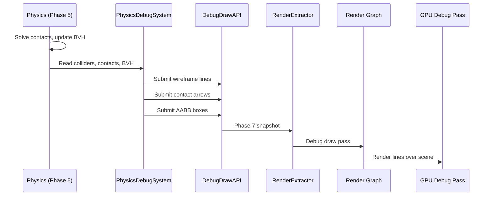

# Rendering ↔ Physics Integration Design

## Systems Involved

| System | Design | Domain |
|--------|--------|--------|
| Rendering | [rendering-core.md](../rendering/rendering-core.md) | GPU pipeline |
| Physics | [foundation.md](../physics/foundation.md) | Simulation |

## Integration Requirements

| ID | Requirement | Systems |
|----|-------------|---------|
| IR-3.4.1 | Debug draw collider wireframes | Phys, Ren |
| IR-3.4.2 | Debug draw contact normals and points | Phys, Ren |
| IR-3.4.3 | Debug draw BVH node AABBs | Phys, Ren |
| IR-3.4.4 | Debug draw raycast/shapecast results | Phys, Ren |
| IR-3.4.5 | Debug viz compile-time gated | Phys, Ren |
| IR-3.4.6 | Physics interpolation for rendering | Phys, Ren |

1. **IR-3.4.1** -- `ColliderShape` variants (sphere, box, capsule, convex hull, triangle mesh,
   heightfield) are drawn as wireframe overlays via the debug draw API (F-2.10.9). Each shape maps
   to a set of line segments colored by `RigidBodyType`.
2. **IR-3.4.2** -- `ContactManifold` and `ContactPoint` data are visualized as arrows (normal
   direction) and dots (contact positions). Arrow length scales with penetration depth.
3. **IR-3.4.3** -- The physics-private BVH and shared BVH node AABBs are drawn as wireframe boxes.
   Leaf nodes use green; internal nodes use yellow. Depth can be filtered by a debug slider.
4. **IR-3.4.4** -- `RayCast` results draw the ray as a line from origin to hit point (green) or max
   distance (red). `ShapeCast` draws the swept volume outline.
5. **IR-3.4.5** -- All physics debug visualization is gated behind `#[cfg(feature = "debug_draw")]`.
   In shipping builds, the code is stripped entirely with zero overhead (NFR-2.10.3).
6. **IR-3.4.6** -- Physics runs on fixed timestep. The render thread interpolates between previous
   and current physics transforms using the accumulator alpha: `lerp(prev, curr, alpha)`.

## Data Contracts

| Type | Defined in | Consumed by | Purpose |
|------|-----------|-------------|---------|
| `ColliderShape` | Physics | Debug draw | Wireframes |
| `ContactManifold` | Physics | Debug draw | Contacts |
| `ContactPoint` | Physics | Debug draw | Hit points |
| `BvhNode` | Spatial index | Debug draw | AABB boxes |
| `RayCast` result | Physics | Debug draw | Ray lines |
| Debug draw API | Rendering | Physics | Line submit |
| Interp alpha | Game loop | Rendering | Smoothing |

```rust
/// Debug visualization configuration for physics.
/// Compile-time gated: #[cfg(feature = "debug_draw")]
pub struct PhysicsDebugConfig {
    pub draw_colliders: bool,
    pub draw_contacts: bool,
    pub draw_bvh: bool,
    pub draw_raycasts: bool,
    pub bvh_max_depth: u32,
    pub collider_color_static: LinearColor,
    pub collider_color_dynamic: LinearColor,
    pub collider_color_kinematic: LinearColor,
    pub contact_normal_scale: f32,
}

/// Interpolated transform for smooth rendering.
pub struct InterpolatedTransform {
    pub previous: Transform,
    pub current: Transform,
    pub alpha: f32,
}
```

## Data Flow



## Timing and Ordering

| System | Phase | Timestep | Order |
|--------|-------|----------|-------|
| Physics solve | 5-Physics | Fixed | Core pipeline |
| PhysicsDebugSystem | 5-Physics | Fixed | After solve |
| Debug draw submit | 5-Physics | Fixed | After debug |
| Interp alpha calc | 8-FrameEnd | Variable | Before snap |
| RenderExtractor | 7-Snapshot | Variable | After phys |
| Debug render pass | Render thread | Variable | Last pass |

## Failure Modes

| Failure | Impact | Recovery |
|---------|--------|----------|
| Too many debug lines | Frame drop | Cap line budget |
| Stale contact data | Flicker | Use current frame only |
| BVH depth too deep | Line overflow | Clamp max_depth |
| Interp alpha > 1.0 | Overshoot | Clamp to [0, 1] |
| Debug feature off | No viz | Expected in shipping |

## Platform Considerations

None -- debug visualization uses the same line rendering path on all platforms. The `debug_draw`
feature flag is a compile-time gate independent of platform. Physics interpolation uses identical
`lerp` math everywhere.

## Test Plan

See companion [rendering-physics-test-cases.md](rendering-physics-test-cases.md).

## Review Feedback

1. [CONFIDENT] Missing `classDiagram` Mermaid diagram. Per `docs/design/CLAUDE.md`, every design
   MUST have a Mermaid classDiagram covering all types, enums, traits, and relationships. Neither
   `PhysicsDebugConfig` nor `InterpolatedTransform` appear in a class diagram.

2. [CONFIDENT] No discussion of the three-thread model. Debug draw lines are submitted in Phase 5
   (workers) but consumed by the render thread. The document never describes how debug draw data
   crosses the thread boundary (crossbeam-channel, RenderFrame snapshot, triple buffer).

3. [CONFIDENT] `InterpolatedTransform` stores `alpha: f32` per entity, but interpolation alpha is a
   frame-global value computed from the fixed-timestep accumulator. This wastes memory by
   duplicating a single scalar across every interpolated entity. Alpha should be a global resource
   (`Res<InterpAlpha>`), not a per-entity field.

4. [CONFIDENT] No 2D/2.5D support discussion. The engine requires first-class 2D/2.5D. Debug draw
   wireframes for 2D colliders (circle, AABB, polygon) and 2D physics interpolation are not
   addressed.

5. [CONFIDENT] `LinearColor` is used in `PhysicsDebugConfig` but never defined in the Rust
   pseudocode. Either define it or reference where it is defined in the rendering design.

6. [CONFIDENT] No HashMap/hot-path analysis. The debug draw system iterates colliders, contacts, and
   BVH nodes every fixed tick. If any lookup or grouping uses HashMap, it violates the
   no-HashMap-on-hot-paths constraint. Specify the iteration strategy (ECS query, flat Vec, arena).

7. [CONFIDENT] No mention of rkyv or serialization. The engine mandates rkyv for all serialized
   data. Clarify whether `PhysicsDebugConfig` and `InterpolatedTransform` are rkyv-archived (e.g.,
   for save/load of debug settings) or purely transient runtime structs.

8. [CONFIDENT] The timing table places "Interp alpha calc" in Phase 8-FrameEnd but "RenderExtractor"
   in Phase 7-Snapshot. Alpha must be computed before the snapshot extracts interpolated transforms.
   Either alpha belongs in Phase 7 (before snapshot) or the snapshot must run after Phase 8, which
   contradicts the phase numbering.

9. [CONFIDENT] `ColliderShape` variants listed in IR-3.4.1 include convex hull, triangle mesh, and
   heightfield, but the companion test cases only cover sphere, box, and capsule. Add test cases for
   the remaining three shapes.

10. [CONFIDENT] IR-3.4.4 describes `ShapeCast` swept volume outline drawing, but no test case covers
    shapecast visualization. Only raycast hit/miss are tested.

11. [CONFIDENT] IR-3.4.3 states internal BVH nodes use yellow and leaf nodes use green, but no test
    case verifies internal nodes render yellow. TC-IR-3.4.3.1 only checks leaf nodes are green.

12. [CONFIDENT] IR-3.4.2 mentions contact points drawn as dots, but no test case verifies dot
    rendering. Both test cases (TC-IR-3.4.2.1, TC-IR-3.4.2.2) only test normal arrows.

13. [CONFIDENT] No test cases for any failure mode. The Failure Modes table lists five scenarios
    (line budget cap, stale data, depth clamping, alpha clamping, feature off). Only alpha clamping
    (TC-IR-3.4.6.2) has a test. Add tests for line budget overflow, stale contact data, and BVH
    depth clamping.

14. [CONFIDENT] The sequence diagram shows `PhysicsDebugSystem` reading colliders, contacts, and BVH
    directly from Physics, but the ECS-primary constraint (~90%) means these should be ECS queries,
    not direct reads from a physics subsystem object. Show the ECS query pattern explicitly.

15. [UNCERTAIN] The `debug_draw` feature flag (IR-3.4.5) gates all debug visualization, but the
    `PhysicsDebugConfig` struct is not itself gated behind `#[cfg(feature = "debug_draw")]`. If the
    struct exists in shipping builds, it adds dead code. Verify whether the config struct should
    also be gated.

16. [CONFIDENT] No `Arc`, `Rc`, `Cell`, or `RefCell` appears in the pseudocode, which is correct.
    However, the `Handle` type used in other integration designs is absent here. If `DebugDrawAPI`
    internally uses shared references for the line buffer, it would violate constraints. Document
    that the debug draw buffer uses owned data or arena allocation.

17. [CONFIDENT] The Failure Modes table lists "Cap line budget" as recovery for too many debug
    lines, but no budget value is specified in `PhysicsDebugConfig` or anywhere in the document. Add
    a `max_debug_lines: u32` field or reference a global debug draw budget.

18. [CONFIDENT] Platform Considerations says "None" but the three-thread model, GPU debug pass
    scheduling, and per-backend line rendering differences (D3D12 vs Metal vs Vulkan debug marker
    APIs) are platform-relevant. This section should not be empty.
