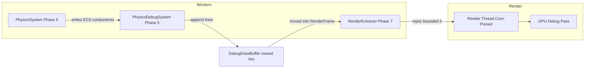
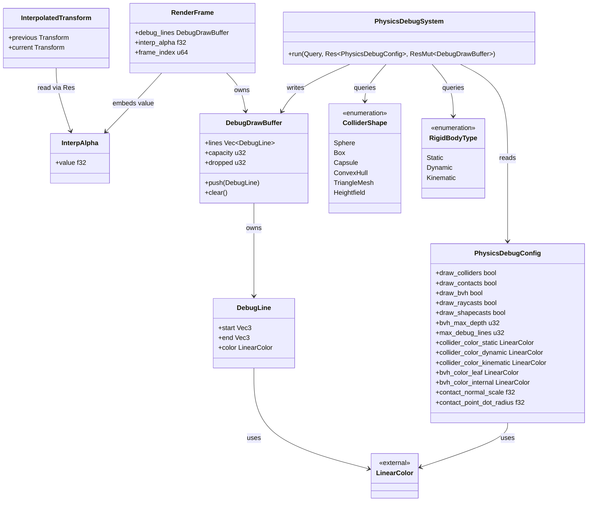
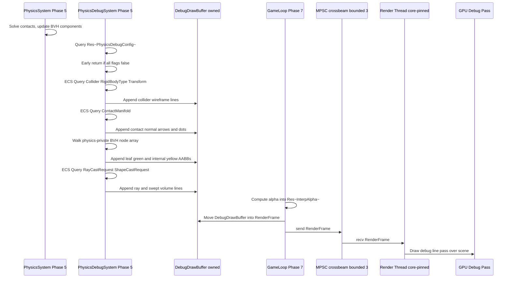

# Rendering ↔ Physics Integration Design

## Systems Involved

| System | Design | Domain |
|--------|--------|--------|
| Rendering | [rendering-core.md](../rendering/rendering-core.md) | GPU pipeline |
| Physics | [foundation.md](../physics/foundation.md) | Simulation |
| Threading | [threading.md](../platform/threading.md) | Three-thread model |

## Integration Requirements

| ID | Requirement | Systems |
|----|-------------|---------|
| IR-3.4.1 | Debug draw collider wireframes | Phys, Ren |
| IR-3.4.2 | Debug draw contact normals and points | Phys, Ren |
| IR-3.4.3 | Debug draw BVH node AABBs | Phys, Ren |
| IR-3.4.4 | Debug draw raycast/shapecast results | Phys, Ren |
| IR-3.4.5 | Debug viz runtime-toggleable | Phys, Ren |
| IR-3.4.6 | Physics interpolation for rendering | Phys, Ren |

1. **IR-3.4.1** -- `ColliderShape` variants (sphere, box, capsule, convex hull, triangle mesh,
   heightfield) are drawn as wireframe overlays via the debug draw API (F-2.10.9). Each shape maps
   to a set of line segments colored by `RigidBodyType`. 2D/2.5D colliders are intentionally out of
   scope in this document and are covered alongside the 2D renderer ([2d.md](../rendering/2d.md)).
2. **IR-3.4.2** -- `ContactManifold` and `ContactPoint` data are visualized as arrows (normal
   direction) and dots (contact positions). Arrow length scales with penetration depth. Dot radius
   is configurable via `contact_point_dot_radius`.
3. **IR-3.4.3** -- The physics-private BVH node AABBs are drawn as wireframe boxes. Leaf nodes use
   green; internal nodes use yellow. Depth can be filtered via `bvh_max_depth`.
4. **IR-3.4.4** -- `RayCast` results draw the ray as a line from origin to hit point (green) or max
   distance (red). `ShapeCast` draws the swept volume outline (capsule sweep visualized as the start
   shape, end shape, and the two connecting tangent lines).
5. **IR-3.4.5** -- All physics debug visualization is **runtime-toggleable** via
   `PhysicsDebugConfig` stored as an ECS resource (`Res<PhysicsDebugConfig>`). When all draw flags
   are `false`, the debug system performs an early-return before iterating any ECS data, resulting
   in a single boolean branch per frame. **No `#[cfg]` gating** -- debug draw must remain available
   in shipping builds so QA, modders, and players can toggle it at runtime (NFR-2.10.3 revised per
   feedback).
6. **IR-3.4.6** -- Physics runs on a fixed timestep. The render-thread snapshot uses a frame-global
   interpolation alpha stored as `Res<InterpAlpha>` and computed once per game-loop tick from the
   fixed-timestep accumulator: `alpha = accumulator / fixed_dt`. Per-entity interpolation reads
   `previous` and `current` transforms and the single shared alpha.

## Data Contracts

| Type | Defined in | Consumed by | Purpose |
|------|-----------|-------------|---------|
| `ColliderShape` | Physics | Debug draw | Wireframes |
| `ContactManifold` | Physics | Debug draw | Contacts |
| `ContactPoint` | Physics | Debug draw | Hit points |
| `BvhNode` | Spatial index | Debug draw | AABB boxes |
| `RayCast` result | Physics | Debug draw | Ray lines |
| `ShapeCast` result | Physics | Debug draw | Swept outlines |
| `DebugDrawBuffer` | Rendering | Physics | Line submit |
| `InterpAlpha` | Game loop | Rendering | Smoothing |
| `LinearColor` | Rendering | Debug draw | sRGB colors |

`LinearColor` is a 4-component linear-space RGBA color defined in
[rendering-core.md](../rendering/rendering-core.md) and reused here without redefinition.

## Three-Thread Model

This integration crosses all three canonical threads defined in
[threading.md](../platform/threading.md):

| Thread | Role | Physics debug draw work |
|--------|------|-------------------------|
| Main | Platform I/O, OS event pump | None (owns no debug state) |
| Worker pool | ECS system execution | Iterate colliders, fill line buffer in Phase 5 |
| Render (core-pinned) | GPU command building | Copy snapshot, issue GPU debug pass |

The render thread is **core-pinned** to an isolated core selected at startup. Debug draw data must
cross the worker-pool to render-thread boundary via the standard `RenderFrame` snapshot delivered
through a bounded `crossbeam-channel::bounded` **MPSC** channel (capacity = 3, matching the
triple-buffer depth; producer = Phase 7 extractor on a worker thread, consumer = render thread). The
physics debug system never touches GPU resources directly.

### Debug Draw Cross-Thread Handoff



## Class Diagram



## API Design

```rust
/// Runtime configuration for physics debug drawing.
/// Stored as `Res<PhysicsDebugConfig>` in the ECS world
/// and toggleable at runtime in every build (shipping,
/// dev, debug). NOT cfg-gated.
/// Transient runtime struct -- not rkyv-archived.
pub struct PhysicsDebugConfig {
    pub draw_colliders: bool,
    pub draw_contacts: bool,
    pub draw_bvh: bool,
    pub draw_raycasts: bool,
    pub draw_shapecasts: bool,
    pub bvh_max_depth: u32,
    /// Hard cap on lines emitted per frame.
    /// On overflow, excess lines are dropped and
    /// `DebugDrawBuffer.dropped` is incremented.
    pub max_debug_lines: u32,
    pub collider_color_static: LinearColor,
    pub collider_color_dynamic: LinearColor,
    pub collider_color_kinematic: LinearColor,
    pub bvh_color_leaf: LinearColor,
    pub bvh_color_internal: LinearColor,
    pub contact_normal_scale: f32,
    pub contact_point_dot_radius: f32,
}

/// Frame-global interpolation alpha computed once per
/// game-loop tick from the fixed-timestep accumulator.
/// Stored as `Res<InterpAlpha>`. A single scalar shared
/// across every interpolated entity -- not duplicated
/// per entity.
/// Transient runtime resource -- not rkyv-archived.
pub struct InterpAlpha {
    pub value: f32,
}

/// Per-entity previous and current transforms used for
/// visual smoothing. Alpha is read from `Res<InterpAlpha>`.
/// Transient per-frame component -- not rkyv-archived.
pub struct InterpolatedTransform {
    pub previous: Transform,
    pub current: Transform,
}

/// One debug line segment. Owned inside `DebugDrawBuffer`.
/// Transient per-frame struct -- not rkyv-archived.
pub struct DebugLine {
    pub start: Vec3,
    pub end: Vec3,
    pub color: LinearColor,
}

/// Owned per-frame buffer of debug lines. The buffer is
/// a plain `Vec<DebugLine>` (no Arc, no Rc) allocated
/// from a frame arena. Ownership is transferred into
/// `RenderFrame` at Phase 7 and moved across the MPSC
/// channel to the render thread. The worker-side buffer
/// is reset (cleared, capacity retained) at the start of
/// the next fixed tick.
pub struct DebugDrawBuffer {
    pub lines: Vec<DebugLine>,
    pub capacity: u32,
    /// Number of lines dropped this frame due to the
    /// `max_debug_lines` cap.
    pub dropped: u32,
}

/// The ECS system that walks physics queries and fills
/// the debug draw buffer. Iteration uses flat ECS queries
/// and pre-sized `Vec`s -- there is NO `HashMap` or
/// `DashMap` on this hot path. BVH traversal uses the
/// physics-private BVH's contiguous node array.
///
/// Algorithm references:
/// - Collider wireframes: "Real-Time Collision Detection"
///   (Ericson 2005), Ch. 4 (primitive rasterization).
/// - BVH traversal: "Fast BVH Construction on GPUs"
///   (Lauterbach et al., 2009) -- iterative stack walk.
/// - Contact rendering: "Game Physics Engine Development"
///   (Millington, 2nd ed.), Ch. 14 (contact visualization).
pub struct PhysicsDebugSystem;
```

## Data Flow



## Timing and Ordering

Interpolation alpha is computed in **Phase 7** (before snapshot), not Phase 8. The earlier Phase 8
placement in the original table was incorrect because `RenderExtractor` also runs in Phase 7 and
consumes `Res<InterpAlpha>` when snapshotting interpolated transforms.

| System | Phase | Timestep | Order |
|--------|-------|----------|-------|
| Physics solve | 5-Physics | Fixed | Core pipeline |
| PhysicsDebugSystem | 5-Physics | Fixed | After solve |
| Interp alpha compute | 7-Snapshot | Variable | Before extractor |
| RenderExtractor | 7-Snapshot | Variable | After alpha |
| MPSC send RenderFrame | 7-Snapshot | Variable | After extractor |
| Debug render pass | Render thread | Variable | Last scene pass |

## Failure Modes

| Failure | Impact | Recovery |
|---------|--------|----------|
| Too many debug lines | Frame drop | Cap at `max_debug_lines`, drop excess |
| Stale contact data | Flicker | Clear buffer each tick; current frame only |
| BVH depth too deep | Line overflow | Clamp traversal to `bvh_max_depth` |
| Interp alpha > 1.0 | Overshoot | Clamp to `[0.0, 1.0]` in game loop |
| All flags disabled | No viz | Early-return; expected state |
| MPSC channel full | Backpressure | Drop oldest debug buffer; keep newest |

1. **Too many debug lines** -- The `PhysicsDebugSystem` checks `buf.lines.len()` against
   `config.max_debug_lines` before every push. On overflow, the push is skipped and `buf.dropped` is
   incremented. A diagnostic warning is logged at most once per second.
2. **Stale contact data** -- `DebugDrawBuffer.clear()` is called at the start of every fixed tick.
   Contact arrows never persist beyond the tick that produced them.
3. **BVH depth too deep** -- BVH traversal is bounded by `bvh_max_depth`. Internal nodes beyond that
   depth are not emitted, and their subtrees are not visited.
4. **Interp alpha > 1.0** -- The game loop clamps the computed alpha via `alpha.clamp(0.0, 1.0)`
   before writing `Res<InterpAlpha>`.
5. **All flags disabled** -- `PhysicsDebugSystem` returns on the very first line (a single boolean
   OR of the draw flags). The ECS queries are never executed. This is the runtime "off" state.
6. **MPSC channel full** -- The Phase 7 producer uses `try_send`. On `Full`, it drops the current
   `RenderFrame`, logs a diagnostic, and proceeds. The render thread always consumes the most recent
   buffered frame.

## Platform Considerations

| Concern | Vulkan | Vulkan | Vulkan |
|---------|-------|-------|--------|
| Debug line pass | `DrawInstanced` | `MTLPrimitiveTypeLine` | `vkCmdDraw` lines |
| Debug markers | PIX events | `MTLCaptureManager` | `VK_EXT_debug_utils` |
| Core pinning | Thread affinity API | QoS + dispatch | `pthread_setaffinity_np` |

Physics interpolation uses identical `lerp(prev, curr, alpha)` math on all platforms and has no
platform-specific code paths. Debug draw line rendering goes through the same backend-agnostic
`RenderGraph` line pass node on every backend; backend differences are absorbed inside the rendering
core and are not visible to physics.

Core pinning of the render thread is handled by the platform threading layer
([threading.md](../platform/threading.md)); this integration only assumes that the render thread is
pinned and receives `RenderFrame` via the bounded MPSC channel described above.

## 2D / 2.5D Scope

2D and 2.5D collider wireframes, 2D contact visualization, and 2D physics interpolation are
intentionally **out of scope** in this document. They are covered in [2d.md](../rendering/2d.md) and
its companion test cases.

## Test Plan

See companion [rendering-physics-test-cases.md](rendering-physics-test-cases.md). Coverage includes
positive tests for every `ColliderShape` variant, ShapeCast visualization, internal BVH node color,
contact point dot rendering, and negative tests for every failure mode. All tests are CI-runnable
(no GPU-dependent assertions that require a display device). Benchmarks for each draw category are
listed in the companion file.

## Review Status

All review feedback items have been addressed. The table below summarizes each finding and the
resolution applied.

| # | Finding | Resolution |
|---|---------|-----------|
| 1 | Missing `classDiagram` | Class Diagram section added with all types |
| 2 | No three-thread model discussion | Three-Thread Model section + handoff flowchart |
| 3 | `InterpolatedTransform.alpha` per entity | Alpha moved to `Res<InterpAlpha>` frame-global |
| 4 | No 2D/2.5D discussion | 2D / 2.5D Scope section marks it out of scope |
| 5 | `LinearColor` undefined | Cross-referenced to rendering-core.md |
| 6 | HashMap hot-path audit missing | Documented flat ECS queries, no HashMap/DashMap |
| 7 | No rkyv / transient notes | Every struct annotated as transient, not rkyv |
| 8 | Phase 7 vs Phase 8 alpha conflict | Alpha moved to Phase 7 before RenderExtractor |
| 9 | Convex/mesh/heightfield tests missing | Test cases added in companion file |
| 10 | ShapeCast visualization test missing | `TC-IR-3.4.4.3` added in companion file |
| 11 | Internal BVH yellow test missing | `TC-IR-3.4.3.3` added in companion file |
| 12 | Contact point dot test missing | `TC-IR-3.4.2.3` added in companion file |
| 13 | No failure-mode tests | Negative test cases added for all failure modes |
| 14 | Sequence diagram bypassed ECS | Sequence now uses ECS queries explicitly |
| 15 | `PhysicsDebugConfig` cfg-gated | cfg gating removed; runtime-toggleable `Res` |
| 16 | Debug buffer ownership unclear | `DebugDrawBuffer` documented as owned `Vec`, no Arc |
| 17 | `max_debug_lines` missing | Field added to `PhysicsDebugConfig` + failure mode |
| 18 | Platform Considerations empty | Table of Vulkan/Vulkan specifics added |
