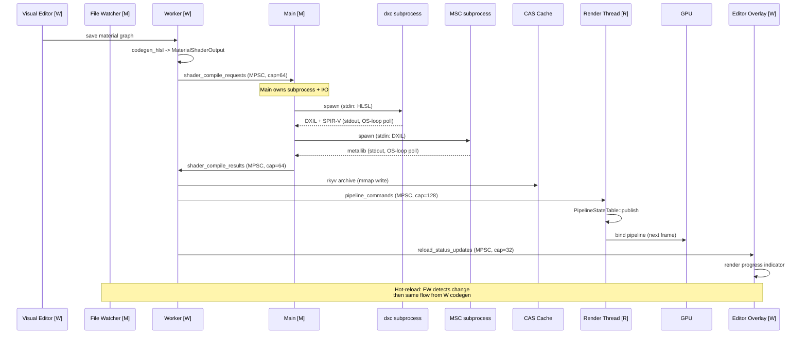

# Rendering ↔ Scripting Integration Design

## Systems Involved

| System | Design | Domain |
|--------|--------|--------|
| Rendering | [render-pipeline.md](../rendering/render-pipeline.md) | GPU pipeline |
| Scripting | [scripting.md](../game-framework/scripting.md) | Logic graphs |

## Integration Requirements

| ID | Requirement | Systems |
|----|-------------|---------|
| IR-3.5.1 | Material graphs codegen to HLSL source | Script, Ren |
| IR-3.5.2 | HLSL compiles via dxc CLI subprocess | Script, Ren |
| IR-3.5.3 | Shader permutations from material features | Script, Ren |
| IR-3.5.4 | Hot reload patches shader binaries | Script, Ren |
| IR-3.5.5 | Post-process graphs codegen compute HLSL | Script, Ren |
| IR-3.5.6 | Effect graphs codegen particle HLSL | Script, Ren |

1. **IR-3.5.1** -- Material graphs authored in the visual editor compile via `CompileTarget::Hlsl`
   in the `GraphCompiler`. The `codegen_hlsl` backend emits HLSL source implementing the material's
   surface shader function. Output includes PBR params (albedo, metallic, roughness, normal,
   emissive). The middleman `.dylib` produced by codegen exposes per-material entry points and the
   HLSL source is written to a CAS-backed arena rather than a heap `String`.
2. **IR-3.5.2** -- Generated HLSL is compiled by `dxc` CLI as a subprocess during asset processing.
   Output is DXIL and SPIR-V. `metal-shaderconverter` CLI translates DXIL to metallib. No runtime
   shader compilation in shipping builds. The subprocess is spawned from the main thread and its
   stdout/stderr pipes are polled via the OS event loop alongside other platform I/O -- no async
   runtime is involved.
3. **IR-3.5.3** -- `PermutationKey` combines `ShadingModel`, `ShaderFeatures`, and `RenderPath` to
   produce unique shader variants. The graph compiler emits `#ifdef` blocks for optional features.
   Asset processing pre-compiles all active permutations in parallel via the job system and stores
   the resulting `CompiledEffect` / `CompiledShader` entries in the CAS.
4. **IR-3.5.4** -- During development, a main-thread file watcher observes material graph assets.
   When an asset changes, a worker thread recompiles the graph to HLSL, the main thread runs `dxc`
   as a subprocess, the worker archives the resulting bytecode via rkyv, and the render thread swaps
   the `PipelineStateHandle` on the next frame. All boundary crossings are crossbeam MPSC channels
   with documented buffer lengths (see [Channel Topology](#channel-topology)).
5. **IR-3.5.5** -- Post-process graph nodes compile to HLSL compute shaders via the same
   `codegen_hlsl` backend. Each post-process effect registers as a compute pass in the render graph
   via an ECS component (`PostProcessPass`).
6. **IR-3.5.6** -- Effect graph nodes (F-11.6.1) compile to HLSL compute shaders for particle spawn,
   init, update, and output kernels via `codegen_hlsl`. The compiled kernels are packaged as a
   `CompiledEffect` stored in the CAS and loaded via zero-copy rkyv mmap at runtime.

### 2D / 2.5D Scope

Sprite and 2.5D shaders are intentionally **out of scope** for this integration. They are covered by
the dedicated 2D rendering path (see `docs/design/rendering/sprites.md`). Material graphs here
target 3D surface and compute shaders only.

## Data Contracts

| Type | Defined in | Consumed by | Purpose |
|------|-----------|-------------|---------|
| `GraphCompiler` | Scripting | Rendering | HLSL emit |
| `CompileTarget` | Scripting | Rendering | Hlsl variant |
| `codegen_hlsl` | Scripting | Rendering | Codegen entry |
| `PermutationKey` | Rendering | Scripting | Shader key |
| `ShadingModel` | Rendering | Scripting | Surface type |
| `ShaderFeatures` | Rendering | Scripting | Feature bits |
| `RenderPath` | Rendering | Scripting | Fwd/deferred |
| `MaterialShaderOutput` | Scripting | Asset Pipeline | HLSL + keys (rkyv) |
| `ShaderCompileRequest` | Scripting | Asset Pipeline | Offline dxc input |
| `ShaderProfile` | Scripting | Asset Pipeline | dxc target profile |
| `CompiledEffect` | VFX | Scripting | Kernels (rkyv) |
| `CompiledKernel` | VFX | Scripting | GPU bytecode (rkyv) |
| `PipelineStateHandle` | Rendering | Hot reload | Generational GPU state |

### ECS Residency

Per the ECS-primary constraint (~90%) all per-entity material and pipeline state is stored as ECS
components or resources. No `Arc` is held by any component -- every cross-thread reference is a
`Copy` generational handle.

| Type | ECS role | Notes |
|------|----------|-------|
| `MaterialHandle` | Component | On renderable entities (generational) |
| `ShaderHandle` | Component | On material entities (generational) |
| `PipelineStateHandle` | Component | On material entities (generational) |
| `PermutationKey` | Component | Current active variant per entity |
| `PostProcessPass` | Component | Tagged entities in the render graph |
| `EffectHandle` | Component | On VFX emitter entities |
| `MaterialShaderCache` | Resource | Interned HLSL arena + permutation table |
| `ShaderReloadStatus` | Resource | Hot-reload progress indicator |
| `PipelineStateTable` | Resource | Render-thread-owned descriptor arena |

### Hot Path Data Structures

| Lookup | Structure | Rationale |
|--------|-----------|-----------|
| Permutation -> pipeline | Sorted `Vec<(PermutationKey, u32)>` | Binary search, cache-friendly |
| Pipeline by handle | Typed arena indexed by `u32` | O(1) generational access |
| Shader source by handle | HLSL arena indexed by `u32` | Offline only; no runtime hit |
| CAS cache (offline only) | `DashMap<[u8; 32], CasEntry>` | Cold path, parallel writes OK |

No `HashMap` is used on the render-frame hot path. See [constraints.md](../constraints.md) for the
rule.

## Architecture

```mermaid
classDiagram
    class ShadingModel {
        <<enumeration>>
        DefaultLit
        Subsurface
        ClearCoat
        Cloth
        Hair
        Eye
        ThinTranslucent
        Foliage
        Unlit
    }

    class RenderPath {
        <<enumeration>>
        ForwardPlus
        Deferred
    }

    class CompileTarget {
        <<enumeration>>
        Hlsl
        NativeDylib
    }

    class ShaderProfile {
        <<enumeration>>
        Vertex6_6
        Pixel6_6
        Compute6_6
        Mesh6_6
        Amplification6_6
    }

    class ShaderReloadStatus {
        <<enumeration>>
        Idle
        Compiling
        PendingSwap
        Succeeded
        Failed
    }

    class OutputMode {
        <<enumeration>>
        Billboard
        Mesh
        Ribbon
        Decal
    }

    class ShaderFeatures {
        +bits u32
        +NONE ShaderFeatures
        +NORMAL_MAP ShaderFeatures
        +EMISSIVE ShaderFeatures
        +ALPHA_CLIP ShaderFeatures
        +VERTEX_COLOR ShaderFeatures
        +DETAIL_MAP ShaderFeatures
        +PARALLAX ShaderFeatures
        +CLEARCOAT_NORMAL ShaderFeatures
        +SUBSURFACE_SCATTER ShaderFeatures
    }

    class PermutationKey {
        +shading_model ShadingModel
        +features ShaderFeatures
        +render_path RenderPath
    }

    class HlslSourceHandle {
        +index u32
        +generation u32
    }

    class PermutationSpan {
        +offset u32
        +length u32
    }

    class MaterialShaderOutput {
        +hlsl ArchivedHlslHandle
        +shading_model ShadingModel
        +features ShaderFeatures
        +permutations PermutationSpan
        +content_hash u64
    }

    class ShaderCompileRequest {
        +hlsl HlslSourceHandle
        +entry_point SmolStr
        +profile ShaderProfile
        +defines ArenaRef~DefinePair~
        +output_dxil bool
        +output_spirv bool
    }

    class CompiledKernel {
        +bytecode Handle~ShaderBytecode~
        +thread_group_size u32
        +param_layout ParamBufferLayout
    }

    class CompiledEffect {
        +source_hash u64
        +spawn_kernel CompiledKernel
        +init_kernel CompiledKernel
        +update_kernel CompiledKernel
        +output_kernel CompiledKernel
        +attribute_layout AttributeLayout
        +output_mode OutputMode
    }

    class PipelineStateHandle {
        +index u32
        +generation u32
    }

    class PipelineStateTable {
        +arena Arena~PipelineStateDesc~
        +publish(desc) PipelineStateHandle
        +resolve(handle) Option~PipelineStateDesc~
    }

    class MaterialShaderCache {
        +hlsl_arena Arena~u8~
        +permutations Arena~PermutationKey~
        +sources Arena~HlslSourceHandle~
    }

    class codegen_hlsl {
        <<function>>
        +emit(graph, target, arena) MaterialShaderOutput
    }

    MaterialShaderOutput --> ShadingModel
    MaterialShaderOutput --> ShaderFeatures
    MaterialShaderOutput --> PermutationSpan
    MaterialShaderOutput --> HlslSourceHandle : arena index
    ShaderCompileRequest --> HlslSourceHandle
    ShaderCompileRequest --> ShaderProfile
    PermutationKey --> ShadingModel
    PermutationKey --> ShaderFeatures
    PermutationKey --> RenderPath
    CompiledEffect --> CompiledKernel
    CompiledEffect --> OutputMode
    PipelineStateTable --> PipelineStateHandle : owns
    MaterialShaderCache --> HlslSourceHandle : arena stores
    codegen_hlsl ..> MaterialShaderOutput : returns
    codegen_hlsl ..> CompileTarget : targets
```



## API Design

```rust
/// Codegen target for the graph compiler.
#[derive(Copy, Clone)]
#[repr(u8)]
pub enum CompileTarget {
    /// Emit HLSL source for a shader graph.
    Hlsl = 0,
    /// Emit Rust source for a logic graph,
    /// compiled into the middleman .dylib.
    NativeDylib = 1,
}

/// Surface shading model. Determines lighting
/// evaluation in the G-buffer or forward pass.
/// Codegen'd into the middleman .dylib.
/// Fully enumerated; no wildcard variant.
#[derive(rkyv::Archive, rkyv::Serialize, Copy, Clone, PartialEq, Eq, Hash)]
#[archive(check_bytes)]
#[repr(u8)]
pub enum ShadingModel {
    DefaultLit = 0,
    Subsurface = 1,
    ClearCoat = 2,
    Cloth = 3,
    Hair = 4,
    Eye = 5,
    ThinTranslucent = 6,
    Foliage = 7,
    Unlit = 8,
}

/// Render path selection. Fully enumerated.
#[derive(rkyv::Archive, rkyv::Serialize, Copy, Clone, PartialEq, Eq, Hash)]
#[archive(check_bytes)]
#[repr(u8)]
pub enum RenderPath {
    ForwardPlus = 0,
    Deferred = 1,
}

/// Bitflags for optional shader features. Each flag
/// maps to an `#ifdef` block in generated HLSL.
/// Fully enumerated (u32 bit positions documented).
#[derive(rkyv::Archive, rkyv::Serialize, Copy, Clone, PartialEq, Eq, Hash)]
#[archive(check_bytes)]
#[repr(transparent)]
pub struct ShaderFeatures(pub u32);

impl ShaderFeatures {
    pub const NONE: Self = Self(0);
    pub const NORMAL_MAP: Self = Self(1 << 0);
    pub const EMISSIVE: Self = Self(1 << 1);
    pub const ALPHA_CLIP: Self = Self(1 << 2);
    pub const VERTEX_COLOR: Self = Self(1 << 3);
    pub const DETAIL_MAP: Self = Self(1 << 4);
    pub const PARALLAX: Self = Self(1 << 5);
    pub const CLEARCOAT_NORMAL: Self = Self(1 << 6);
    pub const SUBSURFACE_SCATTER: Self = Self(1 << 7);
}

/// Unique key for a shader permutation. Enumerated
/// during asset processing (offline path). Compared
/// via sorted `Vec` binary search at runtime -- never
/// hashed on the render frame hot path.
#[derive(rkyv::Archive, rkyv::Serialize, Copy, Clone, PartialEq, Eq, Hash)]
#[archive(check_bytes)]
pub struct PermutationKey {
    pub shading_model: ShadingModel,
    pub features: ShaderFeatures,
    pub render_path: RenderPath,
}

/// Generational handle into `MaterialShaderCache`
/// HLSL arena. Copy, no `Arc`.
#[derive(Copy, Clone, PartialEq, Eq, Hash)]
pub struct HlslSourceHandle {
    pub index: u32,
    pub generation: u32,
}

/// Span of permutation keys in the cache's
/// permutation arena. Replaces `Vec<PermutationKey>`.
#[derive(rkyv::Archive, rkyv::Serialize, Copy, Clone)]
#[archive(check_bytes)]
pub struct PermutationSpan {
    pub offset: u32,
    pub length: u32,
}

/// Material graph compilation output. Persisted to
/// disk via rkyv and mmap'd at runtime (zero-copy).
/// `hlsl` is an arena index into the CAS-backed HLSL
/// byte arena; permutations are a span in the
/// permutation arena. No `Arc`, no `String`, no `Vec`.
#[derive(rkyv::Archive, rkyv::Serialize)]
#[archive(check_bytes)]
#[archive_attr(repr(C, align(16)))]
pub struct MaterialShaderOutput {
    pub hlsl: HlslSourceHandle,
    pub shading_model: ShadingModel,
    pub features: ShaderFeatures,
    pub permutations: PermutationSpan,
    pub content_hash: u64,
}

/// Offline-only shader compilation request handed to
/// the main thread for `dxc` subprocess invocation.
/// MUST NOT be constructed on the render frame path.
/// `entry_point` is a `SmolStr` (inline up to 22
/// bytes); `defines` is an arena span rather than
/// `Vec<(String, String)>`.
pub struct ShaderCompileRequest {
    pub hlsl: HlslSourceHandle,
    pub entry_point: smol_str::SmolStr,
    pub profile: ShaderProfile,
    pub defines: ArenaRef<DefinePair>,
    pub output_dxil: bool,
    pub output_spirv: bool,
}

/// Single (name, value) macro define stored in the
/// offline arena.
pub struct DefinePair {
    pub name: smol_str::SmolStr,
    pub value: smol_str::SmolStr,
}

/// Shader profiles for dxc compilation.
/// Only SM 6.6 variants are currently targeted;
/// SM 6.0-6.5 are explicitly out of scope for the
/// first release (see Open Questions).
#[derive(rkyv::Archive, rkyv::Serialize, Copy, Clone)]
#[archive(check_bytes)]
#[repr(u8)]
pub enum ShaderProfile {
    Vertex6_6 = 0,
    Pixel6_6 = 1,
    Compute6_6 = 2,
    Mesh6_6 = 3,
    Amplification6_6 = 4,
}

/// VFX output mode. Fully enumerated.
#[derive(rkyv::Archive, rkyv::Serialize, Copy, Clone)]
#[archive(check_bytes)]
#[repr(u8)]
pub enum OutputMode {
    Billboard = 0,
    Mesh = 1,
    Ribbon = 2,
    Decal = 3,
}

/// Compiled VFX effect. Loaded at runtime via rkyv
/// zero-copy mmap; all kernels live in the CAS.
#[derive(rkyv::Archive, rkyv::Serialize)]
#[archive(check_bytes)]
#[archive_attr(repr(C, align(16)))]
pub struct CompiledEffect {
    pub source_hash: u64,
    pub spawn_kernel: CompiledKernel,
    pub init_kernel: CompiledKernel,
    pub update_kernel: CompiledKernel,
    pub output_kernel: CompiledKernel,
    pub attribute_layout: AttributeLayout,
    pub output_mode: OutputMode,
}

/// Single GPU compute kernel within a compiled
/// effect. Bytecode is stored via rkyv-archived byte
/// vector; alignment is 16 bytes for driver zero-copy.
#[derive(rkyv::Archive, rkyv::Serialize)]
#[archive(check_bytes)]
pub struct CompiledKernel {
    pub bytecode: Handle<ShaderBytecode>,
    pub thread_group_size: u32,
    pub param_layout: ParamBufferLayout,
}

/// HLSL codegen entry point. Pure function: no global
/// state, no side effects. Writes HLSL bytes into the
/// provided arena and returns the handle + metadata.
/// Called during asset processing on worker threads.
pub fn codegen_hlsl(
    graph: &ShaderGraphIr,
    target: CompileTarget,
    arena: &mut MaterialShaderCache,
) -> MaterialShaderOutput;
```

## Data Flow

### Hot-Reload and Initial Compile

Thread ownership annotations: `[M]` main, `[W]` worker, `[R]` render (core-pinned).



### Channel Topology

All inter-thread communication uses crossbeam MPSC channels. Buffer lengths are documented
explicitly below. No `Arc` is passed through any channel -- only `Copy` handles and rkyv-archived
byte buffers.

| Channel | Producer | Consumer | Kind | Capacity | Purpose |
|---------|----------|----------|------|----------|---------|
| `shader_compile_requests` | Worker | Main | MPSC | 64 | HLSL handle + profile |
| `shader_compile_results` | Main | Worker | MPSC | 64 | DXIL/SPIR-V/metallib bytes |
| `pipeline_commands` | Worker | Render | MPSC | 128 | New `PipelineStateHandle` |
| `reload_status_updates` | Worker | Main (ECS) | MPSC | 32 | `ShaderReloadStatus` writes |
| `material_graph_events` | Main (FW) | Worker | MPSC | 32 | File watcher -> recompile |

Back-pressure: critical paths (`pipeline_commands`) block the producer; non-critical paths
(`reload_status_updates`) drop oldest. Hot-reload latency is dominated by the `dxc` subprocess, not
channel throughput.

### Three-Thread Model

| Data | Thread | Access |
|------|--------|--------|
| File watcher | Main | Detects material graph changes |
| `dxc` / MSC subprocess | Main | Spawns + polls stdout via OS loop |
| `MaterialShaderCache` | Worker | HLSL arena writes |
| CAS cache | Worker | rkyv archive writes |
| `PipelineStateTable` | Render (core-pinned) | Owner of descriptor arena |
| `PipelineStateHandle` publish | Render | Drains `pipeline_commands` each frame |
| GPU resources | Render (core-pinned) | Upload + bind |

Pipeline state objects are created on the render thread only. Worker threads build descriptors and
publish them via the `pipeline_commands` MPSC channel; the render thread drains the channel during
its per-frame setup pass and calls the GPU driver (D3D12/Vulkan/Metal) to materialize the PSO. This
keeps GPU driver interaction on the core-pinned render thread and avoids cross-thread driver calls.

### rkyv Serialization Strategy

Compiled shader artifacts are persisted via rkyv with `check_bytes` and 16-byte alignment so the GPU
driver can consume the bytecode directly from an mmap'd buffer without any copy.

| Type | Persisted | Archive attrs |
|------|-----------|---------------|
| `MaterialShaderOutput` | Yes | `align(16)`, `check_bytes` |
| `CompiledEffect` | Yes | `align(16)`, `check_bytes` |
| `CompiledKernel` | Yes (inline in effect) | `check_bytes` |
| `PermutationKey` | Yes | `check_bytes` |
| `ShaderCompileRequest` | No | Transient only |
| `MaterialShaderCache` | Partial | Arenas mmap'd; handles rebuilt at load |

`ShaderCompileRequest` is transient (offline asset processing only) and is never written to disk, so
it does not need rkyv derives.

## Timing and Ordering

| System | Game loop phase | Timestep | Order |
|--------|----------------|----------|-------|
| Graph compilation | Asset processing | Offline | First |
| dxc subprocess | Asset processing (Main) | Offline | After codegen |
| metal-shaderconverter | Asset processing (Main) | Offline | After dxc |
| File watcher poll | Phase 8 Frame End | Variable | Background |
| Hot-reload recompile | Worker, non-blocking | Variable | Channel-polled |
| Pipeline publish | Phase 0 Frame Start (Render) | Variable | Before extract |
| Render pass bind | Render thread | Variable | Per draw |

The "Hot-reload recompile" row is **not async** -- it uses a crossbeam MPSC channel drained by the
worker job system, which maps to a standard worker-loop poll. The label "Channel-polled" replaces
the prior "Async" label.

### Debug Tools

All rendering-scripting debug tools are runtime-toggleable via the debug tools panel. No recompile
is required to hide or show any overlay.

| Tool | Toggle | Scope |
|------|--------|-------|
| Shader reload overlay | `debug.shader_reload_overlay` | Editor viewport |
| Permutation usage stats | `debug.permutation_stats` | Profiler overlay |
| HLSL source preview | `debug.hlsl_preview` | Editor inspector |
| Hot-reload trace | `debug.hot_reload_trace` | Profiler overlay |
| dxc stderr tail | `debug.dxc_stderr` | Editor overlay |

## Failure Modes

| Failure | Impact | Recovery |
|---------|--------|----------|
| HLSL codegen error | No shader | Emit error node; retain prior handle |
| dxc compile failure | No binary | Fall back to error shader; publish `Failed` |
| dxc binary missing | Build halt | Graceful error; asset build fails cleanly |
| Invalid permutation | Missing variant | Use default permutation (documented fallback) |
| Hot reload conflict | Stale shader | Retry on next channel drain |
| metallib convert fail | No macOS shader | Fall back to previous metallib handle |
| rkyv check_bytes fail | Corrupt artifact | Asset load fails; recompile from source |
| Channel back-pressure (compile) | Slower dev loop | Producer blocks; no drops |

### Documented Fallbacks

1. **Missing permutation** -- when a requested `PermutationKey` has no compiled variant, the
   renderer falls back to the `DefaultLit + ForwardPlus + NONE` permutation and logs a warning.
2. **dxc failure** -- the previous `PipelineStateHandle` is retained by the render thread; the
   editor overlay shows `ShaderReloadStatus::Failed { error_count }` until the next successful
   compile.
3. **metallib failure** -- the previous metallib handle is retained; cross-platform fallback is
   disabled (no SPIR-V on Metal).
4. **Error shader** -- a magenta/black checker shader is compiled at engine boot and always
   resident. Any unresolved pipeline handle resolves to this shader rather than crashing.

## Platform Considerations

| Platform | Compiler | Output | Runtime compile |
|----------|---------|--------|-----------------|
| Windows (D3D12) | dxc | DXIL | Dev-only |
| macOS (Metal) | dxc + MSC | metallib | Dev-only |
| iOS (Metal) | dxc + MSC | metallib | Dev-only |
| Linux (Vulkan) | dxc | SPIR-V | Dev-only |
| Android (Vulkan) | dxc | SPIR-V | Dev-only |
| Shipping | Pre-compiled | All formats | Never |

### Dev-Mode Subprocess Execution

Dev-mode runtime compilation never uses async/await. The flow is:

1. Worker produces `ShaderCompileRequest` and pushes it onto `shader_compile_requests`.
2. Main thread drains the channel during its per-frame I/O poll and calls
   `std::process::Command::spawn`.
3. The child process's stdout and stderr fds are registered with the same OS event loop (io_uring on
   Linux, IOCP on Windows, dispatch_io on macOS/iOS) that owns all other platform I/O.
4. When the child exits, its bytecode is pushed onto `shader_compile_results`.
5. The worker drains the result channel during its job-system tick and proceeds to rkyv archive +
   pipeline publish.

No thread is blocked on subprocess completion -- the main thread continues polling other I/O, the
worker continues executing other jobs, and the render thread continues rendering with the prior
pipeline handle.

### VR / Mobile Shader Profiles

VR and mobile shader profile handling is **explicitly deferred**. The initial release targets
desktop D3D12/Vulkan and Apple Metal only. VR stereo rendering (single-pass instanced, multiview)
and mobile-specific permutations (tiled deferred, framebuffer fetch) will be added in a follow-up
integration design once the base pipeline is in place (see Open Questions).

### 2D / 2.5D

As noted at the top of this document, 2D sprite and 2.5D shaders are handled by the dedicated sprite
pipeline and are not produced by this codegen path.

## Test Plan

See companion [rendering-scripting-test-cases.md](rendering-scripting-test-cases.md). All
integration tests are CI-runnable without hardware GPU requirements where possible -- GPU-dependent
tests are marked `[GPU]` and run on the GPU test runners. Negative tests cover HLSL codegen failure,
dxc compile failure, dxc missing binary, metallib failure, missing permutation fallback, rkyv
alignment failure, and channel back-pressure.

## Open Questions

1. Should the compiled HLSL arena be persisted across editor sessions or recomputed at startup?
2. Should SM 6.0-6.5 profiles be added for compatibility with older drivers, or is SM 6.6 the
   minimum target forever?
3. When should the VR/mobile permutation expansion land -- as a follow-up to this integration or as
   part of the rendering pipeline rewrite?
4. Is the `DefaultLit + ForwardPlus + NONE` fallback permutation always worth building, or should it
   be gated on a project setting?

## Review Status

| # | Item | Status |
|---|------|--------|
| 1 | `MaterialShaderOutput` uses arena indices (no `Arc<str>`, no `Vec`) | APPLIED |
| 2 | `ShaderCompileRequest` documented offline-only; SmolStr + arena span | APPLIED |
| 3 | Hot-reload watch labeled "Channel-polled" (not "Async") | APPLIED |
| 4 | `classDiagram` added covering all types | APPLIED |
| 5 | `CompiledEffect` / `CompiledKernel` pseudocode added | APPLIED |
| 6 | `PermutationKey` pseudocode added (no `HashMap` on hot path) | APPLIED |
| 7 | `ShadingModel` enum defined with full variants | APPLIED |
| 8 | `ShaderFeatures` defined as `#[repr(transparent)]` bitflags | APPLIED |
| 9 | `codegen_hlsl` function signature added to API section | APPLIED |
| 10 | 2D/2.5D explicitly out of scope with 1-line note | APPLIED |
| 11 | rkyv strategy documented for persistent artifacts | APPLIED |
| 12 | ECS residency table added for materials / pipelines / handles | APPLIED |
| 13 | Test case coverage expanded (negative tests + benchmarks) | APPLIED |
| 14 | Sequence diagram annotates thread ownership + MPSC channels | APPLIED |
| 15 | Three-thread model + channel topology section added | APPLIED |
| 16 | Open Questions section added | APPLIED |
| 17 | `ShaderProfile` SM 6.6 scope called out; SM 6.0-6.5 deferred | APPLIED |
| 18 | Dev-mode subprocess non-async execution documented | APPLIED |
| 19 | VR/mobile profiles explicitly deferred with Open Question ref | APPLIED |
| 20 | Debug tools runtime-toggleable table added | APPLIED |
