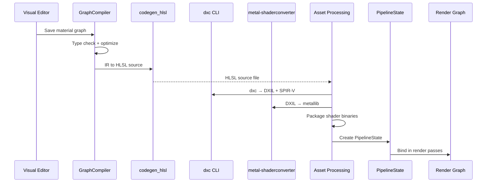

# Rendering ↔ Scripting Integration Design

## Systems Involved

| System | Design | Domain |
|--------|--------|--------|
| Rendering | [render-pipeline.md](../rendering/render-pipeline.md) | GPU pipeline |
| Scripting | [scripting.md](../game-framework/scripting.md) | Logic graphs |

## Integration Requirements

| ID | Requirement | Systems |
|----|-------------|---------|
| IR-3.5.1 | Material graphs codegen to HLSL source | Script, Ren |
| IR-3.5.2 | HLSL compiles via dxc CLI subprocess | Script, Ren |
| IR-3.5.3 | Shader permutations from material features | Script, Ren |
| IR-3.5.4 | Hot reload patches shader binaries | Script, Ren |
| IR-3.5.5 | Post-process graphs codegen compute HLSL | Script, Ren |
| IR-3.5.6 | Effect graphs codegen particle HLSL | Script, Ren |

1. **IR-3.5.1** -- Material graphs authored in the visual editor compile via `CompileTarget::Hlsl`
   in the `GraphCompiler`. The `codegen_hlsl` backend emits HLSL source implementing the material's
   surface shader function. Output includes PBR params (albedo, metallic, roughness, normal,
   emissive).
2. **IR-3.5.2** -- Generated HLSL is compiled by `dxc` CLI as a subprocess during asset processing.
   Output is DXIL and SPIR-V. `metal-shaderconverter` CLI translates DXIL to metallib. No runtime
   shader compilation in shipping builds.
3. **IR-3.5.3** -- `PermutationKey` combines `ShadingModel`, `ShaderFeatures`, and `RenderPath` to
   produce unique shader variants. The graph compiler emits `#ifdef` blocks for optional features.
   Asset processing pre-compiles all active permutations.
4. **IR-3.5.4** -- During development, the `HotReloader` watches material graph assets. When
   changed, the graph recompiles to HLSL, `dxc` produces new binaries, and the render pipeline swaps
   the `PipelineState` on the next frame.
5. **IR-3.5.5** -- Post-process graph nodes compile to HLSL compute shaders via the same
   `codegen_hlsl` backend. Each post-process effect registers as a compute pass in the render graph.
6. **IR-3.5.6** -- Effect graph nodes (F-11.6.1) compile to HLSL compute shaders for particle spawn,
   update, and output kernels via `codegen_hlsl`.

## Data Contracts

| Type | Defined in | Consumed by | Purpose |
|------|-----------|-------------|---------|
| `GraphCompiler` | Scripting | Rendering | HLSL emit |
| `CompileTarget` | Scripting | Rendering | Hlsl variant |
| `PermutationKey` | Rendering | Scripting | Shader key |
| `ShadingModel` | Rendering | Scripting | Surface type |
| `PipelineState` | Rendering | Hot reload | GPU state |
| `CompiledEffect` | VFX | Scripting | Kernels |

```rust
/// Material graph compilation output.
pub struct MaterialShaderOutput {
    pub hlsl_source: String,
    pub shading_model: ShadingModel,
    pub features: ShaderFeatures,
    pub permutation_keys: Vec<PermutationKey>,
    pub content_hash: u64,
}

/// Shader compilation request for dxc subprocess.
pub struct ShaderCompileRequest {
    pub hlsl_source: String,
    pub entry_point: String,
    pub profile: ShaderProfile,
    pub defines: Vec<(String, String)>,
    pub output_dxil: bool,
    pub output_spirv: bool,
}

/// Shader profiles for dxc compilation.
pub enum ShaderProfile {
    Vertex6_6,
    Pixel6_6,
    Compute6_6,
    Mesh6_6,
    Amplification6_6,
}
```

## Data Flow



## Timing and Ordering

| System | Phase | Timestep | Order |
|--------|-------|----------|-------|
| Graph compilation | Asset processing | Offline | First |
| dxc subprocess | Asset processing | Offline | After codegen |
| metal-shaderconverter | Asset processing | Offline | After dxc |
| PipelineState create | Asset load | On demand | After compile |
| Hot reload watch | Development only | Async | Background |
| Hot reload swap | 8-FrameEnd | Variable | End of frame |
| Render pass bind | Render thread | Variable | Per draw |

## Failure Modes

| Failure | Impact | Recovery |
|---------|--------|----------|
| HLSL codegen error | No shader | Show error node in editor |
| dxc compile failure | No binary | Fall back to error shader |
| Invalid permutation | Missing variant | Use default permutation |
| Hot reload conflict | Stale shader | Retry next frame |
| metallib convert fail | No macOS shader | Error shader + log |

## Platform Considerations

| Platform | Compiler | Output | Runtime compile |
|----------|---------|--------|-----------------|
| Windows | dxc | DXIL | Dev-only |
| macOS | dxc + MSC | metallib | Dev-only |
| Linux | dxc | SPIR-V | Dev-only |
| Shipping | Pre-compiled | All formats | Never |

## Test Plan

See companion [rendering-scripting-test-cases.md](rendering-scripting-test-cases.md).
