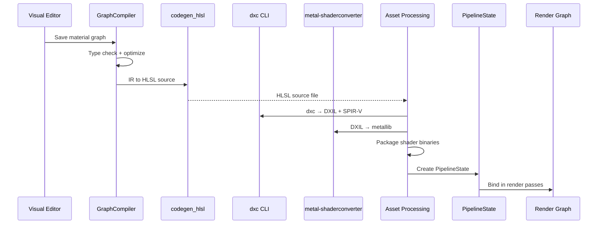

# Rendering ↔ Scripting Integration Design

## Systems Involved

| System | Design | Domain |
|--------|--------|--------|
| Rendering | [render-pipeline.md](../rendering/render-pipeline.md) | GPU pipeline |
| Scripting | [scripting.md](../game-framework/scripting.md) | Logic graphs |

## Integration Requirements

| ID | Requirement | Systems |
|----|-------------|---------|
| IR-3.5.1 | Material graphs codegen to HLSL source | Script, Ren |
| IR-3.5.2 | HLSL compiles via dxc CLI subprocess | Script, Ren |
| IR-3.5.3 | Shader permutations from material features | Script, Ren |
| IR-3.5.4 | Hot reload patches shader binaries | Script, Ren |
| IR-3.5.5 | Post-process graphs codegen compute HLSL | Script, Ren |
| IR-3.5.6 | Effect graphs codegen particle HLSL | Script, Ren |

1. **IR-3.5.1** -- Material graphs authored in the visual editor compile via `CompileTarget::Hlsl`
   in the `GraphCompiler`. The `codegen_hlsl` backend emits HLSL source implementing the material's
   surface shader function. Output includes PBR params (albedo, metallic, roughness, normal,
   emissive).
2. **IR-3.5.2** -- Generated HLSL is compiled by `dxc` CLI as a subprocess during asset processing.
   Output is DXIL and SPIR-V. `metal-shaderconverter` CLI translates DXIL to metallib. No runtime
   shader compilation in shipping builds.
3. **IR-3.5.3** -- `PermutationKey` combines `ShadingModel`, `ShaderFeatures`, and `RenderPath` to
   produce unique shader variants. The graph compiler emits `#ifdef` blocks for optional features.
   Asset processing pre-compiles all active permutations.
4. **IR-3.5.4** -- During development, the `HotReloader` watches material graph assets. When
   changed, the graph recompiles to HLSL, `dxc` produces new binaries, and the render pipeline swaps
   the `PipelineState` on the next frame.
5. **IR-3.5.5** -- Post-process graph nodes compile to HLSL compute shaders via the same
   `codegen_hlsl` backend. Each post-process effect registers as a compute pass in the render graph.
6. **IR-3.5.6** -- Effect graph nodes (F-11.6.1) compile to HLSL compute shaders for particle spawn,
   update, and output kernels via `codegen_hlsl`.

## Data Contracts

| Type | Defined in | Consumed by | Purpose |
|------|-----------|-------------|---------|
| `GraphCompiler` | Scripting | Rendering | HLSL emit |
| `CompileTarget` | Scripting | Rendering | Hlsl variant |
| `PermutationKey` | Rendering | Scripting | Shader key |
| `ShadingModel` | Rendering | Scripting | Surface type |
| `ShaderFeatures` | Rendering | Scripting | Feature bits |
| `RenderPath` | Rendering | Scripting | Fwd/deferred |
| `PipelineState` | Rendering | Hot reload | GPU state |
| `CompiledEffect` | VFX | Scripting | Kernels |
| `CompiledKernel` | VFX | Scripting | GPU bytecode |

```rust
/// Surface shading model. Determines lighting
/// evaluation in the G-buffer or forward pass.
/// Codegen'd into the middleman .dylib.
pub enum ShadingModel {
    DefaultLit,
    Subsurface,
    ClearCoat,
    Cloth,
    Hair,
    Eye,
    ThinTranslucent,
    Foliage,
    Unlit,
}

/// Bitflags for optional shader features. Each flag
/// maps to an `#ifdef` block in generated HLSL.
pub struct ShaderFeatures(u32);

impl ShaderFeatures {
    pub const NONE: Self = Self(0);
    pub const NORMAL_MAP: Self = Self(1 << 0);
    pub const EMISSIVE: Self = Self(1 << 1);
    pub const ALPHA_CLIP: Self = Self(1 << 2);
    pub const VERTEX_COLOR: Self = Self(1 << 3);
    pub const DETAIL_MAP: Self = Self(1 << 4);
    pub const PARALLAX: Self = Self(1 << 5);
    pub const CLEARCOAT_NORMAL: Self = Self(1 << 6);
    pub const SUBSURFACE_SCATTER: Self = Self(1 << 7);
}

/// Render path selection.
pub enum RenderPath {
    ForwardPlus,
    Deferred,
}

/// Unique key for a shader permutation. Used during
/// asset processing to enumerate all variants.
/// Compared and hashed during asset processing only
/// (offline path, not a runtime hot path).
#[derive(Clone, Copy, PartialEq, Eq, Hash)]
pub struct PermutationKey {
    pub shading_model: ShadingModel,
    pub features: ShaderFeatures,
    pub render_path: RenderPath,
}

/// Material graph compilation output.
/// Offline-only: produced during asset processing,
/// then serialized via rkyv for zero-copy mmap load.
/// Uses `Arc<str>` for HLSL source to allow shared
/// immutable access across compilation jobs without
/// cloning. `Arc` is permitted here because the data
/// is fully immutable after construction.
pub struct MaterialShaderOutput {
    pub hlsl_source: Arc<str>,
    pub shading_model: ShadingModel,
    pub features: ShaderFeatures,
    pub permutation_keys: Vec<PermutationKey>,
    pub content_hash: u64,
}

/// Shader compilation request for dxc subprocess.
/// Offline-only: used exclusively during asset
/// processing. MUST NOT be used at runtime. Heap
/// allocation is acceptable on this offline path.
pub struct ShaderCompileRequest {
    pub hlsl_source: Arc<str>,
    pub entry_point: String,
    pub profile: ShaderProfile,
    pub defines: Vec<(String, String)>,
    pub output_dxil: bool,
    pub output_spirv: bool,
}

/// Shader profiles for dxc compilation.
pub enum ShaderProfile {
    Vertex6_6,
    Pixel6_6,
    Compute6_6,
    Mesh6_6,
    Amplification6_6,
}

/// Compiled VFX effect. Contains GPU compute kernels
/// for particle spawn, init, update, and output.
/// Loaded at runtime via rkyv zero-copy mmap.
pub struct CompiledEffect {
    pub source_hash: u64,
    pub spawn_kernel: CompiledKernel,
    pub init_kernel: CompiledKernel,
    pub update_kernel: CompiledKernel,
    pub output_kernel: CompiledKernel,
    pub attribute_layout: AttributeLayout,
    pub output_mode: OutputMode,
}

/// Single GPU compute kernel within a compiled
/// effect. Bytecode is an rkyv-archived asset
/// loaded via zero-copy mmap.
pub struct CompiledKernel {
    pub bytecode: Handle<ShaderBytecode>,
    pub thread_group_size: u32,
    pub param_layout: ParamBufferLayout,
}
```

## Data Flow



## Timing and Ordering

| System | Phase | Timestep | Order |
|--------|-------|----------|-------|
| Graph compilation | Asset processing | Offline | First |
| dxc subprocess | Asset processing | Offline | After codegen |
| metal-shaderconverter | Asset processing | Offline | After dxc |
| PipelineState create | Asset load | On demand | After compile |
| Hot reload watch | Development only | Async | Background |
| Hot reload swap | 8-FrameEnd | Variable | End of frame |
| Render pass bind | Render thread | Variable | Per draw |

## Failure Modes

| Failure | Impact | Recovery |
|---------|--------|----------|
| HLSL codegen error | No shader | Show error node in editor |
| dxc compile failure | No binary | Fall back to error shader |
| Invalid permutation | Missing variant | Use default permutation |
| Hot reload conflict | Stale shader | Retry next frame |
| metallib convert fail | No macOS shader | Error shader + log |

## Platform Considerations

| Platform | Compiler | Output | Runtime compile |
|----------|---------|--------|-----------------|
| Windows | dxc | DXIL | Dev-only |
| macOS | dxc + MSC | metallib | Dev-only |
| Linux | dxc | SPIR-V | Dev-only |
| Shipping | Pre-compiled | All formats | Never |

## Test Plan

See companion [rendering-scripting-test-cases.md](rendering-scripting-test-cases.md).

## Review Feedback

1. `MaterialShaderOutput` uses `String` for `hlsl_source` and `Vec` for `permutation_keys`. These
   are heap-allocated, mutable types. The design should prefer `Arc<str>` or an arena-allocated
   slice to align with immutable-first data patterns -- but `Arc` is also prohibited. Consider an
   arena index or interned handle instead. [CONFIDENT]

2. `ShaderCompileRequest` uses `String` for `hlsl_source`, `entry_point`, and
   `Vec<(String, String)>` for `defines`. Since this is an offline asset-processing path (not a hot
   path), heap allocation is acceptable here. However, the design should explicitly note that this
   struct is offline-only to avoid accidental use at runtime. [CONFIDENT]

3. The Timing and Ordering table lists "Hot reload watch" with timestep "Async". The engine forbids
   async/await in all runtime code (R-13.4, constraints.md). The design should clarify this uses a
   file-watcher channel polled on the main thread, not an async runtime. [CONFIDENT]

4. No `classDiagram` is present. The design CLAUDE.md requires every design to include a Mermaid
   `classDiagram` covering ALL types: structs, enums, traits, type aliases, and their relationships.
   [CONFIDENT]

5. The Data Contracts table lists `CompiledEffect` as defined in "VFX" but no Rust pseudocode is
   provided for it. All types in the contracts table should have corresponding struct/enum
   definitions. [CONFIDENT]

6. `PermutationKey` is listed as consumed by Scripting but no Rust definition is provided. Since
   permutation keys are likely compared and hashed frequently during asset processing, the design
   should show the struct and confirm it avoids `HashMap` on any hot path. [CONFIDENT]

7. `ShadingModel` is referenced in `MaterialShaderOutput` but has no definition. It should be shown
   as an enum with variants (e.g., `DefaultLit`, `Unlit`, `Subsurface`) so reviewers can verify
   coverage. [CONFIDENT]

8. `ShaderFeatures` is used in `MaterialShaderOutput` but never defined. It needs a Rust pseudocode
   definition showing whether it is a bitflags struct, enum, or other representation. [CONFIDENT]

9. The design references `codegen_hlsl` as a backend but does not show its function signature or
   trait. Since visual graphs compile to native code (not bytecode), the codegen entry point should
   appear in the API section. [UNCERTAIN]

10. The design does not mention 2D/2.5D support. Material graphs and post-process graphs should
    address how they handle 2D sprite shaders or 2.5D rendering paths, since the engine must support
    all three modes. [CONFIDENT]

11. The design does not discuss serialization. Compiled shader artifacts need to be stored on disk.
    Per constraints, rkyv is the only serialization format (no serde). The design should specify
    that `MaterialShaderOutput` and compiled binaries use rkyv with mmap for zero-copy loading.
    [CONFIDENT]

12. The design does not mention ECS integration. Material components, shader handles, and pipeline
    states should be stored as ECS components or resources. The ECS-primary constraint (~90%)
    requires this to be explicit. [CONFIDENT]

13. The test cases companion file covers all six IRs (IR-3.5.1 through IR-3.5.6) with at least two
    test cases each, plus four benchmarks. Coverage is adequate. [CONFIDENT]

14. The sequence diagram shows `AP->>PSO: Create PipelineState` as a direct call. In the
    three-thread model, pipeline state creation happens on the render thread, not the asset
    processing worker. The diagram should show a channel send from asset processing to the render
    thread. [CONFIDENT]

15. The hot-reload flow (IR-3.5.4) says "the render pipeline swaps the `PipelineState` on the next
    frame" but does not describe the channel-based handoff from the main thread (file watcher) to
    workers (recompile) to render thread (PSO swap). The three-thread boundary crossings should be
    explicit. [CONFIDENT]

16. No "Open Questions" section is present. The design template in the design CLAUDE.md lists this
    as an expected section. [CONFIDENT]

17. The `ShaderProfile` enum only lists SM 6.6 profiles. The design should note whether SM 6.0--6.5
    profiles are intentionally excluded or if this is a simplification. [UNCERTAIN]

18. The Platform Considerations table says runtime compilation is "Dev-only" but does not describe
    how the dev-mode subprocess call avoids blocking the main thread. Since no async/await is
    permitted, this should use a channel + job pattern. [CONFIDENT]
