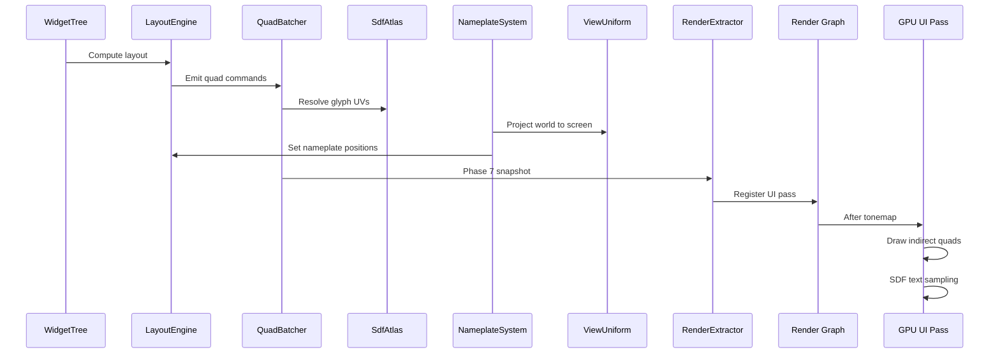

# Rendering ↔ UI Framework Integration Design

## Systems Involved

| System | Design | Domain |
|--------|--------|--------|
| Rendering | [rendering-core.md](../rendering/rendering-core.md) | GPU pipeline |
| UI | [ui-framework.md](../ui/ui-framework.md) | Widget system |

## Integration Requirements

| ID | Requirement | Systems |
|----|-------------|---------|
| IR-3.6.1 | UI renders via dedicated render graph pass | UI, Ren |
| IR-3.6.2 | QuadBatcher submits indirect draw batches | UI, Ren |
| IR-3.6.3 | MSDF text renders in UI pass | UI, Ren |
| IR-3.6.4 | World-space UI panels in 3D pass | UI, Ren |
| IR-3.6.5 | Render-to-texture for 3D-in-UI previews | UI, Ren |
| IR-3.6.6 | UI renders after tonemap, before grain | UI, Ren |
| IR-3.6.7 | Nameplates anchor to 3D world positions | UI, Ren |

1. **IR-3.6.1** -- The UI rendering pipeline registers a dedicated pass in the render graph. This
   pass runs in the `RenderPhase::UI` phase after tonemapping but before film grain and vignette
   (see render effects pipeline order). The pass reads the scene color buffer and writes UI quads on
   top.
2. **IR-3.6.2** -- `QuadBatcher` accumulates widget draw commands into vertex/index buffers. It
   produces `DrawIndirect` args for batched submission. Atlas regions, nine-slice UVs, and tint
   colors are packed per-instance.
3. **IR-3.6.3** -- `SdfAtlas` provides MSDF glyph textures. The UI pass samples the atlas with SDF
   anti-aliased edges (F-10.4.2, F-10.4.7). Up to 5000+ glyphs per frame.
4. **IR-3.6.4** -- World-space UI panels (`F-10.1.10`) render in the 3D scene pass, not the
   screen-space UI pass. They receive lighting and depth testing. Ray- cast input handles
   interaction.
5. **IR-3.6.5** -- `RenderToTexture` creates an offscreen render target for 3D model previews inside
   UI panels (F-10.4.5). The render graph schedules a sub-view that renders the preview scene, then
   the UI pass samples the result texture.
6. **IR-3.6.6** -- Post-process pipeline order: effects 1-9 (HDR), 10-tonemap, UI pass, 11-chromatic
   aberration, 12-film grain, 13-vignette. UI renders in display space after tonemap.
7. **IR-3.6.7** -- `NameplateSystem` projects 3D world positions to screen coordinates using the
   active camera's `ViewUniform.view_projection` matrix. Screen positions feed into `ComputedLayout`
   for nameplate widget placement.

## Data Contracts

| Type | Defined in | Consumed by | Purpose |
|------|-----------|-------------|---------|
| `QuadBatcher` | UI | Rendering | Draw batches |
| `SdfAtlas` | UI | Rendering | Glyph textures |
| `RenderPhase::UI` | Rendering | UI | Pass ordering |
| `RenderToTexture` | UI | Render graph | Offscreen RT |
| `ViewUniform` | Rendering | UI (nameplates) | Projection |
| `NineSliceSolver` | UI | Rendering | Sprite slicing |

```rust
/// UI render pass registered in the render graph.
/// Reads scene color, writes UI quads on top.
pub struct UiRenderPass {
    pub quad_vertex_buffer: GpuBuffer,
    pub quad_index_buffer: GpuBuffer,
    pub indirect_args: GpuBuffer,
    pub atlas_texture: GpuTextureView,
    pub sdf_atlas_texture: GpuTextureView,
    pub draw_count: u32,
}

/// Nameplate screen projection result.
pub struct NameplateScreenPos {
    pub entity: Entity,
    pub screen_xy: Vec2,
    pub depth: f32,
    pub visible: bool,
}
```

## Data Flow



## Timing and Ordering

| System | Phase | Timestep | Order |
|--------|-------|----------|-------|
| WidgetTree diff | 3-Simulation | Variable | After input |
| LayoutEngine | 3-Simulation | Variable | After diff |
| StyleResolver | 3-Simulation | Variable | Before layout |
| QuadBatcher | 7-Snapshot | Variable | In extract |
| NameplateSystem | 7-Snapshot | Variable | After camera |
| RenderToTexture | Render thread | Variable | Before UI |
| UI render pass | Render thread | Variable | After tonemap |
| World-space UI | Render thread | Variable | In 3D pass |

## Failure Modes

| Failure | Impact | Recovery |
|---------|--------|----------|
| Atlas full | Missing glyphs | LRU evict, repack |
| Batch overflow | Partial UI | Split into passes |
| RTT target missing | Black preview | Skip preview quad |
| Nameplate behind cam | Off-screen anchor | Cull depth < 0 |
| > 50 draw calls | Perf target miss | Merge more batches |

## Platform Considerations

| Platform | Max draws | SDF quality | RTT |
|----------|----------|-------------|-----|
| Desktop | 50 | Full MSDF | Yes |
| Console | 50 | Full MSDF | Yes |
| Mobile | 30 | SDF (no multi-channel) | Half-res |
| Switch | 40 | Full MSDF | Half-res |

## Test Plan

See companion [rendering-ui-test-cases.md](rendering-ui-test-cases.md).
