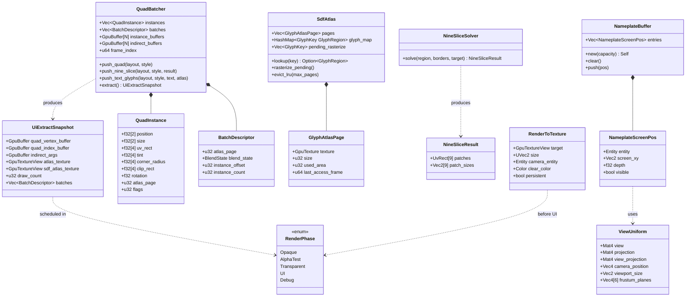
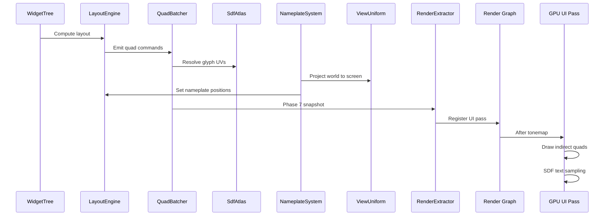

# Rendering ↔ UI Framework Integration Design

## Systems Involved

| System | Design | Domain |
|--------|--------|--------|
| Rendering | [rendering-core.md](../rendering/rendering-core.md) | GPU pipeline |
| UI | [ui-framework.md](../ui/ui-framework.md) | Widget system |

## Integration Requirements

| ID | Requirement | Systems |
|----|-------------|---------|
| IR-3.6.1 | UI renders via dedicated render graph pass | UI, Ren |
| IR-3.6.2 | QuadBatcher submits indirect draw batches | UI, Ren |
| IR-3.6.3 | MSDF text renders in UI pass | UI, Ren |
| IR-3.6.4 | World-space UI panels in 3D pass | UI, Ren |
| IR-3.6.5 | Render-to-texture for 3D-in-UI previews | UI, Ren |
| IR-3.6.6 | UI renders after tonemap, before grain | UI, Ren |
| IR-3.6.7 | Nameplates anchor to 3D world positions | UI, Ren |

1. **IR-3.6.1** -- The UI rendering pipeline registers a dedicated pass in the render graph. This
   pass runs in the `RenderPhase::UI` phase after tonemapping but before film grain and vignette
   (see render effects pipeline order). The pass reads the scene color buffer and writes UI quads on
   top.
2. **IR-3.6.2** -- `QuadBatcher` accumulates widget draw commands into vertex/index buffers. It
   produces `DrawIndirect` args for batched submission. Atlas regions, nine-slice UVs, and tint
   colors are packed per-instance.
3. **IR-3.6.3** -- `SdfAtlas` provides MSDF glyph textures using the multi-channel signed distance
   field algorithm (Chlumsky 2015). The UI pass samples the atlas with SDF anti-aliased edges
   (F-10.4.2, F-10.4.7). Up to 5000+ glyphs per frame. Fallback: when MSDF generation fails for a
   glyph, the system falls back to rasterized bitmap glyphs at the target size.
4. **IR-3.6.4** -- World-space UI panels (`F-10.1.10`) render in the 3D scene pass, not the
   screen-space UI pass. They receive lighting and depth testing. Ray- cast input handles
   interaction.
5. **IR-3.6.5** -- `RenderToTexture` creates an offscreen render target for 3D model previews inside
   UI panels (F-10.4.5). The render graph schedules a sub-view that renders the preview scene, then
   the UI pass samples the result texture.
6. **IR-3.6.6** -- Post-process pipeline order: effects 1-9 (HDR), 10-tonemap, UI pass, 11-chromatic
   aberration, 12-film grain, 13-vignette. UI renders in display space after tonemap.
7. **IR-3.6.7** -- `NameplateSystem` projects 3D world positions to screen coordinates using the
   active camera's `ViewUniform.view_projection` matrix. Screen positions feed into `ComputedLayout`
   for nameplate widget placement.

## Data Contracts

| Type | Defined in | Consumed by | Purpose |
|------|-----------|-------------|---------|
| `QuadBatcher` | UI | Rendering | Draw batches |
| `SdfAtlas` | UI | Rendering | Glyph textures |
| `GlyphAtlasPage` | UI | Rendering | Glyph atlas page |
| `RenderPhase::UI` | Rendering | UI | Pass ordering |
| `RenderToTexture` | UI | Render graph | Offscreen RT |
| `ViewUniform` | Rendering | UI (nameplates) | Projection |
| `NineSliceSolver` | UI | Rendering | Sprite slicing |
| `UiExtractSnapshot` | UI | Render thread | Immutable snapshot |

```rust
/// Immutable snapshot of UI draw data produced by the
/// extract phase (phase 7). Sent to the render thread
/// via channel. The render thread consumes this snapshot
/// to issue GPU draw commands.
pub struct UiExtractSnapshot {
    pub quad_vertex_buffer: GpuBuffer,
    pub quad_index_buffer: GpuBuffer,
    pub indirect_args: GpuBuffer,
    pub atlas_texture: GpuTextureView,
    pub sdf_atlas_texture: GpuTextureView,
    pub draw_count: u32,
    pub batches: Vec<BatchDescriptor>,
}

/// Accumulates widget quad commands during the
/// simulation phase. Each widget entity with a
/// `ComputedLayout` and `ComputedStyle` is queried
/// via ECS and emitted as a `QuadInstance`.
pub struct QuadBatcher {
    instances: Vec<QuadInstance>,
    batches: Vec<BatchDescriptor>,
    instance_buffers: [GpuBuffer; FRAMES_IN_FLIGHT],
    indirect_buffers: [GpuBuffer; FRAMES_IN_FLIGHT],
    frame_index: u64,
}

/// Per-instance quad data packed for GPU submission.
#[derive(Clone, Copy)]
#[repr(C)]
pub struct QuadInstance {
    pub position: [f32; 2],
    pub size: [f32; 2],
    pub uv_rect: [f32; 4],
    pub tint: [f32; 4],
    pub corner_radius: [f32; 4],
    pub clip_rect: [f32; 4],
    pub rotation: f32,
    pub atlas_page: u32,
    pub flags: u32,
    pub _pad: u32,
}

/// Describes one draw batch sharing atlas page and
/// blend state.
#[derive(Clone, Debug)]
pub struct BatchDescriptor {
    pub atlas_page: u32,
    pub blend_state: BlendState,
    pub instance_offset: u32,
    pub instance_count: u32,
}

/// Multi-channel signed distance field glyph atlas.
/// Algorithm: Chlumsky 2015 "Multi-channel Signed
/// Distance Fields."
pub struct SdfAtlas {
    pages: Vec<GlyphAtlasPage>,
    glyph_map: HashMap<GlyphKey, GlyphRegion>,
    pending_rasterize: Vec<GlyphKey>,
}

/// Single atlas page texture. Owned by the render
/// thread. Pages are evicted LRU when the atlas
/// exceeds `max_pages`. On eviction the GPU texture
/// is dropped and any glyphs referencing the page
/// are re-rasterized on demand.
pub struct GlyphAtlasPage {
    pub texture: GpuTexture,
    pub size: u32,
    pub used_area: u32,
    pub last_access_frame: u64,
}

/// Solves nine-slice sprite UVs from border insets.
pub struct NineSliceSolver;

impl NineSliceSolver {
    /// Computes nine-slice UVs for a sprite region.
    /// Fallback: if border insets exceed sprite size,
    /// clamp insets to half the sprite dimension.
    pub fn solve(
        region: &AtlasRegion,
        borders: Edges,
        target_size: Vec2,
    ) -> NineSliceResult { .. }
}

/// Nine-slice UV output for a single widget.
pub struct NineSliceResult {
    pub patches: [UvRect; 9],
    pub patch_sizes: [Vec2; 9],
}

/// Off-screen render-to-texture for 3D previews
/// inside UI panels. The render graph creates a
/// sub-view that renders the preview scene into
/// this target. Persistent targets are owned by
/// the render graph and reused across frames.
/// Fallback: if RTT allocation fails, the UI quad
/// renders a solid fallback color.
pub struct RenderToTexture {
    pub target: GpuTextureView,
    pub size: UVec2,
    pub camera_entity: Entity,
    pub clear_color: Color,
    pub persistent: bool,
}

/// Nameplate screen projection result. Stored in a
/// pre-sized arena-backed `Vec` to avoid per-frame
/// heap allocation on the hot path.
/// Frame-transient; not serialized.
pub struct NameplateScreenPos {
    pub entity: Entity,
    pub screen_xy: Vec2,
    pub depth: f32,
    pub visible: bool,
}

/// Pre-sized arena-backed buffer for nameplate
/// projections. Capacity is set to the maximum
/// expected nameplate count (default 256).
pub struct NameplateBuffer {
    entries: Vec<NameplateScreenPos>,
}

impl NameplateBuffer {
    pub fn new(capacity: usize) -> Self { .. }
    pub fn clear(&mut self) { .. }
    pub fn push(&mut self, pos: NameplateScreenPos) { .. }
}
```

### ECS Integration

Widget entities drive the rendering pipeline through ECS queries. The `QuadBatcher` queries all
entities with `ComputedLayout` and `ComputedStyle` components each frame. The `paint_system` runs
after layout and style resolution.

```rust
/// ECS system: queries widget entities, emits quads.
fn paint_system(
    query: Query<(
        Entity,
        &ComputedLayout,
        &ComputedStyle,
        Option<&NineSliceSprite>,
        Option<&TextContent>,
    )>,
    batcher: ResMut<QuadBatcher>,
    sdf_atlas: Res<SdfAtlas>,
) {
    for (entity, layout, style, nine_slice, text)
        in query.iter()
    {
        if let Some(ns) = nine_slice {
            let result = NineSliceSolver::solve(
                &ns.region, ns.borders, layout.size,
            );
            batcher.push_nine_slice(
                layout, style, &result,
            );
        } else {
            batcher.push_quad(layout, style);
        }
        if let Some(t) = text {
            batcher.push_text_glyphs(
                layout, style, t, &sdf_atlas,
            );
        }
    }
}
```

### Class Diagram



## Data Flow



## Timing and Ordering

| System | Phase | Timestep | Order |
|--------|-------|----------|-------|
| WidgetTree diff | 3-Simulation | Variable | After input |
| LayoutEngine | 3-Simulation | Variable | After diff |
| StyleResolver | 3-Simulation | Variable | Before layout |
| QuadBatcher | 7-Snapshot | Variable | In extract |
| NameplateSystem | 7-Snapshot | Variable | After camera |
| RenderToTexture | Render thread | Variable | Before UI |
| UI render pass | Render thread | Variable | After tonemap |
| World-space UI | Render thread | Variable | In 3D pass |

## Failure Modes

| Failure | Impact | Recovery |
|---------|--------|----------|
| Atlas full | Missing glyphs | LRU evict, repack |
| Batch overflow | Partial UI | Split into passes |
| RTT target missing | Black preview | Skip preview quad |
| Nameplate behind cam | Off-screen anchor | Cull depth < 0 |
| > 50 draw calls | Perf target miss | Merge more batches |

## Platform Considerations

| Platform | Max draws | SDF quality | RTT |
|----------|----------|-------------|-----|
| Desktop | 50 | Full MSDF | Yes |
| Console | 50 | Full MSDF | Yes |
| Mobile | 30 | SDF (no multi-channel) | Half-res |
| Switch | 40 | Full MSDF | Half-res |

## Test Plan

See companion [rendering-ui-test-cases.md](rendering-ui-test-cases.md).

## Review Feedback

1. No Mermaid `classDiagram` is present. The design CLAUDE.md requires every design to include a
   `classDiagram` covering ALL types, structs, enums, traits, type aliases, and their relationships.
   `UiRenderPass`, `NameplateScreenPos`, `QuadBatcher`, `SdfAtlas`, `NineSliceSolver`,
   `RenderToTexture`, `RenderPhase::UI`, and `ViewUniform` all need to appear in a class diagram.
   [CONFIDENT]

2. No `#[derive(Archive, Deserialize, Serialize)]` (rkyv) annotations on any struct. The engine uses
   rkyv exclusively for binary serialization (no serde). `NameplateScreenPos` is frame-transient so
   may not need rkyv, but this should be stated explicitly. Any data that crosses a frame boundary
   or is snapshot for the render thread should show rkyv derivation. [CONFIDENT]

3. The design does not address 2D or 2.5D UI rendering. The engine constraints require first-class
   2D/2.5D support. How does `QuadBatcher` work with `Transform2D`? Does the nameplate system
   project from 2D world positions? The design must cover 2D and 2.5D modes explicitly. [CONFIDENT]

4. No mention of UI widgets as ECS entities. The engine constraint is "ECS-primary (~90%), UI
   widgets as entities." The design references `WidgetTree` and `LayoutEngine` but does not show how
   widget entities feed into the quad batcher or how ECS queries drive the rendering pipeline. This
   is a fundamental architectural omission. [CONFIDENT]

5. The Data Contracts table lists six types but only two (`UiRenderPass`, `NameplateScreenPos`) have
   Rust pseudocode. `QuadBatcher`, `SdfAtlas`, `NineSliceSolver`, and `RenderToTexture` all require
   Rust struct definitions per the design template. [CONFIDENT]

6. `UiRenderPass` holds `draw_count: u32` as a mutable counter, but the engine prefers
   immutable-first data patterns. Consider making `UiRenderPass` an immutable snapshot produced by
   the extract phase rather than a mutable accumulator. [CONFIDENT]

7. The sequence diagram shows `QB->>EX: Phase 7 snapshot` but does not clarify the thread boundary.
   The three-thread model (main, workers, render) means the extract/snapshot copies data from the
   worker thread to the render thread via channel. The diagram should show the channel send and
   which thread owns each participant. [CONFIDENT]

8. No benchmark test case exists for IR-3.6.4 (world-space UI panels) or IR-3.6.6 (UI pass ordering
   relative to post-process). All IRs should have at least one benchmark entry in the companion file
   to verify performance targets. [CONFIDENT]

9. `NameplateScreenPos` stores `entity: Entity` which ties the projection result back to an ECS
   entity, but nothing prevents this struct from being heap-allocated per nameplate per frame. With
   200+ nameplates this is a hot path. The design should specify arena allocation or a pre-sized
   `Vec` backed by a per-thread arena. [CONFIDENT]

10. The Failure Modes table lists "> 50 draw calls" as a failure with recovery "Merge more batches,"
    but the Platform Considerations table allows only 30 draws on mobile. The failure threshold
    should match the per-platform budget, not a single fixed number. [CONFIDENT]

11. No algorithm reference is cited for the MSDF sampling technique. The constraints require every
    non-trivial algorithm to cite its source (paper, blog, GDC talk). MSDF text rendering originates
    from Chlumsky's 2015 thesis and should be cited. [CONFIDENT]

12. The `RenderPhase::UI` variant is listed as "Defined in: Rendering" but no enum definition is
    shown. Since this is the ordering mechanism that determines when UI renders relative to
    post-process effects, its full enum (with all phases) should appear in the Rust pseudocode or be
    cross-referenced to a specific design document section. [UNCERTAIN]

13. The design does not mention how render-to-texture (`RenderToTexture`) interacts with the render
    graph's resource lifetime tracking. If the RTT target is created and destroyed per frame, this
    may conflict with the render graph's resource aliasing. If it persists across frames, the
    ownership and cleanup strategy should be documented. [UNCERTAIN]

14. The Timing table places `StyleResolver` at phase "3-Simulation" with order "Before layout," but
    it is not shown in the sequence diagram or data flow at all. Either add it to the diagram or
    explain why it is omitted. [CONFIDENT]
