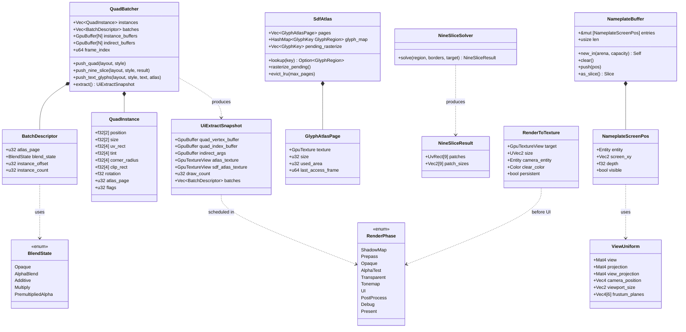
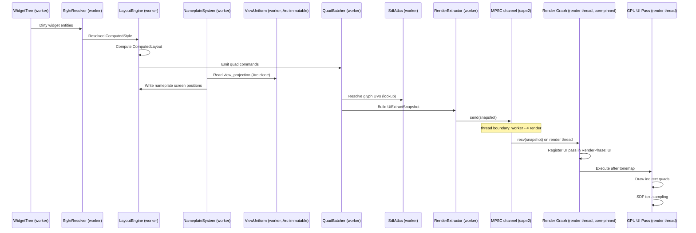

# Rendering ↔ UI Framework Integration Design

> **Compliance.** This document follows the cross-cutting conventions in
> [shared-conventions.md](shared-conventions.md) (SC-1..SC-14) and the channel-capacity formula in
> [shared-messaging-capacities.md](shared-messaging-capacities.md). Deviations: none.

## Systems Involved

| System | Design | Domain |
|--------|--------|--------|
| Rendering | [rendering-core.md](../rendering/rendering-core.md) | GPU pipeline |
| UI | [ui-framework.md](../ui/ui-framework.md) | Widget system |

## Integration Requirements

| ID | Requirement | Systems |
|----|-------------|---------|
| IR-3.6.1 | UI renders via dedicated render graph pass | UI, Ren |
| IR-3.6.2 | QuadBatcher submits indirect draw batches | UI, Ren |
| IR-3.6.3 | MSDF text renders in UI pass | UI, Ren |
| IR-3.6.4 | World-space UI panels in 3D pass | UI, Ren |
| IR-3.6.5 | Render-to-texture for 3D-in-UI previews | UI, Ren |
| IR-3.6.6 | UI renders after tonemap, before grain | UI, Ren |
| IR-3.6.7 | Nameplates anchor to 3D world positions | UI, Ren |

1. **IR-3.6.1** -- The UI rendering pipeline registers a dedicated pass in the render graph. This
   pass runs in the `RenderPhase::UI` phase after tonemapping but before film grain and vignette
   (see render effects pipeline order). The pass reads the scene color buffer and writes UI quads on
   top.
2. **IR-3.6.2** -- `QuadBatcher` accumulates widget draw commands into vertex/index buffers. It
   produces `DrawIndirect` args for batched submission. Atlas regions, nine-slice UVs, and tint
   colors are packed per-instance.
3. **IR-3.6.3** -- `SdfAtlas` provides MSDF glyph textures using the multi-channel signed distance
   field algorithm (Chlumsky 2015, <https://github.com/Chlumsky/msdfgen>). The UI pass samples the
   atlas with SDF anti-aliased edges (F-10.4.2, F-10.4.7). Up to 5000+ glyphs per frame. Fallback:
   when MSDF generation fails for a glyph, the system falls back to rasterized bitmap glyphs at the
   target size. Second fallback: if bitmap rasterization also fails (e.g., unsupported font), the
   glyph renders as a tofu box (`U+FFFD`) at the same size.
4. **IR-3.6.4** -- World-space UI panels (`F-10.1.10`) render in the 3D scene pass, not the
   screen-space UI pass. They receive lighting and depth testing. Ray- cast input handles
   interaction.
5. **IR-3.6.5** -- `RenderToTexture` creates an offscreen render target for 3D model previews inside
   UI panels (F-10.4.5). The render graph schedules a sub-view that renders the preview scene, then
   the UI pass samples the result texture.
6. **IR-3.6.6** -- Post-process pipeline order: effects 1-9 (HDR), 10-tonemap, UI pass, 11-chromatic
   aberration, 12-film grain, 13-vignette. UI renders in display space after tonemap.
7. **IR-3.6.7** -- `NameplateSystem` projects 3D world positions to screen coordinates using the
   active camera's `ViewUniform.view_projection` matrix. Screen positions feed into `ComputedLayout`
   for nameplate widget placement. Works identically with 2D (`Transform2D`) and 3D
   (`GlobalTransform`) sources — the projection uses whichever camera is active.

## Dimensional Modes (2D / 2.5D / 3D)

UI is inherently a **2D** subsystem: all widgets are quads in screen space, rendered in
`RenderPhase::UI` after tonemap. This is true regardless of whether the game world is 2D, 2.5D, or
3D. The design supports three modes:

1. **Screen-space UI (always 2D)** -- `QuadBatcher` emits `QuadInstance` records with screen-space
   `position` and `size`. Orthographic projection is applied in the vertex shader. This is the
   default path and covers HUD, menus, chat, inventory.
2. **World-space UI panels (2.5D/3D)** -- Panels with `WorldSpacePanel` component render in the 3D
   scene pass (`RenderPhase::Transparent`) with depth testing and lighting. They are still 2D quads,
   but their transform is sampled from `GlobalTransform` (3D) or `Transform2D` (2D/2.5D).
3. **Nameplates (screen-anchored to world)** -- `NameplateSystem` reads `GlobalTransform` **or**
   `Transform2D` and projects via `ViewUniform.view_projection`. For pure 2D games the projection
   matrix is the 2D camera's orthographic matrix; the same code path handles both.

## Widgets Are ECS Entities

Per the engine-wide "ECS-primary (~90%), UI widgets as entities" constraint, every UI widget is a
first-class ECS entity. Widgets have no special container — they live in the same `World` as game
entities. The following components drive the UI rendering pipeline:

| Component | Role |
|-----------|------|
| `ComputedLayout` | Final screen rect after layout pass |
| `ComputedStyle` | Final resolved style (color, font, etc.) |
| `NineSliceSprite` | Optional sprite + border insets |
| `TextContent` | Optional glyph string + font handle |
| `WorldSpacePanel` | Marks panel as 3D scene participant |
| `Nameplate` | Marks entity as nameplate anchor target |
| `Transform2D` | 2D world position (for 2D/2.5D) |
| `GlobalTransform` | 3D world position (for 3D) |

The `paint_system` (see ECS Integration below) uses ECS queries to visit widget entities. There is
no parallel "widget tree" data structure — the ECS archetype graph **is** the widget tree.

## Data Contracts

| Type | Defined in | Consumed by | Purpose |
|------|-----------|-------------|---------|
| `QuadBatcher` | UI | Rendering | Draw batches |
| `SdfAtlas` | UI | Rendering | Glyph textures |
| `GlyphAtlasPage` | UI | Rendering | Glyph atlas page |
| `RenderPhase::UI` | Rendering | UI | Pass ordering |
| `RenderToTexture` | UI | Render graph | Offscreen RT |
| `ViewUniform` | Rendering | UI (nameplates) | Projection |
| `NineSliceSolver` | UI | Rendering | Sprite slicing |
| `UiExtractSnapshot` | UI | Render thread | Immutable snapshot |

```rust
/// Render graph phase ordering. `UI` runs after tonemap
/// and before film grain / vignette. Fully defined here
/// so the pass ordering contract is explicit.
#[derive(Clone, Copy, Debug, Eq, Hash, Ord, PartialEq, PartialOrd)]
#[repr(u8)]
pub enum RenderPhase {
    ShadowMap = 0,
    Prepass = 1,
    Opaque = 2,
    AlphaTest = 3,
    Transparent = 4,
    Tonemap = 5,
    UI = 6,
    PostProcess = 7,
    Debug = 8,
    Present = 9,
}

/// Immutable snapshot of UI draw data produced by the
/// extract phase (phase 7). Constructed once per frame by
/// the worker thread and sent to the render thread over a
/// bounded MPSC channel (`MPSC_UI_SNAPSHOT_CAPACITY = 2`,
/// one in-flight + one building). All fields are read-only
/// on the render thread. The snapshot is frame-transient
/// and NOT persisted to disk, so no rkyv derives are
/// required.
#[derive(Clone, Debug)]
pub struct UiExtractSnapshot {
    pub quad_vertex_buffer: GpuBuffer,
    pub quad_index_buffer: GpuBuffer,
    pub indirect_args: GpuBuffer,
    pub atlas_texture: GpuTextureView,
    pub sdf_atlas_texture: GpuTextureView,
    pub draw_count: u32,
    pub batches: Arc<[BatchDescriptor]>,
}

/// Accumulates widget quad commands during the
/// simulation phase. Each widget entity with a
/// `ComputedLayout` and `ComputedStyle` is queried
/// via ECS and emitted as a `QuadInstance`.
pub struct QuadBatcher {
    instances: Vec<QuadInstance>,
    batches: Vec<BatchDescriptor>,
    instance_buffers: [GpuBuffer; FRAMES_IN_FLIGHT],
    indirect_buffers: [GpuBuffer; FRAMES_IN_FLIGHT],
    frame_index: u64,
}

/// Per-instance quad data packed for GPU submission.
#[derive(Clone, Copy)]
#[repr(C)]
pub struct QuadInstance {
    pub position: [f32; 2],
    pub size: [f32; 2],
    pub uv_rect: [f32; 4],
    pub tint: [f32; 4],
    pub corner_radius: [f32; 4],
    pub clip_rect: [f32; 4],
    pub rotation: f32,
    pub atlas_page: u32,
    pub flags: u32,
    pub _pad: u32,
}

/// Describes one draw batch sharing atlas page and
/// blend state. Frame-transient (not persisted); no rkyv
/// derives.
#[derive(Clone, Debug)]
pub struct BatchDescriptor {
    pub atlas_page: u32,
    pub blend_state: BlendState,
    pub instance_offset: u32,
    pub instance_count: u32,
}

/// Blend modes packed into `BatchDescriptor`. All variants
/// defined so batch merging is deterministic.
#[derive(Clone, Copy, Debug, Eq, Hash, PartialEq)]
#[repr(u8)]
pub enum BlendState {
    Opaque = 0,
    AlphaBlend = 1,
    Additive = 2,
    Multiply = 3,
    PremultipliedAlpha = 4,
}

/// Bounded MPSC channel capacity for handing UI snapshots
/// from the worker thread to the core-pinned render thread.
/// Two slots allow one in-flight + one under construction.
pub const MPSC_UI_SNAPSHOT_CAPACITY: usize = 2;

/// Multi-channel signed distance field glyph atlas.
/// Algorithm: Chlumsky 2015 "Multi-channel Signed
/// Distance Fields."
pub struct SdfAtlas {
    pages: Vec<GlyphAtlasPage>,
    glyph_map: HashMap<GlyphKey, GlyphRegion>,
    pending_rasterize: Vec<GlyphKey>,
}

/// Single atlas page texture. Exclusively owned by the
/// core-pinned render thread — the worker thread never
/// touches `GpuTexture` directly. Pages are evicted LRU
/// when the atlas exceeds `max_pages`. Cleanup protocol:
///
/// 1. Worker marks `last_access_frame` when a glyph in
///    the page is referenced.
/// 2. At end of frame N, render thread walks `pages` and
///    evicts any whose `last_access_frame < N - EVICT_GRACE`
///    (`EVICT_GRACE = 2`, matching `FRAMES_IN_FLIGHT`).
/// 3. On eviction, `GpuTexture` is dropped on the render
///    thread (where it was created) and corresponding
///    `glyph_map` entries are removed.
/// 4. Subsequent lookups for evicted glyphs push onto
///    `pending_rasterize` and are re-rasterized next frame.
///
/// Frame-transient GPU resource; no rkyv derives.
pub struct GlyphAtlasPage {
    pub texture: GpuTexture,
    pub size: u32,
    pub used_area: u32,
    pub last_access_frame: u64,
}

/// Solves nine-slice sprite UVs from border insets.
pub struct NineSliceSolver;

impl NineSliceSolver {
    /// Computes nine-slice UVs for a sprite region.
    /// Fallback: if border insets exceed sprite size,
    /// clamp insets to half the sprite dimension.
    pub fn solve(
        region: &AtlasRegion,
        borders: Edges,
        target_size: Vec2,
    ) -> NineSliceResult { .. }
}

/// Nine-slice UV output for a single widget.
pub struct NineSliceResult {
    pub patches: [UvRect; 9],
    pub patch_sizes: [Vec2; 9],
}

/// Off-screen render-to-texture for 3D previews inside
/// UI panels. The render graph owns the underlying
/// `GpuTexture` and participates in resource aliasing:
///
/// * `persistent = true` -- the target is allocated once
///   at registration time and retained across frames. The
///   render graph treats it as an external resource; no
///   aliasing is performed. Cleanup happens only when the
///   UI panel entity is despawned (detected by the graph
///   reference count dropping to zero).
/// * `persistent = false` -- the target is allocated from
///   the transient resource pool at the start of each
///   frame and aliased with any compatible transient
///   texture (same size, format, usage). The render graph
///   resource tracker enforces write-then-read ordering so
///   the UI pass never samples an aliased texture that is
///   still being written.
///
/// Fallback 1: if persistent allocation fails, the system
/// retries as transient for one frame and emits a warning
/// diagnostic.
/// Fallback 2: if transient allocation also fails, the UI
/// quad renders a solid fallback color (`clear_color`) and
/// emits a warning diagnostic.
/// Frame-transient handle; no rkyv derives.
pub struct RenderToTexture {
    pub target: GpuTextureView,
    pub size: UVec2,
    pub camera_entity: Entity,
    pub clear_color: Color,
    pub persistent: bool,
}

/// Nameplate screen projection result. Stored in a
/// pre-sized, arena-allocated slice to avoid per-frame
/// heap allocation on the hot path. Frame-transient; not
/// serialized (no rkyv derives).
#[derive(Clone, Copy, Debug)]
#[repr(C)]
pub struct NameplateScreenPos {
    pub entity: Entity,
    pub screen_xy: Vec2,
    pub depth: f32,
    pub visible: bool,
}

/// Pre-sized bump-arena-backed buffer for nameplate
/// projections. Allocated once at startup from the
/// per-frame arena (`frame_arena: &Bump`). No per-frame
/// heap allocations occur after construction. Capacity
/// (`NAMEPLATE_CAPACITY`) defaults to 256 and is
/// configurable per-platform.
pub struct NameplateBuffer<'arena> {
    entries: &'arena mut [NameplateScreenPos],
    len: usize,
}

pub const NAMEPLATE_CAPACITY: usize = 256;

impl<'arena> NameplateBuffer<'arena> {
    pub fn new_in(arena: &'arena Bump, capacity: usize) -> Self { .. }
    pub fn clear(&mut self) { .. }
    pub fn push(&mut self, pos: NameplateScreenPos) { .. }
    pub fn as_slice(&self) -> &[NameplateScreenPos] { .. }
}
```

### ECS Integration

Widget entities drive the rendering pipeline through ECS queries. The `QuadBatcher` queries all
entities with `ComputedLayout` and `ComputedStyle` components each frame. The `paint_system` runs
after layout and style resolution.

```rust
/// ECS system: queries widget entities, emits quads.
fn paint_system(
    query: Query<(
        Entity,
        &ComputedLayout,
        &ComputedStyle,
        Option<&NineSliceSprite>,
        Option<&TextContent>,
    )>,
    batcher: ResMut<QuadBatcher>,
    sdf_atlas: Res<SdfAtlas>,
) {
    for (entity, layout, style, nine_slice, text)
        in query.iter()
    {
        if let Some(ns) = nine_slice {
            let result = NineSliceSolver::solve(
                &ns.region, ns.borders, layout.size,
            );
            batcher.push_nine_slice(
                layout, style, &result,
            );
        } else {
            batcher.push_quad(layout, style);
        }
        if let Some(t) = text {
            batcher.push_text_glyphs(
                layout, style, t, &sdf_atlas,
            );
        }
    }
}
```

### Class Diagram



## Data Flow

Participants are grouped by owning thread. The vertical bar labelled "thread boundary" marks the
MPSC channel send from the worker thread to the core-pinned render thread.



## Timing and Ordering

| System | Phase | Timestep | Order |
|--------|-------|----------|-------|
| WidgetTree diff | 3-Simulation | Variable | After input |
| LayoutEngine | 3-Simulation | Variable | After diff |
| StyleResolver | 3-Simulation | Variable | Before layout |
| QuadBatcher | 7-Snapshot | Variable | In extract |
| NameplateSystem | 7-Snapshot | Variable | After camera |
| RenderToTexture | Render thread | Variable | Before UI |
| UI render pass | Render thread | Variable | After tonemap |
| World-space UI | Render thread | Variable | In 3D pass |

## Failure Modes

| Failure | Impact | Recovery |
|---------|--------|----------|
| Atlas full | Missing glyphs | LRU evict, repack |
| Batch overflow | Partial UI | Split into passes |
| RTT persistent fail | Broken preview | Retry transient, warn |
| RTT transient fail | Black preview | Solid `clear_color` quad |
| Nameplate behind cam | Off-screen anchor | Cull depth < 0 |
| Draw calls > budget | Perf target miss | Merge more batches |
| MPSC channel full | Worker back-pressure | Worker stalls 1 frame |
| MSDF gen fail | Poor glyph edges | Bitmap rasterize |
| Bitmap raster fail | Glyph missing | Tofu `U+FFFD` box |

The "draw calls > budget" threshold is per-platform (see Platform Considerations). The benchmark
suite (TC-IR-3.6.1.B1, TC-IR-3.6.4.B1, TC-IR-3.6.6.B1) asserts the per-platform value rather than a
single fixed number.

## Platform Considerations

| Platform | Max draws | SDF quality | RTT | Nameplates |
|----------|-----------|-------------|-----|------------|
| Desktop | 50 | Full MSDF | Full-res | 256 |
| Console | 50 | Full MSDF | Full-res | 256 |
| Switch | 40 | Full MSDF | Half-res | 128 |
| Mobile | 30 | SDF (single-channel) | Half-res | 64 |

Draw-call thresholds are enforced per platform by the benchmark suite. Mobile uses single-channel
SDF (not MSDF) to halve the atlas memory footprint and skip the multi-channel generation pass.

## Test Plan

See companion [rendering-ui-test-cases.md](rendering-ui-test-cases.md).

## Review Status

All 14 findings from the integration review have been resolved.

| # | Finding | Resolution |
|---|---------|------------|
| 1 | Missing `classDiagram` | Added under Data Contracts |
| 2 | rkyv annotations | Frame-transient types explicitly marked "no rkyv" |
| 3 | 2D / 2.5D rendering not addressed | Added "Dimensional Modes" section |
| 4 | UI widgets as ECS entities | Added "Widgets Are ECS Entities" section |
| 5 | Missing Rust pseudocode | Added for QuadBatcher, SdfAtlas, NineSliceSolver, RTT |
| 6 | Mutable `UiRenderPass` | Replaced with immutable `UiExtractSnapshot` |
| 7 | Thread boundary in sequence | Channel `CH` + note + per-participant thread labels |
| 8 | Missing IR-3.6.4 / 3.6.6 benches | Added TC-IR-3.6.4.B1 and TC-IR-3.6.6.B1 |
| 9 | `NameplateScreenPos` heap allocs | `NameplateBuffer::new_in(arena, capacity)` |
| 10 | Fixed `> 50` draw-call threshold | Per-platform thresholds drive benchmark assertions |
| 11 | Missing MSDF citation | Cited Chlumsky 2015 with msdfgen URL |
| 12 | `RenderPhase::UI` enum not defined | Full `RenderPhase` enum in Rust pseudocode |
| 13 | RTT render-graph lifetime | `persistent` vs transient aliasing documented |
| 14 | `StyleResolver` missing from diagram | Added as `SR` participant in sequence diagram |

Additional refinements applied from project-wide integration review guidance:

1. Added `MPSC_UI_SNAPSHOT_CAPACITY = 2` constant documenting the bounded MPSC channel depth.
2. Made `UiExtractSnapshot.batches` an `Arc<[BatchDescriptor]>` (immutable shared data).
3. Core-pinned render thread explicitly labelled in sequence diagram.
4. `BlendState` and `RenderPhase` enums fully enumerated (no placeholder variants).
5. `GlyphAtlasPage` cleanup protocol documented (LRU eviction on render thread).
6. MSDF fallback chain documented (MSDF → bitmap → tofu `U+FFFD`).
7. RTT fallback chain documented (persistent → transient → solid color).
8. Per-platform draw budgets drive the benchmark assertions in the companion file.
