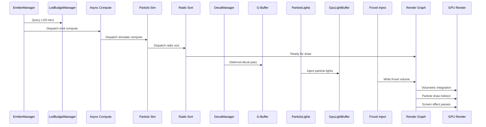

# Rendering ↔ VFX Integration Design

## Systems Involved

| System | Design | Domain |
|--------|--------|--------|
| Rendering | [rendering-core.md](../rendering/rendering-core.md) | GPU pipeline |
| VFX | [effects.md](../vfx/effects.md) | Visual effects |
| Particles | [particles.md](../vfx/particles.md) | GPU particles |

## Integration Requirements

| ID | Requirement | Systems |
|----|-------------|---------|
| IR-3.7.1 | Particle sim dispatches in render graph | VFX, Ren |
| IR-3.7.2 | Particle rendering via indirect draw | VFX, Ren |
| IR-3.7.3 | Froxel volume injection from VFX | VFX, Ren |
| IR-3.7.4 | Decals project onto G-buffer | VFX, Ren |
| IR-3.7.5 | Particle lights inject into light buffer | VFX, Ren |
| IR-3.7.6 | Screen effects as post-process passes | VFX, Ren |
| IR-3.7.7 | VFX LOD uses camera distance | VFX, Ren |

1. **IR-3.7.1** -- GPU particle simulation compute passes (emit, simulate, sub-emit) register in the
   render graph on the async compute queue. The graph compiler inserts barriers between simulation
   writes and rendering reads of particle buffers.
2. **IR-3.7.2** -- `ParticleRenderer` registers sprite, ribbon, and mesh particle passes. GPU radix
   sort orders particles by camera distance for alpha blending. `DrawIndirect` avoids CPU readback.
3. **IR-3.7.3** -- Volumetric fog, weather particles, and dust inject density/scattering into the
   froxel volume used by the clustered lighting system. The VFX compute pass writes to the froxel 3D
   texture before the volumetric integration pass.
4. **IR-3.7.4** -- `DecalManager` renders deferred decals that modify G-buffer albedo, normal, and
   PBR channels. Decals are sorted by priority and projected from depth buffer world positions.
5. **IR-3.7.5** -- `ParticleLightEmitter` injects dynamic point lights from emissive particles into
   `GpuLightBuffer`. Lights are culled and added to the clustered light grid (F-11.1.6).
6. **IR-3.7.6** -- Screen effects (heat haze, shockwave distortion, damage overlay, screen flash)
   register as post-process compute passes in the render graph after the main scene but before
   tonemapping.
7. **IR-3.7.7** -- `EmitterLodComponent` evaluates distance to the active camera. `LodTier`
   transitions (Full, Reduced, Impostor, Culled) scale spawn rate and rendering cost with
   hysteresis.

## Data Contracts

| Type | Defined in | Consumed by | Purpose |
|------|-----------|-------------|---------|
| `GpuParticleBuffer` | VFX | Render graph | Sim buffers |
| `ParticleRenderer` | VFX | Render graph | Draw passes |
| `DecalManager` | VFX | Render graph | G-buf modify |
| `GpuLightBuffer` | Rendering | VFX (lights) | Light inject |
| `ClusterGrid` | Rendering | VFX (lights) | Cluster ref |
| `EffectBudget` | VFX | Rendering | Budget cap |
| `EmitterLodComponent` | VFX | Rendering | LOD tier |
| Froxel 3D texture | Rendering | VFX | Vol fog inject |

```rust
/// Particle render pass registration.
pub struct ParticleRenderPassDesc {
    pub particle_buffer: GpuBufferView,
    pub alive_list: GpuBufferView,
    pub indirect_args: GpuBufferView,
    pub render_mode: RenderMode,
    pub sort_key: SortKey,
    pub blend_mode: BlendMode,
}

/// Froxel injection from VFX volumes.
pub struct FroxelInjection {
    pub density: f32,
    pub scattering: Vec3,
    pub absorption: Vec3,
    pub world_aabb: Aabb,
}
```

## Data Flow



## Timing and Ordering

| System | Phase | Timestep | Order |
|--------|-------|----------|-------|
| EmitterManager | 3-Simulation | Variable | Early |
| LOD evaluation | 3-Simulation | Variable | After camera |
| Budget scaling | 3-Simulation | Variable | After LOD |
| Particle sim | Render (async) | Variable | Compute queue |
| Radix sort | Render (async) | Variable | After sim |
| Decal G-buf pass | Render thread | Variable | After G-buf |
| Froxel injection | Render thread | Variable | Before vol |
| Light injection | Render thread | Variable | Before cluster |
| Particle draw | Render thread | Variable | Transparent |
| Screen effects | Render thread | Variable | Before tonemap |

## Failure Modes

| Failure | Impact | Recovery |
|---------|--------|----------|
| Budget exceeded | Particle pop | Scale spawn rate down |
| Sort buffer OOM | Unsorted alpha | Skip sort, accept error |
| Froxel overflow | Fog clamp | Cap density per voxel |
| Decal atlas full | Missing decals | LRU evict oldest |
| Light inject overflow | Missing lights | Cap at budget max |
| Async compute stall | Frame hitch | Fence timeout fallback |

## Platform Considerations

| Platform | Max particles | Async compute | Froxel |
|----------|-------------|---------------|--------|
| Desktop | 500K | Full overlap | 160x90x64 |
| Console | 200K | Full overlap | 160x90x64 |
| Switch | 50K | Limited | 80x45x32 |
| Mobile | 10K | None (inline) | Disabled |

## Test Plan

See companion [rendering-vfx-test-cases.md](rendering-vfx-test-cases.md).
