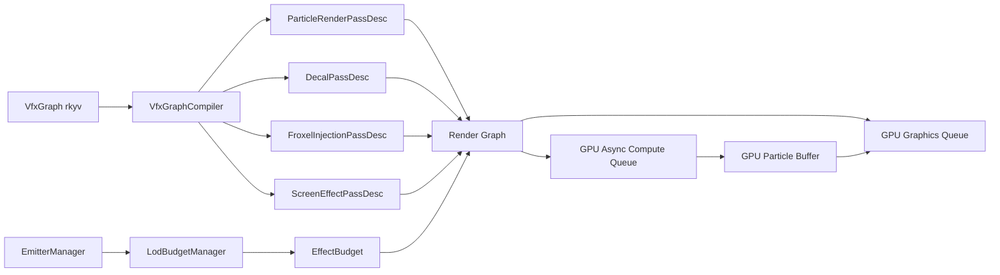
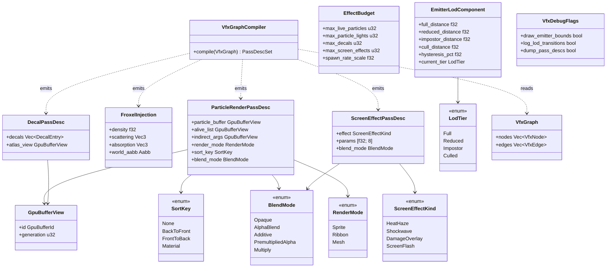
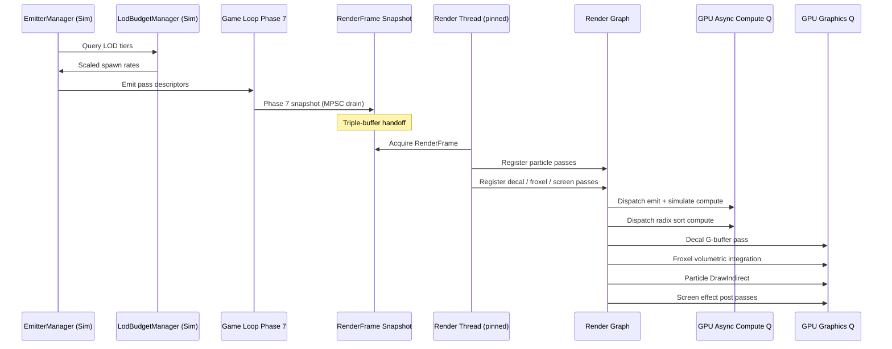

# Rendering ↔ VFX Integration Design

> **Compliance.** This document follows the cross-cutting conventions in
> [shared-conventions.md](shared-conventions.md) (SC-1..SC-14) and the channel-capacity formula in
> [shared-messaging-capacities.md](shared-messaging-capacities.md). Deviations: none.

## Systems Involved

| System | Design | Domain |
|--------|--------|--------|
| Rendering | [rendering-core.md](../rendering/rendering-core.md) | GPU pipeline |
| VFX | [effects.md](../vfx/effects.md) | Visual effects |
| Particles | [particles.md](../vfx/particles.md) | GPU particles |

## Requirements Trace

| IR | Source requirement / feature | Systems |
|----|------------------------------|---------|
| IR-3.7.1 | R-3.7.1, F-11.2.1 (GPU particle simulation) | VFX, Ren |
| IR-3.7.2 | R-3.7.2, F-11.2.2 (indirect draw) | VFX, Ren |
| IR-3.7.3 | R-3.7.3, F-11.2.3 (volumetric injection) | VFX, Ren |
| IR-3.7.4 | R-3.7.4, F-11.2.4 (deferred decals) | VFX, Ren |
| IR-3.7.5 | R-3.7.5, F-11.1.6 (clustered lighting) | VFX, Ren |
| IR-3.7.6 | R-3.7.6, F-11.2.5 (screen effects) | VFX, Ren |
| IR-3.7.7 | R-3.7.7, F-11.2.6 (emitter LOD) | VFX, Ren |

## Overview

VFX authors effects as declarative composable graphs (`feedback_vfx_react_graph.md`). Each graph
node declares emitters, volumes, decals, and screen passes as data. At load time the VFX crate
translates a graph into a set of render-graph pass descriptors plus ECS components. At run time the
Rendering system registers these passes into the frame render graph, binds GPU buffers, and
dispatches compute + draw work on the GPU hardware queues. No Rust async/await is used anywhere on
this path; "GPU async compute queue" refers strictly to the GPU hardware compute queue that runs
concurrently with the graphics queue.

1. **2D / 2.5D scope** — 2D sprites and tilemaps use the extension fields on `RenderFrame`
   documented in `integration/high-level.md#RenderFrame-contents`. This integration design targets
   the 3D particle / decal / volumetric path only; 2D/2.5D VFX are intentionally out of scope and
   covered by the dedicated 2D rendering integration.
2. **Declarative composition** — a `VfxGraph` is a DAG of `VfxNode`s produced by the editor and
   stored as rkyv-archived data. At load time `VfxGraphCompiler` walks the graph and emits
   `ParticleRenderPassDesc`, `DecalPassDesc`, `FroxelInjectionPassDesc`, and `ScreenEffectPassDesc`
   values. Graph evaluation is pure data-to-data; no runtime interpretation.

## Integration Requirements

| ID | Requirement | Systems |
|----|-------------|---------|
| IR-3.7.1 | Particle sim dispatches in render graph | VFX, Ren |
| IR-3.7.2 | Particle rendering via indirect draw | VFX, Ren |
| IR-3.7.3 | Froxel volume injection from VFX | VFX, Ren |
| IR-3.7.4 | Decals project onto G-buffer | VFX, Ren |
| IR-3.7.5 | Particle lights inject into light buffer | VFX, Ren |
| IR-3.7.6 | Screen effects as post-process passes | VFX, Ren |
| IR-3.7.7 | VFX LOD uses camera distance | VFX, Ren |

1. **IR-3.7.1** — GPU particle simulation compute passes (emit, simulate, sub-emit) run on the GPU
   async compute queue (hardware queue) via the render graph. The graph compiler inserts barriers
   between simulation writes and rendering reads of particle buffers. No Rust async is involved;
   dispatch is recorded synchronously on the render thread.
2. **IR-3.7.2** — `ParticleRenderer` registers sprite, ribbon, and mesh particle passes. GPU radix
   sort (algorithm: Merrill & Grimshaw 2011, "High Performance and Scalable Radix Sorting on GPUs")
   orders particles by camera distance for alpha blending. `DrawIndirect` avoids CPU readback.
3. **IR-3.7.3** — Volumetric fog, weather particles, and dust inject density/scattering into the
   froxel volume used by the clustered lighting system. The VFX compute pass writes to the froxel 3D
   texture (VFX is the producer) before Rendering's volumetric integration pass consumes it.
4. **IR-3.7.4** — `DecalManager` renders deferred decals that modify G-buffer albedo, normal, and
   PBR channels. Decals are sorted by priority using a pre-sized `Vec<DecalEntry>` with an introsort
   pass (algorithm: Pattern Defeating Quicksort, Orson Peters 2021); no HashMap on the hot path.
5. **IR-3.7.5** — `ParticleLightEmitter` injects dynamic point lights from emissive particles into
   `GpuLightBuffer`. Lights are culled and added to the clustered light grid (F-11.1.6). The "100
   brightest of N" selection uses a bounded binary min-heap of size `budget` over the candidate
   `Vec<ParticleLight>` — O(N log budget) — not a HashMap.
6. **IR-3.7.6** — Screen effects (heat haze, shockwave distortion, damage overlay, screen flash)
   register as post-process compute passes in the render graph after the main scene but before
   tonemapping.
7. **IR-3.7.7** — `EmitterLodComponent` evaluates distance to the active camera. `LodTier`
   transitions (Full, Reduced, Impostor, Culled) scale spawn rate and rendering cost with hysteresis
   (20% distance overlap band).

## Architecture



## API Design

All types below are interface-level only. Implementation lives in the `harmonius_vfx` and
`harmonius_rendering` crates.

```rust
/// Particle render pass registration. Transient
/// per-frame descriptor, not persisted; no rkyv.
pub struct ParticleRenderPassDesc {
    pub particle_buffer: GpuBufferView,
    pub alive_list: GpuBufferView,
    pub indirect_args: GpuBufferView,
    pub render_mode: RenderMode,
    pub sort_key: SortKey,
    pub blend_mode: BlendMode,
}

/// Froxel injection descriptor from VFX volume
/// sources (fog, weather, dust). Transient; Vec3
/// and Aabb are `glam::Vec3` and `harmonius_math::
/// Aabb`. Both are `#[repr(C)]` and GPU-uploadable.
pub struct FroxelInjection {
    pub density: f32,
    pub scattering: Vec3,
    pub absorption: Vec3,
    pub world_aabb: Aabb,
}

/// Decal pass descriptor; transient per frame.
pub struct DecalPassDesc {
    pub decals: Vec<DecalEntry>,
    pub atlas_view: GpuBufferView,
}

/// Screen-space effect pass descriptor.
pub struct ScreenEffectPassDesc {
    pub effect: ScreenEffectKind,
    pub params: [f32; 8],
    pub blend_mode: BlendMode,
}

/// Generational handle to a GPU buffer region.
/// NOT ref-counted (no Arc/Rc). `Copy`, 8 bytes,
/// validated against `GpuBufferRegistry` on use.
#[derive(Copy, Clone)]
pub struct GpuBufferView {
    pub id: GpuBufferId,   // u32 slot index
    pub generation: u32,   // ABA protection
}

/// Particle sort key. Variants ordered by render
/// pipeline concern, not by numeric value.
#[repr(u8)]
pub enum SortKey {
    /// Do not sort; opaque particles.
    None,
    /// Back-to-front by camera distance (alpha).
    BackToFront,
    /// Front-to-back (early-z opaque).
    FrontToBack,
    /// Sort by material id (batching).
    Material,
}

/// Transparency blend mode for particles and
/// screen effects.
#[repr(u8)]
pub enum BlendMode {
    Opaque,
    AlphaBlend,
    Additive,
    PremultipliedAlpha,
    Multiply,
}

/// Render mode for particle geometry.
#[repr(u8)]
pub enum RenderMode {
    Sprite,
    Ribbon,
    Mesh,
}

/// Screen effect kind dispatched as post pass.
#[repr(u8)]
pub enum ScreenEffectKind {
    HeatHaze,
    Shockwave,
    DamageOverlay,
    ScreenFlash,
}

/// LOD tier for an emitter. Hysteresis prevents
/// oscillation at tier boundaries.
#[repr(u8)]
pub enum LodTier {
    Full,
    Reduced,
    Impostor,
    Culled,
}

/// ECS component: per-emitter LOD state.
pub struct EmitterLodComponent {
    pub full_distance: f32,
    pub reduced_distance: f32,
    pub impostor_distance: f32,
    pub cull_distance: f32,
    pub hysteresis_pct: f32,
    pub current_tier: LodTier,
}

/// Per-frame global VFX budget caps. Scales spawn
/// rate when exceeded.
pub struct EffectBudget {
    pub max_live_particles: u32,
    pub max_particle_lights: u32,
    pub max_decals: u32,
    pub max_screen_effects: u32,
    pub spawn_rate_scale: f32,
}

/// VFX graph — declarative composable effect.
/// Persistent; rkyv-archived for load and save.
#[derive(rkyv::Archive, rkyv::Serialize, rkyv::Deserialize)]
pub struct VfxGraph {
    pub nodes: Vec<VfxNode>,
    pub edges: Vec<VfxEdge>,
}
```

### Class Diagram



## Data Contracts

| Type | Defined in | Consumed by | Purpose |
|------|-----------|-------------|---------|
| `GpuParticleBuffer` | VFX | Render graph | Sim buffers |
| `ParticleRenderPassDesc` | VFX | Render graph | Draw pass reg |
| `DecalPassDesc` | VFX | Render graph | G-buf modify |
| `GpuLightBuffer` | Rendering | VFX (lights) | Light inject |
| `ClusterGrid` | Rendering | VFX (lights) | Cluster ref |
| `EffectBudget` | VFX | Rendering | Budget cap |
| `EmitterLodComponent` | VFX | Rendering | LOD tier |
| `FroxelInjection` | VFX | Rendering | Vol fog inject |
| Froxel 3D texture | Rendering | Rendering | Vol storage |
| `VfxGraph` | VFX | VFX compiler | Authoring |

1. **`VfxGraph`** is the only persistent type; it carries rkyv derives for zero-copy load. All
   `*PassDesc` and `FroxelInjection` types are transient per-frame values, allocated from a frame
   arena, and never serialized. The froxel 3D texture is allocated and owned by Rendering; VFX is
   the producer (writes density/scattering) and Rendering's volumetric integration pass is the
   consumer, so the storage itself lives entirely inside Rendering.

## Data Flow



1. **Phase 7 snapshot** — per the three-thread model in `integration/high-level.md#Phase-7`, all
   simulation-thread VFX outputs (`EffectBudget`, `EmitterLodComponent` transitions, per-frame pass
   descriptors) are written into `RenderFrame` at Phase 7. The render thread reads only the
   immutable snapshot; there is no shared mutable state between simulation workers and the render
   thread.
2. **VFX graph evaluation path** — `VfxGraphCompiler::compile` runs once at VFX asset load time on a
   worker thread. Output pass descriptors are cached in ECS components. At run time,
   `emitter_lod_system` and `vfx_budget_system` read those cached descriptors, apply LOD and budget
   adjustments, and push the adjusted set into the simulation-phase output queue consumed at Phase
   7.

## Thread Ownership

| Data / system | Owning thread | QoS / pin | Handoff |
|---------------|---------------|-----------|---------|
| `EmitterManager` | Simulation worker | QoS: user-initiated | ECS writes |
| `LodBudgetManager` | Simulation worker | QoS: user-initiated | ECS writes |
| `VfxGraphCompiler` | Asset worker | QoS: utility | Once at load |
| Per-frame pass desc queue | Simulation worker | QoS: user-initiated | MPSC to Phase 7 |
| `RenderFrame` VFX slice | Built on sim, read on render | Snapshot | Triple buffer |
| Render graph registration | Render thread | Core-pinned (P-core) | Reads snapshot |
| GPU compute dispatch | Render thread | Core-pinned | GPU hardware queue |

1. **Channel** — `crossbeam_channel::bounded(256)` MPSC from simulation workers (producers) to the
   game loop Phase 7 drain (single consumer). Buffer length 256 sized for ~4 frames at 60 Hz with
   headroom for burst emit events; overflow drops oldest pass descriptor and logs.
2. **Arc policy** — only immutable VFX assets (`VfxGraph`, emitter templates, texture atlases) are
   shared via `Arc`. Mutable per-frame state (`EmitterLodComponent`, pass desc queues, particle
   buffers) lives in ECS on simulation workers or in frame arenas on the render thread.
3. **Render thread pinning** — the render thread is pinned to a P-core via
   `core_affinity::set_for_current` (no OS scheduler migration). Pass descriptor submission and GPU
   dispatch both run on this thread; workers never touch GPU handles.
4. **Debug toggles** — a runtime-toggleable `VfxDebugFlags` resource on `RenderFrame` enables
   emitter bound drawing, LOD transition logging, and pass descriptor dumping via console command.

## Timing and Ordering

| System | Phase | Thread | Timestep | Order |
|--------|-------|--------|----------|-------|
| EmitterManager | 3-Simulation | Sim worker | Fixed (60 Hz) | Early |
| LOD evaluation | 3-Simulation | Sim worker | Fixed | After camera |
| Budget scaling | 3-Simulation | Sim worker | Fixed | After LOD |
| Pass desc build | 3-Simulation | Sim worker | Fixed | End of sim |
| RenderFrame snapshot | 7-Snapshot | Game loop main | Variable | Phase 7 |
| Particle sim dispatch | Render | Render (pinned) | Variable | GPU compute Q |
| Radix sort dispatch | Render | Render (pinned) | Variable | After sim |
| Decal G-buf pass | Render | Render (pinned) | Variable | After G-buf |
| Froxel injection | Render | Render (pinned) | Variable | Before vol |
| Light injection | Render | Render (pinned) | Variable | Before cluster |
| Particle draw | Render | Render (pinned) | Variable | Transparent |
| Screen effects | Render | Render (pinned) | Variable | Before tonemap |

## Failure Modes

| Failure | Impact | Recovery |
|---------|--------|----------|
| Budget exceeded | Particle pop | `EffectBudget.spawn_rate_scale` ramps down |
| Sort buffer OOM | Unsorted alpha | Skip sort, render in emission order, warn |
| Froxel overflow | Fog clamp | Cap density per voxel at load-time max |
| Decal atlas full | Missing decals | LRU evict oldest decal slot |
| Light inject overflow | Missing lights | Cap at `max_particle_lights`, keep brightest |
| GPU compute queue stall | Frame hitch | Fence timeout, reissue on graphics queue |

1. Every row has a corresponding negative test case (TC-IR-3.7.*.F*) in the companion file.

## Platform Considerations

| Platform | Max particles | GPU async compute queue | Froxel |
|----------|---------------|-------------------------|--------|
| Desktop | 500K | Full overlap (hardware Q) | 160x90x64 |
| Console | 200K | Full overlap (hardware Q) | 160x90x64 |
| Switch | 50K | Limited (shared Q) | 80x45x32 |
| Mobile | 10K | Not supported | Disabled |

1. **Switch** — uses a single shared GPU queue; the render graph serializes compute and graphics
   work on the same queue rather than overlapping.
2. **Mobile froxel fallback** — when the GPU async compute queue and 3D texture froxel storage are
   unavailable, VFX falls back to a screen-tile CPU volumetric approximation: the simulation worker
   computes per-tile density/scattering for a coarse 16x9 screen grid, writes it to a uniform
   buffer, and the forward shader samples it per-pixel. This degrades IR-3.7.3 quality but still
   satisfies the visible-fog contract. Selection happens at capability-detection time.
3. **Mobile compute fallback** — when the GPU async compute queue is unavailable, particle
   simulation dispatches inline on the graphics queue between G-buffer and shading, with an explicit
   barrier. This serializes compute and graphics but avoids CPU readback.

## Test Plan

See companion [rendering-vfx-test-cases.md](rendering-vfx-test-cases.md). Every IR is covered by
positive tests, negative failure-mode tests, and at least one benchmark. All tests are CI-runnable
against a software adapter (llvmpipe / WARP) so CI does not require discrete GPUs.

## Open Questions

| # | Question | Owner | Target |
|---|----------|-------|--------|
| 1 | Should screen-tile mobile froxel use tri-linear or bilinear sample? | VFX lead | Wave 3 |
| 2 | Does radix sort share a scratch buffer with GPU culling? | Render lead | Wave 2 |
| 3 | Can `VfxGraph` rkyv layout stay stable across editor versions? | Tools lead | Wave 2 |

## Review Status

| # | Finding | Status | Resolution |
|---|---------|--------|-----------|
| 1 | "async compute" ambiguous vs Rust async | Resolved | Renamed "GPU async compute queue" |
| 2 | Missing classDiagram | Resolved | Added full classDiagram in API Design |
| 3 | No 2D/2.5D acknowledgement | Resolved | Overview notes 2D/2.5D out of scope |
| 4 | Missing rkyv annotations | Resolved | `VfxGraph` has rkyv derives; others are transient |
| 5 | Vec3, Aabb unsourced | Resolved | Cross-referenced glam / harmonius_math |
| 6 | VFX graph evaluation path missing | Resolved | Added VfxGraphCompiler + Data Flow note |
| 7 | HashMap on hot paths | Resolved | Decals use sorted Vec; lights use min-heap |
| 8 | GpuBufferView may be ref-counted | Resolved | Defined as generational handle (no Arc) |
| 9 | EmitterLodComponent, EffectBudget pseudocode | Resolved | Added struct definitions |
| 10 | Thread ownership for sim entries | Resolved | Added Thread Ownership table with threads |
| 11 | Missing IR-3.7.6, IR-3.7.7 benchmarks | Resolved | Added in companion test cases file |
| 12 | Missing failure-mode test cases | Resolved | Added 6 negative test cases in companion |
| 13 | Froxel producer/consumer inverted | Resolved | Data Contracts now lists VFX as producer |
| 14 | Mobile froxel fallback undocumented | Resolved | Added screen-tile CPU fallback spec |
| 15 | Missing Requirements Trace and sections | Resolved | Added Trace, Overview, Arch, API, OQ |
| 16 | SortKey, BlendMode enums undefined | Resolved | Enums defined inline in API Design |
| 17 | Sequence diagram missing Phase 7 | Resolved | Added GLP + RF participants in sequence |
| 18 | Algorithm references missing | Resolved | Cited Merrill/Grimshaw, Peters pdqsort |
